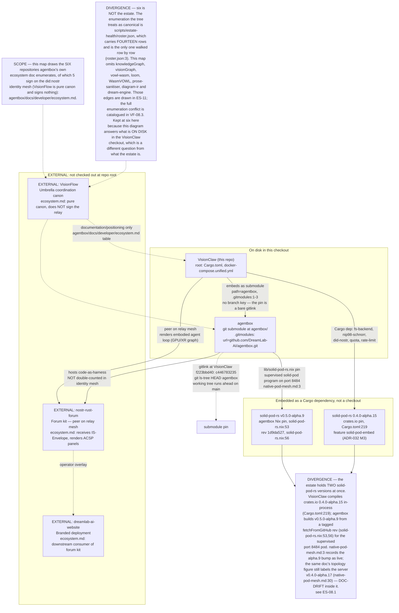
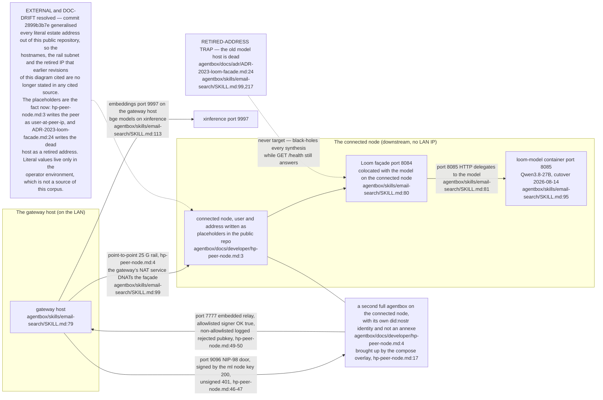
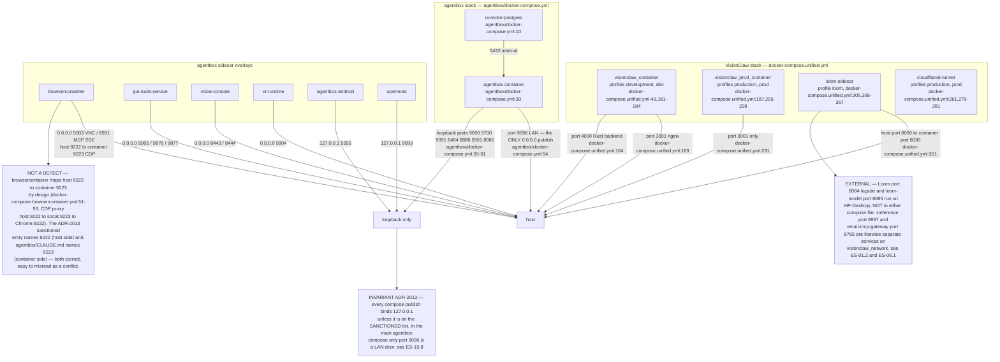
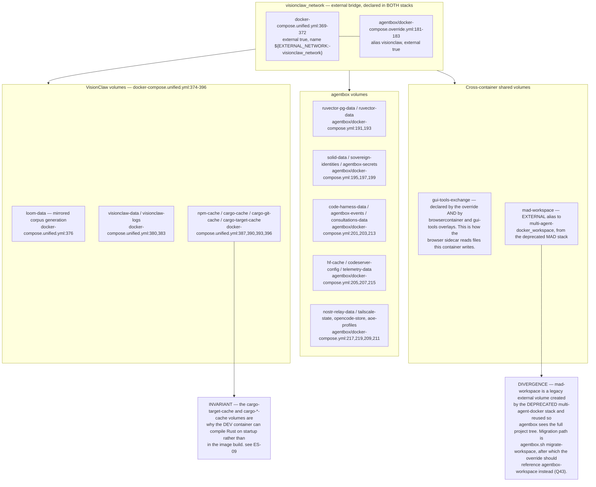
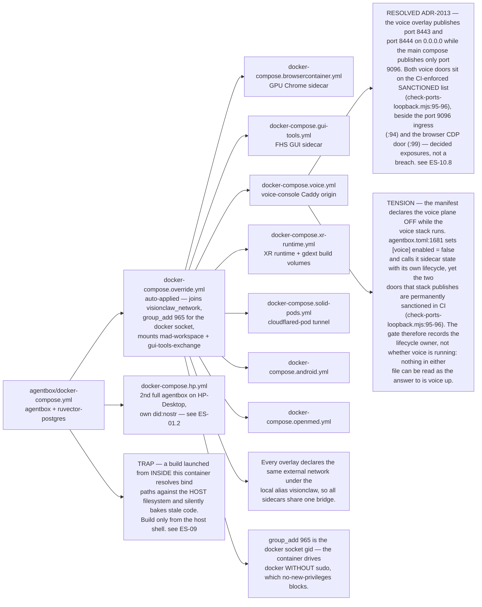
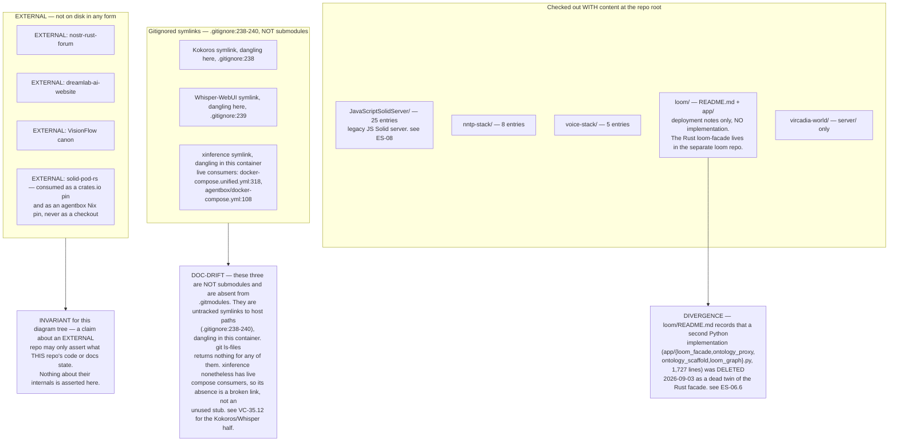
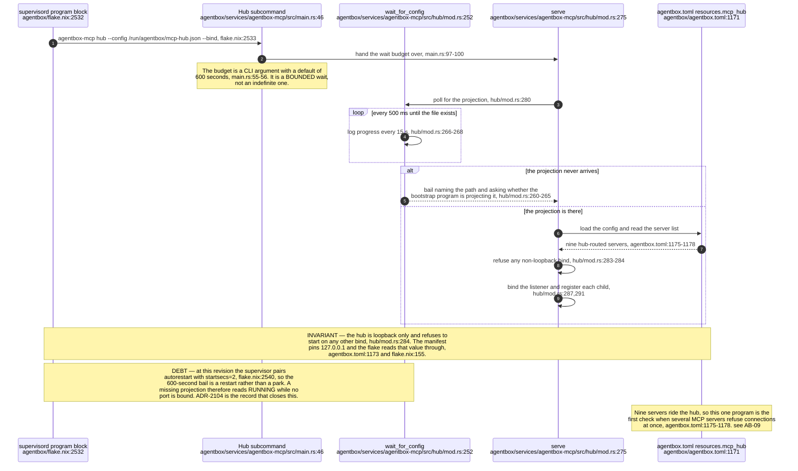
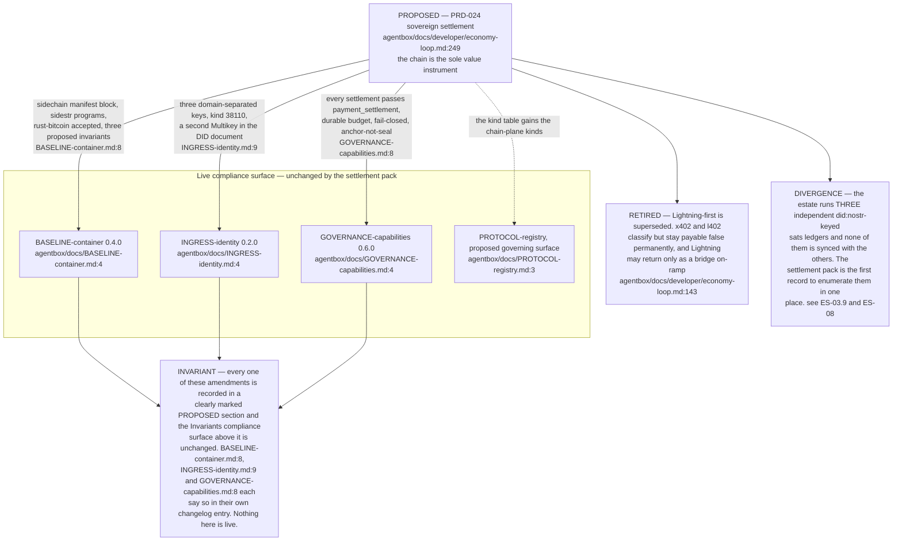

## ES-01.1 Substrate map — the VisionClaw checkout's neighbourhood, not the whole estate

## ES-01.2 Network / compute fabric — gateway host, connected-node rail, retired-address trap

## ES-01.3 Service and port map — every published surface in the estate

## ES-01.4 Docker networks and volumes — one external bridge joins both stacks

## ES-01.5 Compose overlay composition — which file adds what

## ES-01.6 Repositories on disk — what is a checkout, what is a stub, what is external

## ES-01.7 The MCP hub is a boot-order dependency, and the wait is bounded

## ES-01.8 The four governing documents and the proposed settlement sections they now carry

