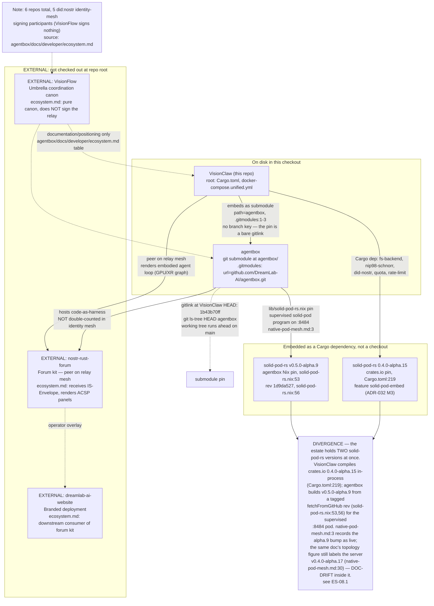
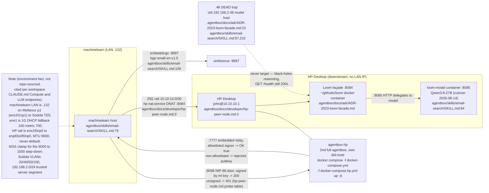
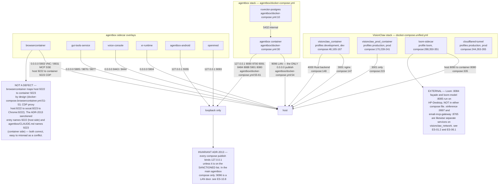
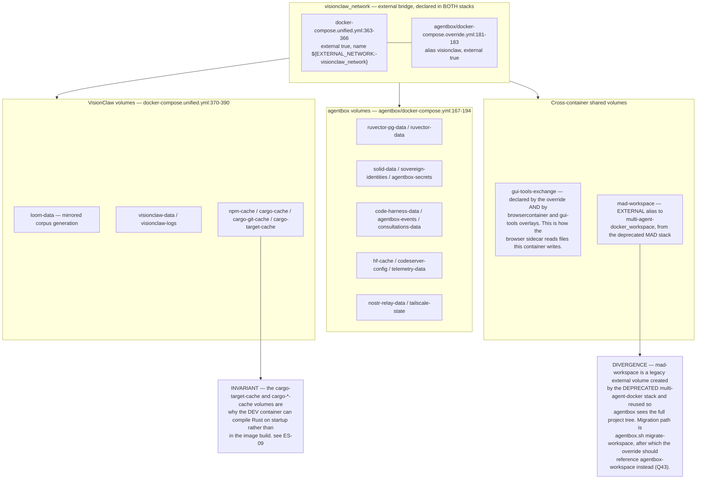
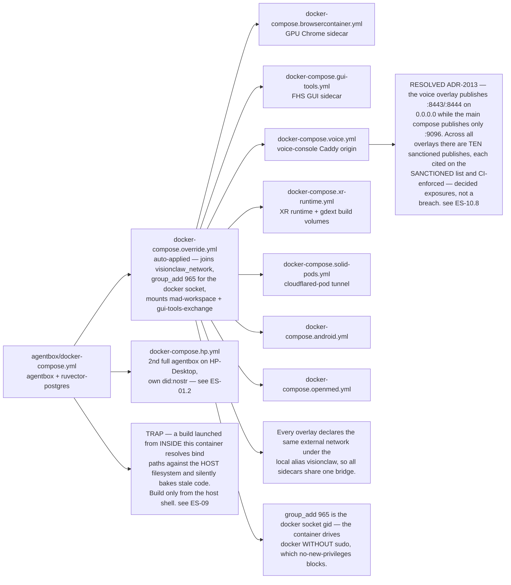
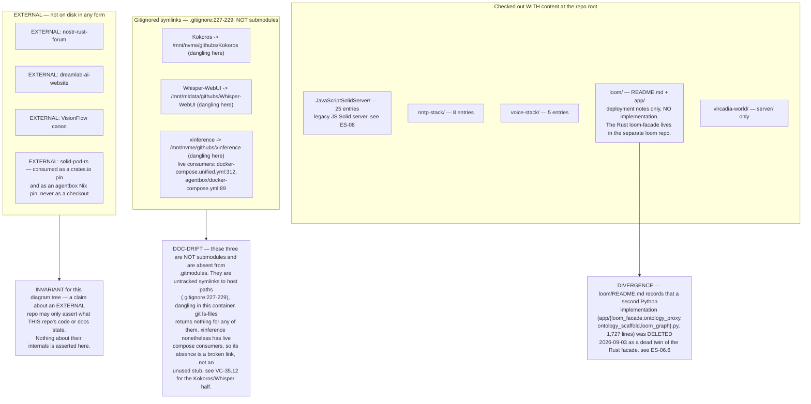

## ES-01.1 Substrate map — six repositories, five-participant identity mesh

## ES-01.2 Network / compute fabric — machinelearn, HP-Desktop rail, dead trap

## ES-01.3 Service and port map — every published surface in the estate

## ES-01.4 Docker networks and volumes — one external bridge joins both stacks

## ES-01.5 Compose overlay composition — which file adds what

## ES-01.6 Repositories on disk — what is a checkout, what is a stub, what is external

