## ES-02.1 Producer — POST /v1/agent-events/emit, NIP-98 gate, local publish
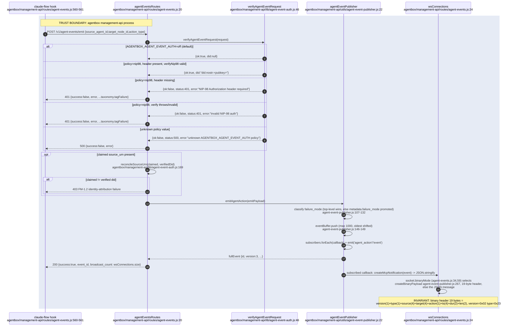

## ES-02.2 Cross-container forward — agentbox WS subscriber to VisionClaw ingest, auth + envelope validation
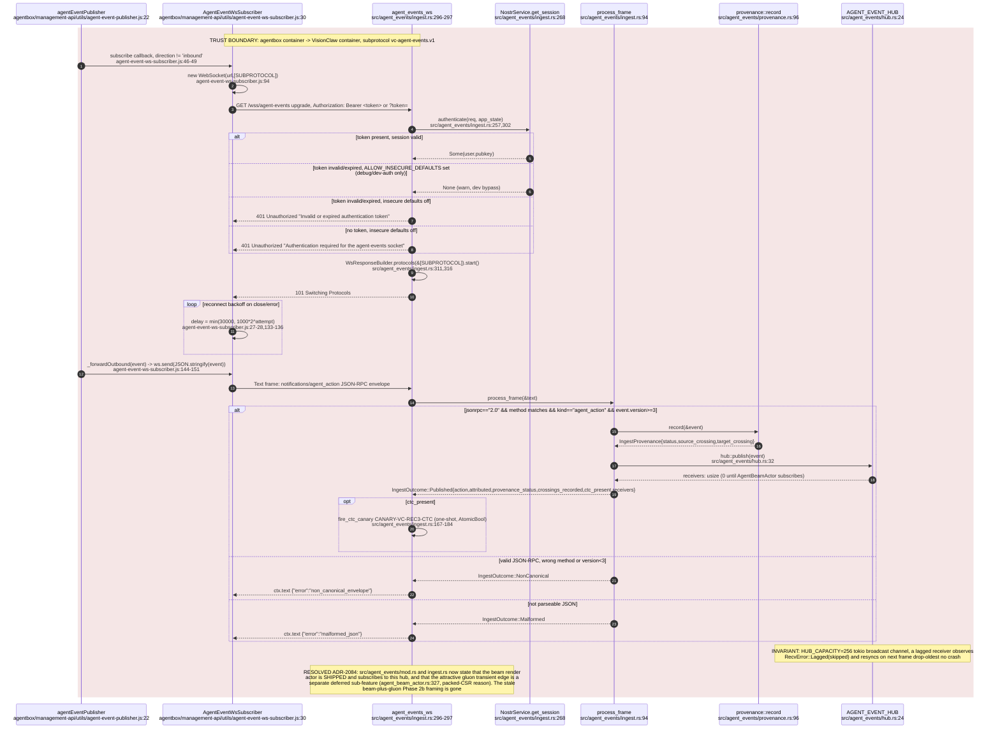

## ES-02.3 Canonical wire envelope — AgentActionNotification / AgentActionEnvelope
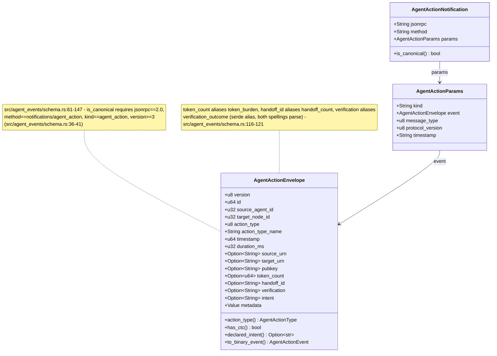

## ES-02.4 Hub fan-out and beam coalescing — backpressure to ClientCoordinatorActor
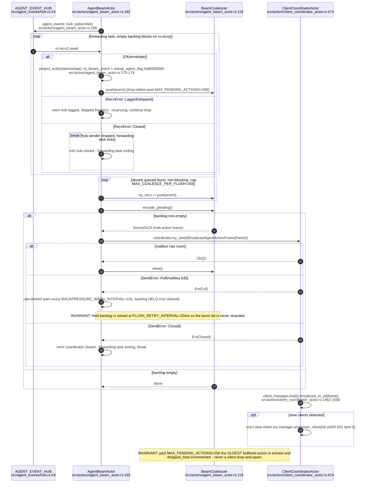

## ES-02.5 Binary wire 0x23 AGENT_ACTION — single event and batch layout
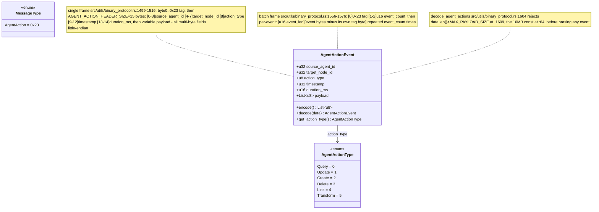

## ES-02.6 Client render — decode, beam store, DIVERGENCE beam+gluon vs class_charge
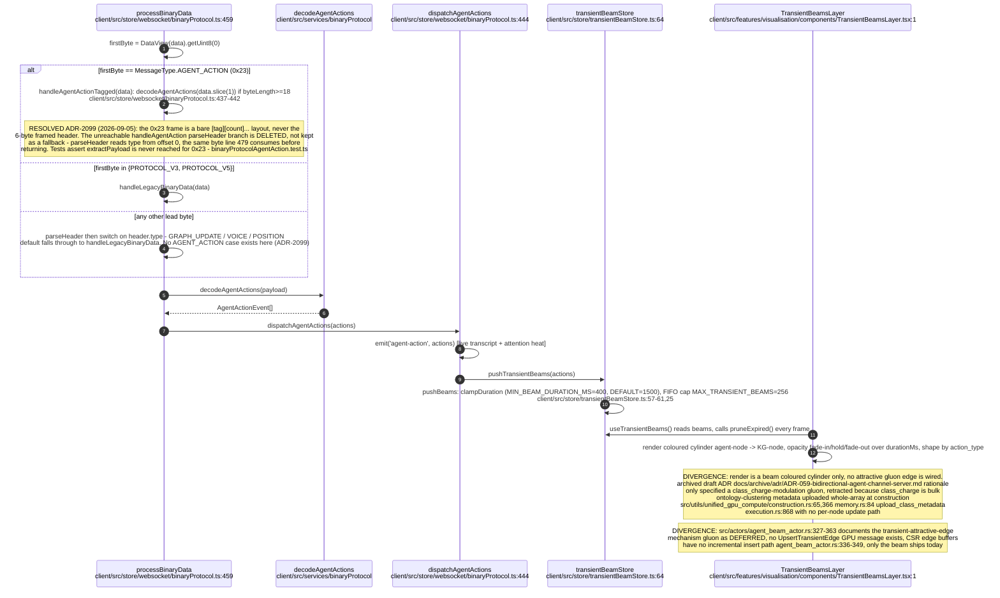

## ES-02.7 LEGACY — :9500 MCP-TCP relay lifecycle (docker-exec supervision)
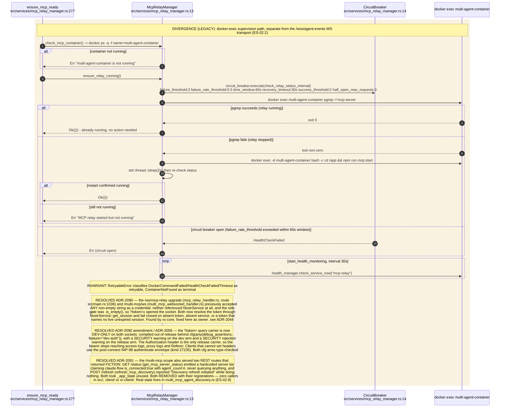

## ES-02.8 LEGACY — bots_client :9500 state-snapshot poll (JSON-RPC over raw TCP)
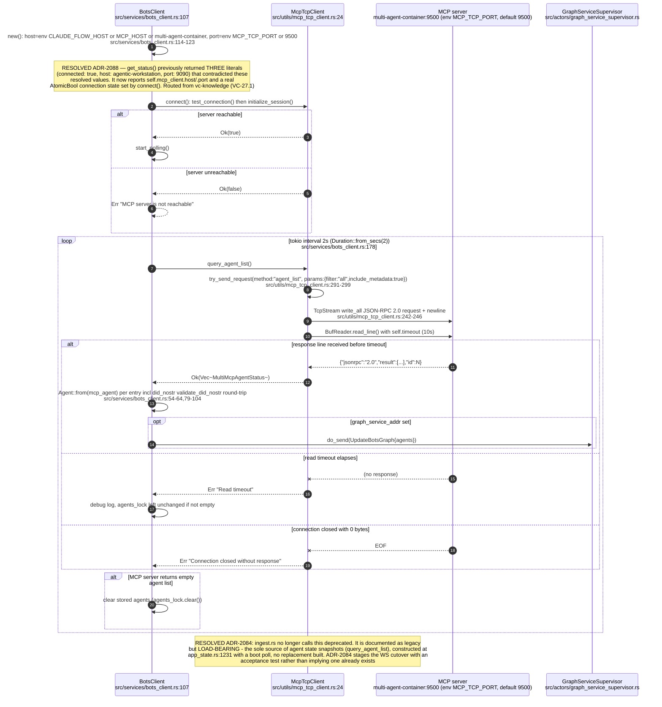

## ES-02.9 LEGACY — multi-MCP agent discovery, concurrent fan-out poll
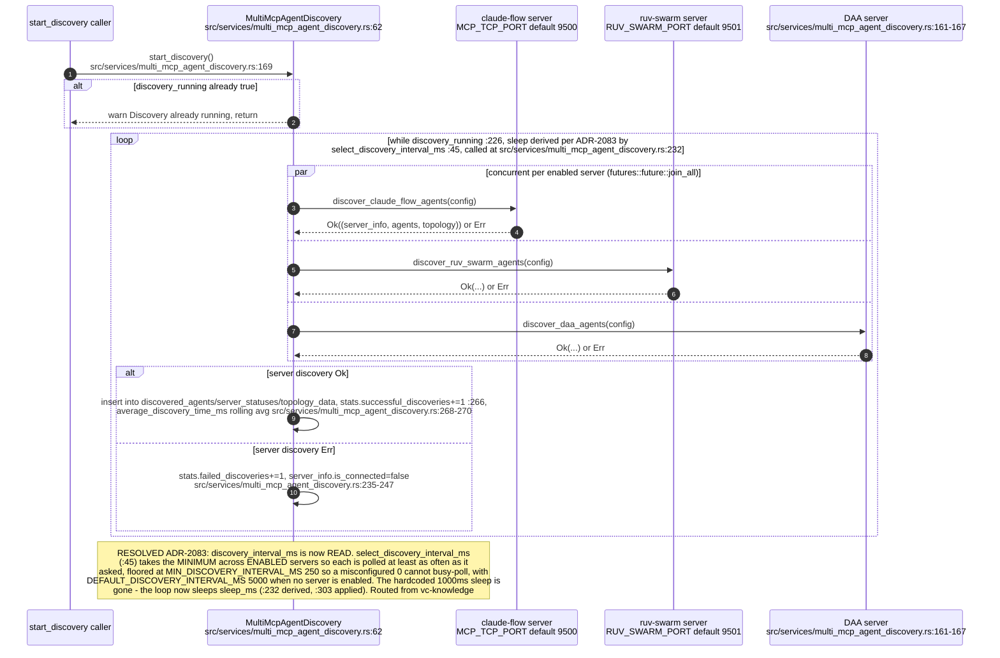

## ES-02.10 REVERSE — VisionClaw calling agentbox: task lifecycle family
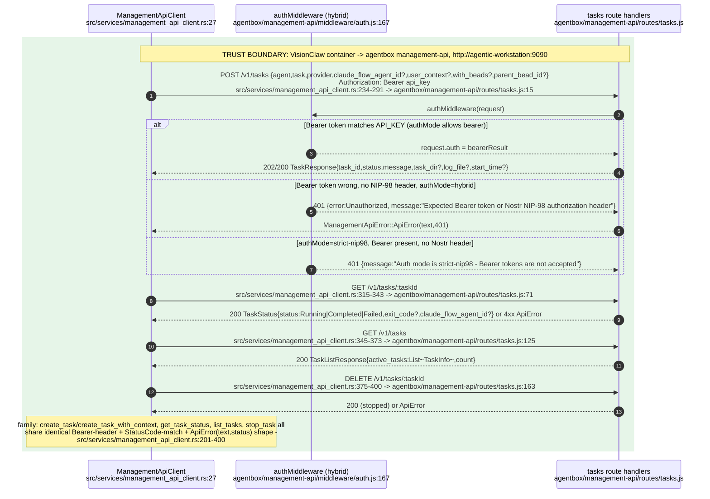

## ES-02.11 REVERSE — VisionClaw calling agentbox: briefing workflow + status/health family
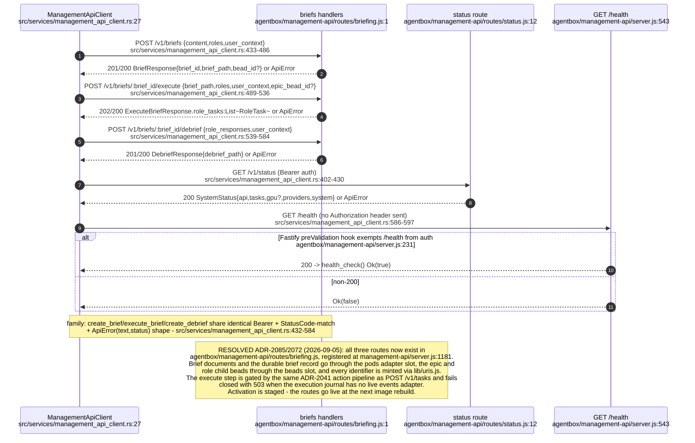
