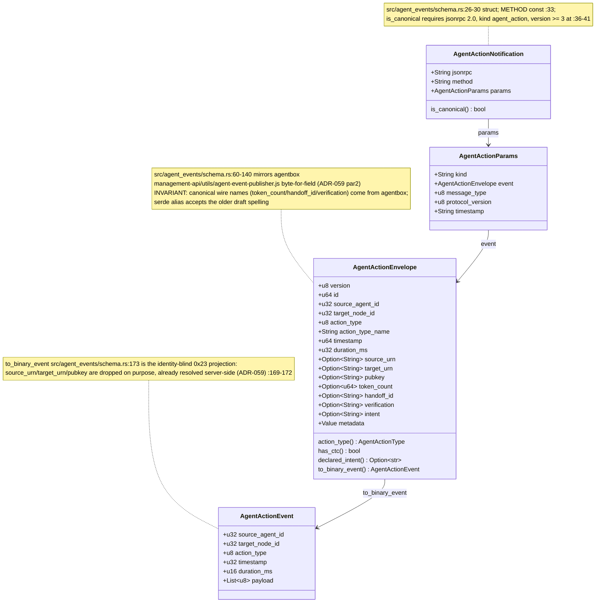
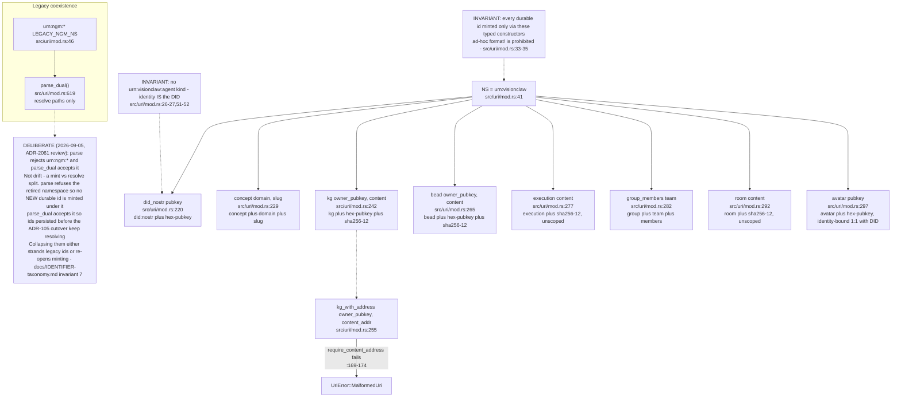
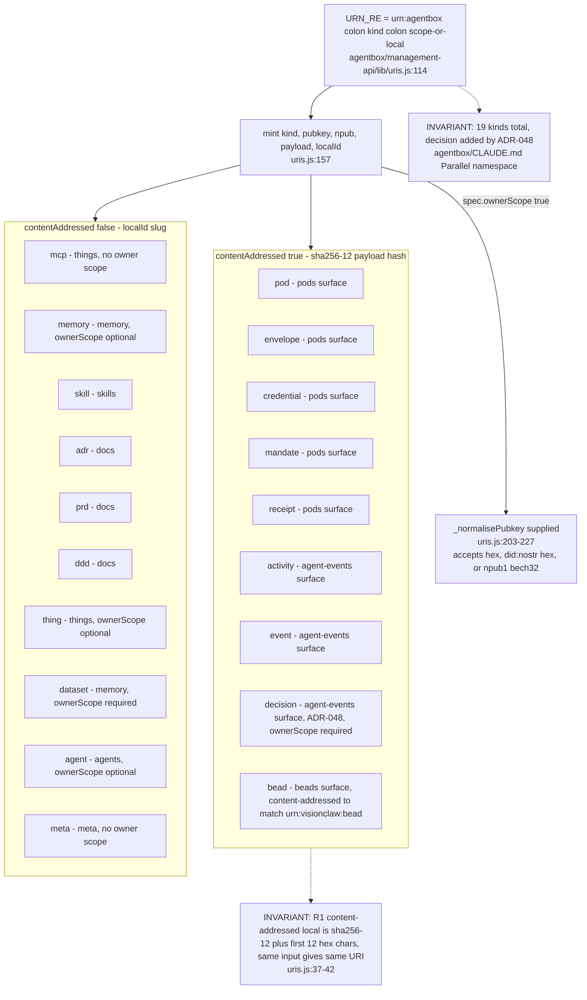
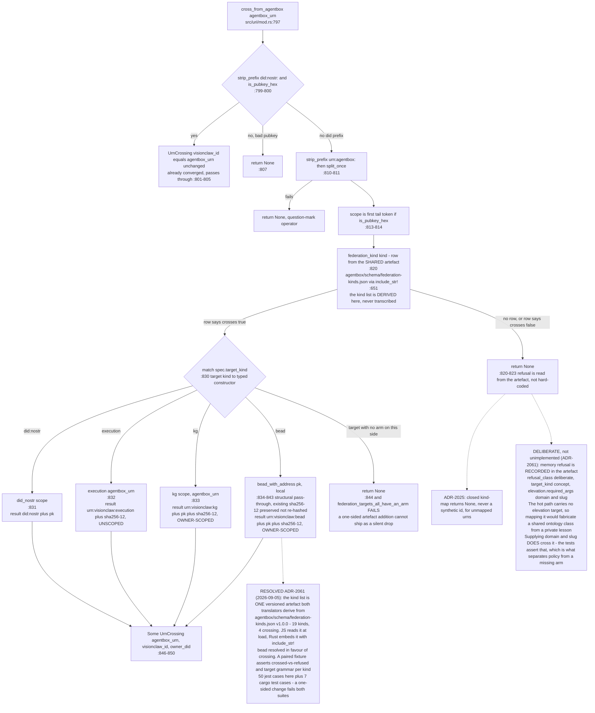
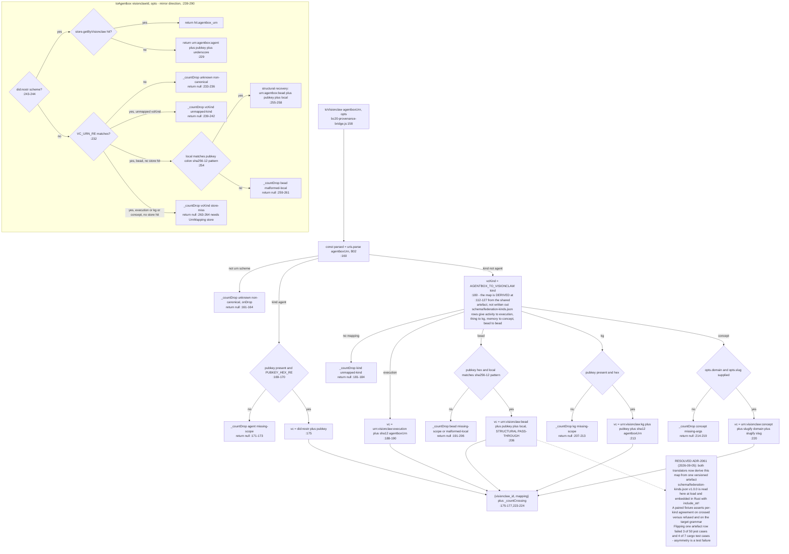
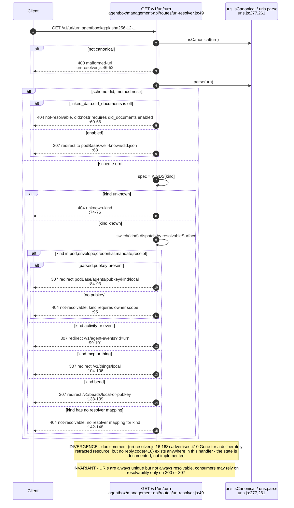
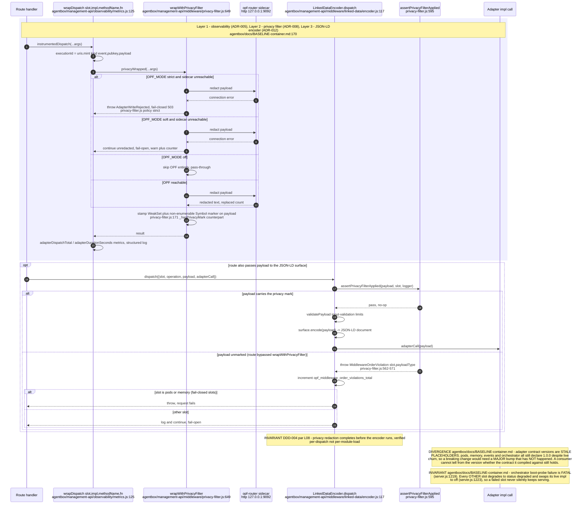
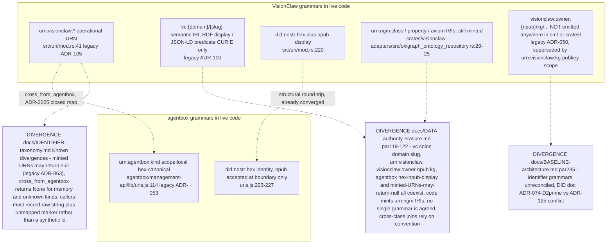

## ES-03.1 Shared wire envelope: AgentActionNotification (agentbox emit -> VisionClaw ingest)

## ES-03.2 VisionClaw urn:visionclaw grammar - 7 kinds, no agent kind

## ES-03.3 agentbox urn:agentbox grammar - 19 kinds (uris.js KINDS)

## ES-03.4 cross_from_agentbox: closed kind-map, VisionClaw inbound (agentbox source wins)

## ES-03.5 bc20-provenance-bridge.js: AGENTBOX_TO_VISIONCLAW / VISIONCLAW_TO_AGENTBOX (JS side, wider than Rust)

## ES-03.6 Content address byte-identity: sha256-12, first 6 bytes, lowercase hex (ADR-2023)

## ES-03.7 uris.js mint(): alt for every MalformedUri throw

## ES-03.8 /v1/uri/<urn> resolver: resolvable, unresolvable, retracted (best-effort)

## ES-03.9 Adapter dispatch: observability -> privacy filter -> JSON-LD encoder, in that order

## ES-03.10 DATA-authority-erasure divergence: identifier grammars unreconciled across the federation

