## ES-03.1 Shared wire envelope: AgentActionNotification (agentbox emit -> VisionClaw ingest)

## ES-03.2 VisionClaw urn:visionclaw grammar - 7 kinds, no agent kind
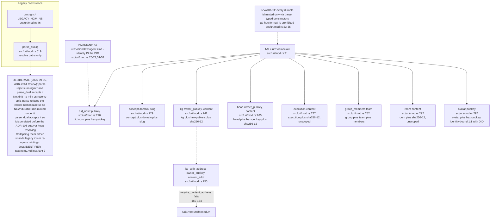
## ES-03.3 agentbox urn:agentbox grammar - 20 kinds (uris.js KINDS)
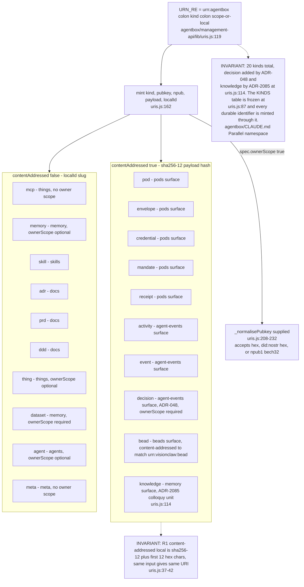
## ES-03.4 cross_from_agentbox: shared kind policy and typed inbound targets
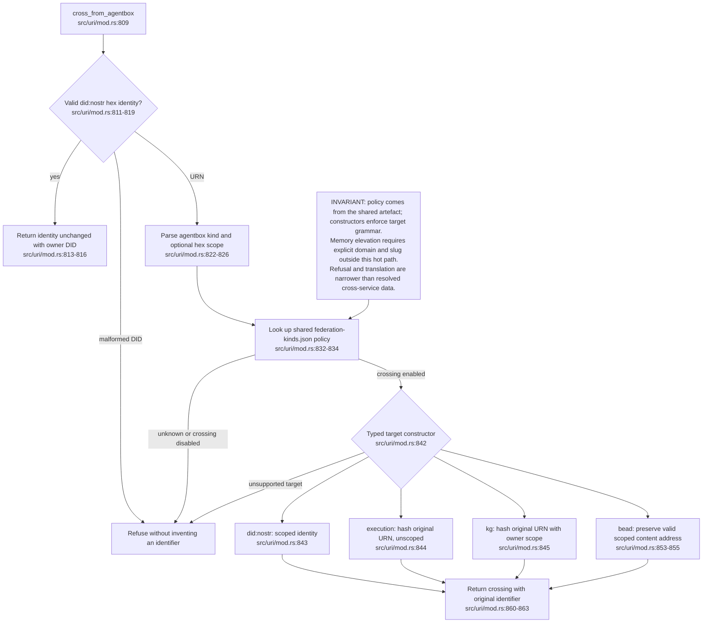
## ES-03.5 bc20-provenance-bridge.js: forward policy and reversible identity recovery
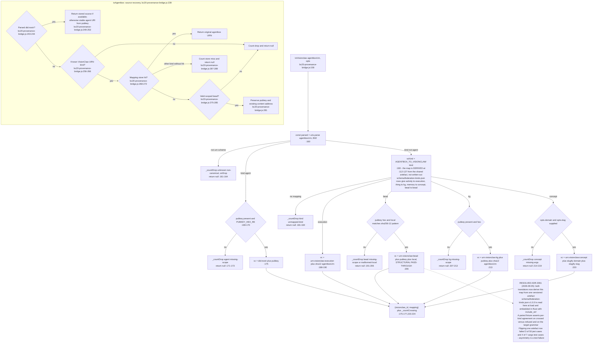
## ES-03.6 Content address byte-identity: sha256-12, first 6 bytes, lowercase hex (ADR-2023)
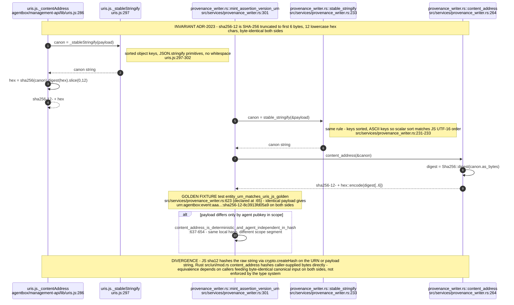
## ES-03.7 uris.js mint(): alt for every MalformedUri throw
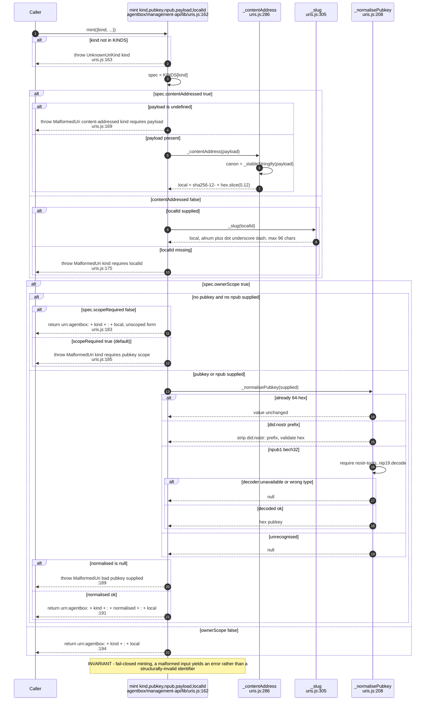
## ES-03.8 URI resolver: redirect routing does not attest target availability
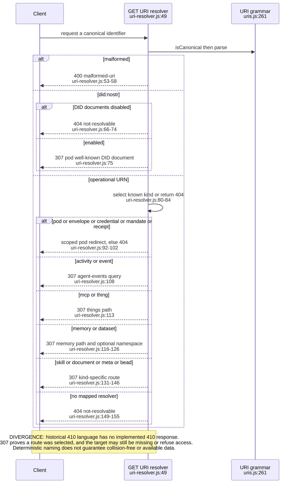
## ES-03.9 Adapter dispatch: observability -> privacy filter -> JSON-LD encoder, in that order
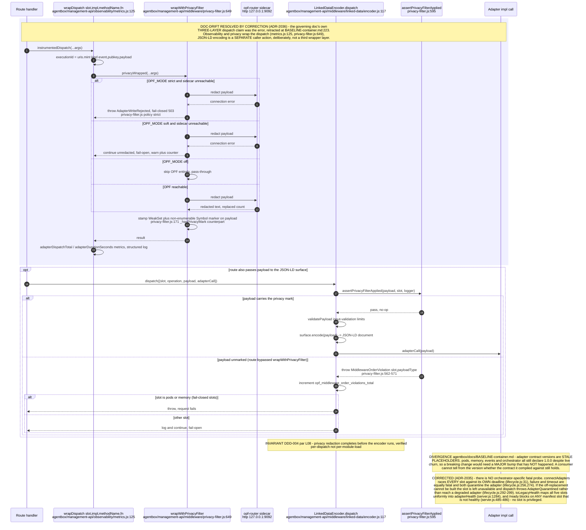
## ES-03.10 Partial convergence: typed operational crossings and remaining RDF identity seams
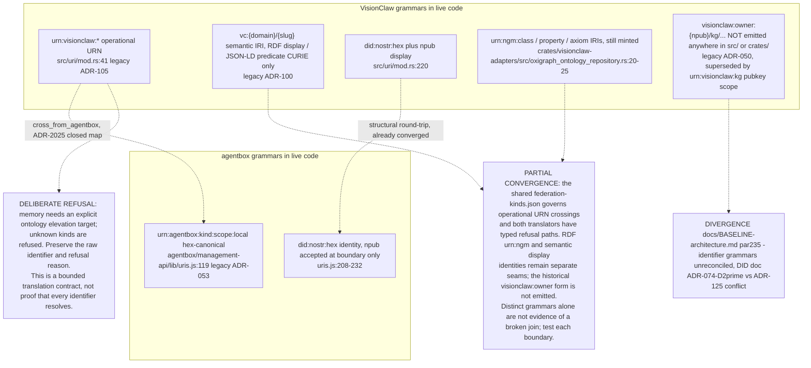

## ES-03.11 PROPOSED sovereign settlement — one decision, six repositories, nothing live
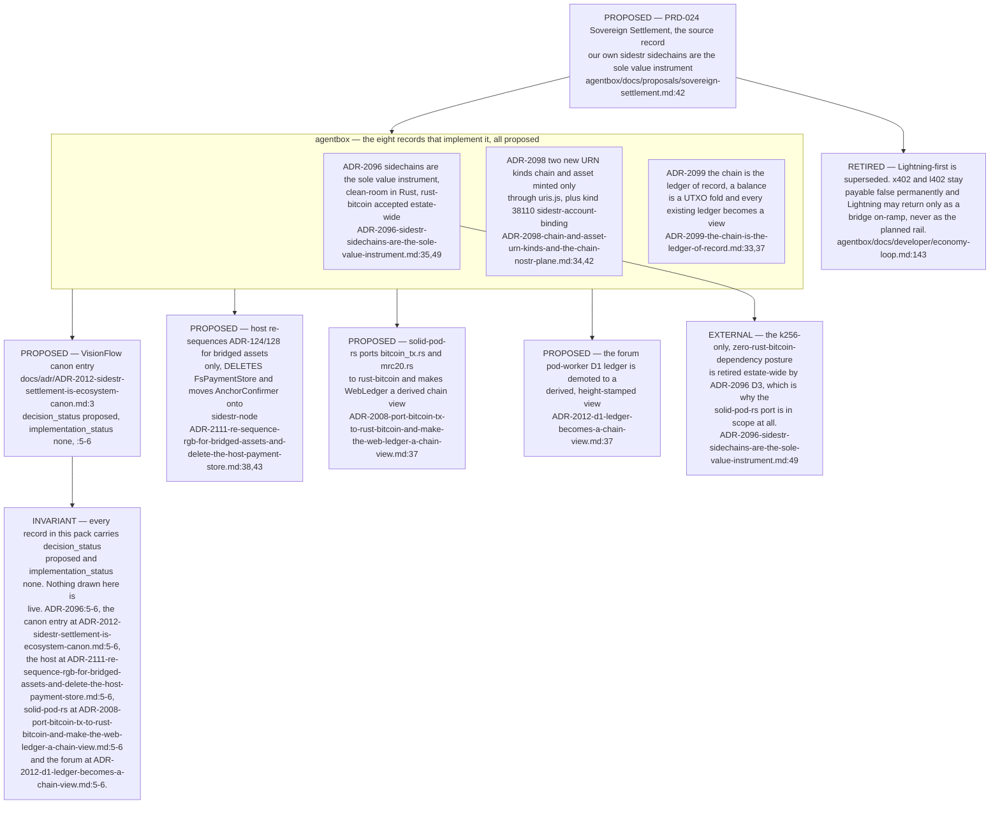

## ES-03.12 Three unsynced ledgers, and the derived views they are proposed to become
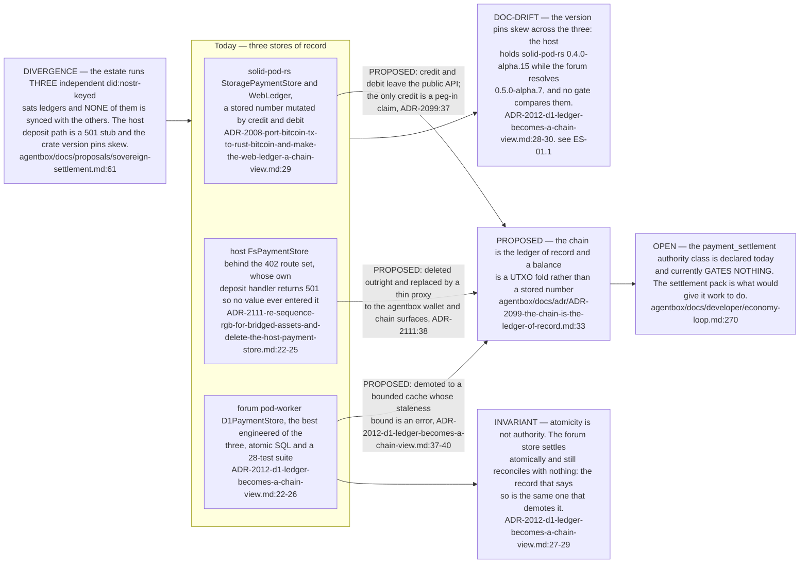
