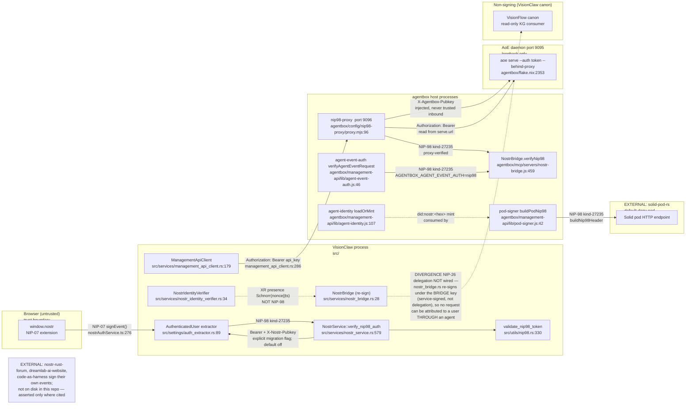
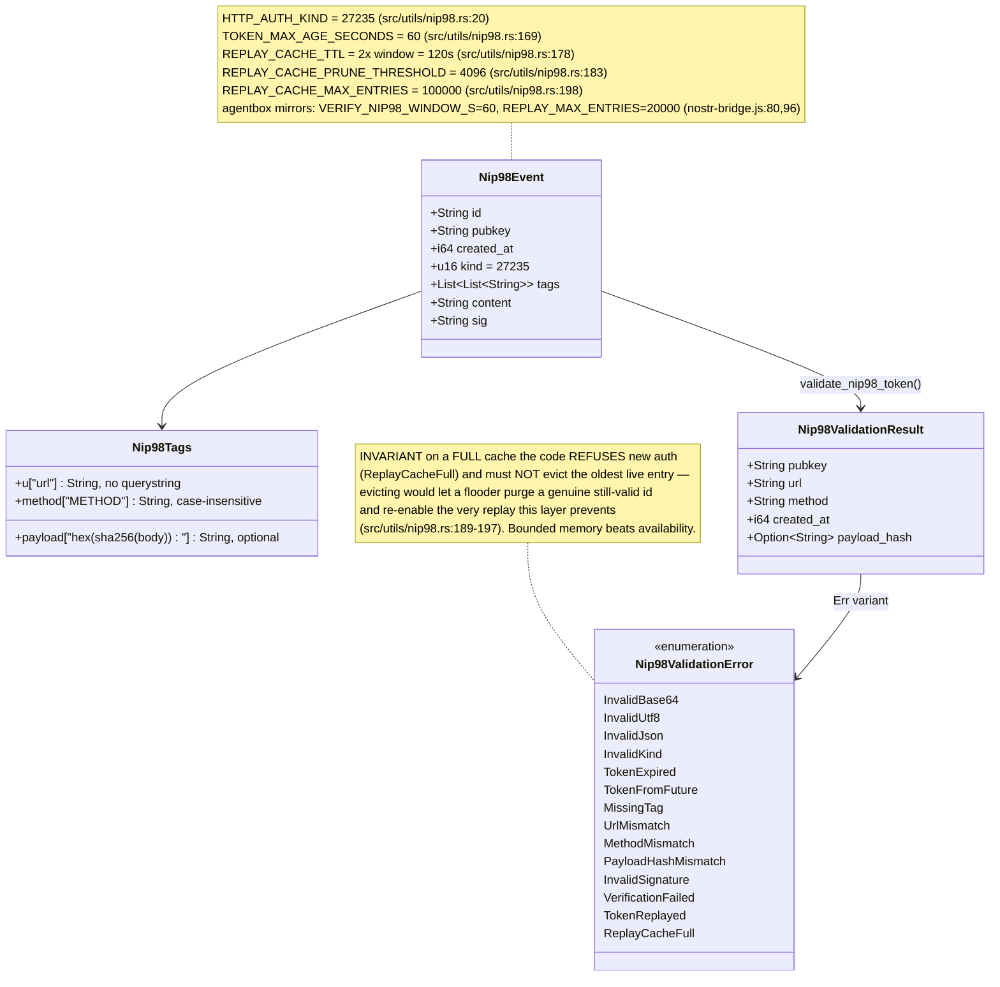
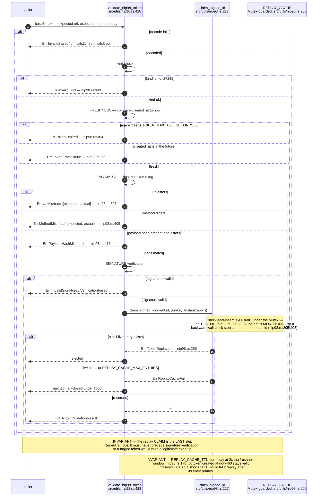
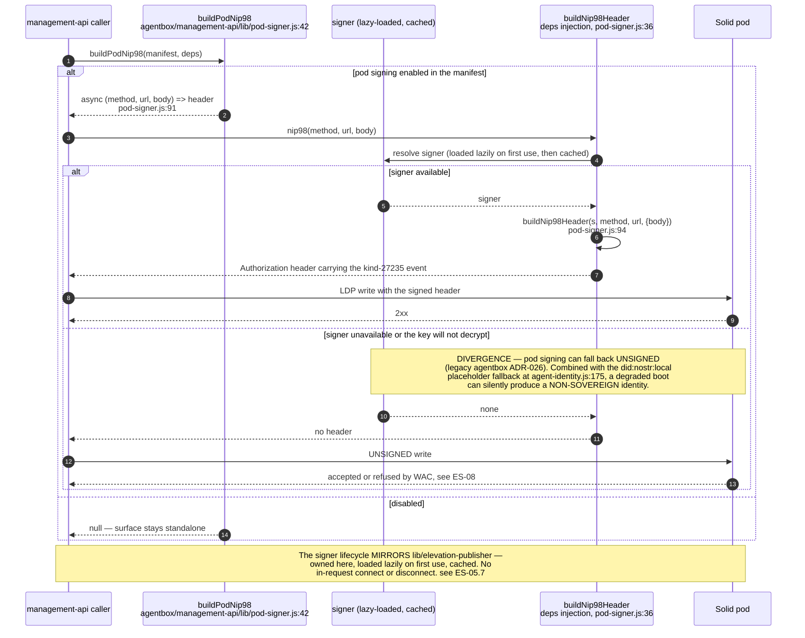
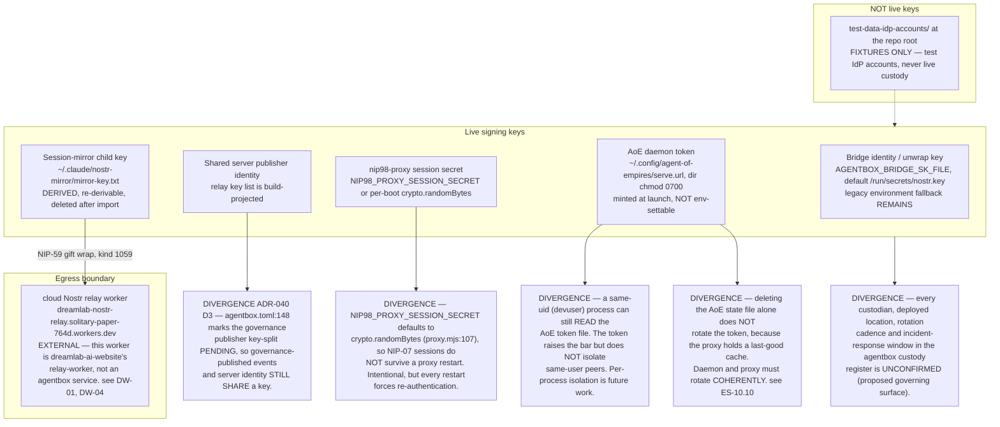
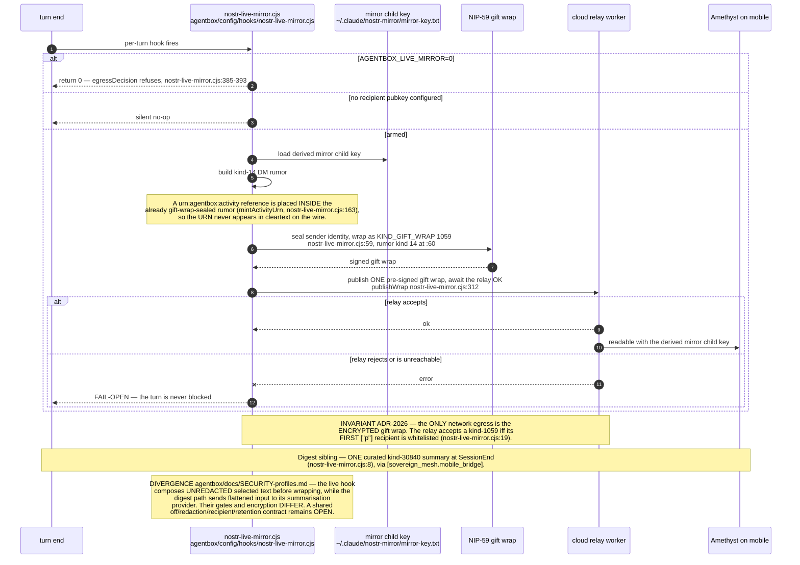

## ES-04.1 verification mesh — who signs, who verifies whom

## ES-04.2 NIP-98 event structure (kind 27235)

## ES-04.3 validate_nip98_token — the fixed check order, replay claimed LAST

## ES-04.4 agentbox pod-signer — an agent signing a write to a Solid pod

## ES-04.5 Key custody — where every signing key actually lives

## ES-04.6 Session mirror — derive, gift-wrap, publish, fail open

The 2026-09-07 source closeout makes opaque session issuance, lookup and refresh
conditional on `VISIONCLAW_LEGACY_SESSIONS=1/true`, default off. Browser REST signs
per request; graph WebSocket upgrades now carry a fresh signed NIP-98 event in a
base64url subprotocol and negotiate only a public protocol. Missing/declined signers
fail before connection. These changes do not prove remaining MCP clients or the
actual proxy/reconnect deployment have migrated. See VC-03.17 and the
[execution report](../../estate-review/closeout/2026-09-07-execution-visionclaw.md).
