## ES-05.1 Approval crosses independently durable systems
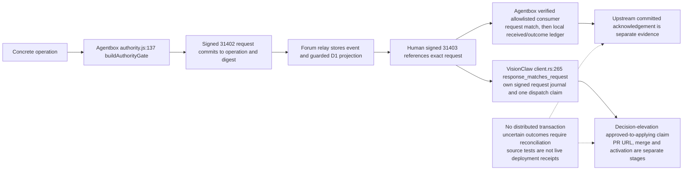

## ES-05.2 Wire fields and exact response binding
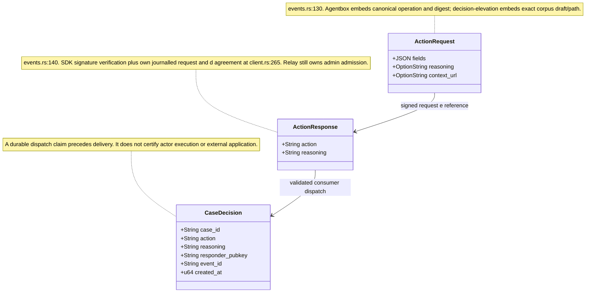

## ES-05.3 Authority gate binds the signed operation
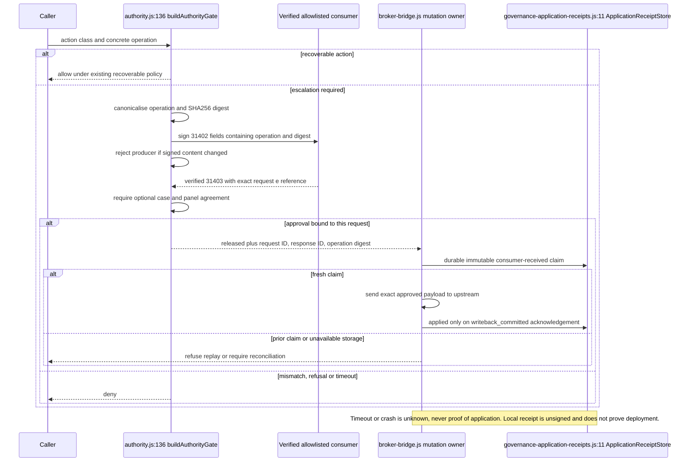

## ES-05.4 Decision waiter requires the exact request
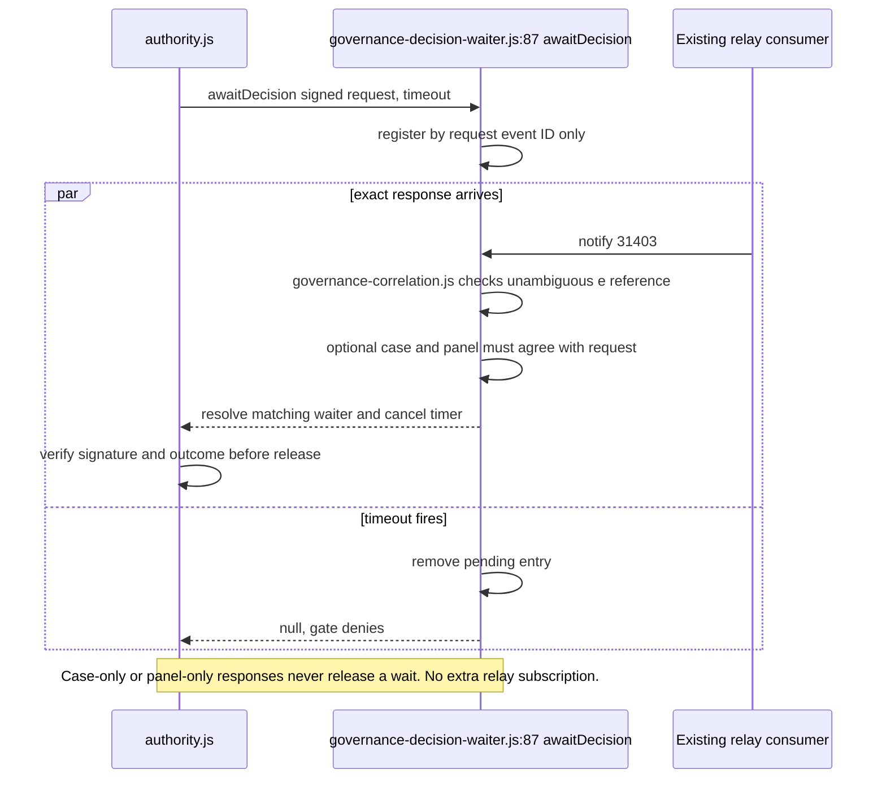

## ES-05.5 Broker inbox reads the current case state
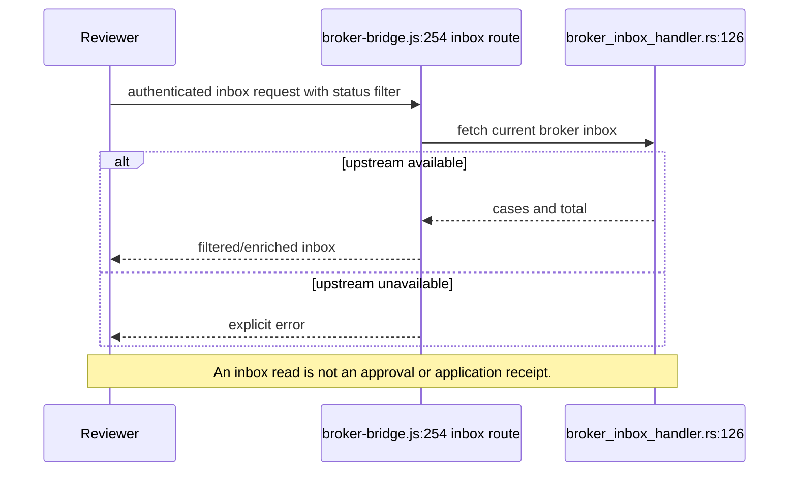

## ES-05.6 Mutation-owner acknowledgement and replay refusal
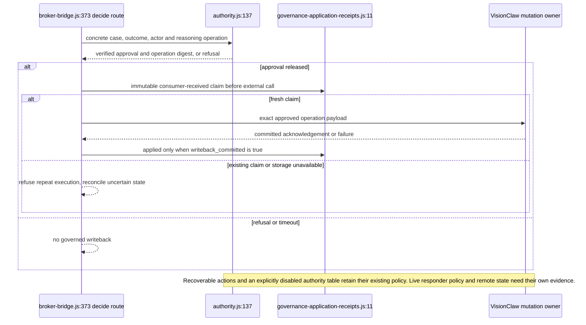

## ES-05.7 Governed ontology elevation — personal to shared, federated over Nostr
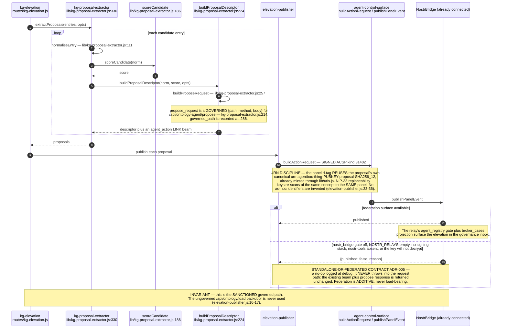

## ES-05.8 Approval, dispatch and application remain distinct
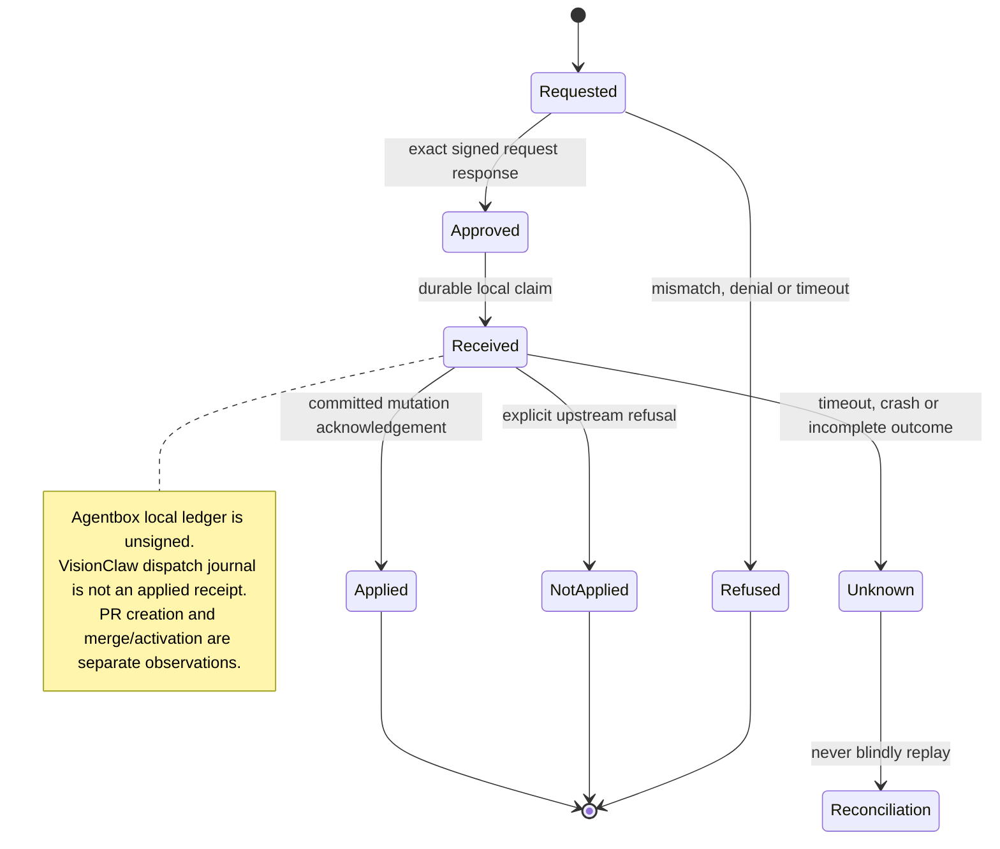

## ES-05.9 Mandate and receipt — the durable authority artefacts
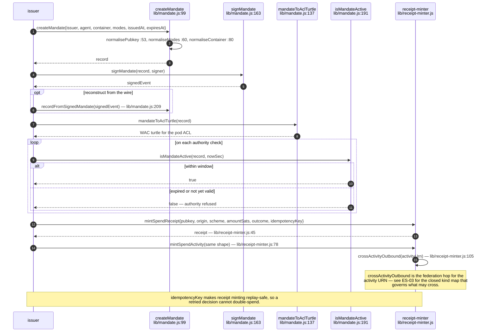

## ES-05.10 Remaining governance boundaries after execution closeout
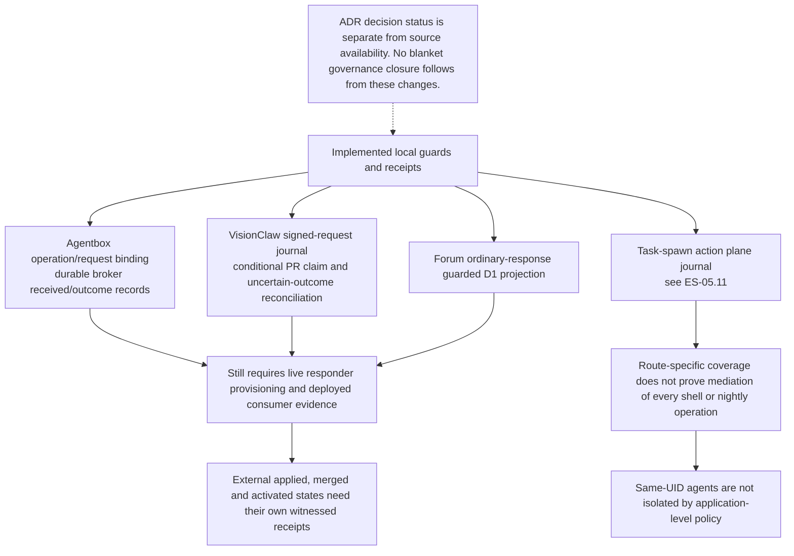

## ES-05.11 Journal coverage is route-specific

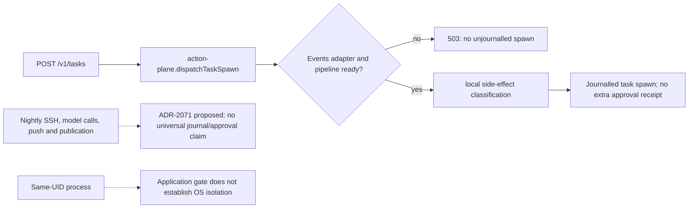

Grounded in Agentbox `management-api/lib/action-plane.js` and `routes/tasks.js`; broader governance routes retain their individual contracts. A working task-spawn journal does not establish complete mediation of shell commands or nightly egress. See [audit](../../estate-review/2026-09-07-agentbox-audit.md).
