## ES-05.1 The loop — one case crossing four systems
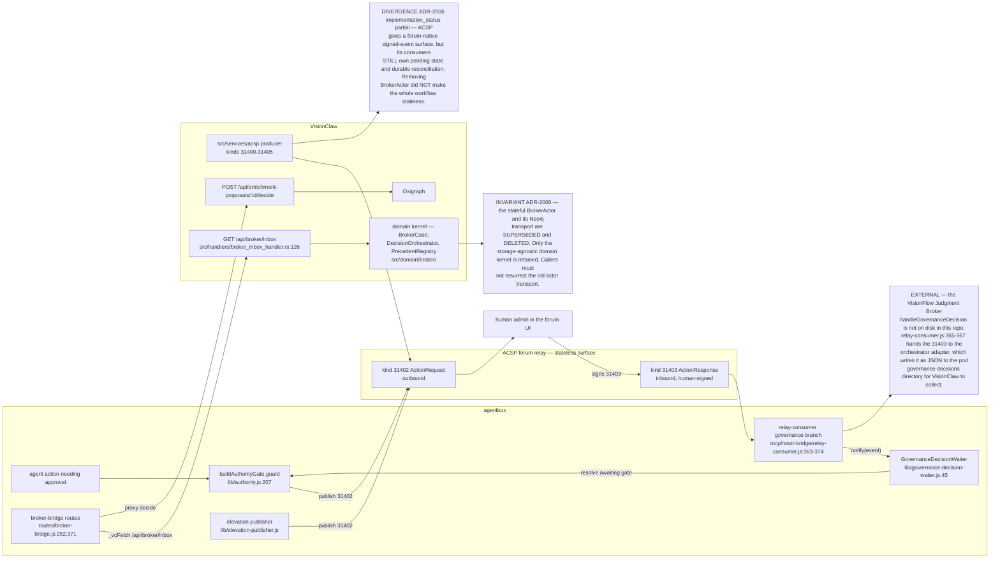

## ES-05.2 ACSP event kinds — the whole 31400-31405 block
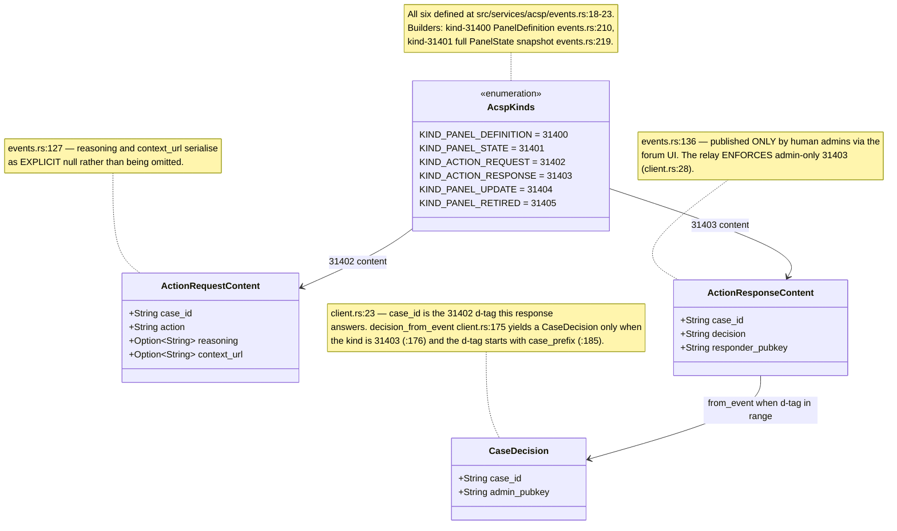

## ES-05.3 Authority gate — zero-tolerance blocks on a signed approval, else DENY
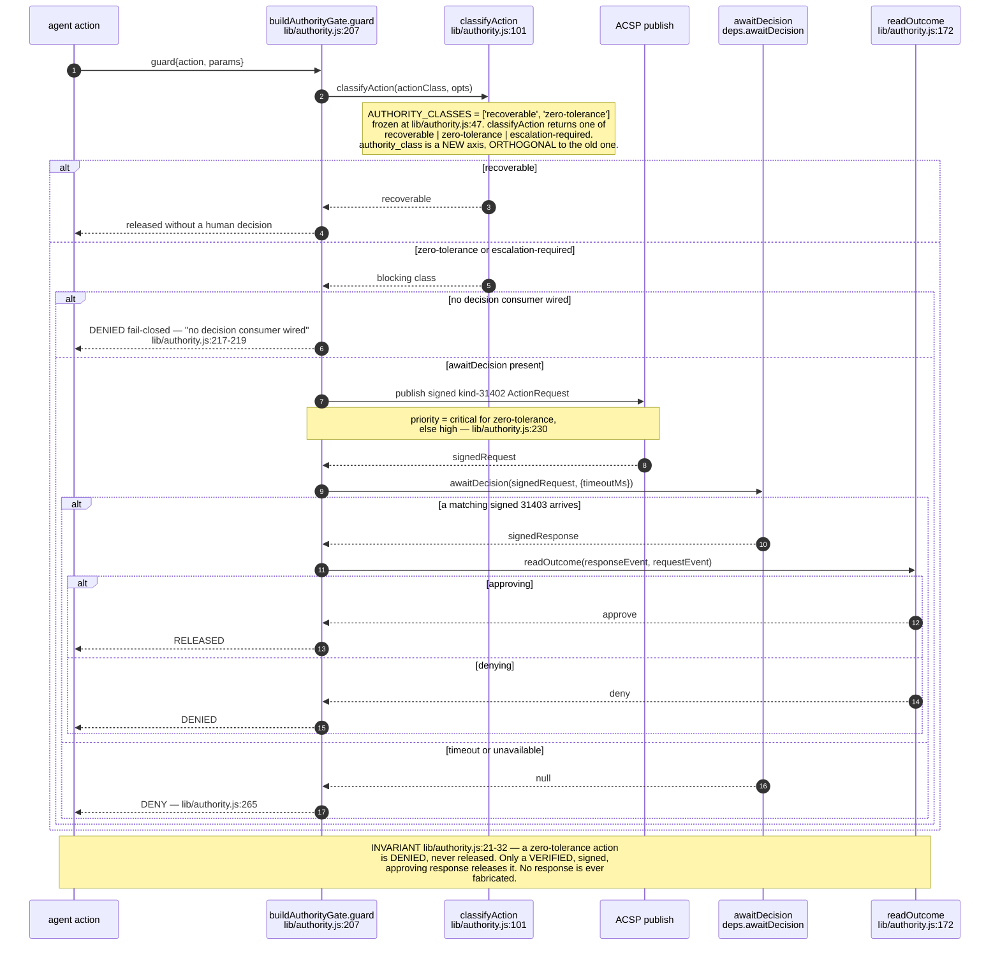

## ES-05.4 Decision waiter — one relay subscription, a registry of awaiters
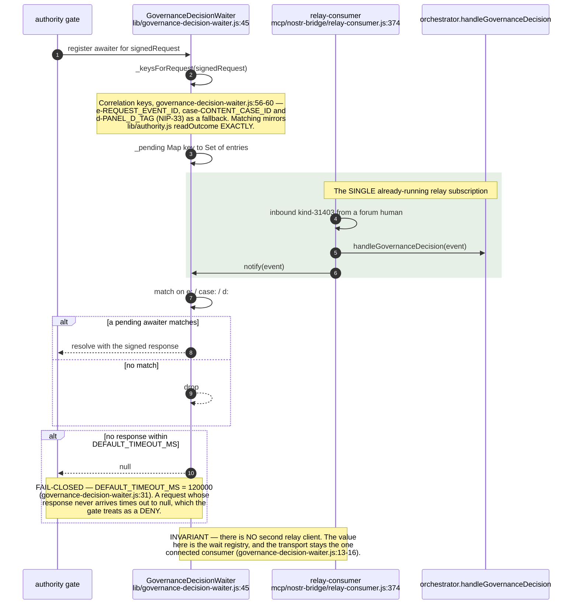

## ES-05.5 Broker inbox — agentbox reads VisionClaw's case list
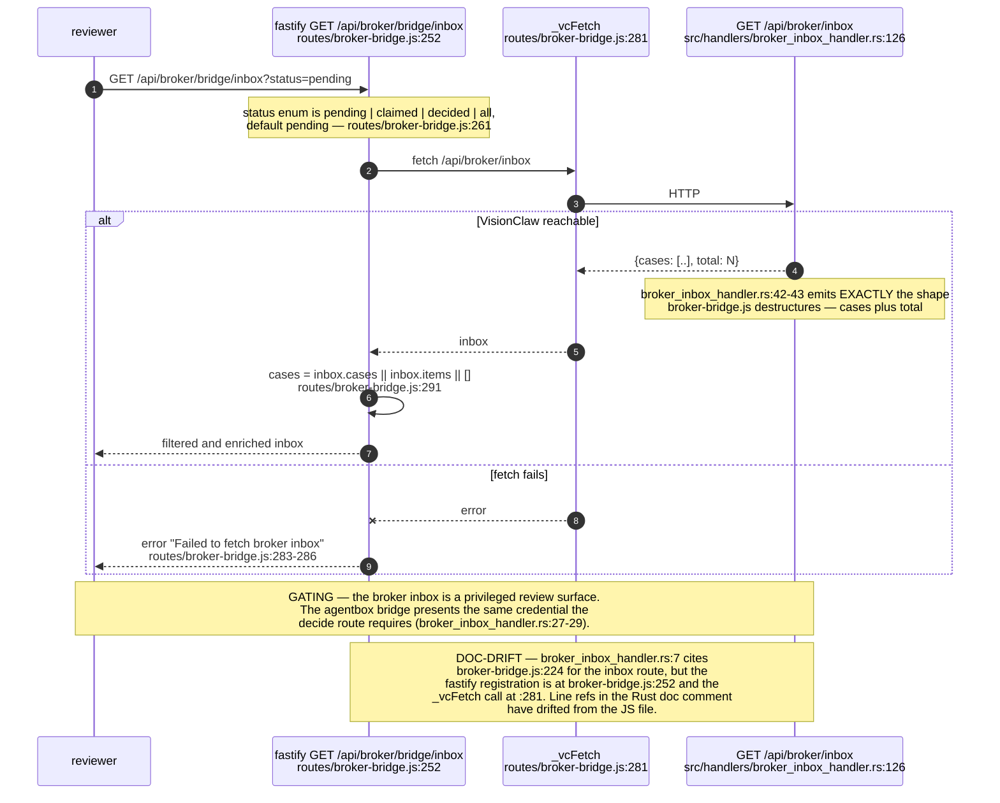

## ES-05.6 Decide and write back — the gated mutation
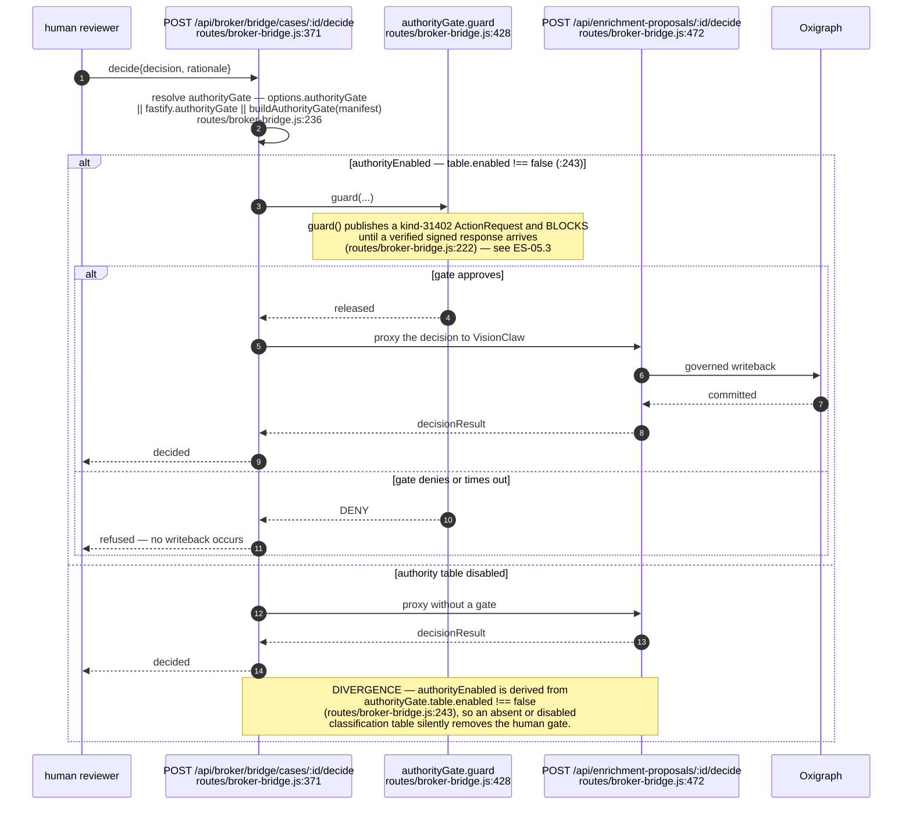

## ES-05.7 Governed ontology elevation — personal to shared, federated over Nostr
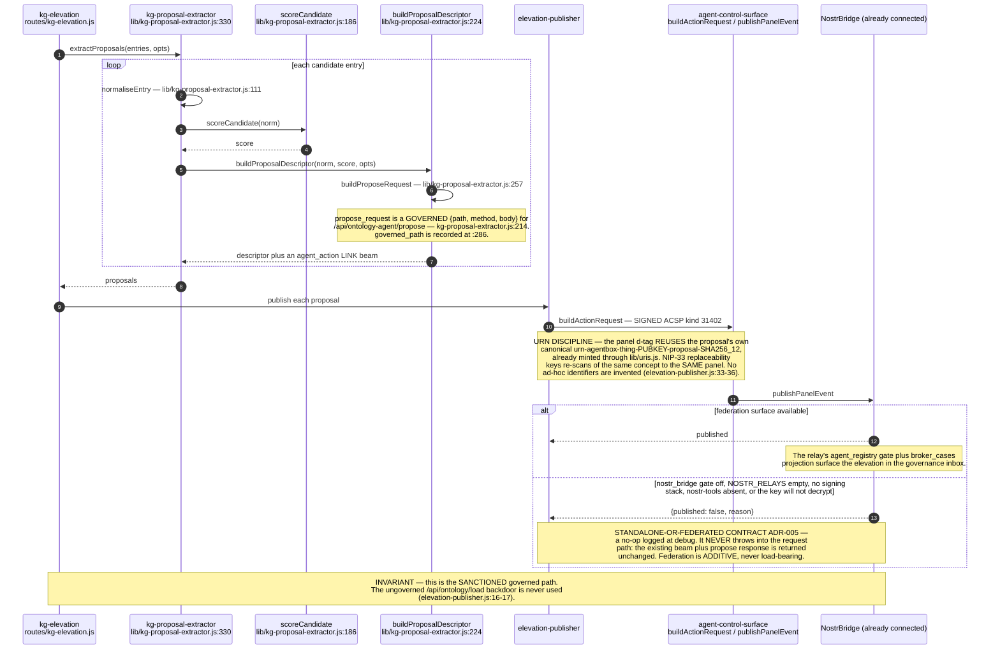

## ES-05.8 One case, end to end, as a state machine
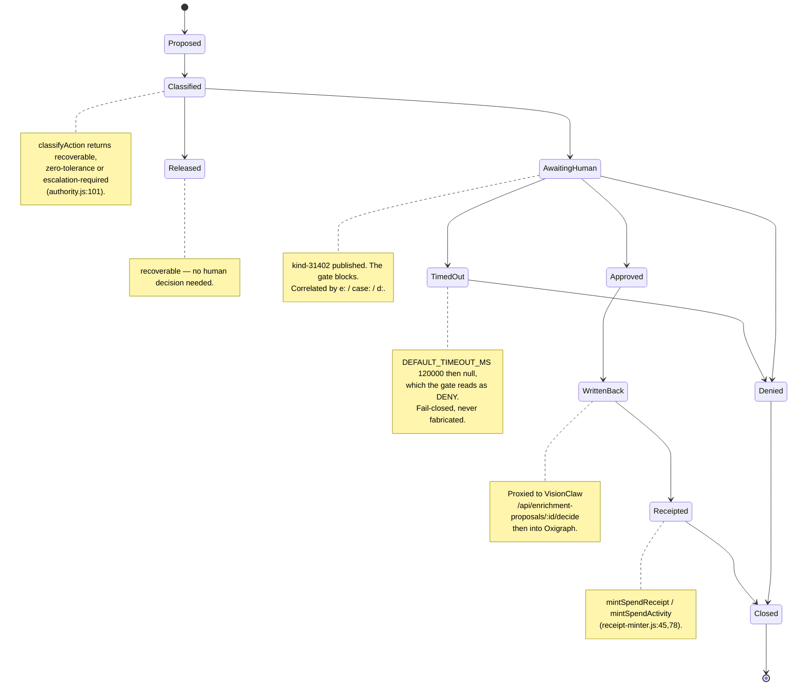

## ES-05.9 Mandate and receipt — the durable authority artefacts
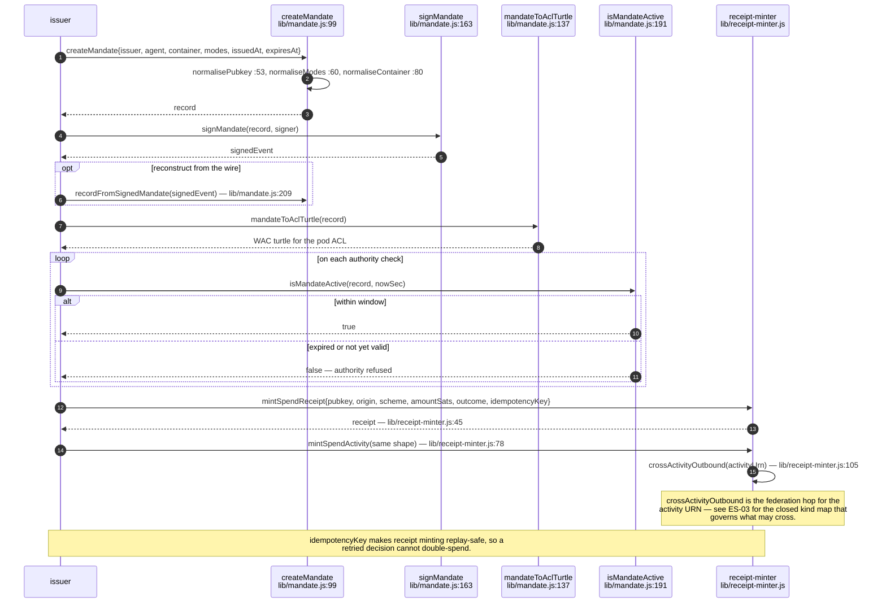

## ES-05.10 Governance divergences — the gap the governing doc names first
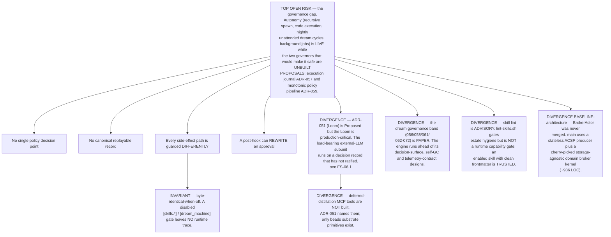

## ES-05.11 Journal coverage is route-specific

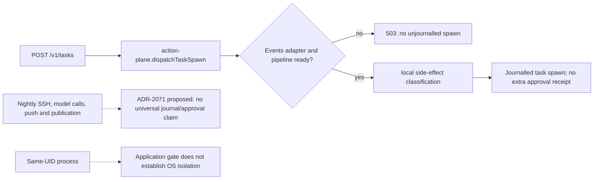

Grounded in Agentbox `management-api/lib/action-plane.js` and `routes/tasks.js`; broader governance routes retain their individual contracts. A working task-spawn journal does not establish complete mediation of shell commands or nightly egress. See [audit](../../estate-review/2026-09-07-agentbox-audit.md).
