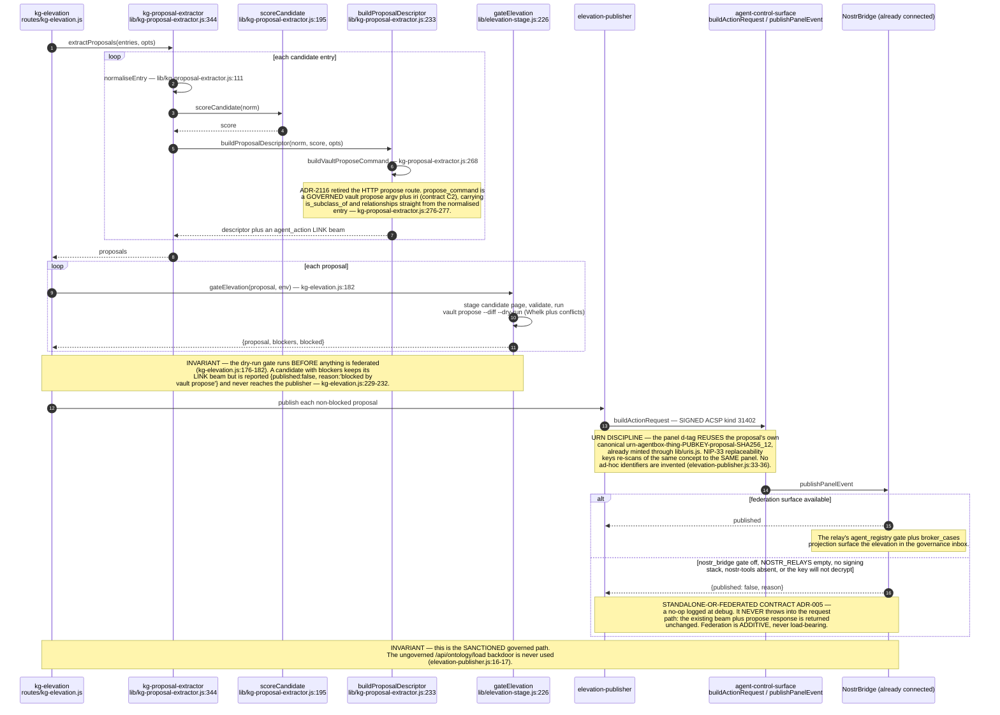
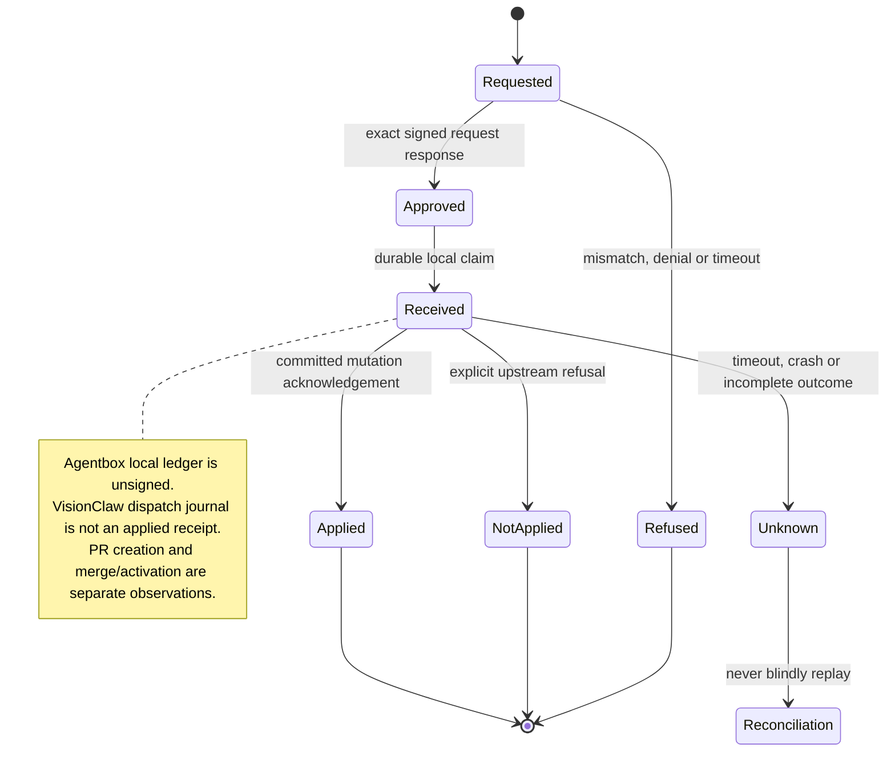
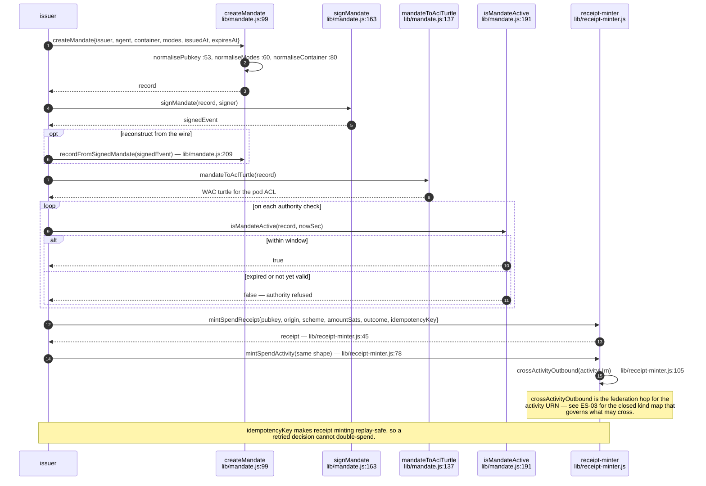
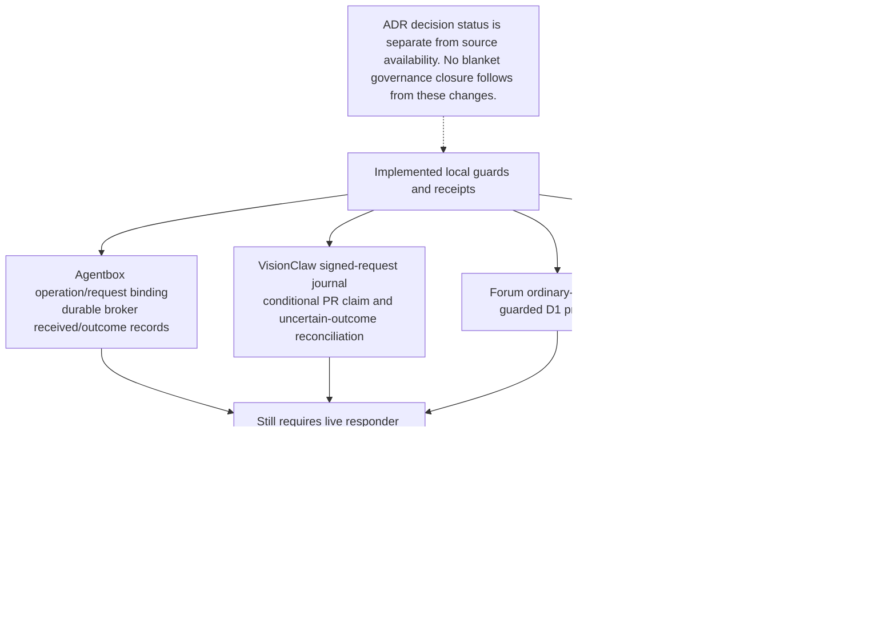
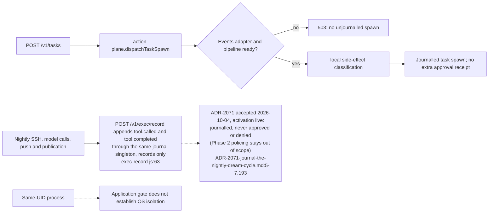
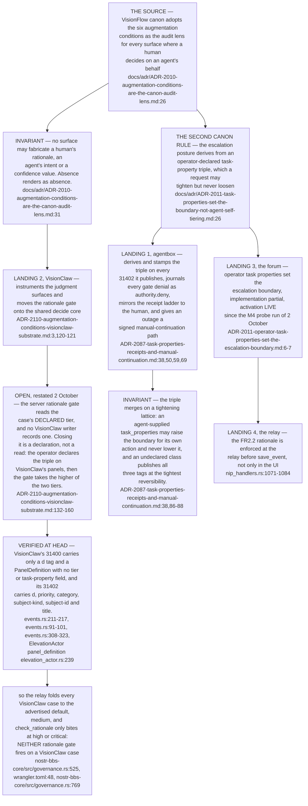
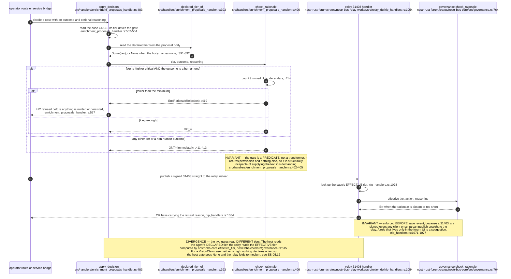
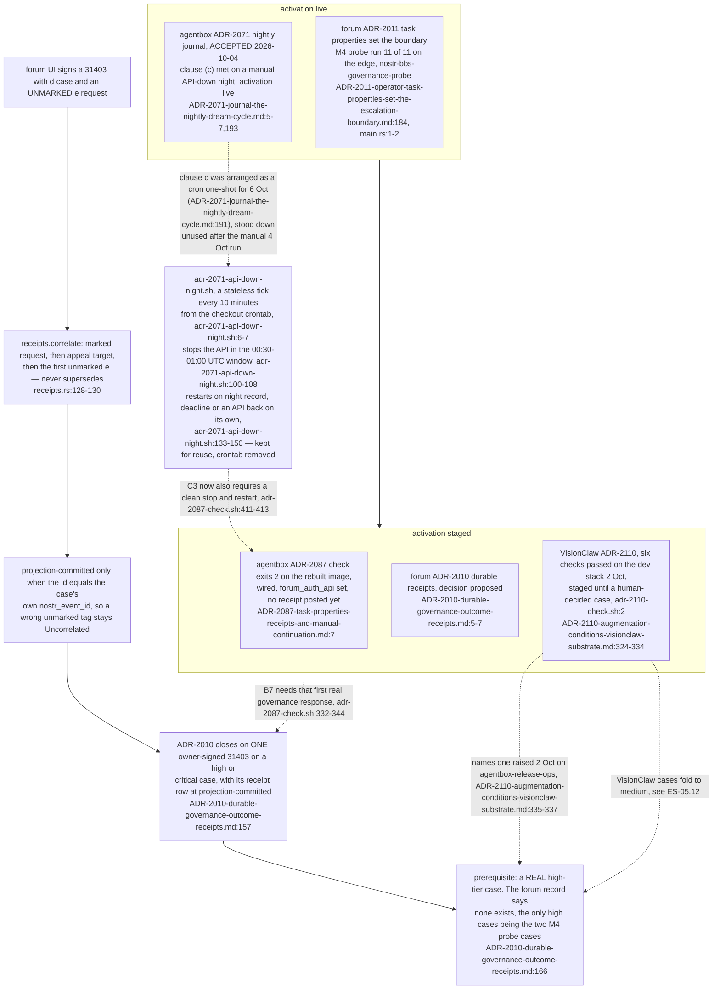
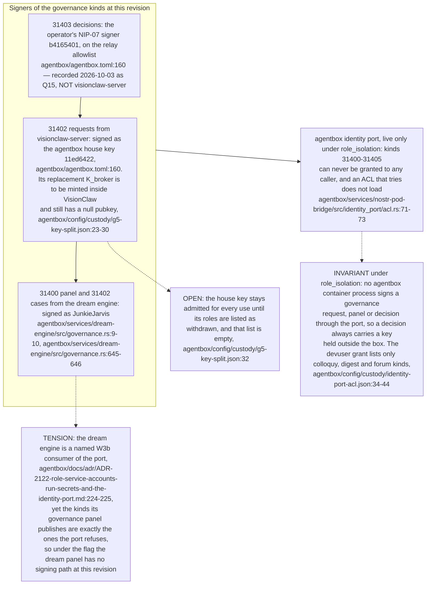

## ES-05.2 Wire fields and exact response binding

```mermaid
classDiagram
    class ActionRequest {
        +JSON fields
        +OptionString reasoning
        +OptionString context_url
    }
    class ActionResponse {
        +String action
        +String reasoning
    }
    class CaseDecision {
        +String case_id
        +String action
        +String reasoning
        +String responder_pubkey
        +String event_id
        +u64 created_at
    }
    ActionRequest --> ActionResponse : signed request e reference
    ActionResponse --> CaseDecision : validated consumer dispatch
    note for ActionRequest "events.rs:130. Agentbox embeds canonical operation and digest; decision-elevation embeds exact corpus draft/path."
    note for ActionResponse "events.rs:140. SDK signature verification plus own journalled request and d agreement at client.rs:265. Relay still owns admin admission."
    note for CaseDecision "A durable dispatch claim precedes delivery. It does not certify actor execution or external application."
```

## ES-05.6 Mutation-owner acknowledgement and replay refusal

```mermaid
sequenceDiagram
    participant Bridge as broker-bridge.js:435 decide route
    participant Gate as authority.js:226
    participant Ledger as governance-application-receipts.js:26
    participant VC as VisionClaw mutation owner
    Bridge->>Gate: concrete case, outcome, actor and reasoning operation
    Gate-->>Bridge: verified approval and operation digest, or refusal
    alt approval released
        Bridge->>Ledger: immutable consumer-received claim before external call
        alt fresh claim
            Bridge->>VC: exact approved operation payload
            VC-->>Bridge: committed acknowledgement or failure
            Bridge->>Ledger: applied only when writeback_committed is true
        else existing claim or storage unavailable
            Bridge-->>Bridge: refuse repeat execution, reconcile uncertain state
        end
    else refusal or timeout
        Bridge-->>Bridge: no governed writeback
    end
    Note over Gate,VC: Recoverable actions and an explicitly disabled authority table retain their existing policy. Live responder policy and remote state need their own evidence.
```

## ES-05.7 Governed ontology elevation — dry-run gate, then federated over Nostr

```mermaid
sequenceDiagram
    autonumber
    participant KE as kg-elevation<br/>routes/kg-elevation.js
    participant EX as kg-proposal-extractor<br/>lib/kg-proposal-extractor.js:344
    participant SC as scoreCandidate<br/>lib/kg-proposal-extractor.js:195
    participant BD as buildProposalDescriptor<br/>lib/kg-proposal-extractor.js:233
    participant GT as gateElevation<br/>lib/elevation-stage.js:226
    participant EP as elevation-publisher
    participant ACS as agent-control-surface<br/>buildActionRequest / publishPanelEvent
    participant NB as NostrBridge (already connected)

    KE->>EX: extractProposals(entries, opts)
    loop each candidate entry
        EX->>EX: normaliseEntry — lib/kg-proposal-extractor.js:111
        EX->>SC: scoreCandidate(norm)
        SC-->>EX: score
        EX->>BD: buildProposalDescriptor(norm, score, opts)
        BD->>BD: buildVaultProposeCommand — kg-proposal-extractor.js:268
        Note over BD: ADR-2116 retired the HTTP propose route. propose_command is<br/>a GOVERNED vault propose argv plus iri (contract C2), carrying<br/>is_subclass_of and relationships straight from the normalised<br/>entry — kg-proposal-extractor.js:276-277.
        BD-->>EX: descriptor plus an agent_action LINK beam
    end
    EX-->>KE: proposals
    loop each proposal
        KE->>GT: gateElevation(proposal, env) — kg-elevation.js:182
        GT->>GT: stage candidate page, validate, run<br/>vault propose --diff --dry-run (Whelk plus conflicts)
        GT-->>KE: {proposal, blockers, blocked}
    end
    Note over KE,GT: INVARIANT — the dry-run gate runs BEFORE anything is federated<br/>(kg-elevation.js:176-182). A candidate with blockers keeps its<br/>LINK beam but is reported {published:false, reason:'blocked by<br/>vault propose'} and never reaches the publisher — kg-elevation.js:229-232.
    KE->>EP: publish each non-blocked proposal
    EP->>ACS: buildActionRequest — SIGNED ACSP kind 31402
    Note over EP,ACS: URN DISCIPLINE — the panel d-tag REUSES the proposal's own<br/>canonical urn-agentbox-thing-PUBKEY-proposal-SHA256_12,<br/>already minted through lib/uris.js. NIP-33 replaceability<br/>keys re-scans of the same concept to the SAME panel. No<br/>ad-hoc identifiers are invented (elevation-publisher.js:33-36).
    ACS->>NB: publishPanelEvent
    alt federation surface available
        NB-->>EP: published
        Note over NB: The relay's agent_registry gate plus broker_cases<br/>projection surface the elevation in the governance inbox.
    else nostr_bridge gate off, NOSTR_RELAYS empty, no signing<br/>stack, nostr-tools absent, or the key will not decrypt
        NB-->>EP: {published: false, reason}
        Note over EP,NB: STANDALONE-OR-FEDERATED CONTRACT ADR-005 —<br/>a no-op logged at debug. It NEVER throws into the request<br/>path: the existing beam plus propose response is returned<br/>unchanged. Federation is ADDITIVE, never load-bearing.
    end
    Note over KE,NB: INVARIANT — this is the SANCTIONED governed path.<br/>The ungoverned /api/ontology/load backdoor is never used<br/>(elevation-publisher.js:16-17).
```

## ES-05.8 Approval, dispatch and application remain distinct

```mermaid
stateDiagram-v2
    [*] --> Requested
    Requested --> Approved: exact signed request response
    Requested --> Refused: mismatch, denial or timeout
    Approved --> Received: durable local claim
    Received --> Applied: committed mutation acknowledgement
    Received --> NotApplied: explicit upstream refusal
    Received --> Unknown: timeout, crash or incomplete outcome
    Unknown --> Reconciliation: never blindly replay
    Applied --> [*]
    NotApplied --> [*]
    Refused --> [*]
    note right of Received
        Agentbox local ledger is unsigned.
        VisionClaw dispatch journal is not an applied receipt.
        PR creation and merge/activation are separate observations.
    end note
```

## ES-05.9 Mandate and receipt — the durable authority artefacts

```mermaid
sequenceDiagram
    autonumber
    participant I as issuer
    participant M as createMandate<br/>lib/mandate.js:99
    participant S as signMandate<br/>lib/mandate.js:163
    participant T as mandateToAclTurtle<br/>lib/mandate.js:137
    participant CK as isMandateActive<br/>lib/mandate.js:191
    participant RM as receipt-minter<br/>lib/receipt-minter.js

    I->>M: createMandate{issuer, agent, container, modes, issuedAt, expiresAt}
    M->>M: normalisePubkey :53, normaliseModes :60, normaliseContainer :80
    M-->>I: record
    I->>S: signMandate(record, signer)
    S-->>I: signedEvent
    opt reconstruct from the wire
        I->>M: recordFromSignedMandate(signedEvent) — lib/mandate.js:209
    end
    I->>T: mandateToAclTurtle(record)
    T-->>I: WAC turtle for the pod ACL
    loop on each authority check
        I->>CK: isMandateActive(record, nowSec)
        alt within window
            CK-->>I: true
        else expired or not yet valid
            CK-->>I: false — authority refused
        end
    end
    I->>RM: mintSpendReceipt{pubkey, origin, scheme, amountSats, outcome, idempotencyKey}
    RM-->>I: receipt — lib/receipt-minter.js:45
    I->>RM: mintSpendActivity(same shape) — lib/receipt-minter.js:78
    RM->>RM: crossActivityOutbound(activityUrn) — lib/receipt-minter.js:105
    Note over RM: crossActivityOutbound is the federation hop for the<br/>activity URN — see ES-03 for the closed kind map that<br/>governs what may cross.
    Note over I,RM: idempotencyKey makes receipt minting replay-safe, so a<br/>retried decision cannot double-spend.
```

## ES-05.10 Remaining governance boundaries after execution closeout

```mermaid
flowchart TB
    Local["Implemented local guards and receipts"] --> AB["Agentbox operation/request binding<br/>durable broker received/outcome records"]
    Local --> VC["VisionClaw signed-request journal<br/>conditional PR claim and uncertain-outcome reconciliation"]
    Local --> Forum["Forum ordinary-response guarded D1 projection"]
    Local --> Tasks["Task-spawn action plane journal<br/>see ES-05.11"]
    AB --> Runtime["Still requires live responder provisioning and deployed consumer evidence"]
    VC --> Runtime
    Forum --> Runtime
    Tasks --> Scope["Route-specific coverage does not prove mediation of every shell or nightly operation"]
    Scope --> UID["Same-UID agents are not isolated by application-level policy"]
    Runtime --> External["External applied, merged and activated states need their own witnessed receipts"]
    Note["ADR decision status is separate from source availability. No blanket governance closure follows from these changes."] -.-> Local
```

## ES-05.11 Journal coverage is route-specific

```mermaid
flowchart LR
    TASK["POST /v1/tasks"] --> PLANE["action-plane.dispatchTaskSpawn"]
    PLANE --> READY{"Events adapter and pipeline ready?"}
    READY -->|no| REFUSE["503: no unjournalled spawn"]
    READY -->|yes| LOCAL["local side-effect classification"]
    LOCAL --> SPAWN["Journalled task spawn; no extra approval receipt"]
    NIGHT["Nightly SSH, model calls, push and publication"] --> REC["POST /v1/exec/record appends tool.called and tool.completed<br/>through the same journal singleton, records only<br/>exec-record.js:63"]
    REC -.-> GAP["ADR-2071 accepted 2026-10-04, activation live:<br/>journalled, never approved or denied<br/>(Phase 2 policing stays out of scope)<br/>ADR-2071-journal-the-nightly-dream-cycle.md:5-7,193"]
    PEER["Same-UID process"] -.-> LIMIT["Application gate does not establish OS isolation"]
```

Grounded in Agentbox `management-api/lib/action-plane.js`, `routes/tasks.js` and, since ADR-2071 Phase 1, `routes/exec-record.js`; broader governance routes retain their individual contracts. A working task-spawn journal does not establish complete mediation of shell commands or nightly egress. See [audit](../../estate-review/2026-09-07-agentbox-audit.md).

## ES-05.12 The augmentation conditions — one canon decision landing in four repositories

```mermaid
flowchart TB
    CANON["THE SOURCE — VisionFlow canon adopts the six augmentation<br/>conditions as the audit lens for every surface where a human<br/>decides on an agent's behalf<br/>docs/adr/ADR-2010-augmentation-conditions-are-the-canon-audit-lens.md:26"]
    RULE["INVARIANT — no surface may fabricate a human's rationale, an<br/>agent's intent or a confidence value. Absence renders as absence.<br/>docs/adr/ADR-2010-augmentation-conditions-are-the-canon-audit-lens.md:31"]
    BOUND["THE SECOND CANON RULE — the escalation posture derives from an<br/>operator-declared task-property triple, which a request may<br/>tighten but never loosen<br/>docs/adr/ADR-2011-task-properties-set-the-boundary-not-agent-self-tiering.md:26"]
    CANON --> RULE
    CANON --> BOUND

    AB["LANDING 1, agentbox — derives and stamps the triple on every<br/>31402 it publishes, journals every gate denial as authority.deny,<br/>mirrors the receipt ladder to the human, and gives an outage a<br/>signed manual-continuation path<br/>ADR-2087-task-properties-receipts-and-manual-continuation.md:38,50,59,69"]
    VC["LANDING 2, VisionClaw — instruments the judgment surfaces and<br/>moves the rationale gate onto the shared decide core<br/>ADR-2110-augmentation-conditions-visionclaw-substrate.md:3,120-121"]
    FRM["LANDING 3, the forum — operator task properties set the<br/>escalation boundary, implementation partial, activation LIVE<br/>since the M4 probe run of 2 October<br/>ADR-2011-operator-task-properties-set-the-escalation-boundary.md:6-7"]
    REL["LANDING 4, the relay — the FR2.2 rationale is enforced at the<br/>relay before save_event, not only in the UI<br/>nip_handlers.rs:1071-1084"]

    BOUND --> AB
    RULE --> VC
    BOUND --> FRM
    FRM --> REL

    OPEN["OPEN, restated 2 October — the server rationale gate reads the<br/>case's DECLARED tier, and no VisionClaw writer records one. Closing<br/>it is a declaration, not a read: the operator declares the triple on<br/>VisionClaw's panels, then the gate takes the higher of the two tiers.<br/>ADR-2110-augmentation-conditions-visionclaw-substrate.md:132-160"]
    NOTIER["VERIFIED AT HEAD — VisionClaw's 31400 carries only a d tag and a<br/>PanelDefinition with no tier or task-property field, and its 31402<br/>carries d, priority, category, subject-kind, subject-id and title.<br/>events.rs:211-217, events.rs:91-101, events.rs:308-323,<br/>ElevationActor panel_definition elevation_actor.rs:239"]
    MED["so the relay folds every VisionClaw case to the advertised default,<br/>medium, and check_rationale only bites at high or critical:<br/>NEITHER rationale gate fires on a VisionClaw case<br/>nostr-bbs-core/src/governance.rs:525, wrangler.toml:48, nostr-bbs-core/src/governance.rs:769"]
    OPEN --> NOTIER --> MED
    VC --> OPEN

    TIGHT["INVARIANT — the triple merges on a tightening lattice: an<br/>agent-supplied task_properties may raise the boundary for its own<br/>action and never lower it, and an undeclared class publishes all<br/>three tags at the tightest reversibility.<br/>ADR-2087-task-properties-receipts-and-manual-continuation.md:38,86-88"]
    AB --> TIGHT
```

## ES-05.13 The rationale gate — a predicate that refuses, on both the host core and the relay

```mermaid
sequenceDiagram
    autonumber
    participant UI as operator route or service bridge
    participant AD as apply_decision<br/>src/handlers/enrichment_proposals_handler.rs:483
    participant DT as declared_tier_of<br/>src/handlers/enrichment_proposals_handler.rs:393
    participant CK as check_rationale<br/>src/handlers/enrichment_proposals_handler.rs:406
    participant RL as relay 31403 handler<br/>nostr-rust-forum/crates/nostr-bbs-relay-worker/src/relay_do/nip_handlers.rs:1054
    participant FG as governance check_rationale<br/>nostr-rust-forum/crates/nostr-bbs-core/src/governance.rs:764

    UI->>AD: decide a case with an outcome and optional reasoning
    AD->>AD: read the case ONCE, its tier drives the gate<br/>enrichment_proposals_handler.rs:502-504
    AD->>DT: read the declared tier from the proposal body
    DT-->>AD: Some(tier), or None when the body names none, :391-392
    AD->>CK: tier, outcome, reasoning
    alt tier is high or critical AND the outcome is a human one
        CK->>CK: count trimmed Unicode scalars, :414
        alt fewer than the minimum
            CK-->>AD: Err(RationaleRejection), :419
            AD-->>UI: 422 refused before anything is minted or persisted,<br/>enrichment_proposals_handler.rs:527
        else long enough
            CK-->>AD: Ok(())
        end
    else any other tier or a non-human outcome
        CK-->>AD: Ok(()) immediately, :411-413
    end

    Note over CK: INVARIANT — the gate is a PREDICATE, not a transformer. It<br/>returns permission and nothing else, so it is structurally<br/>incapable of supplying the text it is demanding.<br/>src/handlers/enrichment_proposals_handler.rs:402-405

    UI->>RL: publish a signed 31403 straight to the relay instead
    RL->>RL: look up the case's EFFECTIVE tier, nip_handlers.rs:1078
    RL->>FG: effective tier, action, reasoning
    FG-->>RL: Err when the rationale is absent or too short
    RL-->>UI: OK false carrying the refusal reason, nip_handlers.rs:1084

    Note over RL,FG: INVARIANT — enforced BEFORE save_event, because a 31403 is a<br/>signed event any client or script can publish straight to the<br/>relay. A rule that lives only in the forum UI is a suggestion.<br/>nip_handlers.rs:1071-1077
    Note over AD,RL: DIVERGENCE — the two gates read DIFFERENT tiers. The host reads<br/>the agent's DECLARED tier, the relay reads the EFFECTIVE tier<br/>computed by nostr-bbs-core effective_tier, nostr-bbs-core/src/governance.rs:515.<br/>For a VisionClaw case neither is high: nothing declares a tier, so<br/>the host gate sees None and the relay folds to medium. see ES-05.12
```

## ES-05.14 Where each record of the loop stands on 2 October, and the correlation fix that let a UI decision land

**What it shows.** The governance loop's records by activation state at the stamped revisions, and the
forum relay defect that sat between the human's decision and every downstream receipt: until `a5b809e`
`receipts::correlate` found the request only in an `e` tag marked `request`, which no producer emits, so a
31403 signed in the forum UI was stored and acknowledged but never projected. ADR-2071 left the proposed
list on 4 October: clause (c) ran that morning as a manual API-down night on the live image, all three
Phase 1 clauses passed, and the record is accepted with the 6 October cron one-shot retired.

**Why it is this way.** Each repository activates its own record against its own evidence (ADR-2087's
check script, the forum's M4 probe suite, ADR-2110's check script). The correlation fix was found while
preparing ADR-2010's acceptance and reached the edge with the website kit pin to `341c5d2`; the website now
pins `72463fbd`, a descendant of `13cbe6c`. On 2 October VisionClaw's ADR-2110 check passed on the owner's
dev stack and the record moved to staged; agentbox's one-shot for the night of 6 October was stood down
unused after the manual 4 October run met clause (c) instead.

```mermaid
flowchart TB
    subgraph LIVE["activation live"]
        F2011["forum ADR-2011 task properties set the boundary<br/>M4 probe run 11 of 11 on the edge, nostr-bbs-governance-probe<br/>ADR-2011-operator-task-properties-set-the-escalation-boundary.md:184, main.rs:1-2"]
        A2071["agentbox ADR-2071 nightly journal, ACCEPTED 2026-10-04<br/>clause (c) met on a manual API-down night, activation live<br/>ADR-2071-journal-the-nightly-dream-cycle.md:5-7,193"]
    end
    A2071 -.->|"clause c was arranged as a cron one-shot for 6 Oct<br/>(ADR-2071-journal-the-nightly-dream-cycle.md:191), stood down<br/>unused after the manual 4 Oct run"| ONESHOT["adr-2071-api-down-night.sh, a stateless tick every 10 minutes<br/>from the checkout crontab, adr-2071-api-down-night.sh:6-7<br/>stops the API in the 00:30-01:00 UTC window, adr-2071-api-down-night.sh:100-108<br/>restarts on night record, deadline or an API back on its own,<br/>adr-2071-api-down-night.sh:133-150 — kept for reuse, crontab removed"]
    ONESHOT -.->|"C3 now also requires a clean stop and restart, adr-2087-check.sh:411-413"| A2087
    subgraph STAGED["activation staged"]
        A2087["agentbox ADR-2087 check exits 2 on the rebuilt image,<br/>wired, forum_auth_api set, no receipt posted yet<br/>ADR-2087-task-properties-receipts-and-manual-continuation.md:7"]
        F2010["forum ADR-2010 durable receipts, decision proposed<br/>ADR-2010-durable-governance-outcome-receipts.md:5-7"]
        V2110["VisionClaw ADR-2110, six checks passed on the dev stack 2 Oct,<br/>staged until a human-decided case, adr-2110-check.sh:2<br/>ADR-2110-augmentation-conditions-visionclaw-substrate.md:324-334"]
    end
    LIVE --> STAGED

    UI["forum UI signs a 31403 with d case and an UNMARKED e request"] --> COR["receipts.correlate: marked request, then appeal target,<br/>then the first unmarked e — never supersedes<br/>receipts.rs:128-130"]
    COR --> PROJ["projection-committed only when the id equals the case's<br/>own nostr_event_id, so a wrong unmarked tag stays Uncorrelated"]
    PROJ --> ACC["ADR-2010 closes on ONE owner-signed 31403 on a high or<br/>critical case, with its receipt row at projection-committed<br/>ADR-2010-durable-governance-outcome-receipts.md:157"]
    ACC --> NOCASE["prerequisite: a REAL high-tier case. The forum record says<br/>none exists, the only high cases being the two M4 probe cases<br/>ADR-2010-durable-governance-outcome-receipts.md:166"]
    V2110 -.->|"names one raised 2 Oct on agentbox-release-ops, ADR-2110-augmentation-conditions-visionclaw-substrate.md:335-337"| NOCASE
    V2110 -.->|"VisionClaw cases fold to medium, see ES-05.12"| NOCASE
    A2087 -.->|"B7 needs that first real governance response, adr-2087-check.sh:332-344"| ACC
```

**Invariant:** reading the unmarked `e` tag cannot bind a decision to the wrong case, because the projection still requires the request id to equal the case's own `nostr_event_id` (`../nostr-rust-forum/crates/nostr-bbs-relay-worker/src/relay_do/receipts.rs:121-127`).

**Open:** two activations now wait on the same event — the owner's first decision on a real high-tier case. VisionClaw still declares no tier on its panels or requests (`../project/src/services/acsp/events.rs:308-323`), so its cases fold to `medium` on the forum (`../nostr-rust-forum/crates/nostr-bbs-core/src/governance.rs:525`); the candidate case is agentbox's, raised on the agentbox-release-ops panel on 2 October (`../project/docs/adr/ADR-2110-augmentation-conditions-visionclaw-substrate.md:335-337`). Whether the relay stamped it `effective_tier: high` is the prerequisite forum ADR-2010 left unchecked (`../nostr-rust-forum/docs/adr/ADR-2010-durable-governance-outcome-receipts.md:176`), and who declares the first VisionClaw triple remains the owner's policy choice (`../project/docs/adr/ADR-2110-augmentation-conditions-visionclaw-substrate.md:153-155`).

**Tension (forum ADR-2010 and ADR-2011 vs VisionClaw ADR-2110):** the forum records say the only high cases on the edge are the two M4 probe cases (`../nostr-rust-forum/docs/adr/ADR-2010-durable-governance-outcome-receipts.md:166`, `../nostr-rust-forum/docs/adr/ADR-2011-operator-task-properties-set-the-escalation-boundary.md:197`); VisionClaw's ADR-2110 names a real high-tier case raised the same day (`../project/docs/adr/ADR-2110-augmentation-conditions-visionclaw-substrate.md:335-337`). Neither cites a `--list-cases` read of it.

The former drift on the FR3.2 client read is closed: forum ADR-2011 now records it on the edge with kit `341c5d2` (`../nostr-rust-forum/docs/adr/ADR-2011-operator-task-properties-set-the-escalation-boundary.md:203`), and the Workers deploy pins `72463fbd`, a descendant (`../dreamlab-ai-website/.github/workflows/workers-deploy.yml:45`).

## ES-05.15 Who signs which governance kind, and what the agentbox identity port will never sign

```mermaid
flowchart TB
    subgraph SIGNERS["Signers of the governance kinds at this revision"]
        direction TB
        DEC["31403 decisions: the operator's NIP-07 signer b4165401, on the relay allowlist<br/>agentbox/agentbox.toml:160 — recorded 2026-10-03 as Q15, NOT visionclaw-server"]
        VCS["31402 requests from visionclaw-server: signed as the agentbox house key 11ed6422,<br/>agentbox/agentbox.toml:160. Its replacement K_broker is to be minted inside VisionClaw<br/>and still has a null pubkey, agentbox/config/custody/g5-key-split.json:23-30"]
        JJ["31400 panel and 31402 cases from the dream engine: signed as JunkieJarvis<br/>agentbox/services/dream-engine/src/governance.rs:9-10, agentbox/services/dream-engine/src/governance.rs:645-646"]
        DEC --> VCS --> JJ
    end
    PORT["agentbox identity port, live only under role_isolation: kinds 31400-31405<br/>can never be granted to any caller, and an ACL that tries does not load<br/>agentbox/services/nostr-pod-bridge/src/identity_port/acl.rs:71-73"]
    SIGNERS --> PORT
    PORT -.-> INV["INVARIANT under role_isolation: no agentbox container process signs a governance<br/>request, panel or decision through the port, so a decision always carries a key<br/>held outside the box. The devuser grant lists only colloquy, digest and forum kinds,<br/>agentbox/config/custody/identity-port-acl.json:34-44"]
    JJ -.-> TEN["TENSION: the dream engine is a named W3b consumer of the port,<br/>agentbox/docs/adr/ADR-2122-role-service-accounts-run-secrets-and-the-identity-port.md:224-225,<br/>yet the kinds its governance panel publishes are exactly the ones the port refuses,<br/>so under the flag the dream panel has no signing path at this revision"]
    VCS -.-> OPN["OPEN: the house key stays admitted for every use until its roles are listed as<br/>withdrawn, and that list is empty, agentbox/config/custody/g5-key-split.json:32"]
```

**What it shows.** The three signers the estate's governance loop runs on at this revision, after the 2026-10-03 correction of which key signs what, and the line the agentbox identity port draws: a container process may sign colloquy, digests and forum posts through it, but never a governance panel, request or decision.

**Why it is this way.** ADR-2122 built the port on ADR-2101's rule that it permits named operations only, and the port's own refusal list keeps container keys out of human decisions. The G-5 key split, which moves VisionClaw's governance signer off the house key, is staged with public keys only and needs the owner's rebuilds before anything is withdrawn.

**Invariant (under role_isolation):** the agentbox identity port refuses to load any ACL that grants a governance kind (31400-31405) or a graduation (38414), so no container caller can obtain a governance signature from it (`../project/agentbox/services/nostr-pod-bridge/src/identity_port/acl.rs:71-73`).

**Tension (identity port vs the dream governance panel):** the dream engine publishes its 31400 panel and 31402 cases as JunkieJarvis (`../project/agentbox/services/dream-engine/src/governance.rs:9-10`) and is listed for the W3b move onto the port (`../project/agentbox/docs/adr/ADR-2122-role-service-accounts-run-secrets-and-the-identity-port.md:224-225`), but the port never signs those kinds (`../project/agentbox/services/nostr-pod-bridge/src/identity_port/acl.rs:71-73`); with the flag on, the panel has no signer at this revision.

**Drift (resolved 2026-10-03, Q15):** the relay allowlist used to call `b4165401…` the visionclaw-server governance publisher; it now records it as the operator's NIP-07 signer for 31403 decisions, with visionclaw-server signing 31402 as the house key (`../project/agentbox/agentbox.toml:160`). Resolved in the manifest's wording only; the verifier set is unchanged.
