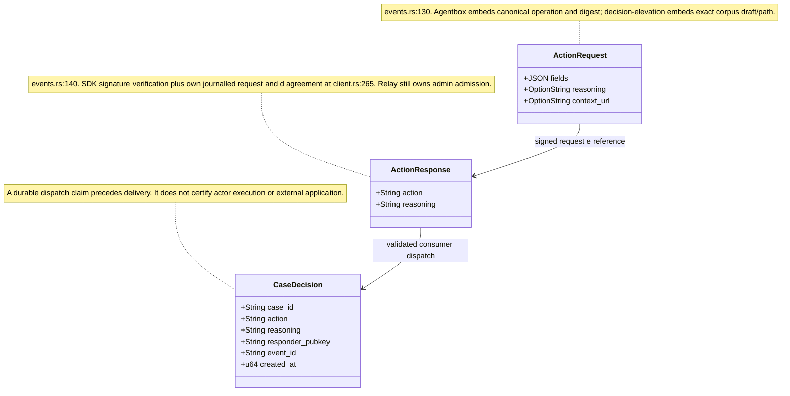
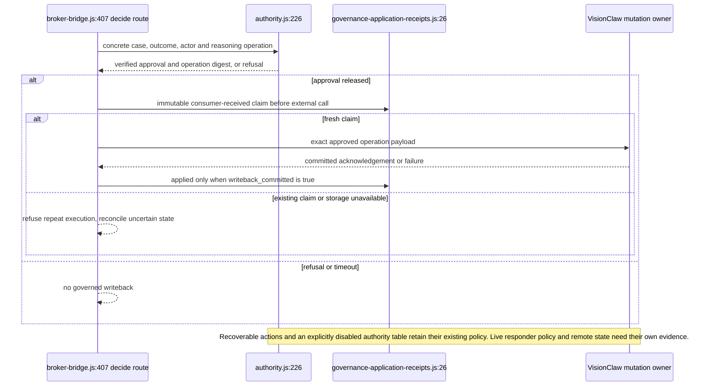
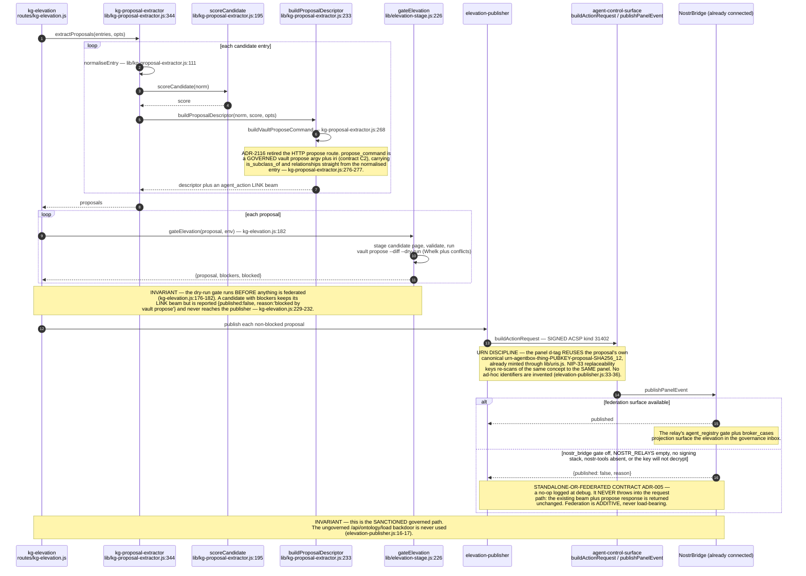
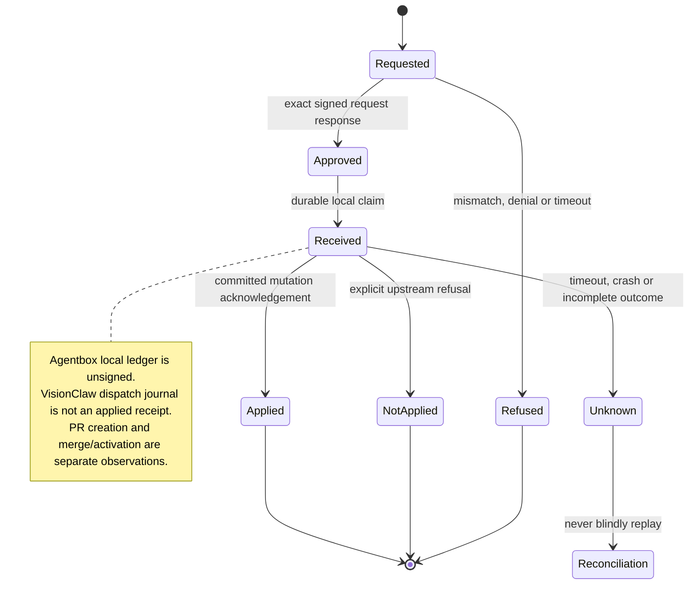
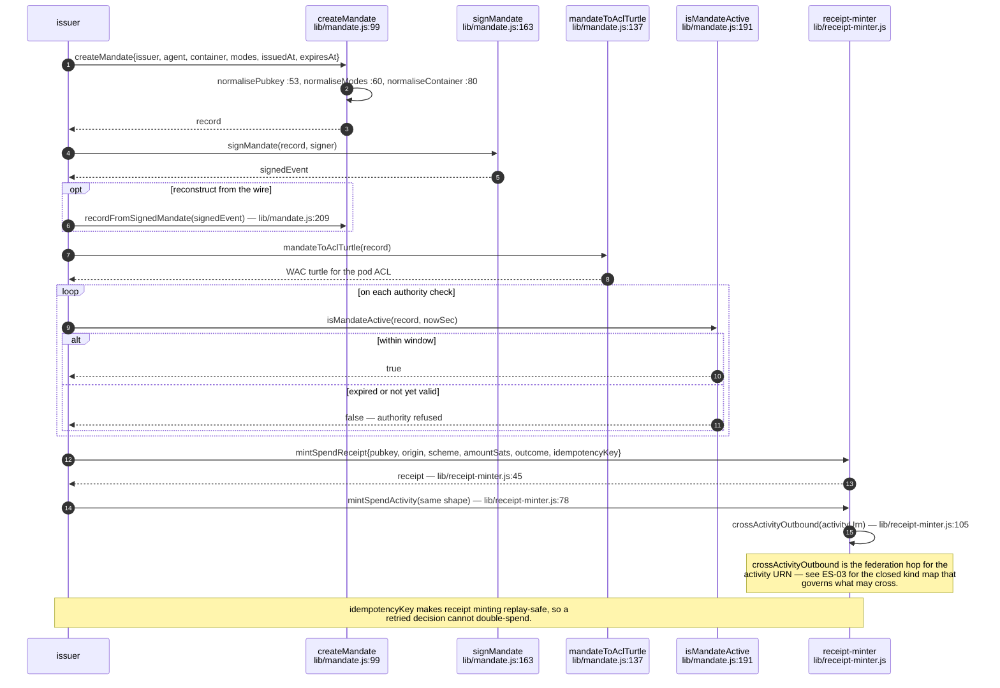
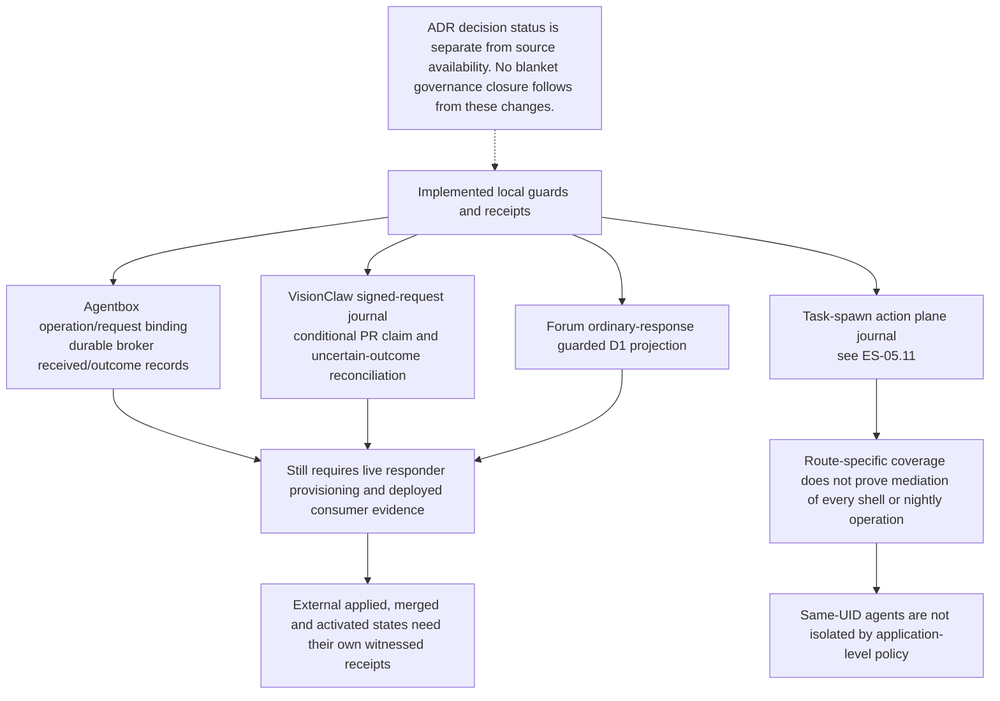
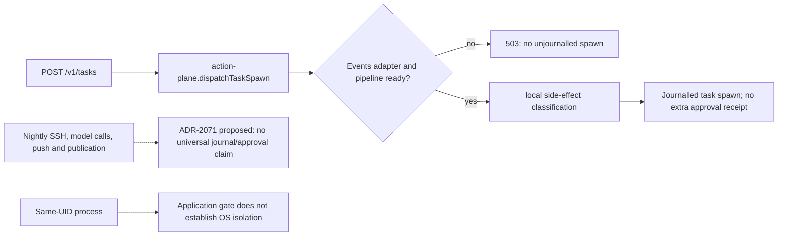
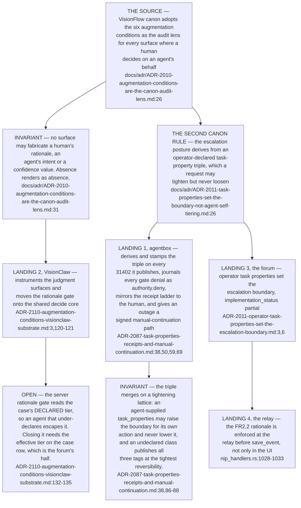
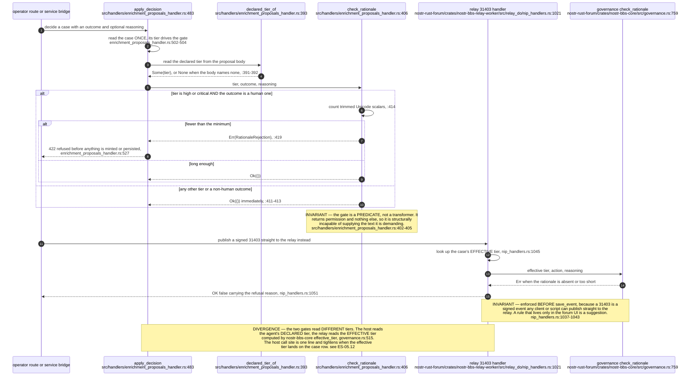

## ES-05.2 Wire fields and exact response binding

```mermaid
classDiagram
    class ActionRequest {
        +JSON fields
        +OptionString reasoning
        +OptionString context_url
    }
    class ActionResponse {
        +String action
        +String reasoning
    }
    class CaseDecision {
        +String case_id
        +String action
        +String reasoning
        +String responder_pubkey
        +String event_id
        +u64 created_at
    }
    ActionRequest --> ActionResponse : signed request e reference
    ActionResponse --> CaseDecision : validated consumer dispatch
    note for ActionRequest "events.rs:130. Agentbox embeds canonical operation and digest; decision-elevation embeds exact corpus draft/path."
    note for ActionResponse "events.rs:140. SDK signature verification plus own journalled request and d agreement at client.rs:265. Relay still owns admin admission."
    note for CaseDecision "A durable dispatch claim precedes delivery. It does not certify actor execution or external application."
```

## ES-05.6 Mutation-owner acknowledgement and replay refusal

```mermaid
sequenceDiagram
    participant Bridge as broker-bridge.js:407 decide route
    participant Gate as authority.js:226
    participant Ledger as governance-application-receipts.js:26
    participant VC as VisionClaw mutation owner
    Bridge->>Gate: concrete case, outcome, actor and reasoning operation
    Gate-->>Bridge: verified approval and operation digest, or refusal
    alt approval released
        Bridge->>Ledger: immutable consumer-received claim before external call
        alt fresh claim
            Bridge->>VC: exact approved operation payload
            VC-->>Bridge: committed acknowledgement or failure
            Bridge->>Ledger: applied only when writeback_committed is true
        else existing claim or storage unavailable
            Bridge-->>Bridge: refuse repeat execution, reconcile uncertain state
        end
    else refusal or timeout
        Bridge-->>Bridge: no governed writeback
    end
    Note over Gate,VC: Recoverable actions and an explicitly disabled authority table retain their existing policy. Live responder policy and remote state need their own evidence.
```

## ES-05.7 Governed ontology elevation — dry-run gate, then federated over Nostr

```mermaid
sequenceDiagram
    autonumber
    participant KE as kg-elevation<br/>routes/kg-elevation.js
    participant EX as kg-proposal-extractor<br/>lib/kg-proposal-extractor.js:344
    participant SC as scoreCandidate<br/>lib/kg-proposal-extractor.js:195
    participant BD as buildProposalDescriptor<br/>lib/kg-proposal-extractor.js:233
    participant GT as gateElevation<br/>lib/elevation-stage.js:226
    participant EP as elevation-publisher
    participant ACS as agent-control-surface<br/>buildActionRequest / publishPanelEvent
    participant NB as NostrBridge (already connected)

    KE->>EX: extractProposals(entries, opts)
    loop each candidate entry
        EX->>EX: normaliseEntry — lib/kg-proposal-extractor.js:111
        EX->>SC: scoreCandidate(norm)
        SC-->>EX: score
        EX->>BD: buildProposalDescriptor(norm, score, opts)
        BD->>BD: buildVaultProposeCommand — kg-proposal-extractor.js:268
        Note over BD: ADR-2116 retired the HTTP propose route. propose_command is<br/>a GOVERNED vault propose argv plus iri (contract C2), carrying<br/>is_subclass_of and relationships straight from the normalised<br/>entry — kg-proposal-extractor.js:276-277.
        BD-->>EX: descriptor plus an agent_action LINK beam
    end
    EX-->>KE: proposals
    loop each proposal
        KE->>GT: gateElevation(proposal, env) — kg-elevation.js:182
        GT->>GT: stage candidate page, validate, run<br/>vault propose --diff --dry-run (Whelk plus conflicts)
        GT-->>KE: {proposal, blockers, blocked}
    end
    Note over KE,GT: INVARIANT — the dry-run gate runs BEFORE anything is federated<br/>(kg-elevation.js:176-182). A candidate with blockers keeps its<br/>LINK beam but is reported {published:false, reason:'blocked by<br/>vault propose'} and never reaches the publisher — kg-elevation.js:229-232.
    KE->>EP: publish each non-blocked proposal
    EP->>ACS: buildActionRequest — SIGNED ACSP kind 31402
    Note over EP,ACS: URN DISCIPLINE — the panel d-tag REUSES the proposal's own<br/>canonical urn-agentbox-thing-PUBKEY-proposal-SHA256_12,<br/>already minted through lib/uris.js. NIP-33 replaceability<br/>keys re-scans of the same concept to the SAME panel. No<br/>ad-hoc identifiers are invented (elevation-publisher.js:33-36).
    ACS->>NB: publishPanelEvent
    alt federation surface available
        NB-->>EP: published
        Note over NB: The relay's agent_registry gate plus broker_cases<br/>projection surface the elevation in the governance inbox.
    else nostr_bridge gate off, NOSTR_RELAYS empty, no signing<br/>stack, nostr-tools absent, or the key will not decrypt
        NB-->>EP: {published: false, reason}
        Note over EP,NB: STANDALONE-OR-FEDERATED CONTRACT ADR-005 —<br/>a no-op logged at debug. It NEVER throws into the request<br/>path: the existing beam plus propose response is returned<br/>unchanged. Federation is ADDITIVE, never load-bearing.
    end
    Note over KE,NB: INVARIANT — this is the SANCTIONED governed path.<br/>The ungoverned /api/ontology/load backdoor is never used<br/>(elevation-publisher.js:16-17).
```

## ES-05.8 Approval, dispatch and application remain distinct

```mermaid
stateDiagram-v2
    [*] --> Requested
    Requested --> Approved: exact signed request response
    Requested --> Refused: mismatch, denial or timeout
    Approved --> Received: durable local claim
    Received --> Applied: committed mutation acknowledgement
    Received --> NotApplied: explicit upstream refusal
    Received --> Unknown: timeout, crash or incomplete outcome
    Unknown --> Reconciliation: never blindly replay
    Applied --> [*]
    NotApplied --> [*]
    Refused --> [*]
    note right of Received
        Agentbox local ledger is unsigned.
        VisionClaw dispatch journal is not an applied receipt.
        PR creation and merge/activation are separate observations.
    end note
```

## ES-05.9 Mandate and receipt — the durable authority artefacts

```mermaid
sequenceDiagram
    autonumber
    participant I as issuer
    participant M as createMandate<br/>lib/mandate.js:99
    participant S as signMandate<br/>lib/mandate.js:163
    participant T as mandateToAclTurtle<br/>lib/mandate.js:137
    participant CK as isMandateActive<br/>lib/mandate.js:191
    participant RM as receipt-minter<br/>lib/receipt-minter.js

    I->>M: createMandate{issuer, agent, container, modes, issuedAt, expiresAt}
    M->>M: normalisePubkey :53, normaliseModes :60, normaliseContainer :80
    M-->>I: record
    I->>S: signMandate(record, signer)
    S-->>I: signedEvent
    opt reconstruct from the wire
        I->>M: recordFromSignedMandate(signedEvent) — lib/mandate.js:209
    end
    I->>T: mandateToAclTurtle(record)
    T-->>I: WAC turtle for the pod ACL
    loop on each authority check
        I->>CK: isMandateActive(record, nowSec)
        alt within window
            CK-->>I: true
        else expired or not yet valid
            CK-->>I: false — authority refused
        end
    end
    I->>RM: mintSpendReceipt{pubkey, origin, scheme, amountSats, outcome, idempotencyKey}
    RM-->>I: receipt — lib/receipt-minter.js:45
    I->>RM: mintSpendActivity(same shape) — lib/receipt-minter.js:78
    RM->>RM: crossActivityOutbound(activityUrn) — lib/receipt-minter.js:105
    Note over RM: crossActivityOutbound is the federation hop for the<br/>activity URN — see ES-03 for the closed kind map that<br/>governs what may cross.
    Note over I,RM: idempotencyKey makes receipt minting replay-safe, so a<br/>retried decision cannot double-spend.
```

## ES-05.10 Remaining governance boundaries after execution closeout

```mermaid
flowchart TB
    Local["Implemented local guards and receipts"] --> AB["Agentbox operation/request binding<br/>durable broker received/outcome records"]
    Local --> VC["VisionClaw signed-request journal<br/>conditional PR claim and uncertain-outcome reconciliation"]
    Local --> Forum["Forum ordinary-response guarded D1 projection"]
    Local --> Tasks["Task-spawn action plane journal<br/>see ES-05.11"]
    AB --> Runtime["Still requires live responder provisioning and deployed consumer evidence"]
    VC --> Runtime
    Forum --> Runtime
    Tasks --> Scope["Route-specific coverage does not prove mediation of every shell or nightly operation"]
    Scope --> UID["Same-UID agents are not isolated by application-level policy"]
    Runtime --> External["External applied, merged and activated states need their own witnessed receipts"]
    Note["ADR decision status is separate from source availability. No blanket governance closure follows from these changes."] -.-> Local
```

## ES-05.11 Journal coverage is route-specific

```mermaid
flowchart LR
    TASK["POST /v1/tasks"] --> PLANE["action-plane.dispatchTaskSpawn"]
    PLANE --> READY{"Events adapter and pipeline ready?"}
    READY -->|no| REFUSE["503: no unjournalled spawn"]
    READY -->|yes| LOCAL["local side-effect classification"]
    LOCAL --> SPAWN["Journalled task spawn; no extra approval receipt"]
    NIGHT["Nightly SSH, model calls, push and publication"] -.-> GAP["ADR-2071 proposed: no universal journal/approval claim"]
    PEER["Same-UID process"] -.-> LIMIT["Application gate does not establish OS isolation"]
```

Grounded in Agentbox `management-api/lib/action-plane.js` and `routes/tasks.js`; broader governance routes retain their individual contracts. A working task-spawn journal does not establish complete mediation of shell commands or nightly egress. See [audit](../../estate-review/2026-09-07-agentbox-audit.md).

## ES-05.12 The augmentation conditions — one canon decision landing in four repositories

```mermaid
flowchart TB
    CANON["THE SOURCE — VisionFlow canon adopts the six augmentation<br/>conditions as the audit lens for every surface where a human<br/>decides on an agent's behalf<br/>docs/adr/ADR-2010-augmentation-conditions-are-the-canon-audit-lens.md:26"]
    RULE["INVARIANT — no surface may fabricate a human's rationale, an<br/>agent's intent or a confidence value. Absence renders as absence.<br/>docs/adr/ADR-2010-augmentation-conditions-are-the-canon-audit-lens.md:31"]
    BOUND["THE SECOND CANON RULE — the escalation posture derives from an<br/>operator-declared task-property triple, which a request may<br/>tighten but never loosen<br/>docs/adr/ADR-2011-task-properties-set-the-boundary-not-agent-self-tiering.md:26"]
    CANON --> RULE
    CANON --> BOUND

    AB["LANDING 1, agentbox — derives and stamps the triple on every<br/>31402 it publishes, journals every gate denial as authority.deny,<br/>mirrors the receipt ladder to the human, and gives an outage a<br/>signed manual-continuation path<br/>ADR-2087-task-properties-receipts-and-manual-continuation.md:38,50,59,69"]
    VC["LANDING 2, VisionClaw — instruments the judgment surfaces and<br/>moves the rationale gate onto the shared decide core<br/>ADR-2110-augmentation-conditions-visionclaw-substrate.md:3,120-121"]
    FRM["LANDING 3, the forum — operator task properties set the<br/>escalation boundary, implementation_status partial<br/>ADR-2011-operator-task-properties-set-the-escalation-boundary.md:3,6"]
    REL["LANDING 4, the relay — the FR2.2 rationale is enforced at the<br/>relay before save_event, not only in the UI<br/>nip_handlers.rs:1028-1033"]

    BOUND --> AB
    RULE --> VC
    BOUND --> FRM
    FRM --> REL

    OPEN["OPEN — the server rationale gate reads the case's DECLARED tier,<br/>so an agent that under-declares escapes it. Closing it needs the<br/>effective tier on the case row, which is the forum's half.<br/>ADR-2110-augmentation-conditions-visionclaw-substrate.md:132-135"]
    VC --> OPEN

    TIGHT["INVARIANT — the triple merges on a tightening lattice: an<br/>agent-supplied task_properties may raise the boundary for its own<br/>action and never lower it, and an undeclared class publishes all<br/>three tags at the tightest reversibility.<br/>ADR-2087-task-properties-receipts-and-manual-continuation.md:38,86-88"]
    AB --> TIGHT
```

## ES-05.13 The rationale gate — a predicate that refuses, on both the host core and the relay

```mermaid
sequenceDiagram
    autonumber
    participant UI as operator route or service bridge
    participant AD as apply_decision<br/>src/handlers/enrichment_proposals_handler.rs:483
    participant DT as declared_tier_of<br/>src/handlers/enrichment_proposals_handler.rs:393
    participant CK as check_rationale<br/>src/handlers/enrichment_proposals_handler.rs:406
    participant RL as relay 31403 handler<br/>nostr-rust-forum/crates/nostr-bbs-relay-worker/src/relay_do/nip_handlers.rs:1021
    participant FG as governance check_rationale<br/>nostr-rust-forum/crates/nostr-bbs-core/src/governance.rs:759

    UI->>AD: decide a case with an outcome and optional reasoning
    AD->>AD: read the case ONCE, its tier drives the gate<br/>enrichment_proposals_handler.rs:502-504
    AD->>DT: read the declared tier from the proposal body
    DT-->>AD: Some(tier), or None when the body names none, :391-392
    AD->>CK: tier, outcome, reasoning
    alt tier is high or critical AND the outcome is a human one
        CK->>CK: count trimmed Unicode scalars, :414
        alt fewer than the minimum
            CK-->>AD: Err(RationaleRejection), :419
            AD-->>UI: 422 refused before anything is minted or persisted,<br/>enrichment_proposals_handler.rs:527
        else long enough
            CK-->>AD: Ok(())
        end
    else any other tier or a non-human outcome
        CK-->>AD: Ok(()) immediately, :411-413
    end

    Note over CK: INVARIANT — the gate is a PREDICATE, not a transformer. It<br/>returns permission and nothing else, so it is structurally<br/>incapable of supplying the text it is demanding.<br/>src/handlers/enrichment_proposals_handler.rs:402-405

    UI->>RL: publish a signed 31403 straight to the relay instead
    RL->>RL: look up the case's EFFECTIVE tier, nip_handlers.rs:1045
    RL->>FG: effective tier, action, reasoning
    FG-->>RL: Err when the rationale is absent or too short
    RL-->>UI: OK false carrying the refusal reason, nip_handlers.rs:1051

    Note over RL,FG: INVARIANT — enforced BEFORE save_event, because a 31403 is a<br/>signed event any client or script can publish straight to the<br/>relay. A rule that lives only in the forum UI is a suggestion.<br/>nip_handlers.rs:1037-1043
    Note over AD,RL: DIVERGENCE — the two gates read DIFFERENT tiers. The host reads<br/>the agent's DECLARED tier, the relay reads the EFFECTIVE tier<br/>computed by nostr-bbs-core effective_tier, governance.rs:515.<br/>The host call site is one line and tightens when the effective<br/>tier lands on the case row. see ES-05.12
```
