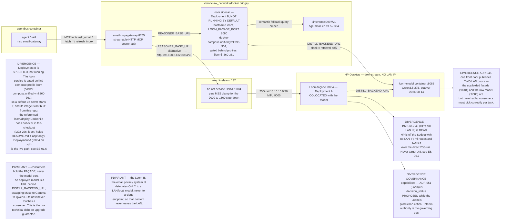
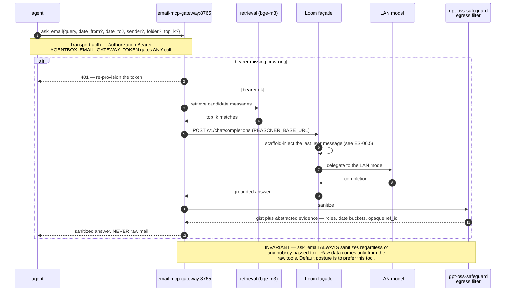
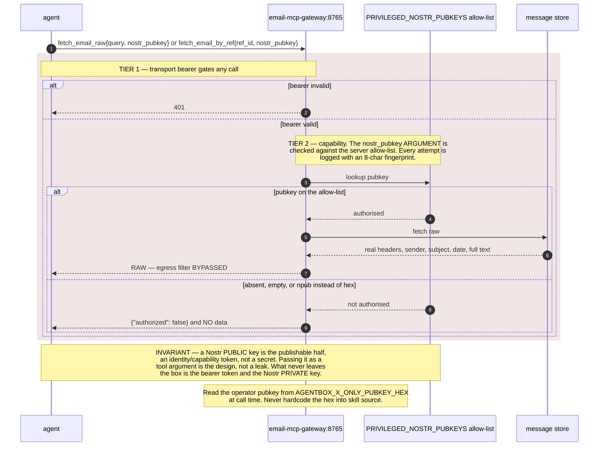
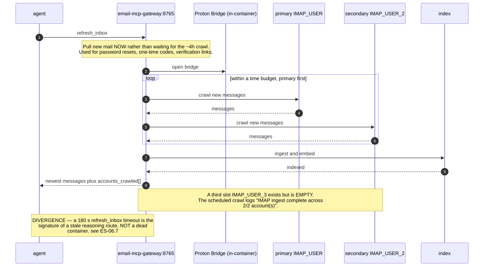
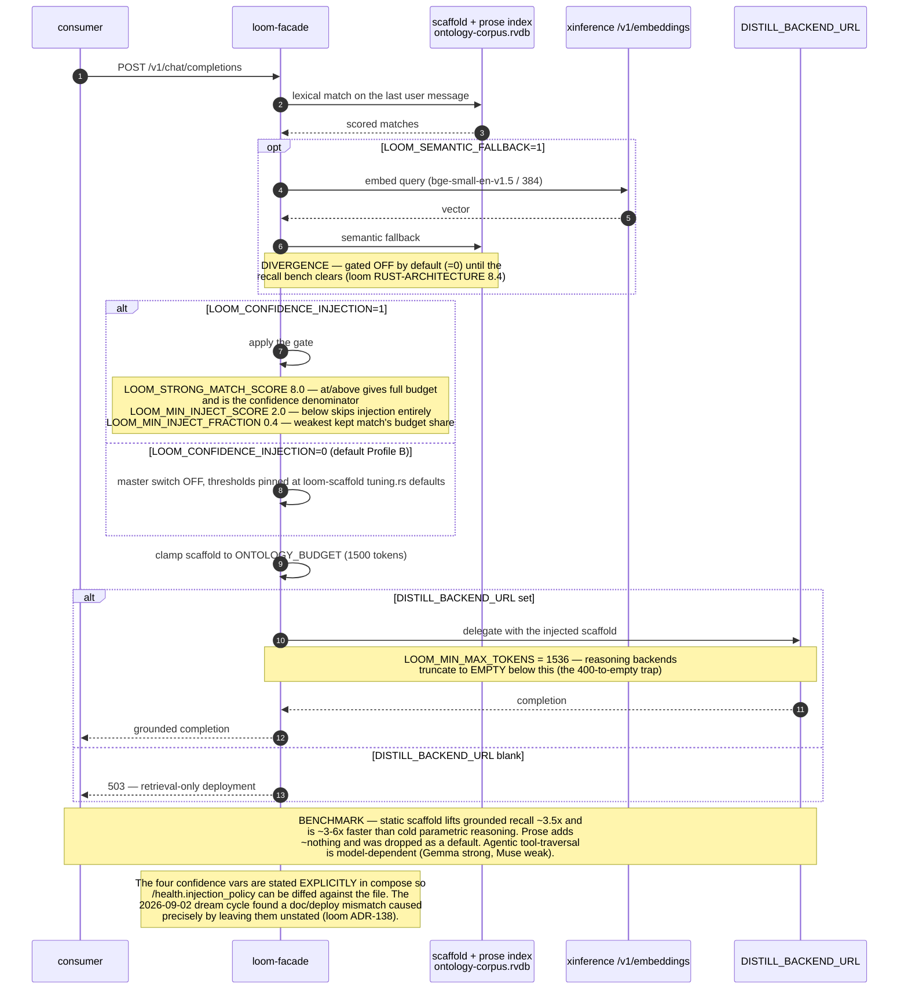
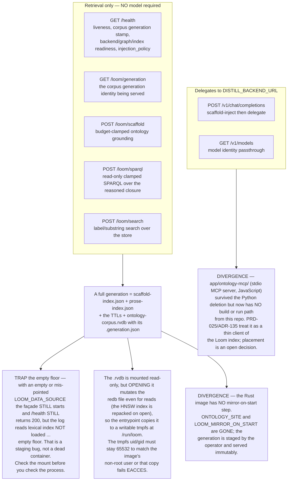
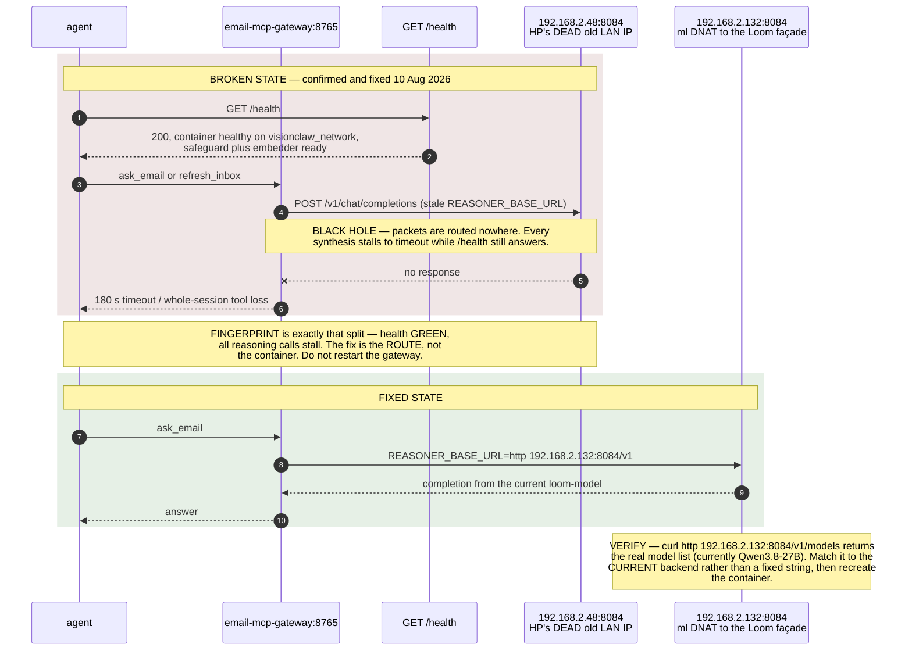
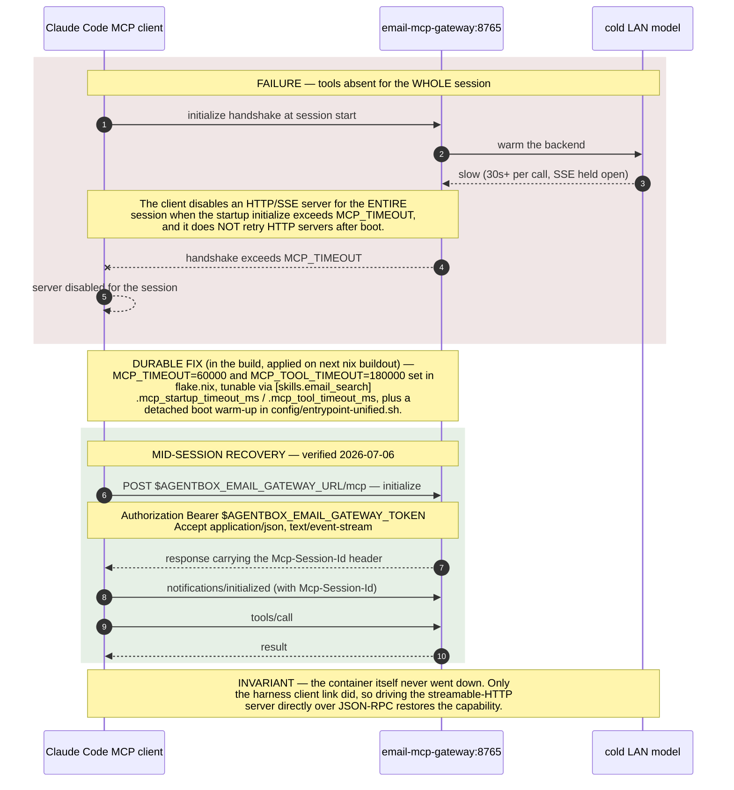
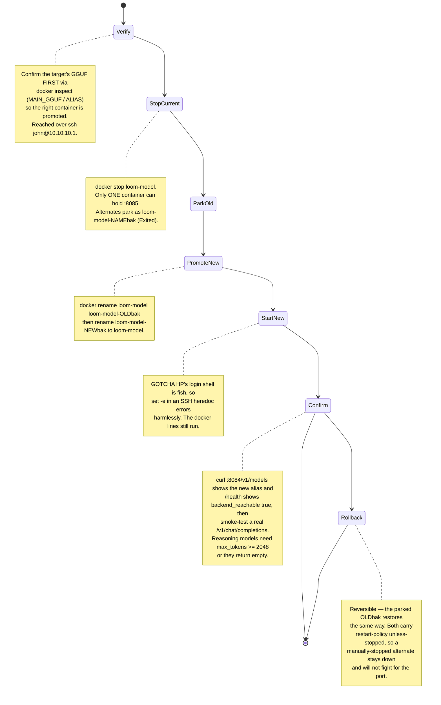
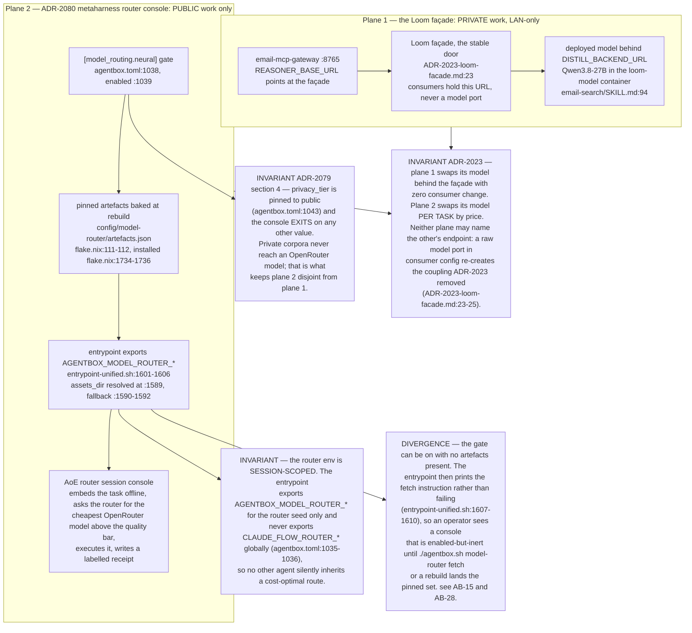

## ES-06.1 Topology — the gateway holds a façade, never a model port

## ES-06.2 ask_email — tier 1, egress filter applied

## ES-06.3 Break-glass tier — raw tools behind a second, capability gate

## ES-06.4 refresh_inbox — on-demand ingest across two Proton accounts

## ES-06.5 Loom scaffold-inject — grounding, budget clamp and the confidence gate

## ES-06.6 Loom endpoint map — what needs a model and what does not

## ES-06.7 The black-hole hang — health green, every reasoning call stalls

## ES-06.8 MCP client link loss and the mid-session JSON-RPC recovery

## ES-06.9 Backend-swap runbook — one port, stop-park-promote-start

## ES-06.10 Two model-selection planes, and the privacy line between them

