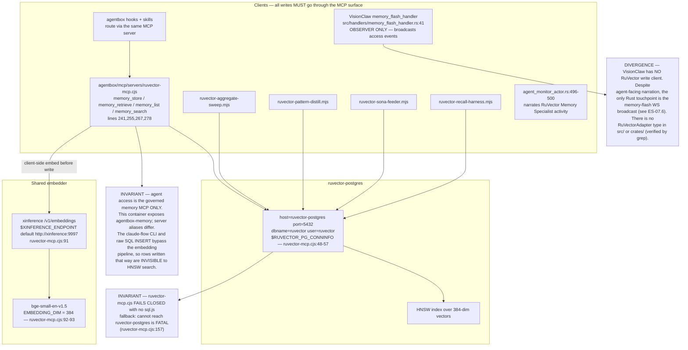
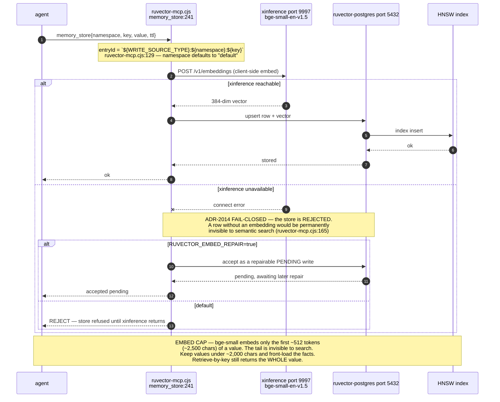
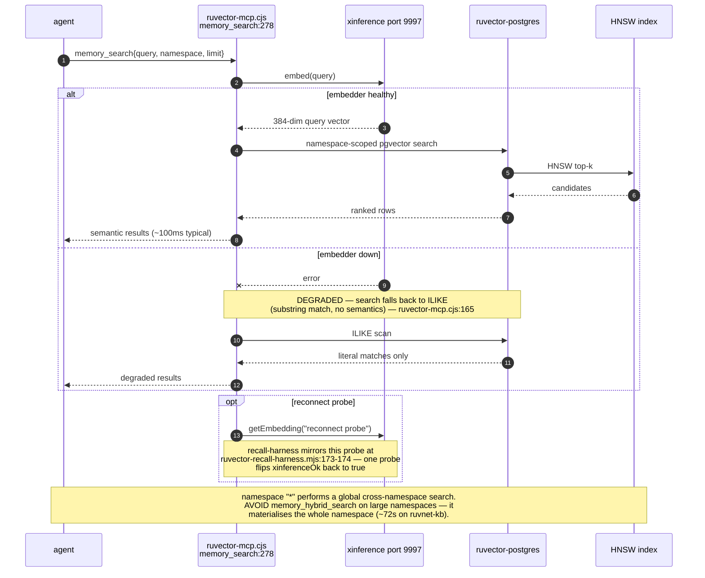
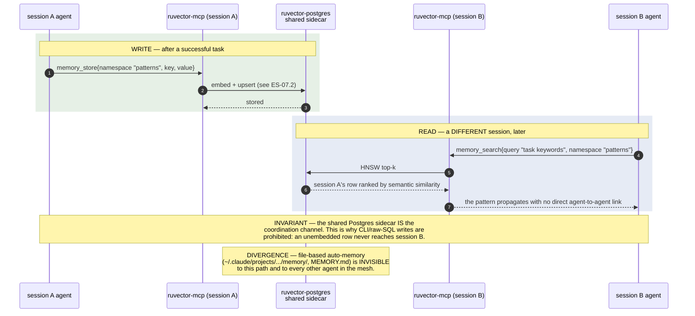
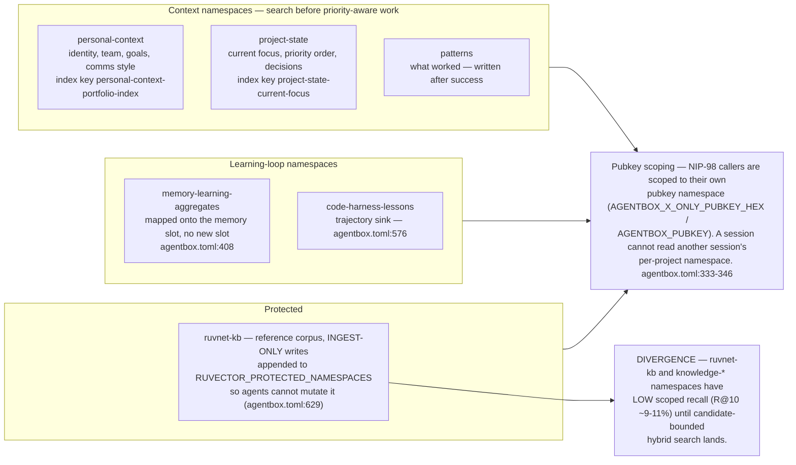
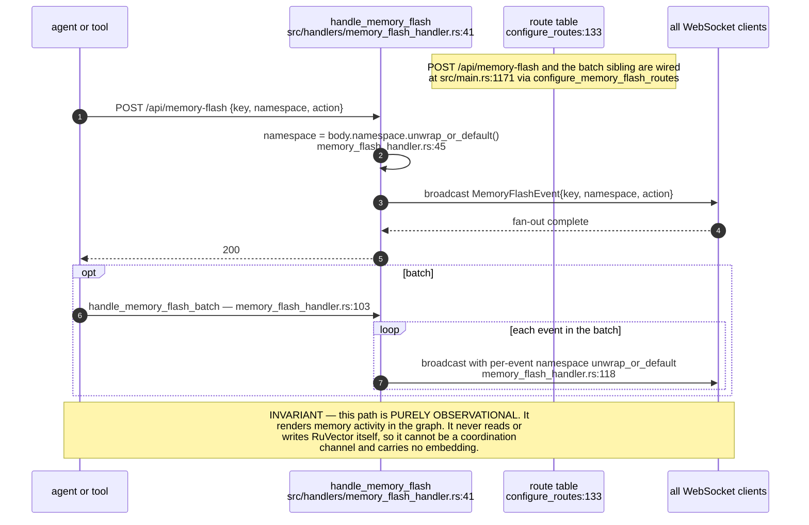
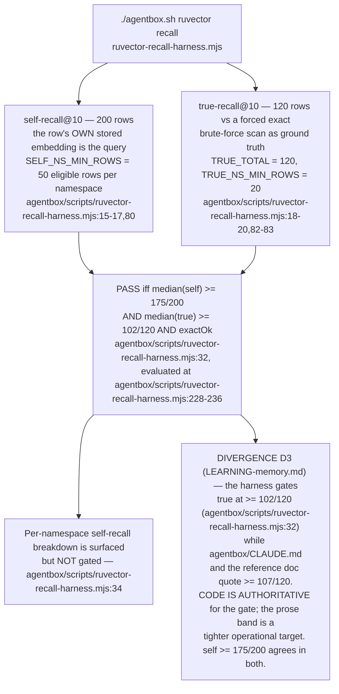
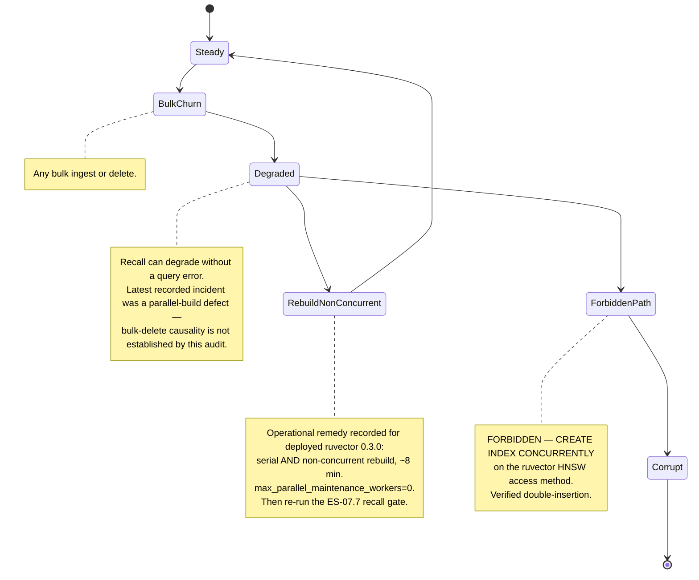
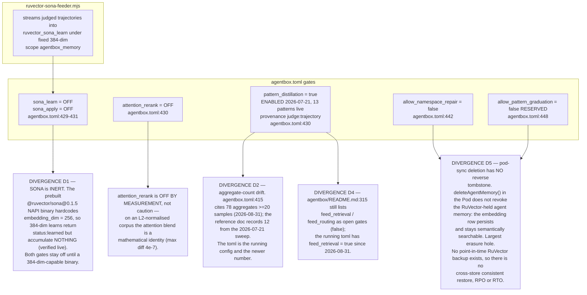

## ES-07.1 Every RuVector client and the one shared embedder

## ES-07.2 memory_store — embed-then-write, fail-closed when the embedder is down

## ES-07.3 memory_search — HNSW semantic path with an ILIKE degradation

## ES-07.4 Cross-agent pattern propagation — store in one session, search in another

## ES-07.5 Namespace map and the protected reference corpus

## ES-07.6 VisionClaw memory-flash — RuVector access events on the WebSocket

## ES-07.7 Recall gate — the band that must hold before and after any retrieval change

## ES-07.8 Index law — the rebuild that must never be concurrent

## ES-07.9 Learning loop — the gates that are off, and why

## Audit qualification — 2026-09-07

The 2026-09-05 Agentbox recall closeout records self 189/200 and true 115/120 after a **serial** rebuild, versus self 151/200 after parallel rebuilding. These are historical receipts, not a fresh benchmark. The local RuVector source contains `hnsw_bulkdelete` and deleted-node flags; neither proves a deployed bulk-delete recall regression. Keep cross-store reverse tombstones (ADR-2060) distinct from index tombstones. No database mutation or reindex was performed. See [audit](../../estate-review/2026-09-07-agentbox-audit.md).
