## ES-08.1 Four coexisting Solid-pod deployments — topology contrast

```mermaid
flowchart TB
    subgraph VC["VisionClaw process — single binary"]
        FLAG{{"cargo feature #quot;solid-pod-embed#quot;<br/>in default at Cargo.toml:250, declared :281 (default ON)"}}
        EMB["solid_proxy_handler.rs<br/>handle_solid_proxy:307"]
        STUB["no routes registered at all<br/>configure_routes twin, solid_proxy_handler.rs:1800-1802"]
        FLAG -->|"feature ON"| EMB
        FLAG -->|"feature OFF"| STUB
    end

    subgraph AB["agentbox container — supervised service"]
        SUP["supervisord [program:solid-pod]<br/>agentbox/flake.nix:2163-2172"]
        SRV["solid-pod-rs-server :8484<br/>agentbox/agentbox.toml:459-467"]
        HTTPS["[program:https-bridge]<br/>agentbox/flake.nix:2180"]
        SUP -->|"exec solidPodRsLauncher"| SRV
        HTTPS -->|"TLS terminate to :8484"| SRV
    end

    subgraph CF["Cloudflare Tunnel overlay"]
        CFD["cloudflared-pod<br/>agentbox/docker-compose.solid-pods.yml:26-33"]
    end
    CFD -->|"pods-native.dreamlab-ai.com to agentbox:8484"| SRV

    subgraph LEGACY["JavaScriptSolidServer — DELETED by ADR-2068"]
        JSS["was bin/jss.js :3000 at the repo root —<br/>a vendored third-party copy, now removed.<br/>see ES-08.10"]
    end

    MGMT["management-api adapters/pods/local-solid-rs.js<br/>DEFAULT_BASE is loopback port 8484"] -->|"HTTP LDP"| SRV
    CLIENTB["client SolidPodService.ts<br/>SOLID_POD_BASE_URL=/solid"] -->|"proxied #quot;/solid/*#quot;"| EMB

    NOTE1["DIVERGENCE: docker-compose.solid-pods.yml is only the Cloudflare<br/>Tunnel sidecar for THIS SAME port 8484 server (deployment 2) - solid-pod.md:253-255.<br/>It is not a separate multi-user pods deployment. Multi-user pods<br/>(agentbox/docs/user/multi-user-pods.md) is a design scaffold, defaults<br/>off, targets this same server via admin-users.js - see ES-08.5"]
    NOTE2["DIVERGENCE: sources-of-truth conflict (legacy) - Pod claims<br/>write-master for some agent state while Oxigraph, GitHub public::true<br/>and RuVector claim primacy elsewhere per docs/DATA-authority-erasure.md<br/>Known divergences and open items; legacy prose unreconciled, not authority"]
    NOTE3["_solid-http-base.js:11-12 — this base class was renamed from<br/>local-jss.js after the Python/JSS stub was retired 2026-04-25;<br/>wire contract is protocol-level Solid, not JSS-specific"]
```

## ES-08.2 Agent pod write — NIP-98 signing via pod-signer (with unsigned fallback)

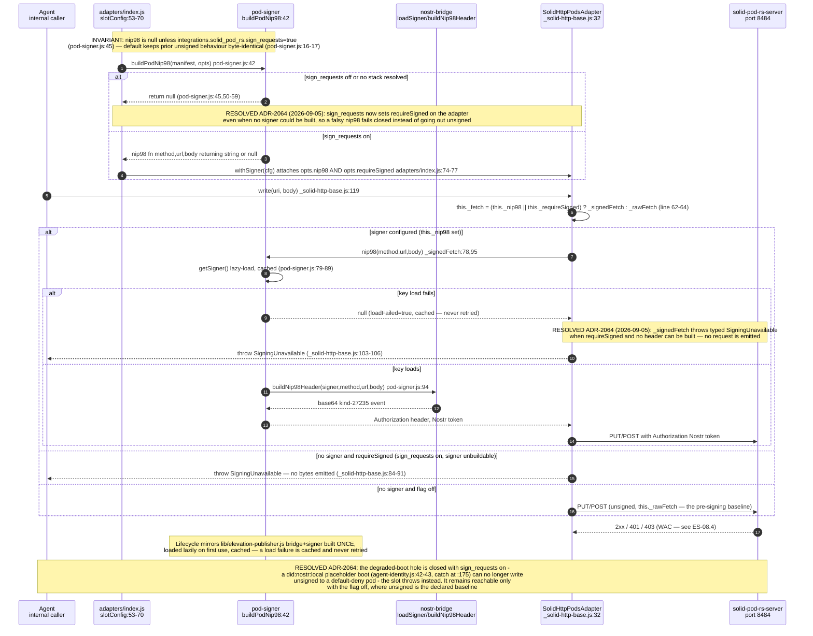

## ES-08.3 User pod write — SolidPodService through ldpClient

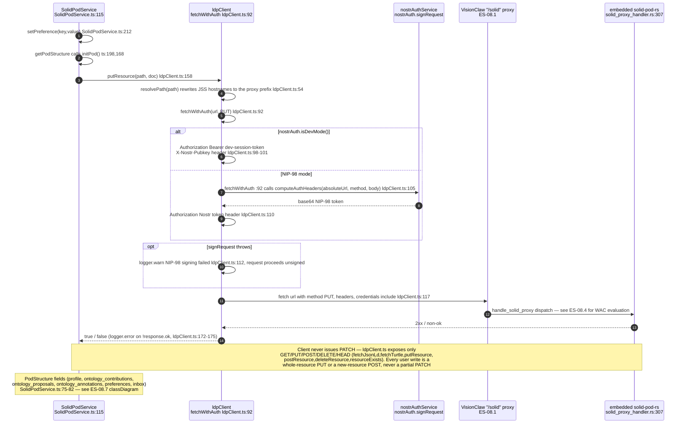

## ES-08.4 WAC-denied read — embedded handle_solid_proxy

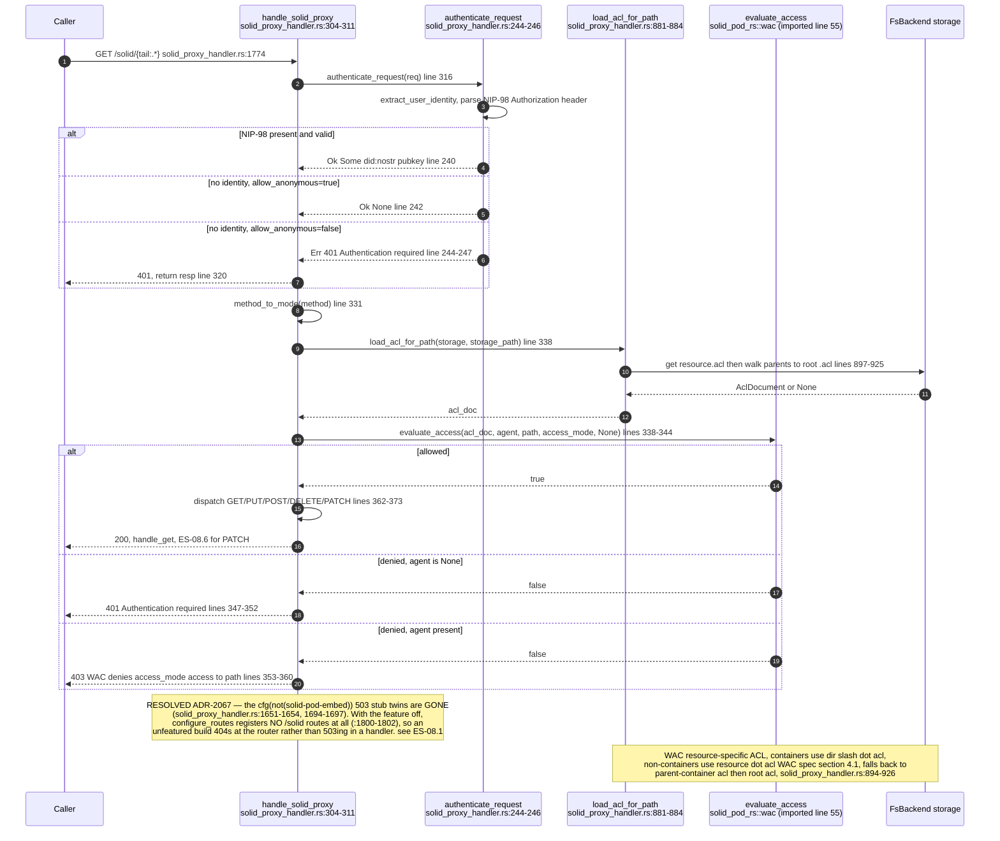

## ES-08.5 Pod provisioning for a new user

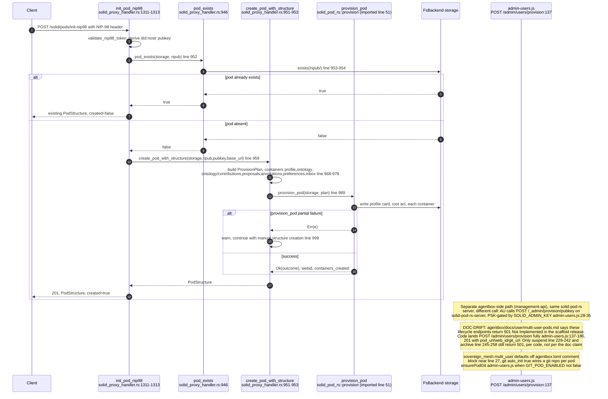

## ES-08.6 Non-destructive PATCH — N3 Patch, SPARQL-Update, JSON Patch dialects

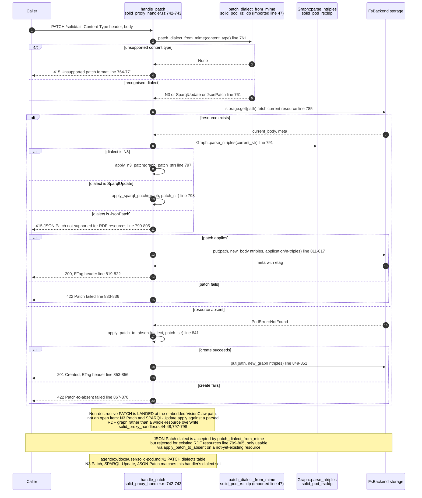

## ES-08.7 Client pod resource model

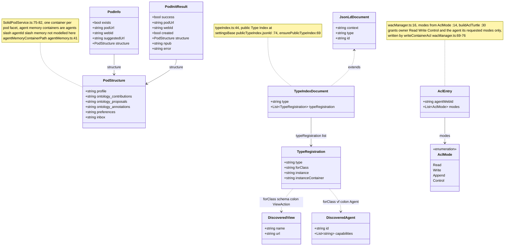

## ES-08.8 Supervised solid-pod service lifecycle

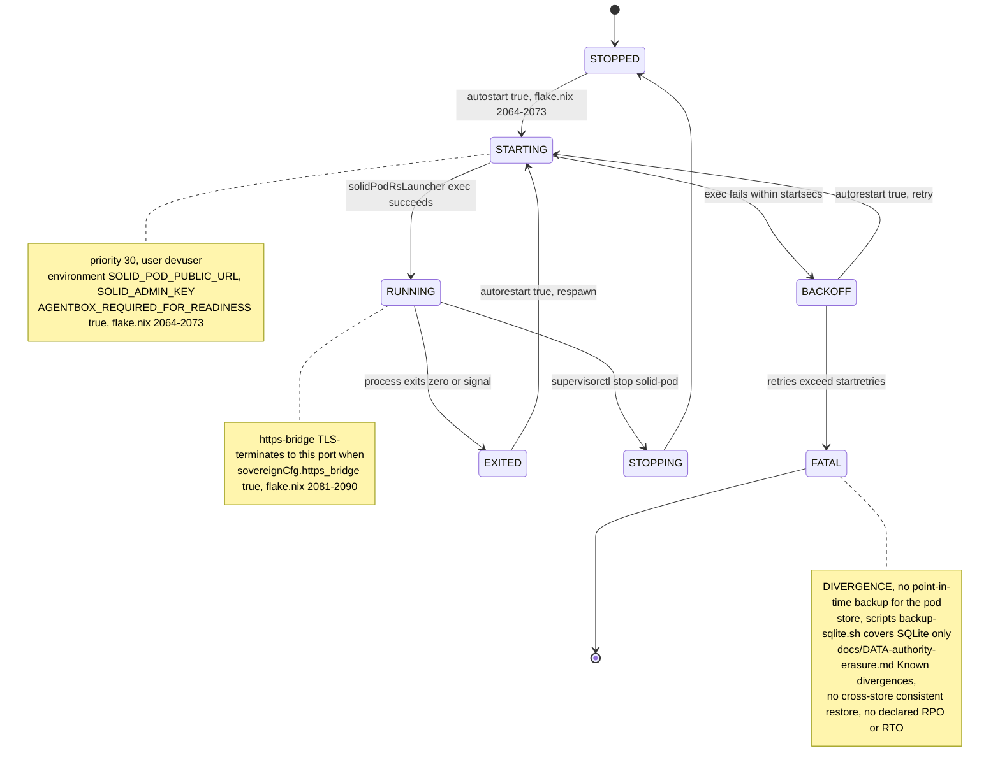

## ES-08.9 deleteAgentMemory tombstone gap

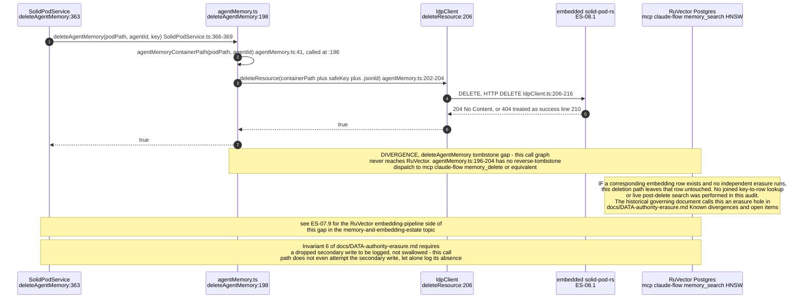

## ES-08.10 JavaScriptSolidServer — legacy JS implementation, REMOVED from the repo

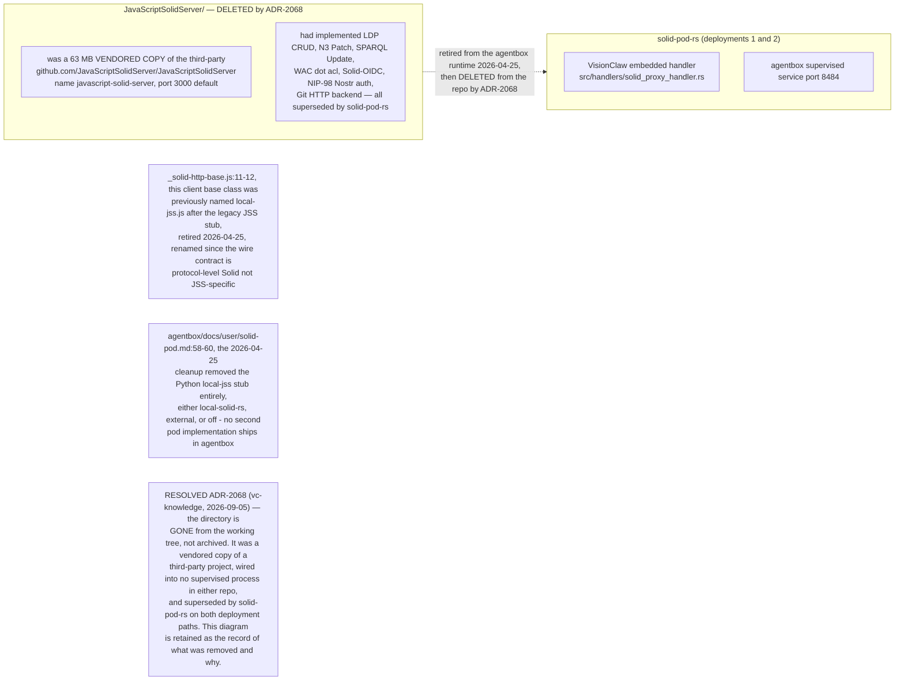

## ES-08.11 ADR-2106 — the embedded pod PULLS the published ontology at boot
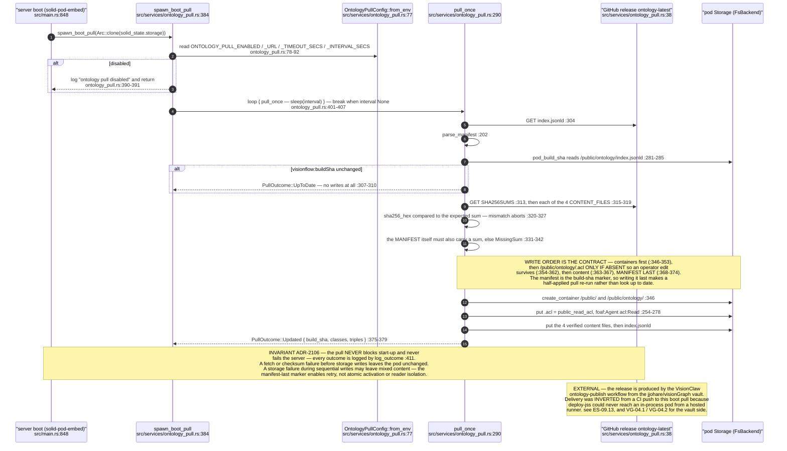

The 2026-09-07 audit distinguishes ES-08.9's missing cross-store erasure dispatch from HNSW index degradation. This source path demonstrates neither bulk vector deletion nor degraded recall. ES-08.11 similarly distinguishes verified downloads from atomic multi-file activation: readers can observe partially replaced content before the manifest changes. See the [federation audit](../../estate-review/2026-09-07-federation-audit.md).
