## ES-09.1 The host-vs-container build trap — wrong path vs sanctioned path
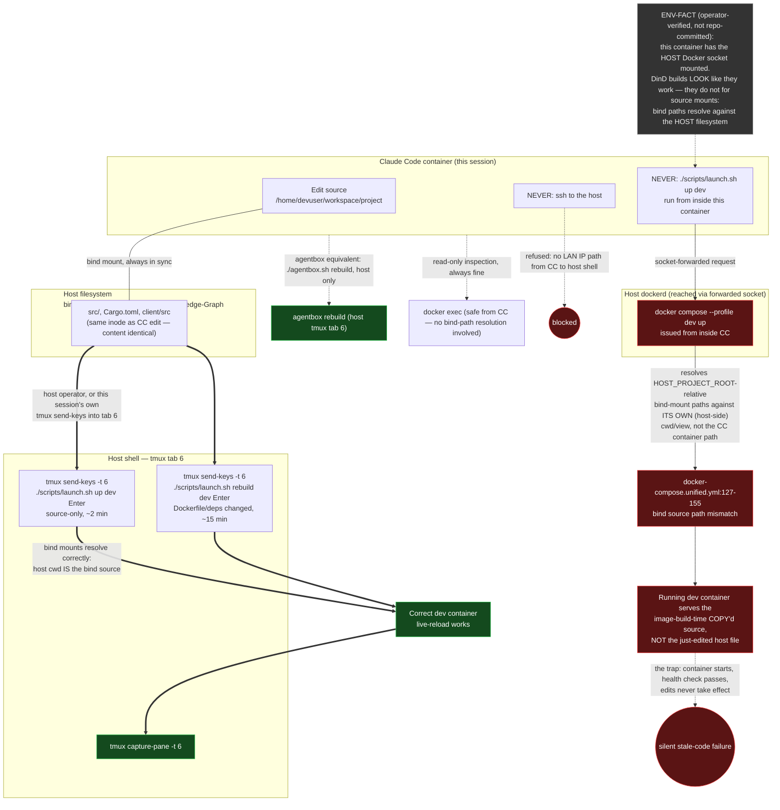
```mermaid
flowchart TB
    classDef wrong fill:#5a1414,stroke:#ff4444,color:#fff
    classDef right fill:#144a1e,stroke:#33cc55,color:#fff
    classDef fact fill:#333,stroke:#999,color:#eee

    ENVFACT["ENV-FACT (operator-verified, not repo-committed):<br/>this container has the HOST Docker socket mounted.<br/>DinD builds LOOK like they work — they do not for source mounts:<br/>bind paths resolve against the HOST filesystem"]:::fact

    subgraph CCBOX["Claude Code container (this session)"]
        EDIT["Edit source<br/>/home/devuser/workspace/project"]
        SSHTRY["NEVER: ssh to the host"]
        LAUNCHTRY["NEVER: ./scripts/launch.sh up dev<br/>run from inside this container"]
    end

    subgraph HOSTFS["Host filesystem<br/>bind: /mnt/mldata/githubs/AR-AI-Knowledge-Graph"]
        HOSTSRC["src/, Cargo.toml, client/src<br/>(same inode as CC edit — content identical)"]
    end

    subgraph HOSTDOCKERD["Host dockerd (reached via forwarded socket)"]
        BUILDREQ["docker compose --profile dev up<br/>issued from inside CC"]
    end

    EDIT ---|"bind mount, always in sync"| HOSTSRC
    LAUNCHTRY -->|"socket-forwarded request"| BUILDREQ:::wrong
    SSHTRY -.->|"refused: no LAN IP path from CC to host shell"| REFUSED(("blocked")):::wrong
    BUILDREQ -->|"resolves HOST_PROJECT_ROOT-relative<br/>bind-mount paths against ITS OWN (host-side)<br/>cwd/view, not the CC container path"| MISBIND["docker-compose.unified.yml:127-155<br/>bind source path mismatch"]:::wrong
    MISBIND --> STALE["Running dev container serves the<br/>image-build-time COPY'd source,<br/>NOT the just-edited host file"]:::wrong
    STALE -.->|"the trap: container starts, health check passes,<br/>edits never take effect"| TRAPEND(("silent stale-code failure")):::wrong

    ENVFACT -.-> LAUNCHTRY

    subgraph HOSTSHELL["Host shell — tmux tab 6"]
        RIGHT1["tmux send-keys -t 6<br/>./scripts/launch.sh up dev Enter<br/>source-only, ~2 min"]
        RIGHT2["tmux send-keys -t 6<br/>./scripts/launch.sh rebuild dev Enter<br/>Dockerfile/deps changed, ~15 min"]
        MONITOR["tmux capture-pane -t 6"]
    end

    HOSTSRC ==>|"host operator, or this session's own<br/>tmux send-keys into tab 6"| RIGHT1
    HOSTSRC ==> RIGHT2
    RIGHT1 ==>|"bind mounts resolve correctly:<br/>host cwd IS the bind source"| GOODBUILD["Correct dev container<br/>live-reload works"]:::right
    RIGHT2 ==> GOODBUILD
    GOODBUILD ==> MONITOR:::right

    DOCKEREXEC["docker exec (safe from CC — no bind-path resolution involved)"]
    CCBOX -.->|"agentbox equivalent: ./agentbox.sh rebuild, host only"| AGENTBOXREBUILD["agentbox rebuild (host tmux tab 6)"]:::right
    CCBOX -.->|"read-only inspection, always fine"| DOCKEREXEC
```

## ES-09.2 Edit-build-verify cycle across the container/host boundary
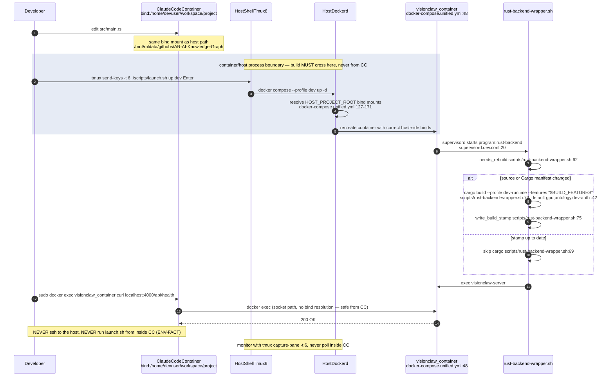
```mermaid
sequenceDiagram
    autonumber
    participant Dev as Developer
    participant CC as ClaudeCodeContainer<br/>bind:/home/devuser/workspace/project
    participant T6 as HostShellTmux6
    participant DD as HostDockerd
    participant DC as visionclaw_container<br/>docker-compose.unified.yml:48
    participant W as rust-backend-wrapper.sh

    Dev->>CC: edit src/main.rs
    Note over CC: same bind mount as host path<br/>/mnt/mldata/githubs/AR-AI-Knowledge-Graph
    rect rgb(230,235,245)
    Note over T6,DD: container/host process boundary — build MUST cross here, never from CC
    Dev->>T6: tmux send-keys -t 6 ./scripts/launch.sh up dev Enter
    T6->>DD: docker compose --profile dev up -d
    DD->>DD: resolve HOST_PROJECT_ROOT bind mounts<br/>docker-compose.unified.yml:127-171
    DD->>DC: recreate container with correct host-side binds
    end
    DC->>W: supervisord starts program:rust-backend<br/>supervisord.dev.conf:20
    W->>W: needs_rebuild scripts/rust-backend-wrapper.sh:62
    alt source or Cargo manifest changed
        W->>W: cargo build --profile dev-runtime --features "$BUILD_FEATURES"<br/>scripts/rust-backend-wrapper.sh:73, default gpu,ontology,dev-auth :42
        W->>W: write_build_stamp scripts/rust-backend-wrapper.sh:75
    else stamp up to date
        W->>W: skip cargo scripts/rust-backend-wrapper.sh:69
    end
    W->>DC: exec visionclaw-server
    Dev->>CC: sudo docker exec visionclaw_container curl localhost:4000/api/health
    CC->>DC: docker exec (socket path, no bind resolution — safe from CC)
    DC-->>CC: 200 OK
    Note over Dev,CC: NEVER ssh to the host, NEVER run launch.sh from inside CC (ENV-FACT)
    Note over T6,DD: monitor with tmux capture-pane -t 6, never poll inside CC
```

## ES-09.3 Dockerfile.unified — multi-stage build, dev vs prod target divergence
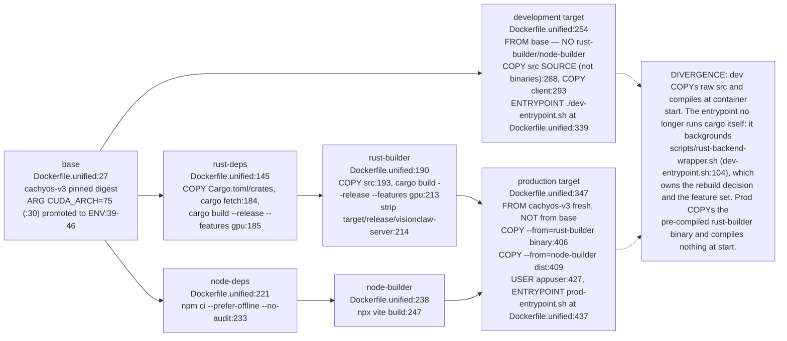
```mermaid
flowchart LR
    BASE["base<br/>Dockerfile.unified:27<br/>cachyos-v3 pinned digest<br/>ARG CUDA_ARCH=75 (:30) promoted to ENV:39-46"]
    RUSTDEPS["rust-deps<br/>Dockerfile.unified:145<br/>COPY Cargo.toml/crates, cargo fetch:184,<br/>cargo build --release --features gpu:185"]
    RUSTBUILD["rust-builder<br/>Dockerfile.unified:190<br/>COPY src:193, cargo build --release --features gpu:213<br/>strip target/release/visionclaw-server:214"]
    NODEDEPS["node-deps<br/>Dockerfile.unified:221<br/>npm ci --prefer-offline --no-audit:233"]
    NODEBUILD["node-builder<br/>Dockerfile.unified:238<br/>npx vite build:247"]
    DEV["development target<br/>Dockerfile.unified:254<br/>FROM base — NO rust-builder/node-builder<br/>COPY src SOURCE (not binaries):288, COPY client:293<br/>ENTRYPOINT ./dev-entrypoint.sh at Dockerfile.unified:339"]
    PROD["production target<br/>Dockerfile.unified:347<br/>FROM cachyos-v3 fresh, NOT from base<br/>COPY --from=rust-builder binary:406<br/>COPY --from=node-builder dist:409<br/>USER appuser:427, ENTRYPOINT prod-entrypoint.sh at Dockerfile.unified:437"]

    BASE --> RUSTDEPS --> RUSTBUILD
    BASE --> NODEDEPS --> NODEBUILD
    BASE --> DEV
    RUSTBUILD --> PROD
    NODEBUILD --> PROD

    DIVERGE["DIVERGENCE: dev COPYs raw src and compiles at container<br/>start. The entrypoint no longer runs cargo itself: it backgrounds<br/>scripts/rust-backend-wrapper.sh (dev-entrypoint.sh:104), which<br/>owns the rebuild decision and the feature set. Prod COPYs the<br/>pre-compiled rust-builder binary and compiles nothing at start."]
    DEV -.-> DIVERGE
    PROD -.-> DIVERGE
```

## ES-09.4 Dockerfile.production — cache-optimised 5-stage pipeline
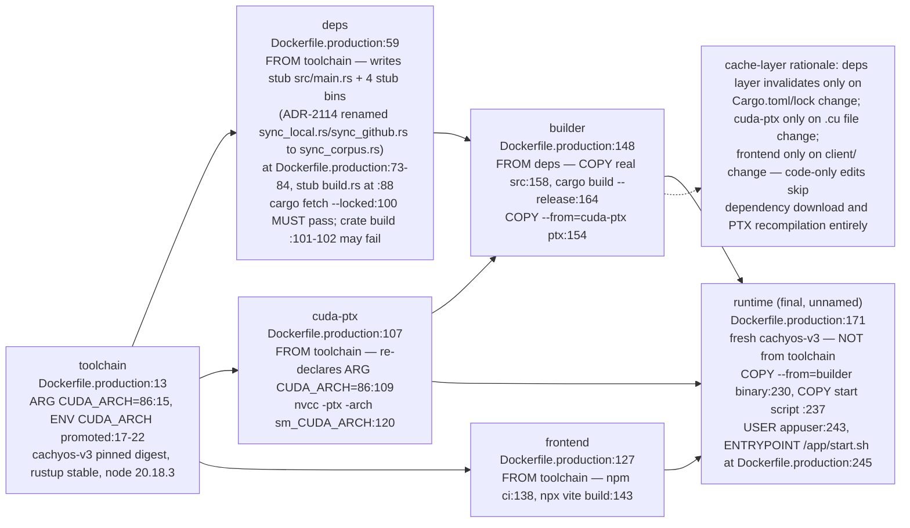
```mermaid
flowchart LR
    TOOLCHAIN["toolchain<br/>Dockerfile.production:13<br/>ARG CUDA_ARCH=86:15, ENV CUDA_ARCH promoted:17-22<br/>cachyos-v3 pinned digest, rustup stable, node 20.18.3"]
    DEPS["deps<br/>Dockerfile.production:59<br/>FROM toolchain — writes stub src/main.rs + 4 stub bins<br/>(ADR-2114 renamed sync_local.rs/sync_github.rs to sync_corpus.rs)<br/>at Dockerfile.production:73-84, stub build.rs at :88<br/>cargo fetch --locked:100 MUST pass; crate build :101-102 may fail"]
    CUDAPTX["cuda-ptx<br/>Dockerfile.production:107<br/>FROM toolchain — re-declares ARG CUDA_ARCH=86:109<br/>nvcc -ptx -arch sm_CUDA_ARCH:120"]
    FRONTEND["frontend<br/>Dockerfile.production:127<br/>FROM toolchain — npm ci:138, npx vite build:143"]
    BUILDER["builder<br/>Dockerfile.production:148<br/>FROM deps — COPY real src:158, cargo build --release:164<br/>COPY --from=cuda-ptx ptx:154"]
    RUNTIME["runtime (final, unnamed)<br/>Dockerfile.production:171<br/>fresh cachyos-v3 — NOT from toolchain<br/>COPY --from=builder binary:230, COPY start script :237<br/>USER appuser:243, ENTRYPOINT /app/start.sh at Dockerfile.production:245"]

    TOOLCHAIN --> DEPS
    TOOLCHAIN --> CUDAPTX
    TOOLCHAIN --> FRONTEND
    DEPS --> BUILDER
    CUDAPTX --> BUILDER
    BUILDER --> RUNTIME
    FRONTEND --> RUNTIME
    CUDAPTX --> RUNTIME

    NOTE1["cache-layer rationale: deps layer invalidates only on<br/>Cargo.toml/lock change; cuda-ptx only on .cu file change;<br/>frontend only on client/ change — code-only edits skip<br/>dependency download and PTX recompilation entirely"]
    BUILDER -.-> NOTE1
```

## ES-09.5 CUDA_ARCH ARG-to-ENV promotion, and the ADR-2037 hygiene-stub divergence
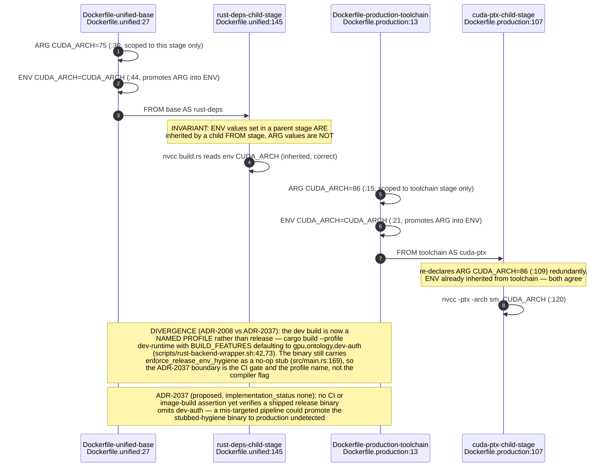
```mermaid
sequenceDiagram
    autonumber
    participant U as Dockerfile-unified-base<br/>Dockerfile.unified:27
    participant C1 as rust-deps-child-stage<br/>Dockerfile.unified:145
    participant P as Dockerfile-production-toolchain<br/>Dockerfile.production:13
    participant C2 as cuda-ptx-child-stage<br/>Dockerfile.production:107

    U->>U: ARG CUDA_ARCH=75 (:30, scoped to this stage only)
    U->>U: ENV CUDA_ARCH=CUDA_ARCH (:44, promotes ARG into ENV)
    U->>C1: FROM base AS rust-deps
    Note over C1: INVARIANT: ENV values set in a parent stage ARE<br/>inherited by a child FROM stage, ARG values are NOT
    C1->>C1: nvcc build.rs reads env CUDA_ARCH (inherited, correct)

    P->>P: ARG CUDA_ARCH=86 (:15, scoped to toolchain stage only)
    P->>P: ENV CUDA_ARCH=CUDA_ARCH (:21, promotes ARG into ENV)
    P->>C2: FROM toolchain AS cuda-ptx
    Note over C2: re-declares ARG CUDA_ARCH=86 (:109) redundantly,<br/>ENV already inherited from toolchain — both agree
    C2->>C2: nvcc -ptx -arch sm_CUDA_ARCH (:120)

    Note over U,P: DIVERGENCE (ADR-2008 vs ADR-2037): the dev build is now a<br/>NAMED PROFILE rather than release — cargo build --profile<br/>dev-runtime with BUILD_FEATURES defaulting to gpu,ontology,dev-auth<br/>(scripts/rust-backend-wrapper.sh:42,73). The binary still carries<br/>enforce_release_env_hygiene as a no-op stub (src/main.rs:169), so<br/>the ADR-2037 boundary is the CI gate and the profile name, not the<br/>compiler flag
    Note over U,P: ADR-2037 (proposed, implementation_status none): no CI or<br/>image-build assertion yet verifies a shipped release binary<br/>omits dev-auth — a mis-targeted pipeline could promote the<br/>stubbed-hygiene binary to production undetected
```

## ES-09.6 supervisord.dev.conf — program set and restart policy
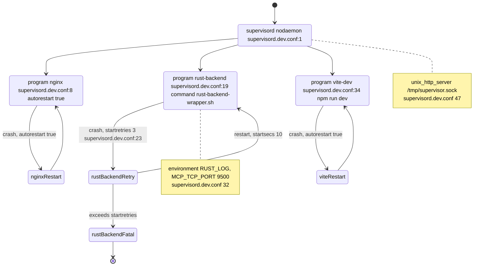
```mermaid
stateDiagram-v2
    [*] --> supervisordRoot
    supervisordRoot: supervisord nodaemon supervisord.dev.conf:1
    supervisordRoot --> nginx
    supervisordRoot --> rustBackend
    supervisordRoot --> viteDev

    nginx: program nginx supervisord.dev.conf:8 autorestart true
    rustBackend: program rust-backend supervisord.dev.conf:19 command rust-backend-wrapper.sh
    viteDev: program vite-dev supervisord.dev.conf:34 npm run dev

    rustBackend --> rustBackendRetry: crash, startretries 3 supervisord.dev.conf:23
    rustBackendRetry --> rustBackend: restart, startsecs 10
    rustBackendRetry --> rustBackendFatal: exceeds startretries
    rustBackendFatal --> [*]

    nginx --> nginxRestart: crash, autorestart true
    nginxRestart --> nginx

    viteDev --> viteRestart: crash, autorestart true
    viteRestart --> viteDev

    note right of rustBackend
        environment RUST_LOG, MCP_TCP_PORT 9500
        supervisord.dev.conf 32
    end note
    note right of supervisordRoot
        unix_http_server /tmp/supervisor.sock
        supervisord.dev.conf 47
    end note
```

## ES-09.7 supervisord.production.conf — root PID1, appuser drop, restart policy
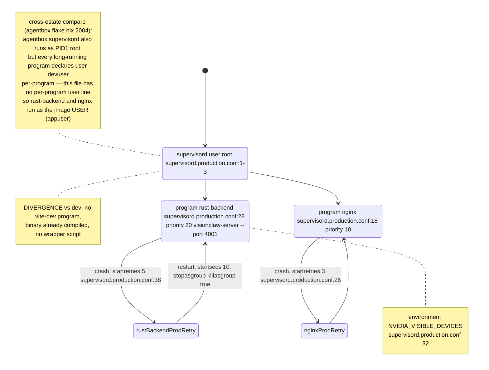
```mermaid
stateDiagram-v2
    [*] --> supervisordRootProd
    supervisordRootProd: supervisord user root supervisord.production.conf:1-3
    supervisordRootProd --> nginxProd
    supervisordRootProd --> rustBackendProd

    nginxProd: program nginx supervisord.production.conf:18 priority 10
    rustBackendProd: program rust-backend supervisord.production.conf:28 priority 20 visionclaw-server --port 4001

    rustBackendProd --> rustBackendProdRetry: crash, startretries 5 supervisord.production.conf:38
    rustBackendProdRetry --> rustBackendProd: restart, startsecs 10, stopasgroup killasgroup true
    nginxProd --> nginxProdRetry: crash, startretries 3 supervisord.production.conf:26
    nginxProdRetry --> nginxProd

    note right of rustBackendProd
        environment NVIDIA_VISIBLE_DEVICES
        supervisord.production.conf 32
    end note
    note right of supervisordRootProd
        DIVERGENCE vs dev: no vite-dev program,
        binary already compiled, no wrapper script
    end note
    note left of supervisordRootProd
        cross-estate compare (agentbox flake.nix 2004):
        agentbox supervisord also runs as PID1 root,
        but every long-running program declares user devuser
        per-program — this file has no per-program user line
        so rust-backend and nginx run as the image USER (appuser)
    end note
```

## ES-09.8 Compose profiles — dev, production, tunnel, loom
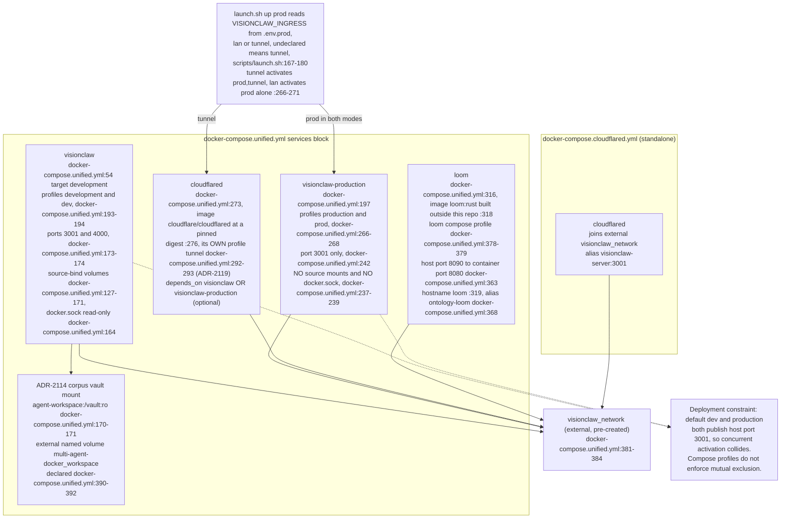
```mermaid
flowchart TB
    subgraph PROFILES["docker-compose.unified.yml services block"]
        DEVSVC["visionclaw<br/>docker-compose.unified.yml:54 target development<br/>profiles development and dev, docker-compose.unified.yml:193-194<br/>ports 3001 and 4000, docker-compose.unified.yml:173-174<br/>source-bind volumes docker-compose.unified.yml:127-171,<br/>docker.sock read-only docker-compose.unified.yml:164"]
        VAULTMOUNT["ADR-2114 corpus vault mount<br/>agent-workspace:/vault:ro docker-compose.unified.yml:170-171<br/>external named volume multi-agent-docker_workspace<br/>declared docker-compose.unified.yml:390-392"]
        PRODSVC["visionclaw-production<br/>docker-compose.unified.yml:197<br/>profiles production and prod, docker-compose.unified.yml:266-268<br/>port 3001 only, docker-compose.unified.yml:242<br/>NO source mounts and NO docker.sock, docker-compose.unified.yml:237-239"]
        CLOUDFLARED["cloudflared<br/>docker-compose.unified.yml:273, image cloudflare/cloudflared at a pinned<br/>digest :276, its OWN profile tunnel docker-compose.unified.yml:292-293 (ADR-2119)<br/>depends_on visionclaw OR visionclaw-production (optional)"]
        LOOM["loom<br/>docker-compose.unified.yml:316, image loom:rust built outside this repo :318<br/>loom compose profile docker-compose.unified.yml:378-379<br/>host port 8090 to container port 8080 docker-compose.unified.yml:363<br/>hostname loom :319, alias ontology-loom docker-compose.unified.yml:368"]
    end
    subgraph EXTFILE["docker-compose.cloudflared.yml (standalone)"]
        CFSTANDALONE["cloudflared<br/>joins external visionclaw_network<br/>alias visionclaw-server:3001"]
    end
    NET["visionclaw_network (external, pre-created)<br/>docker-compose.unified.yml:381-384"]
    INGRESS["launch.sh up prod reads VISIONCLAW_INGRESS from .env.prod,<br/>lan or tunnel, undeclared means tunnel, scripts/launch.sh:167-180<br/>tunnel activates prod,tunnel, lan activates prod alone :266-271"]
    INGRESS -->|"tunnel"| CLOUDFLARED
    INGRESS -->|"prod in both modes"| PRODSVC

    DEVSVC --> VAULTMOUNT
    DEVSVC --> NET
    PRODSVC --> NET
    CLOUDFLARED --> NET
    LOOM --> NET
    CFSTANDALONE --> NET

    GATE["Deployment constraint: default dev and production<br/>both publish host port 3001, so concurrent activation collides.<br/>Compose profiles do not enforce mutual exclusion."]
    DEVSVC -.-> GATE
    PRODSVC -.-> GATE
```

## ES-09.9 nginx route tables — dev vs production upstreams
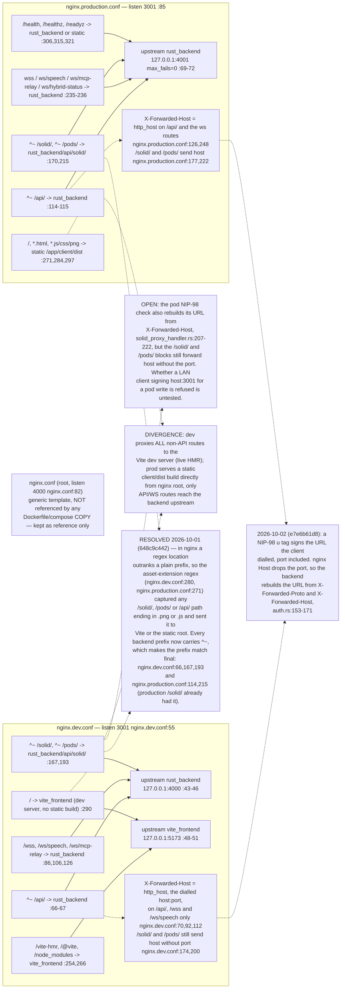
```mermaid
flowchart LR
    subgraph DEVNGINX["nginx.dev.conf — listen 3001 nginx.dev.conf:55"]
        DUPRUST["upstream rust_backend<br/>127.0.0.1:4000 :43-46"]
        DUPVITE["upstream vite_frontend<br/>127.0.0.1:5173 :48-51"]
        DAPI["^~ /api/ -> rust_backend :66-67"]
        DWSS["/wss, /ws/speech, /ws/mcp-relay -> rust_backend :86,106,126"]
        DSOLID["^~ /solid/, ^~ /pods/ -> rust_backend/api/solid/ :167,193"]
        DHMR["/vite-hmr, /@vite, /node_modules -> vite_frontend :254,266"]
        DROOT["/ -> vite_frontend (dev server, no static build) :290"]
        DXFH["X-Forwarded-Host = http_host, the dialled host:port,<br/>on /api/, /wss and /ws/speech only nginx.dev.conf:70,92,112<br/>/solid/ and /pods/ still send host without port nginx.dev.conf:174,200"]
    end
    subgraph PRODNGINX["nginx.production.conf — listen 3001 :85"]
        PUPRUST["upstream rust_backend<br/>127.0.0.1:4001 max_fails=0 :69-72"]
        PAPI["^~ /api/ -> rust_backend :114-115"]
        PWS["wss / ws/speech / ws/mcp-relay / ws/hybrid-status -> rust_backend :235-236"]
        PSOLID["^~ /solid/, ^~ /pods/ -> rust_backend/api/solid/ :170,215"]
        PSTATIC["/, *.html, *.js/css/png -> static /app/client/dist :271,284,297"]
        PHEALTH["/health, /healthz, /readyz -> rust_backend or static :306,315,321"]
        PXFH["X-Forwarded-Host = http_host on /api/ and the ws routes<br/>nginx.production.conf:126,248<br/>/solid/ and /pods/ send host nginx.production.conf:177,222"]
    end
    LEGACY["nginx.conf (root, listen 4000 nginx.conf:82)<br/>generic template, NOT referenced by any<br/>Dockerfile/compose COPY — kept as reference only"]

    DAPI --> DUPRUST
    DWSS --> DUPRUST
    DSOLID --> DUPRUST
    DHMR --> DUPVITE
    DROOT --> DUPVITE
    PAPI --> PUPRUST
    PWS --> PUPRUST
    PSOLID --> PUPRUST
    PHEALTH --> PUPRUST
    DAPI -.-> DXFH
    PAPI -.-> PXFH
    XFHWHY["2026-10-02 (e7e6b61d8): a NIP-98 u tag signs the URL the client<br/>dialled, port included. nginx Host drops the port, so the backend<br/>rebuilds the URL from X-Forwarded-Proto and X-Forwarded-Host,<br/>auth.rs:153-171"]
    DXFH -.-> XFHWHY
    PXFH -.-> XFHWHY
    XFHOPEN["OPEN: the pod NIP-98 check also rebuilds its URL from<br/>X-Forwarded-Host, solid_proxy_handler.rs:207-222, but the /solid/ and<br/>/pods/ blocks still forward host without the port. Whether a LAN<br/>client signing host:3001 for a pod write is refused is untested."]
    DSOLID -.-> XFHOPEN

    DIVNOTE["DIVERGENCE: dev proxies ALL non-API routes to the<br/>Vite dev server (live HMR); prod serves a static<br/>client/dist build directly from nginx root, only<br/>API/WS routes reach the backend upstream"]
    DROOT -.-> DIVNOTE
    PSTATIC -.-> DIVNOTE

    PRECED["RESOLVED 2026-10-01 (648c9c442) — in nginx a regex location<br/>outranks a plain prefix, so the asset-extension regex<br/>(nginx.dev.conf:280, nginx.production.conf:271) captured any<br/>/solid/, /pods/ or /api/ path ending in .png or .js and sent it to<br/>Vite or the static root. Every backend prefix now carries ^~,<br/>which makes the prefix match final: nginx.dev.conf:66,167,193<br/>and nginx.production.conf:114,215 (production /solid/ already had it)."]
    DSOLID -.-> PRECED
    PSOLID -.-> PRECED
```

## ES-09.10 agentbox flake rebuild gate, and the submodule pointer-bump flow
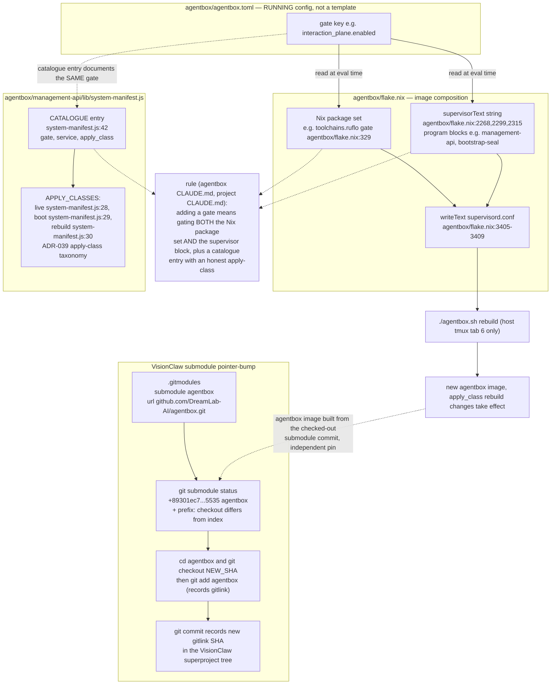
```mermaid
flowchart TB
    subgraph FLAKE["agentbox/flake.nix — image composition"]
        NIXPKG["Nix package set<br/>e.g. toolchains.ruflo gate agentbox/flake.nix:329"]
        SUPTEXT["supervisorText string<br/>agentbox/flake.nix:2268,2299,2315<br/>program blocks e.g. management-api, bootstrap-seal"]
        SUPWRITE["writeText supervisord.conf<br/>agentbox/flake.nix:3405-3409"]
    end
    subgraph TOML["agentbox/agentbox.toml — RUNNING config, not a template"]
        GATEKEY["gate key e.g. interaction_plane.enabled"]
    end
    subgraph MANIFEST["agentbox/management-api/lib/system-manifest.js"]
        CATALOGUE["CATALOGUE entry<br/>system-manifest.js:42<br/>gate, service, apply_class"]
        APPLYCLASS["APPLY_CLASSES:<br/>live system-manifest.js:28, boot system-manifest.js:29,<br/>rebuild system-manifest.js:30<br/>ADR-039 apply-class taxonomy"]
    end

    GATEKEY -->|"read at eval time"| NIXPKG
    GATEKEY -->|"read at eval time"| SUPTEXT
    NIXPKG --> SUPWRITE
    SUPTEXT --> SUPWRITE
    GATEKEY -.->|"catalogue entry documents the SAME gate"| CATALOGUE
    CATALOGUE --> APPLYCLASS

    RULE["rule (agentbox CLAUDE.md, project CLAUDE.md):<br/>adding a gate means gating BOTH the Nix package<br/>set AND the supervisor block, plus a catalogue<br/>entry with an honest apply-class"]
    NIXPKG -.-> RULE
    SUPTEXT -.-> RULE
    CATALOGUE -.-> RULE

    REBUILD["./agentbox.sh rebuild (host tmux tab 6 only)"]
    SUPWRITE --> REBUILD
    REBUILD --> IMAGE["new agentbox image, apply_class rebuild changes take effect"]

    subgraph SUBMOD["VisionClaw submodule pointer-bump"]
        GITMODULES[".gitmodules<br/>submodule agentbox<br/>url github.com/DreamLab-AI/agentbox.git"]
        SUBSTATUS["git submodule status<br/>+89301ec7...5535 agentbox<br/>+ prefix: checkout differs from index"]
        SUBUPDATE["cd agentbox and git checkout NEW_SHA<br/>then git add agentbox (records gitlink)"]
        SUBCOMMIT["git commit records new gitlink SHA<br/>in the VisionClaw superproject tree"]
    end
    GITMODULES --> SUBSTATUS
    SUBSTATUS --> SUBUPDATE
    SUBUPDATE --> SUBCOMMIT
    IMAGE -.->|"agentbox image built from the checked-out<br/>submodule commit, independent pin"| SUBSTATUS
```

## ES-09.11 VisionClaw ci.yml — Rust CPU/client blocking gates, GPU excluded
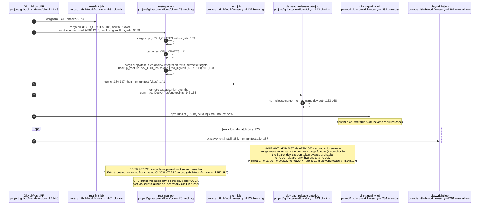
```mermaid
sequenceDiagram
    autonumber
    participant GH as GitHubPush/PR<br/>project/.github/workflows/ci.yml:41-46
    participant FMT as rust-fmt job<br/>project/.github/workflows/ci.yml:61 blocking
    participant CPU as rust-cpu job<br/>project/.github/workflows/ci.yml:75 blocking
    participant CLI as client job<br/>project/.github/workflows/ci.yml:122 blocking
    participant GATE as dev-auth-release-gate job<br/>project/.github/workflows/ci.yml:143 blocking
    participant LINT as client-quality job<br/>project/.github/workflows/ci.yml:234 advisory
    participant PW as playwright job<br/>project/.github/workflows/ci.yml:264 manual only

    GH->>FMT: cargo fmt --all --check :72-73
    GH->>CPU: cargo build CPU_CRATES :105, now built over<br/>vault-core and vault (ADR-2113), replacing vault-migrate :90-91
    CPU->>CPU: cargo clippy CPU_CRATES --all-targets :109
    CPU->>CPU: cargo test CPU_CRATES :111
    CPU->>CPU: cargo clippy/test -p visionclaw-integration-tests, hermetic targets<br/>backup_posture, dev_build_inputs and prod_ingress (ADR-2119) :118,120
    GH->>CLI: npm ci :136-137, then npm run test (vitest) :141
    GH->>GATE: hermetic text assertion over the<br/>committed Dockerfiles/entrypoints :146-155
    GATE->>GATE: no --release cargo line may name dev-auth :163-168
    GH->>LINT: npm run lint (ESLint) :253, npx tsc --noEmit :255
    Note over LINT: continue-on-error true :240, never a required check
    opt workflow_dispatch only :270
        GH->>PW: npx playwright install :285, npm run test:e2e :287
    end
    Note over GATE: INVARIANT: ADR-2037 via ADR-2086 - a production/release<br/>image must never carry the dev-auth cargo feature (it compiles in<br/>the Bearer dev-session-token bypass and stubs<br/>enforce_release_env_hygiene to a no-op).<br/>Hermetic: no cargo, no docker, no network - project/.github/workflows/ci.yml:143,146
    Note over CPU: DIVERGENCE: visionclaw-gpu and root server crate link<br/>CUDA at runtime, removed from hosted CI 2026-07-24 (project/.github/workflows/ci.yml:257-259)
    Note over CPU: GPU crates validated only on the developer CUDA<br/>host via scripts/launch.sh, not by any GitHub runner
```

## ES-09.12 VisionClaw docs-ci.yml — ADR ledger gate and documentation quality score
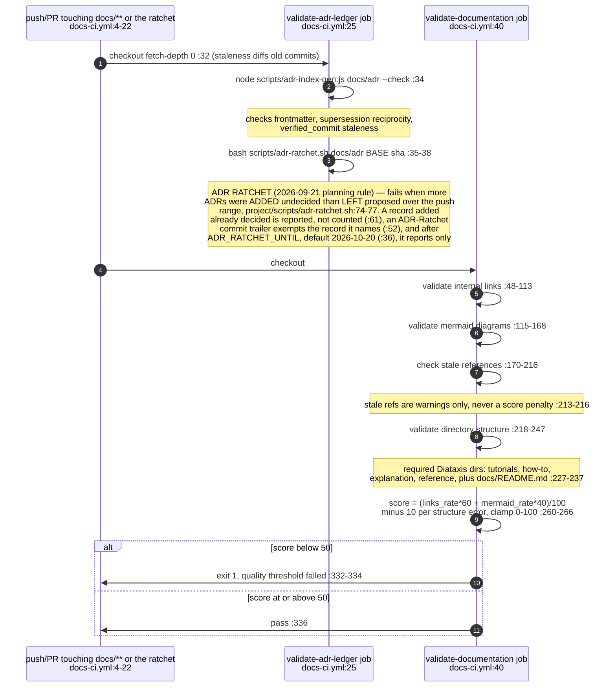
```mermaid
sequenceDiagram
    autonumber
    participant GH as push/PR touching docs/** or the ratchet<br/>docs-ci.yml:4-22
    participant ADR as validate-adr-ledger job<br/>docs-ci.yml:25
    participant DOC as validate-documentation job<br/>docs-ci.yml:40

    GH->>ADR: checkout fetch-depth 0 :32 (staleness diffs old commits)
    ADR->>ADR: node scripts/adr-index-gen.js docs/adr --check :34
    Note over ADR: checks frontmatter, supersession reciprocity,<br/>verified_commit staleness
    ADR->>ADR: bash scripts/adr-ratchet.sh docs/adr BASE sha :35-38
    Note over ADR: ADR RATCHET (2026-09-21 planning rule) — fails when more<br/>ADRs were ADDED undecided than LEFT proposed over the push<br/>range, project/scripts/adr-ratchet.sh:74-77. A record added<br/>already decided is reported, not counted (:61), an ADR-Ratchet<br/>commit trailer exempts the record it names (:52), and after<br/>ADR_RATCHET_UNTIL, default 2026-10-20 (:36), it reports only

    GH->>DOC: checkout
    DOC->>DOC: validate internal links :48-113
    DOC->>DOC: validate mermaid diagrams :115-168
    DOC->>DOC: check stale references :170-216
    Note over DOC: stale refs are warnings only, never a score penalty :213-216
    DOC->>DOC: validate directory structure :218-247
    Note over DOC: required Diataxis dirs: tutorials, how-to,<br/>explanation, reference, plus docs/README.md :227-237
    DOC->>DOC: score = (links_rate*60 + mermaid_rate*40)/100<br/>minus 10 per structure error, clamp 0-100 :260-266
    alt score below 50
        DOC->>GH: exit 1, quality threshold failed :332-334
    else score at or above 50
        DOC->>GH: pass :336
    end
```

## ES-09.13 VisionClaw ontology-publish.yml — vault build now runs in-repo, pull model to pod
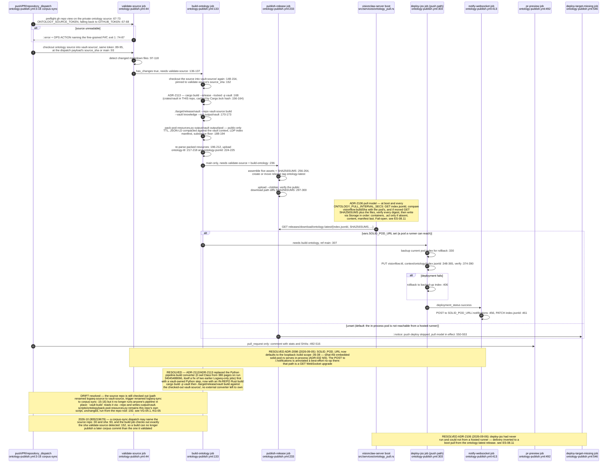
```mermaid
sequenceDiagram
    autonumber
    participant GH as push/PR/repository_dispatch<br/>ontology-publish.yml:3-16 corpus-sync
    participant VAL as validate-source job<br/>ontology-publish.yml:44
    participant BLD as build-ontology job<br/>ontology-publish.yml:133
    participant REL as publish-release job<br/>ontology-publish.yml:233
    participant SRV as visionclaw-server boot<br/>src/services/ontology_pull.rs
    participant DEP as deploy-jss job (push path)<br/>ontology-publish.yml:303
    participant WS as notify-websocket job<br/>ontology-publish.yml:413
    participant PRP as pr-preview job<br/>ontology-publish.yml:492
    participant MIS as deploy-target-missing job<br/>ontology-publish.yml:546

    GH->>VAL: preflight gh repo view on the private ontology source :67-73<br/>ONTOLOGY_SOURCE_TOKEN, falling back to GITHUB_TOKEN :67-68
    alt source unreadable
        VAL--xGH: ::error + OPS ACTION naming the fine-grained PAT, exit 1 :74-87
    end
    GH->>VAL: checkout ontology source into vault-source/, same token :89-95,<br/>at the dispatch payload's source_sha or main :93
    VAL->>VAL: detect changed markdown files :97-118
    VAL->>BLD: has_changes true, needs validate-source :136-137
    BLD->>BLD: checkout the source into vault-source/ again :148-154,<br/>pinned to validate-source's source_sha :152
    BLD->>BLD: ADR-2113 — cargo build --release --locked -p vault :168<br/>(crates/vault in THIS repo, cached by Cargo.lock hash :156-164)
    BLD->>BLD: ./target/release/vault --repo vault-source build<br/>--vault knowledge --out output/vault :170-173
    BLD->>BLD: pack-pod-resources.py output/vault output/pod — public-only<br/>TTL, JSON-LD compacted against the vault context, LDP index<br/>manifest, substance floor :188-194
    BLD->>BLD: re-parse packed resources :196-212, upload<br/>ontology-ttl :217-218 and ontology-jsonld :224-225
    BLD->>REL: main only, needs validate-source + build-ontology :236
    REL->>REL: assemble five assets + SHA256SUMS :256-264,<br/>create or move release tag ontology-latest
    REL->>REL: upload --clobber, verify the public<br/>download path diffs SHA256SUMS :297-300
    Note over SRV: ADR-2106 pull model — at boot and every<br/>ONTOLOGY_PULL_INTERVAL_SECS: GET index.jsonld, compare<br/>visionflow:buildSha with the pod's, and if moved GET<br/>SHA256SUMS plus the files, verify every digest, then write<br/>via Storage in order: containers, .acl only if absent,<br/>content, manifest last. Fail-open. see ES-08.11
    SRV->>REL: GET releases/download/ontology-latest/{index.jsonld, SHA256SUMS, ...}
    alt vars.SOLID_POD_URL set (a pod a runner can reach)
        BLD->>DEP: needs build-ontology, ref main :307
        DEP->>DEP: backup current pod index for rollback :330
        DEP->>DEP: PUT visionflow.ttl, context/ontology/index jsonld :348-365, verify :374-390
        alt deployment fails
            DEP->>DEP: rollback to backed-up index :406
        end
        DEP->>WS: deployment_status success
        WS->>WS: POST to SOLID_POD_URL/.notifications :456, PATCH index.jsonld :461
    else unset (default: the in-process pod is not reachable from a hosted runner)
        REL->>MIS: ::notice: push deploy skipped, pull model in effect :550-553
    end
    GH->>PRP: pull_request only: comment with stats and SHAs :492-516
    Note over VAL,WS: RESOLVED ADR-2098 (2026-09-05): SOLID_POD_URL now<br/>defaults to the loopback /solid scope :36-38 — what the embedded<br/>solid-pod-rs serves in-process (ADR-032 M3). The POST to<br/>/.notifications is annotated a best-effort no-op there:<br/>that path is a GET WebSocket upgrade
    Note over BLD: RESOLVED — ADR-2112/ADR-2113 replaced the Python<br/>pipeline.build converter (0 owl:Class from 380 pages on run<br/>34045488066, itself a fix of two earlier Logseq-only jobs) first<br/>with a vault-owned Python step, now with an IN-REPO Rust build:<br/>cargo build -p vault then ./target/release/vault build against<br/>the checked-out vault-source/, no external converter left to own
    Note over GH,BLD: DRIFT resolved — the source repo is still checked out (path<br/>renamed logseq-source to vault-source, trigger renamed logseq-sync<br/>to corpus-sync :15-16) but it no longer runs anyone's pipeline in<br/>place: `vault build` reads it via --repo and writes output/vault.<br/>scripts/ontology/pack-pod-resources.py remains this repo's own<br/>script, unchanged, run from the repo root :192. see VG-04.1, KG-05
    Note over GH,BLD: 2026-10 (805219679) — a corpus-sync dispatch may name the<br/>source repo :30 and sha :93, and the build job checks out exactly<br/>the sha validate-source detected :152, so a build can no longer<br/>publish a later corpus commit than the one it validated
    Note over SRV,MIS: RESOLVED ADR-2106 (2026-09-06): deploy-jss had never<br/>run and could not from a hosted runner — delivery inverted to a<br/>boot pull from the ontology-latest release. see ES-08.11
```

## ES-09.14 VisionClaw xr-godot-ci.yml — gdext + GUT under a GL display, Quest 3 advisory
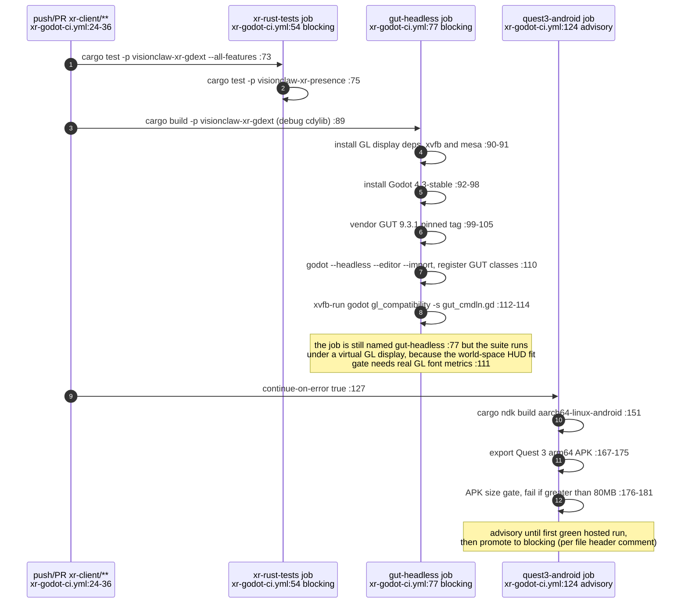
```mermaid
sequenceDiagram
    autonumber
    participant GH as push/PR xr-client/**<br/>xr-godot-ci.yml:24-36
    participant RT as xr-rust-tests job<br/>xr-godot-ci.yml:54 blocking
    participant GUT as gut-headless job<br/>xr-godot-ci.yml:77 blocking
    participant Q3 as quest3-android job<br/>xr-godot-ci.yml:124 advisory

    GH->>RT: cargo test -p visionclaw-xr-gdext --all-features :73
    RT->>RT: cargo test -p visionclaw-xr-presence :75
    GH->>GUT: cargo build -p visionclaw-xr-gdext (debug cdylib) :89
    GUT->>GUT: install GL display deps, xvfb and mesa :90-91
    GUT->>GUT: install Godot 4.3-stable :92-98
    GUT->>GUT: vendor GUT 9.3.1 pinned tag :99-105
    GUT->>GUT: godot --headless --editor --import, register GUT classes :110
    GUT->>GUT: xvfb-run godot gl_compatibility -s gut_cmdln.gd :112-114
    Note over GUT: the job is still named gut-headless :77 but the suite runs<br/>under a virtual GL display, because the world-space HUD fit<br/>gate needs real GL font metrics :111
    GH->>Q3: continue-on-error true :127
    Q3->>Q3: cargo ndk build aarch64-linux-android :151
    Q3->>Q3: export Quest 3 arm64 APK :167-175
    Q3->>Q3: APK size gate, fail if greater than 80MB :176-181
    Note over Q3: advisory until first green hosted run,<br/>then promote to blocking (per file header comment)
```

## ES-09.15 agentbox invariants.yml — security invariant gates including loopback-publish
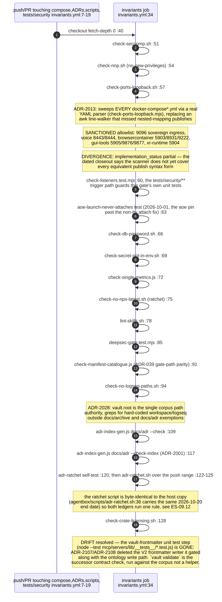
```mermaid
sequenceDiagram
    autonumber
    participant GH as push/PR touching compose,ADRs,scripts,<br/>tests/security invariants.yml:7-19
    participant J as invariants job<br/>invariants.yml:34

    GH->>J: checkout fetch-depth 0 :40
    J->>J: check-seccomp.sh :51
    J->>J: check-nnp.sh (no-new-privileges) :54
    J->>J: check-ports-loopback.sh :57
    Note over J: ADR-2013: sweeps EVERY docker-compose*.yml via a real<br/>YAML parser (check-ports-loopback.mjs), replacing an<br/>awk line-walker that missed nested-mapping publishes
    Note over J: SANCTIONED allowlist: 9096 sovereign ingress,<br/>voice 8443/8444, browsercontainer 5903/8931/9222,<br/>gui-tools 5905/9876/9877, xr-runtime 5904
    Note over J: DIVERGENCE: implementation_status partial — the<br/>dated closeout says the scanner does not yet cover<br/>every equivalent publish syntax form
    J->>J: check-listeners.test.mjs :60, the tests/security/**<br/>trigger path guards this gate's own unit tests
    J->>J: aoe-launch-never-attaches test (2026-10-01, the aoe pin<br/>past the non-tty attach fix) :63
    J->>J: check-db-password.sh :66
    J->>J: check-secret-not-in-env.sh :69
    J->>J: check-single-metrics.js :72
    J->>J: check-no-npx-latest.sh (ratchet) :75
    J->>J: lint-skills.sh :78
    J->>J: deepsec-gate.test.mjs :85
    J->>J: check-manifest-catalogue.js (ADR-039 gate-path parity) :91
    J->>J: check-no-logseq-paths.sh :94
    Note over J: ADR-2028: vault.root is the single corpus path<br/>authority, greps for hard-coded workspace/logseq<br/>outside docs/archive and docs/adr exemptions
    J->>J: adr-index-gen.js docs/adr --check :109
    J->>J: adr-index-gen.js docs/adr --check-index (ADR-2001) :117
    J->>J: adr-ratchet self-test :120, then adr-ratchet.sh over the push range :122-125
    Note over J: the ratchet script is byte-identical to the host copy<br/>(agentbox/scripts/adr-ratchet.sh:36 carries the same 2026-10-20<br/>end date) so both ledgers run one rule. see ES-09.12
    J->>J: check-crate-licensing.sh :128
    Note over J: DRIFT resolved — the vault-frontmatter unit test step<br/>(node --test mcp/servers/lib/__tests__/*.test.js) is GONE:<br/>ADR-2107/ADR-2108 deleted the V2 frontmatter writer it gated<br/>along with the ontology write path. `vault validate` is the<br/>successor contract check, run against the corpus not a helper.
```

## ES-09.16 agentbox contract-tests.yml — adapter contract suites
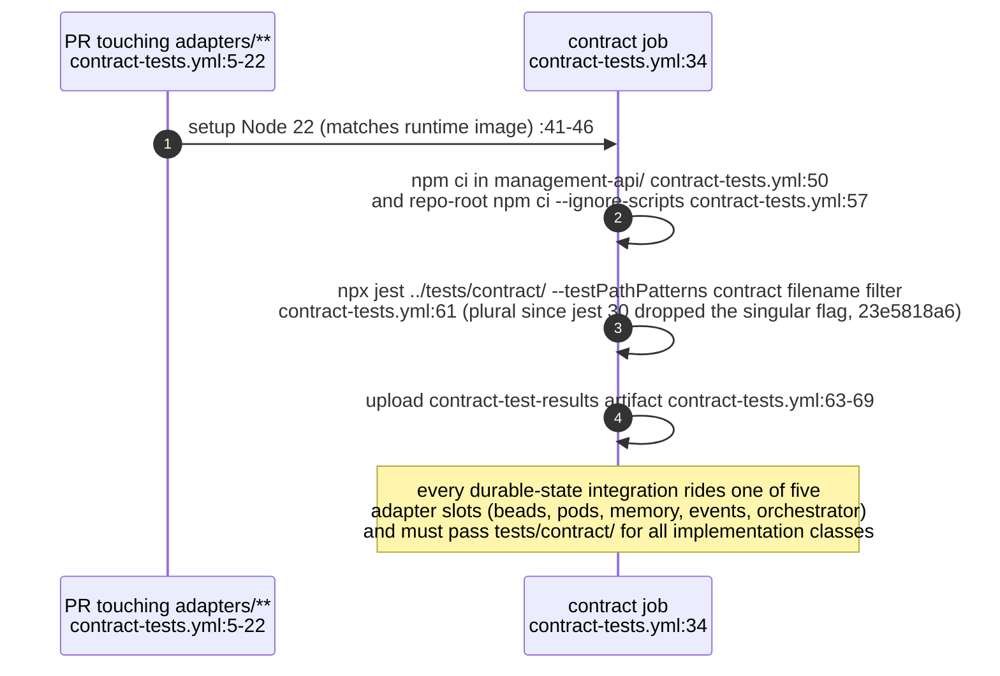
```mermaid
sequenceDiagram
    autonumber
    participant GH as PR touching adapters/**<br/>contract-tests.yml:5-22
    participant C as contract job<br/>contract-tests.yml:34

    GH->>C: setup Node 22 (matches runtime image) :41-46
    C->>C: npm ci in management-api/ contract-tests.yml:50<br/>and repo-root npm ci --ignore-scripts contract-tests.yml:57
    C->>C: npx jest ../tests/contract/ --testPathPatterns contract filename filter<br/>contract-tests.yml:61 (plural since jest 30 dropped the singular flag, 23e5818a6)
    C->>C: upload contract-test-results artifact contract-tests.yml:63-69
    Note over C: every durable-state integration rides one of five<br/>adapter slots (beads, pods, memory, events, orchestrator)<br/>and must pass tests/contract/ for all implementation classes
```

## ES-09.17 agentbox manifest-validate.yml — config validator and TUI round-trip
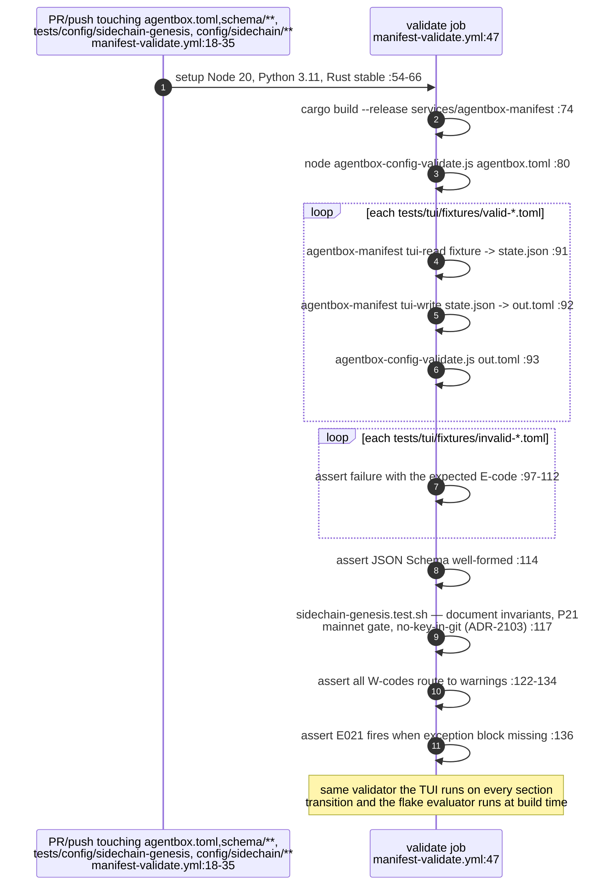
```mermaid
sequenceDiagram
    autonumber
    participant GH as PR/push touching agentbox.toml,schema/**,<br/>tests/config/sidechain-genesis, config/sidechain/**<br/>manifest-validate.yml:18-35
    participant V as validate job<br/>manifest-validate.yml:47

    GH->>V: setup Node 20, Python 3.11, Rust stable :54-66
    V->>V: cargo build --release services/agentbox-manifest :74
    V->>V: node agentbox-config-validate.js agentbox.toml :80
    loop each tests/tui/fixtures/valid-*.toml
        V->>V: agentbox-manifest tui-read fixture -> state.json :91
        V->>V: agentbox-manifest tui-write state.json -> out.toml :92
        V->>V: agentbox-config-validate.js out.toml :93
    end
    loop each tests/tui/fixtures/invalid-*.toml
        V->>V: assert failure with the expected E-code :97-112
    end
    V->>V: assert JSON Schema well-formed :114
    V->>V: sidechain-genesis.test.sh — document invariants, P21<br/>mainnet gate, no-key-in-git (ADR-2103) :117
    V->>V: assert all W-codes route to warnings :122-134
    V->>V: assert E021 fires when exception block missing :136
    Note over V: same validator the TUI runs on every section<br/>transition and the flake evaluator runs at build time
```

## ES-09.18 agentbox ci.yml aggregate gate, and the structurally-identical workflow family
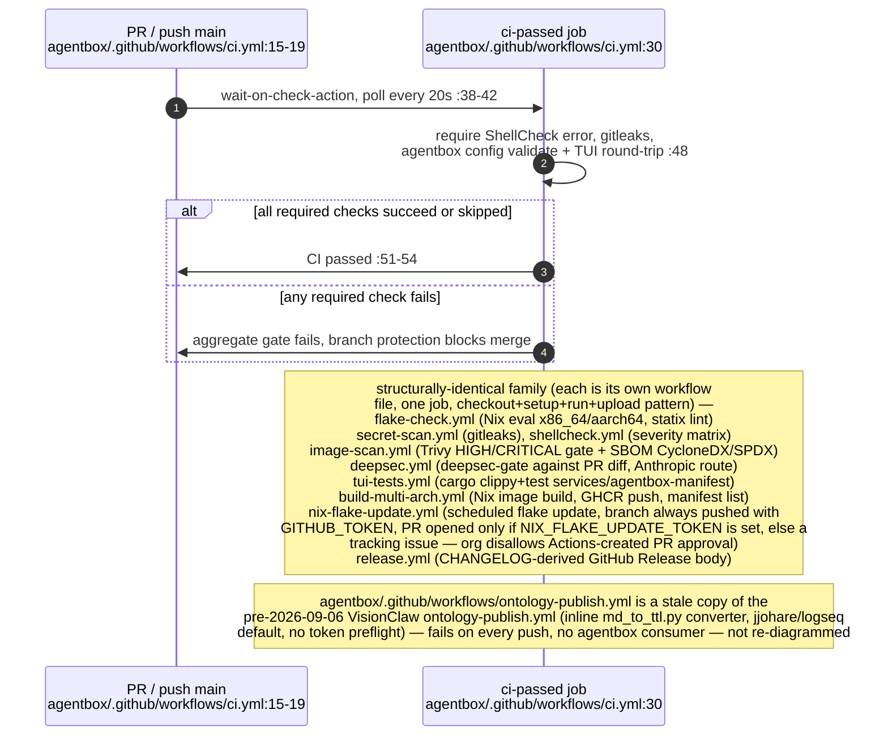
```mermaid
sequenceDiagram
    autonumber
    participant GH as PR / push main<br/>agentbox/.github/workflows/ci.yml:15-19
    participant AGG as ci-passed job<br/>agentbox/.github/workflows/ci.yml:30

    GH->>AGG: wait-on-check-action, poll every 20s :38-42
    AGG->>AGG: require ShellCheck error, gitleaks,<br/>agentbox config validate + TUI round-trip :48
    alt all required checks succeed or skipped
        AGG->>GH: CI passed :51-54
    else any required check fails
        AGG->>GH: aggregate gate fails, branch protection blocks merge
    end
    Note over AGG: structurally-identical family (each is its own workflow<br/>file, one job, checkout+setup+run+upload pattern) —<br/>flake-check.yml (Nix eval x86_64/aarch64, statix lint)<br/>secret-scan.yml (gitleaks), shellcheck.yml (severity matrix)<br/>image-scan.yml (Trivy HIGH/CRITICAL gate + SBOM CycloneDX/SPDX)<br/>deepsec.yml (deepsec-gate against PR diff, Anthropic route)<br/>tui-tests.yml (cargo clippy+test services/agentbox-manifest)<br/>build-multi-arch.yml (Nix image build, GHCR push, manifest list)<br/>nix-flake-update.yml (scheduled flake update, branch always pushed with<br/>GITHUB_TOKEN, PR opened only if NIX_FLAKE_UPDATE_TOKEN is set, else a<br/>tracking issue — org disallows Actions-created PR approval)<br/>release.yml (CHANGELOG-derived GitHub Release body)
    Note over AGG: agentbox/.github/workflows/ontology-publish.yml is a stale copy of the<br/>pre-2026-09-06 VisionClaw ontology-publish.yml (inline md_to_ttl.py converter, jjohare/logseq<br/>default, no token preflight) — fails on every push, no agentbox consumer — not re-diagrammed
```

## ES-09.19 End-to-end artefact flow — source to running container
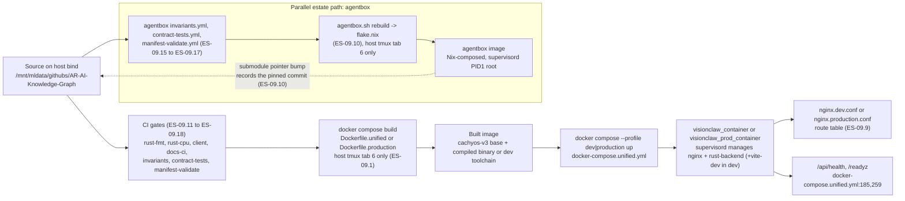
```mermaid
flowchart LR
    SRC["Source on host bind<br/>/mnt/mldata/githubs/AR-AI-Knowledge-Graph"]
    CIGATE["CI gates (ES-09.11 to ES-09.18)<br/>rust-fmt, rust-cpu, client, docs-ci,<br/>invariants, contract-tests, manifest-validate"]
    DOCKERBUILD["docker compose build<br/>Dockerfile.unified or Dockerfile.production<br/>host tmux tab 6 only (ES-09.1)"]
    IMAGE["Built image<br/>cachyos-v3 base + compiled binary or dev toolchain"]
    COMPOSEUP["docker compose --profile dev|production up<br/>docker-compose.unified.yml"]
    CONTAINER["visionclaw_container or visionclaw_prod_container<br/>supervisord manages nginx + rust-backend (+vite-dev in dev)"]
    NGINXROUTE["nginx.dev.conf or nginx.production.conf<br/>route table (ES-09.9)"]
    HEALTH["/api/health, /readyz<br/>docker-compose.unified.yml:185,259"]

    SRC --> CIGATE
    CIGATE --> DOCKERBUILD
    DOCKERBUILD --> IMAGE
    IMAGE --> COMPOSEUP
    COMPOSEUP --> CONTAINER
    CONTAINER --> NGINXROUTE
    CONTAINER --> HEALTH

    subgraph AGENTBOXPARALLEL["Parallel estate path: agentbox"]
        ABGATE["agentbox invariants.yml, contract-tests.yml,<br/>manifest-validate.yml (ES-09.15 to ES-09.17)"]
        ABFLAKE["agentbox.sh rebuild -> flake.nix<br/>(ES-09.10), host tmux tab 6 only"]
        ABIMAGE["agentbox image<br/>Nix-composed, supervisord PID1 root"]
    end
    SRC --> ABGATE --> ABFLAKE --> ABIMAGE
    ABIMAGE -.->|"submodule pointer bump<br/>records the pinned commit (ES-09.10)"| SRC
```

## ES-09.20 The compile-time submodule input — why the dev image mounts agentbox/schema
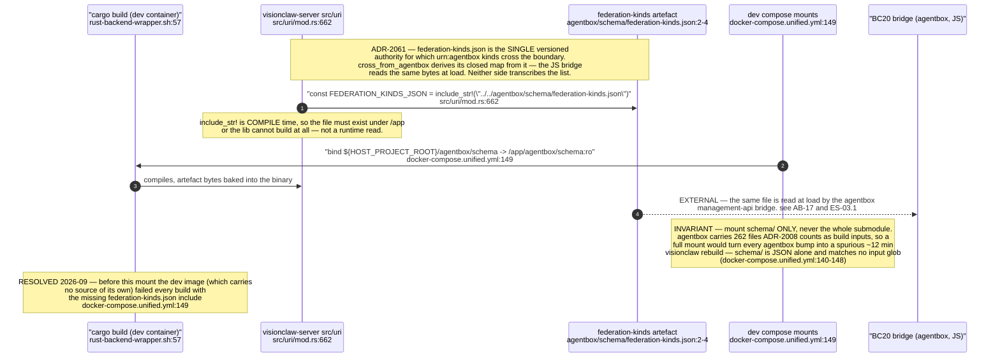
```mermaid
sequenceDiagram
    autonumber
    participant CB as "cargo build (dev container)"<br/>rust-backend-wrapper.sh:57
    participant URI as visionclaw-server src/uri<br/>src/uri/mod.rs:662
    participant FK as federation-kinds artefact<br/>agentbox/schema/federation-kinds.json:2-4
    participant CMP as dev compose mounts<br/>docker-compose.unified.yml:149
    participant BR as "BC20 bridge (agentbox, JS)"

    Note over URI,FK: ADR-2061 — federation-kinds.json is the SINGLE versioned<br/>authority for which urn:agentbox kinds cross the boundary.<br/>cross_from_agentbox derives its closed map from it — the JS bridge<br/>reads the same bytes at load. Neither side transcribes the list.
    URI->>FK: "const FEDERATION_KINDS_JSON = include_str!(\"../../agentbox/schema/federation-kinds.json\")"<br/>src/uri/mod.rs:662
    Note over URI: include_str! is COMPILE time, so the file must exist under /app<br/>or the lib cannot build at all — not a runtime read.
    CMP->>CB: "bind ${HOST_PROJECT_ROOT}/agentbox/schema -> /app/agentbox/schema:ro"<br/>docker-compose.unified.yml:149
    CB->>URI: compiles, artefact bytes baked into the binary
    FK-->>BR: EXTERNAL — the same file is read at load by the agentbox<br/>management-api bridge. see AB-17 and ES-03.1
    Note over CMP: INVARIANT — mount schema/ ONLY, never the whole submodule.<br/>agentbox carries 262 files ADR-2008 counts as build inputs, so a<br/>full mount would turn every agentbox bump into a spurious ~12 min<br/>visionclaw rebuild — schema/ is JSON alone and matches no input glob<br/>(docker-compose.unified.yml:140-148)
    Note over CB: RESOLVED 2026-09 — before this mount the dev image (which carries<br/>no source of its own) failed every build with<br/>the missing federation-kinds.json include<br/>docker-compose.unified.yml:149
```

## ES-09.21 scripts/launch.sh — env-file resolution and the two divergent code paths
```mermaid
flowchart TB
    START["launch.sh main()<br/>scripts/launch.sh:1242<br/>PROJECT_ROOT = dirname SCRIPT_DIR :15"]

    subgraph SANCTIONED["Sanctioned path — up / rebuild dev|prod"]
        LOADENV["load_env_config<br/>looks for .env.$ENVIRONMENT :183-184"]
        INGR["prod: resolve_prod_ingress reads VISIONCLAW_INGRESS,<br/>lan or tunnel, anything else exits :190,167-180"]
        PRODREQ["production: .env.prod REQUIRED<br/>refuses four forbidden dev settings :195-197<br/>demands concrete values :218-219, the tunnel token only<br/>for tunnel, CORS_ALLOWED_ORIGINS for lan :205-209<br/>hard error if absent :232"]
        DEVFALL["dev: falls back to plain .env :236-241<br/>hard error if neither exists :243"]
        HPR["HOST_PROJECT_ROOT export :328,:336,:344<br/>— the DinD path translation the schema<br/>mount in ES-09.20 depends on"]
    end

    subgraph LEGACY["rebuild_agent_container — legacy MAD path"]
        CD["cd $PROJECT_ROOT/multi-agent-docker :880"]
        MK[".env absent -> cp env.example .env :884-887<br/>then blocks on an interactive read :890"]
    end

    START --> LOADENV
    LOADENV --> INGR --> PRODREQ
    LOADENV --> DEVFALL
    LOADENV --> HPR
    START -->|"launch.sh rebuild-agent, scripts/launch.sh:1305-1308"| CD --> MK

    FIX["RESOLVED 2026-09-06 — the auto-create branch tested for a dotted<br/>.env.example that has never existed in the tree, so it always fell<br/>through to the error exit. It now copies env.example, the template<br/>that actually ships (scripts/launch.sh:884-887, env.example)."]
    DIV["DIVERGENCE — multi-agent-docker/ is not present in this checkout,<br/>so rebuild_agent_container cds into a missing directory before it<br/>reaches the fixed branch. The repaired .env creation is correct but<br/>currently unreachable; the MAD stack is the deprecated predecessor<br/>whose only surviving trace is the mad-workspace volume. see ES-01.4"]
    INV["INVARIANT ADR-2027 — profile selection is env-file driven, and the<br/>production branch fails closed: a missing or dev-contaminated<br/>.env.prod aborts the launch rather than defaulting. see ES-10"]

    MK --> FIX
    CD --> DIV
    PRODREQ --> INV
```

## ES-09.22 The agentbox invariants gate grew six checks, and each one names the record it enforces
```mermaid
flowchart TB
    TRIG["push or PR touching compose, ADRs, entrypoint, management-api,<br/>lib, scripts, tests/security, flake.nix, skills, mcp, schema<br/>or the manifest<br/>agentbox/.github/workflows/invariants.yml:7-19"]
    JOB["the single invariants job<br/>agentbox/.github/workflows/invariants.yml:34"]
    TRIG --> JOB

    subgraph SKILLS["Skill-estate gates — required before a rebuild"]
        S1["lint-skills.sh, the structure gate<br/>agentbox/.github/workflows/invariants.yml:78"]
        S2["skill-count-check, the SINGLE count authority<br/>agentbox/.github/workflows/invariants.yml:79-80"]
        S3["gen-routing-table --check, routing-table freshness<br/>generated from frontmatter<br/>agentbox/.github/workflows/invariants.yml:82"]
    end
    JOB --> SKILLS

    subgraph CONTRACT["Contract gates"]
        C1["research-gates tests, the deep-research quote, citation<br/>and independence contract<br/>agentbox/.github/workflows/invariants.yml:87-88"]
        C2["check-manifest-catalogue, ADR-039 gate-path parity<br/>agentbox/.github/workflows/invariants.yml:91"]
        C3["federation-fixture-check, the cross-repo identifier<br/>contract from the agentbox side<br/>agentbox/.github/workflows/invariants.yml:100-101"]
    end
    JOB --> CONTRACT

    DEBT["DEBT the workflow records against itself — skill-count-check was<br/>RED and UNWIRED, and the federation fixture check was governed by<br/>a record but never run by anything, found in a script audit. The<br/>fixture's whole point is that both repositories assert the SAME<br/>table rather than two tables that happen to agree, which an<br/>ungated check cannot deliver.<br/>agentbox/.github/workflows/invariants.yml:79,100"]
    S2 --> DEBT
    C3 --> DEBT

    CAT["INVARIANT ADR-039 — a new manifest gate must arrive with a<br/>CATALOGUE entry carrying an honest apply class, and the parity<br/>check above is what enforces it. Recent module entries: Claude Code<br/>permissions (ADR-2116) and instruction tiers (ADR-2118) at boot,<br/>claude-cred-sync at rebuild, skill-router-cascade (ADR-2095) and<br/>routing-teacher-labels (ADR-2110, proposed) at boot, vault-cli<br/>(ADR-2107/2108) at rebuild<br/>agentbox/management-api/lib/system-manifest.js:212,215,218,235,238,273"]
    HONEST["2026-10-02 — two entries show the honesty rule working. jev-compaction<br/>moved from boot to REBUILD when factrail landed (ADR-2121), because<br/>the binary and plugin are now gated in flake.nix,<br/>agentbox/management-api/lib/system-manifest.js:221-222. A new sidechain<br/>entry is rebuild-class with three gates, :257-258, and stateOf now lets<br/>a false parent gate dominate its child gates, :318. Twenty-five module<br/>entries carry boot at HEAD, down from twenty-six."]
    CAT --> HONEST
    C2 --> CAT

    CLASS["Each carries apply_class boot, meaning the entrypoint projects<br/>it and a flip takes effect on the next container restart with no<br/>image rebuild. The three classes are defined at<br/>system-manifest.js:28-30."]
    CAT --> CLASS
```

## ES-09.23 The host ADR ledger gates its own staleness, and fifteen records are failing it
```mermaid
sequenceDiagram
    autonumber
    participant CI as docs-ci workflow<br/>project/.github/workflows/docs-ci.yml:34
    participant GEN as adr-index-gen check<br/>project/scripts/adr-index-gen.js:190
    participant REC as one ADR record's frontmatter
    participant GIT as git

    CI->>GEN: node scripts/adr-index-gen.js docs/adr --check
    GEN->>REC: does it declare verified_paths
    alt no verified_paths
        REC-->>GEN: nothing to check
        Note over GEN: The staleness gate is OPT-IN per record. A record with no<br/>verified_paths gets only a soft nudge toward a full 40-char<br/>SHA, project/scripts/adr-index-gen.js:175-184.
    else verified_paths declared
        REC-->>GEN: verified_commit plus the governed paths
        GEN->>GIT: does the commit exist, and is it an ancestor of HEAD
        alt either answer is no
            GIT-->>GEN: no
            GEN-->>CI: fail, project/scripts/adr-index-gen.js:200-202
        else both yes
            GEN->>GIT: diff those paths from the commit to HEAD
            alt anything changed
                GIT-->>GEN: a non-empty path list
                GEN-->>CI: STALE, re-verify and bump verified_commit,<br/>project/scripts/adr-index-gen.js:207
            else nothing changed
                GIT-->>GEN: empty
                GEN-->>CI: the claim still holds
            end
        end
    end

    Note over GEN,CI: DEBT — at visionclaw f223bbd40 FIFTEEN host records fail this<br/>gate, each naming the governed path that moved under it. The<br/>gate works, and what it is reporting is a re-verification backlog,<br/>project/scripts/adr-index-gen.js:207.
    Note over CI: INVARIANT — the gate is wired into the docs workflow rather than<br/>left to a habit: invalid frontmatter, asymmetric supersession<br/>edges and stale verification claims all fail the build,<br/>project/.github/workflows/docs-ci.yml:34. see VF-01
    Note over CI: SECOND LEDGER GATE (2026-10, 95ec80059 and c57f6c128) — the same<br/>job now runs the ADR ratchet after this check, project/.github/workflows/docs-ci.yml:35-38.<br/>Staleness asks whether a claim still holds, the ratchet asks whether the<br/>proposed backlog grew, project/scripts/adr-ratchet.sh:74-77. see ES-09.12
    Note over REC: Presence of verified_paths is what ARMS the gate, which is why<br/>a record can be honestly unverified without failing CI,<br/>project/scripts/adr-index-gen.js:137-138.
```
