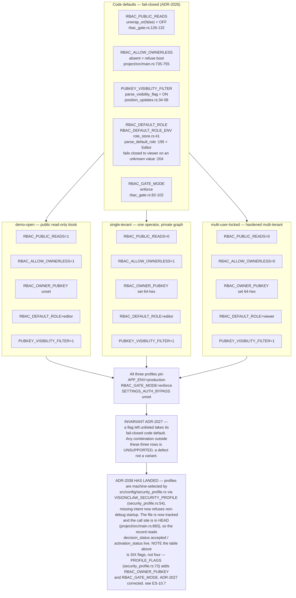
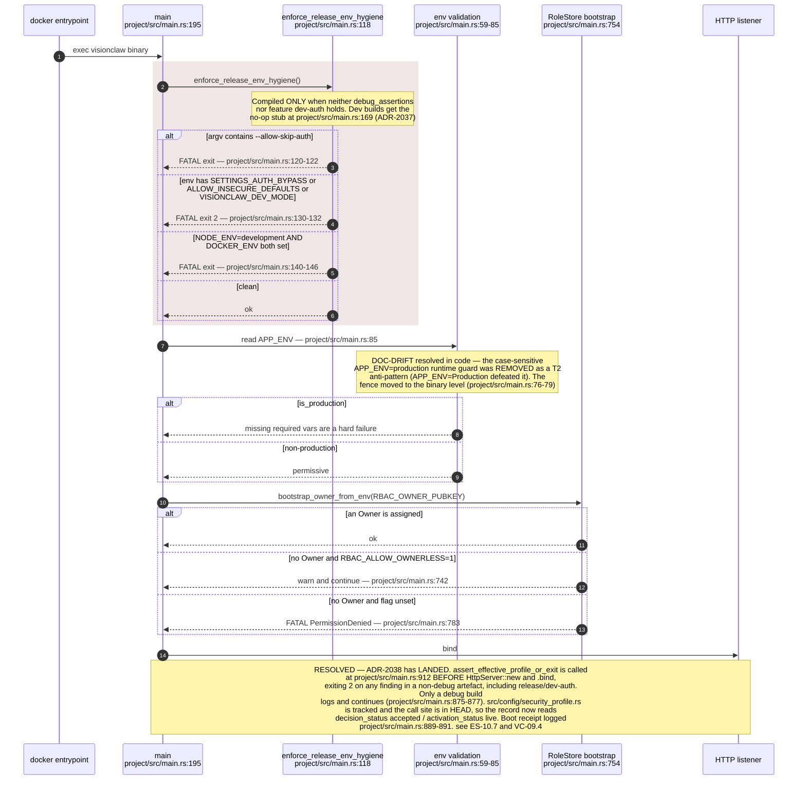
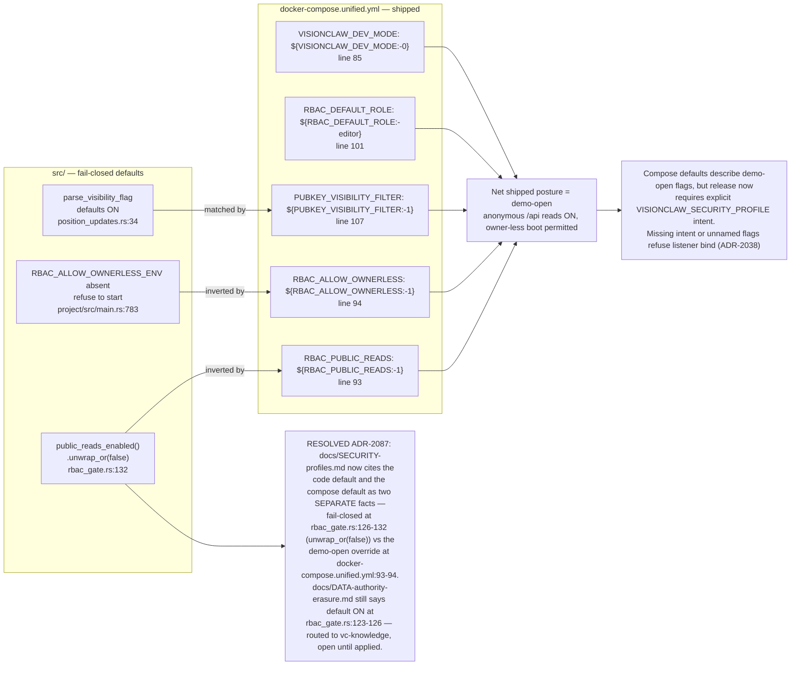
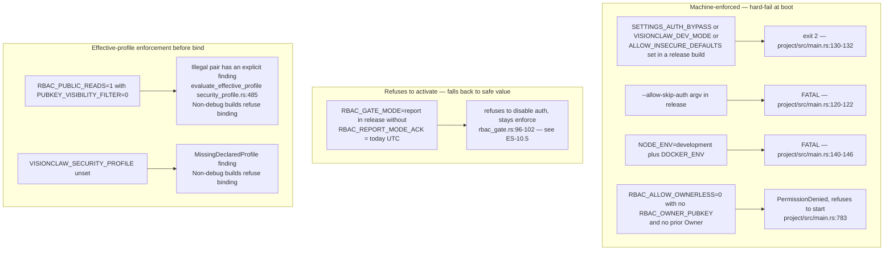
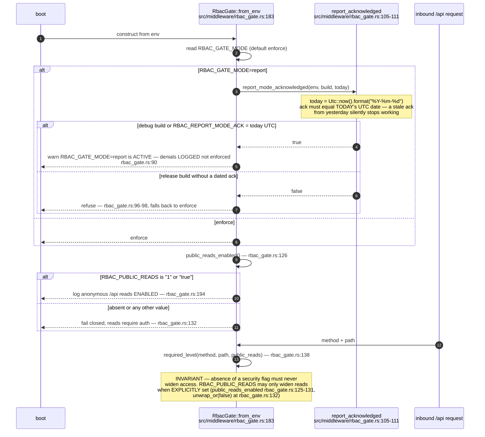
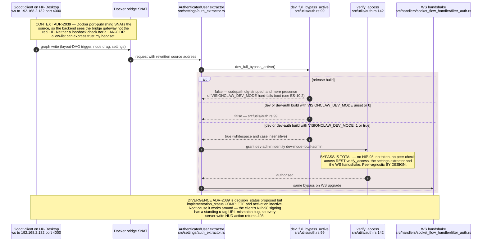
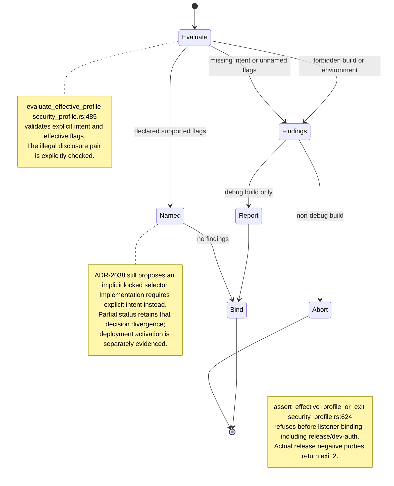
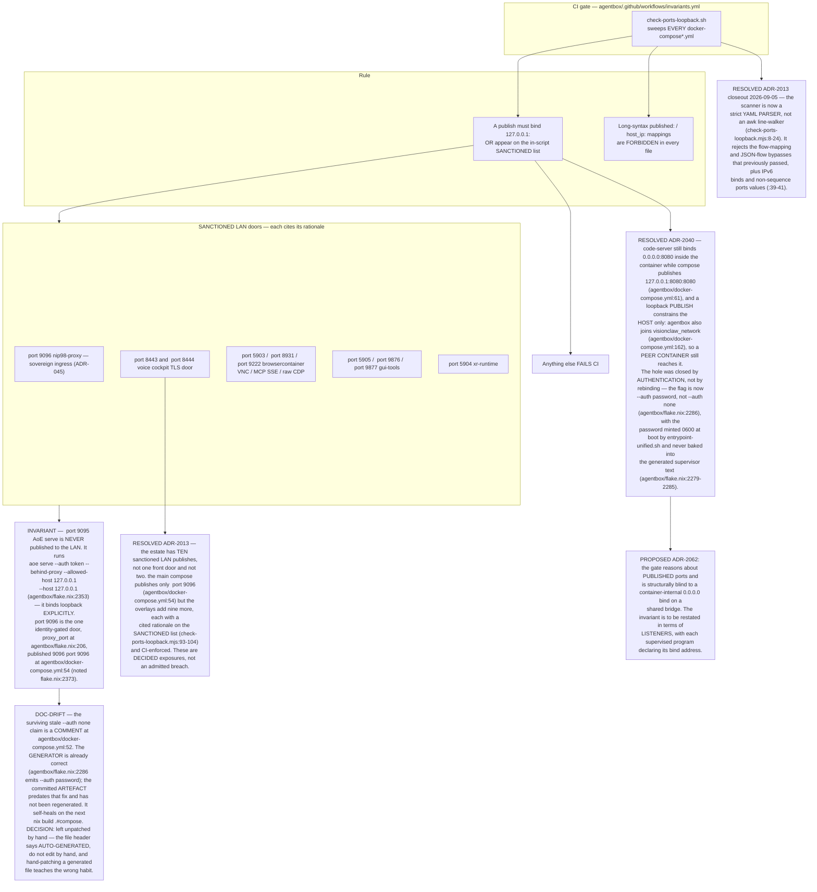
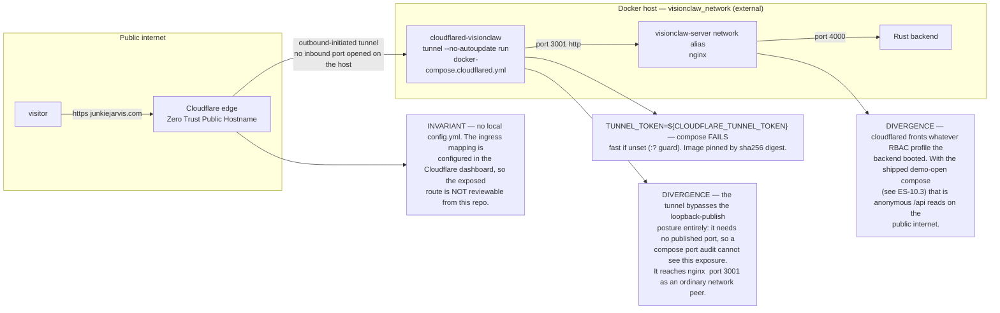
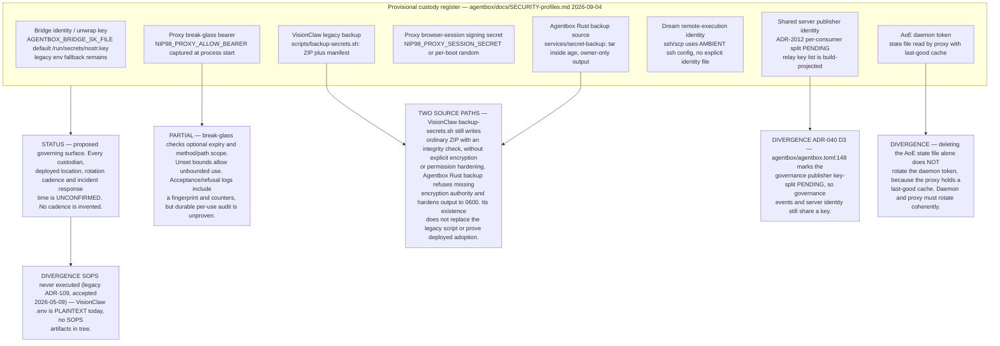

## ES-10.1 Three named profiles — exact flag set per profile vs the fail-closed code default

## ES-10.2 Boot gate order — every check before the listener binds

## ES-10.3 Shipped compose inverts two fail-closed code defaults

## ES-10.4 Illegal combinations and where each is actually enforced

## ES-10.5 RBAC_GATE_MODE=report — dated acknowledgement or refuse

## ES-10.6 VISIONCLAW_DEV_MODE — peer-agnostic LAN-local full bypass (ADR-2039)

## ES-10.7 Boot-time profile assertion and remaining decision divergence

## ES-10.8 agentbox exposure policy — loopback-by-default with a sanctioned list (ADR-2013)

## ES-10.9 cloudflared — the tunnel exposure path

## ES-10.10 agentbox credential custody register — roles and open acceptance evidence

## Custody audit qualification — 2026-09-07

ES-10.10 follows `proxy.mjs::verifyIdentity`, `breakGlassNotExpired` and `breakGlassScopeAllows`, the existing VisionClaw ZIP script, and Agentbox `services/secret-backup/src/main.rs::backup`. The encrypted implementation and legacy script coexist. No actual credential, backup, deployed configuration or restoration was inspected or exercised. Lifecycle acceptance remains open; see the [Agentbox audit](../../estate-review/2026-09-07-agentbox-audit.md).

The source closeout adds findings for missing profile intent and unnamed effective
flags, and refuses every finding in non-debug builds. Explicit intent is required;
no implicit locked profile is selected. That differs from ADR-2038's original
production-selector proposal, so the record remains partial pending owner decision.
Actual default release artefact probes rejected forbidden variables even when set
to zero; the receipt identifies that artefact and does not certify every image.
