## ES-10.1 Three named profiles — exact flag set per profile vs the fail-closed code default
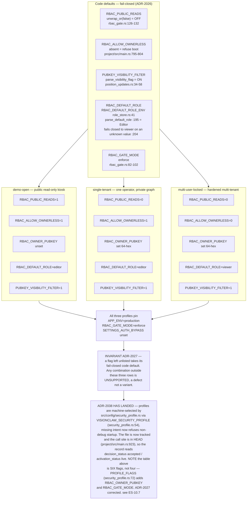
```mermaid
flowchart TB
    subgraph code["Code defaults — fail-closed (ADR-2026)"]
        CD1["RBAC_PUBLIC_READS<br/>unwrap_or(false) = OFF<br/>rbac_gate.rs:126-132"]
        CD2["RBAC_ALLOW_OWNERLESS<br/>absent = refuse boot<br/>project/src/main.rs:795-804"]
        CD3["PUBKEY_VISIBILITY_FILTER<br/>parse_visibility_flag = ON<br/>position_updates.rs:34-58"]
        CD4["RBAC_DEFAULT_ROLE<br/>RBAC_DEFAULT_ROLE_ENV role_store.rs:41<br/>parse_default_role :195 = Editor<br/>fails closed to viewer on an unknown value :204"]
        CD5["RBAC_GATE_MODE<br/>enforce<br/>rbac_gate.rs:82-102"]
    end
    subgraph demo["demo-open — public read-only kiosk"]
        D1["RBAC_PUBLIC_READS=1"]
        D2["RBAC_ALLOW_OWNERLESS=1"]
        D3["RBAC_OWNER_PUBKEY unset"]
        D4["RBAC_DEFAULT_ROLE=editor"]
        D5["PUBKEY_VISIBILITY_FILTER=1"]
    end
    subgraph single["single-tenant — one operator, private graph"]
        S1["RBAC_PUBLIC_READS=0"]
        S2["RBAC_ALLOW_OWNERLESS=1"]
        S3["RBAC_OWNER_PUBKEY set 64-hex"]
        S4["RBAC_DEFAULT_ROLE=editor"]
        S5["PUBKEY_VISIBILITY_FILTER=1"]
    end
    subgraph locked["multi-user-locked — hardened multi-tenant"]
        L1["RBAC_PUBLIC_READS=0"]
        L2["RBAC_ALLOW_OWNERLESS=0"]
        L3["RBAC_OWNER_PUBKEY set 64-hex"]
        L4["RBAC_DEFAULT_ROLE=viewer"]
        L5["PUBKEY_VISIBILITY_FILTER=1"]
    end
    ALL["All three profiles pin<br/>APP_ENV=production<br/>RBAC_GATE_MODE=enforce<br/>SETTINGS_AUTH_BYPASS unset"]
    INV["INVARIANT ADR-2027 — a flag left unlisted takes its<br/>fail-closed code default. Any combination outside<br/>these three rows is UNSUPPORTED, a defect not a variant."]
    DRIFT["ADR-2038 HAS LANDED — profiles are machine-selected by<br/>src/config/security_profile.rs via VISIONCLAW_SECURITY_PROFILE (security_profile.rs:54),<br/>missing intent now refuses non-debug startup. The file is now tracked<br/>and the call site is in HEAD (project/src/main.rs:923), so the record reads<br/>decision_status accepted / activation_status live. NOTE the table above<br/>is SIX flags, not four — PROFILE_FLAGS (security_profile.rs:72) adds RBAC_OWNER_PUBKEY<br/>and RBAC_GATE_MODE. ADR-2027 corrected. see ES-10.7"]

    code --> demo
    code --> single
    code --> locked
    demo --> ALL
    single --> ALL
    locked --> ALL
    ALL --> INV
    INV --> DRIFT
```

## ES-10.2 Boot gate order — every check before the listener binds
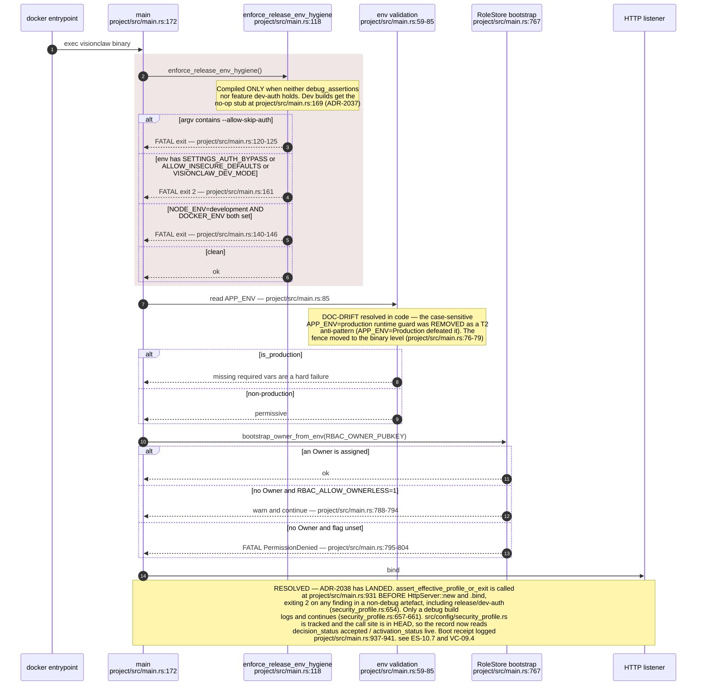
```mermaid
sequenceDiagram
    autonumber
    participant OS as docker entrypoint
    participant M as main<br/>project/src/main.rs:172
    participant EH as enforce_release_env_hygiene<br/>project/src/main.rs:118
    participant EV as env validation<br/>project/src/main.rs:59-85
    participant RS as RoleStore bootstrap<br/>project/src/main.rs:767
    participant L as HTTP listener

    OS->>M: exec visionclaw binary
    rect rgb(240,230,230)
    M->>EH: enforce_release_env_hygiene()
    Note over EH: Compiled ONLY when neither debug_assertions<br/>nor feature dev-auth holds. Dev builds get the<br/>no-op stub at project/src/main.rs:169 (ADR-2037)
    alt argv contains --allow-skip-auth
        EH-->>M: FATAL exit — project/src/main.rs:120-125
    else env has SETTINGS_AUTH_BYPASS or ALLOW_INSECURE_DEFAULTS or VISIONCLAW_DEV_MODE
        EH-->>M: FATAL exit 2 — project/src/main.rs:161
    else NODE_ENV=development AND DOCKER_ENV both set
        EH-->>M: FATAL exit — project/src/main.rs:140-146
    else clean
        EH-->>M: ok
    end
    end
    M->>EV: read APP_ENV — project/src/main.rs:85
    Note over EV: DOC-DRIFT resolved in code — the case-sensitive<br/>APP_ENV=production runtime guard was REMOVED as a T2<br/>anti-pattern (APP_ENV=Production defeated it). The<br/>fence moved to the binary level (project/src/main.rs:76-79)
    alt is_production
        EV-->>M: missing required vars are a hard failure
    else non-production
        EV-->>M: permissive
    end
    M->>RS: bootstrap_owner_from_env(RBAC_OWNER_PUBKEY)
    alt an Owner is assigned
        RS-->>M: ok
    else no Owner and RBAC_ALLOW_OWNERLESS=1
        RS-->>M: warn and continue — project/src/main.rs:788-794
    else no Owner and flag unset
        RS-->>M: FATAL PermissionDenied — project/src/main.rs:795-804
    end
    M->>L: bind
    Note over M,L: RESOLVED — ADR-2038 has LANDED. assert_effective_profile_or_exit is called<br/>at project/src/main.rs:931 BEFORE HttpServer::new and .bind,<br/>exiting 2 on any finding in a non-debug artefact, including release/dev-auth<br/>(security_profile.rs:654). Only a debug build<br/>logs and continues (security_profile.rs:657-661). src/config/security_profile.rs<br/>is tracked and the call site is in HEAD, so the record now reads<br/>decision_status accepted / activation_status live. Boot receipt logged<br/>project/src/main.rs:937-941. see ES-10.7 and VC-09.4
```

## ES-10.3 Shipped compose inverts two fail-closed code defaults
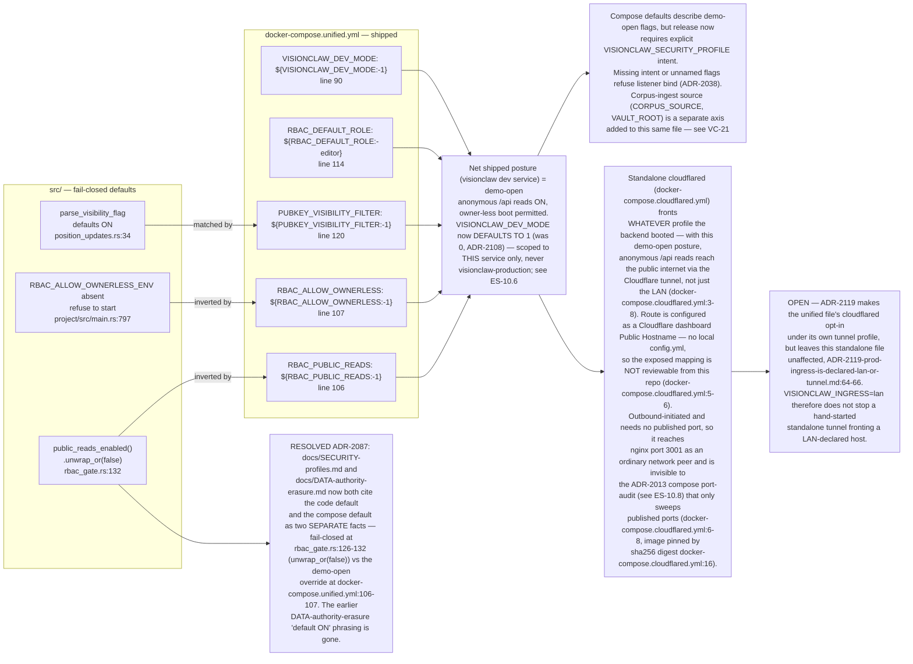
```mermaid
flowchart LR
    subgraph codeside["src/ — fail-closed defaults"]
        A1["public_reads_enabled()<br/>.unwrap_or(false)<br/>rbac_gate.rs:132"]
        A2["RBAC_ALLOW_OWNERLESS_ENV absent<br/>refuse to start<br/>project/src/main.rs:797"]
        A3["parse_visibility_flag<br/>defaults ON<br/>position_updates.rs:34"]
    end
    subgraph composeside["docker-compose.unified.yml — shipped"]
        B1["RBAC_PUBLIC_READS: ${RBAC_PUBLIC_READS:-1}<br/>line 106"]
        B2["RBAC_ALLOW_OWNERLESS: ${RBAC_ALLOW_OWNERLESS:-1}<br/>line 107"]
        B3["PUBKEY_VISIBILITY_FILTER: ${PUBKEY_VISIBILITY_FILTER:-1}<br/>line 120"]
        B4["RBAC_DEFAULT_ROLE: ${RBAC_DEFAULT_ROLE:-editor}<br/>line 114"]
        B5["VISIONCLAW_DEV_MODE: ${VISIONCLAW_DEV_MODE:-1}<br/>line 90"]
    end
    NET["Net shipped posture (visionclaw dev service) = demo-open<br/>anonymous /api reads ON, owner-less boot permitted.<br/>VISIONCLAW_DEV_MODE now DEFAULTS TO 1 (was 0, ADR-2108) — scoped to<br/>THIS service only, never visionclaw-production; see ES-10.6"]
    DRIFT1["Compose defaults describe demo-open flags, but release now<br/>requires explicit VISIONCLAW_SECURITY_PROFILE intent.<br/>Missing intent or unnamed flags refuse listener bind (ADR-2038).<br/>Corpus-ingest source (CORPUS_SOURCE, VAULT_ROOT) is a separate axis<br/>added to this same file — see VC-21"]
    DRIFT2["RESOLVED ADR-2087: docs/SECURITY-profiles.md and<br/>docs/DATA-authority-erasure.md now both cite the code default<br/>and the compose default as two SEPARATE facts — fail-closed at<br/>rbac_gate.rs:126-132 (unwrap_or(false)) vs the demo-open<br/>override at docker-compose.unified.yml:106-107. The earlier<br/>DATA-authority-erasure 'default ON' phrasing is gone."]
    CFT["Standalone cloudflared (docker-compose.cloudflared.yml) fronts<br/>WHATEVER profile the backend booted — with this demo-open posture,<br/>anonymous /api reads reach the public internet via the<br/>Cloudflare tunnel, not just the LAN (docker-compose.cloudflared.yml:3-8). Route is configured<br/>as a Cloudflare dashboard Public Hostname — no local config.yml,<br/>so the exposed mapping is NOT reviewable from this repo (docker-compose.cloudflared.yml:5-6).<br/>Outbound-initiated and needs no published port, so it reaches<br/>nginx port 3001 as an ordinary network peer and is invisible to<br/>the ADR-2013 compose port-audit (see ES-10.8) that only sweeps<br/>published ports (docker-compose.cloudflared.yml:6-8, image pinned by<br/>sha256 digest docker-compose.cloudflared.yml:16)."]

    A1 -- "inverted by" --> B1
    A2 -- "inverted by" --> B2
    A3 -- "matched by" --> B3
    B1 --> NET
    B2 --> NET
    B3 --> NET
    B4 --> NET
    B5 --> NET
    NET --> DRIFT1
    NET --> CFT
    LANGAP["OPEN — ADR-2119 makes the unified file's cloudflared opt-in<br/>under its own tunnel profile, but leaves this standalone file<br/>unaffected, ADR-2119-prod-ingress-is-declared-lan-or-tunnel.md:64-66.<br/>VISIONCLAW_INGRESS=lan therefore does not stop a hand-started<br/>standalone tunnel fronting a LAN-declared host."]
    CFT --> LANGAP
    A1 --> DRIFT2
```

## ES-10.4 Illegal combinations and where each is actually enforced
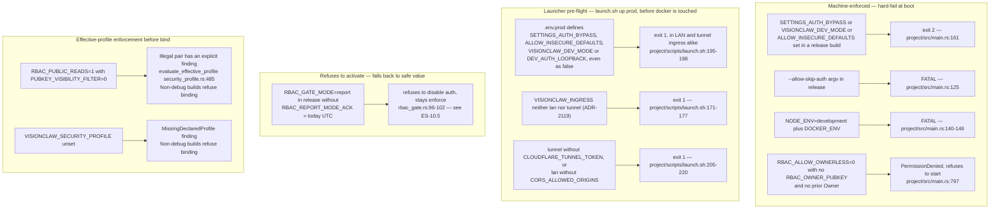
```mermaid
flowchart TB
    subgraph hard["Machine-enforced — hard-fail at boot"]
        H1["SETTINGS_AUTH_BYPASS or VISIONCLAW_DEV_MODE or<br/>ALLOW_INSECURE_DEFAULTS set in a release build"]
        H1E["exit 2 — project/src/main.rs:161"]
        H2["--allow-skip-auth argv in release"]
        H2E["FATAL — project/src/main.rs:125"]
        H3["NODE_ENV=development plus DOCKER_ENV"]
        H3E["FATAL — project/src/main.rs:140-146"]
        H4["RBAC_ALLOW_OWNERLESS=0 with no RBAC_OWNER_PUBKEY<br/>and no prior Owner"]
        H4E["PermissionDenied, refuses to start<br/>project/src/main.rs:797"]
    end
    subgraph launcher["Launcher pre-flight — launch.sh up prod, before docker is touched"]
        P1[".env.prod defines SETTINGS_AUTH_BYPASS, ALLOW_INSECURE_DEFAULTS,<br/>VISIONCLAW_DEV_MODE or DEV_AUTH_LOOPBACK, even as false"]
        P1E["exit 1, in LAN and tunnel ingress alike<br/>project/scripts/launch.sh:195-198"]
        P2["VISIONCLAW_INGRESS neither lan nor tunnel (ADR-2119)"]
        P2E["exit 1 — project/scripts/launch.sh:171-177"]
        P3["tunnel without CLOUDFLARE_TUNNEL_TOKEN, or<br/>lan without CORS_ALLOWED_ORIGINS"]
        P3E["exit 1 — project/scripts/launch.sh:205-220"]
    end
    subgraph soft["Refuses to activate — falls back to safe value"]
        S1["RBAC_GATE_MODE=report in release without<br/>RBAC_REPORT_MODE_ACK = today UTC"]
        S1E["refuses to disable auth, stays enforce<br/>rbac_gate.rs:96-102 — see ES-10.5"]
    end
    subgraph none["Effective-profile enforcement before bind"]
        N1["RBAC_PUBLIC_READS=1 with PUBKEY_VISIBILITY_FILTER=0"]
        N1E["Illegal pair has an explicit finding<br/>evaluate_effective_profile security_profile.rs:485<br/>Non-debug builds refuse binding"]
        N2["VISIONCLAW_SECURITY_PROFILE unset"]
        N2E["MissingDeclaredProfile finding<br/>Non-debug builds refuse binding"]
    end

    H1 --> H1E
    H2 --> H2E
    H3 --> H3E
    H4 --> H4E
    S1 --> S1E
    P1 --> P1E
    P2 --> P2E
    P3 --> P3E
    N1 --> N1E
    N2 --> N2E
```

## ES-10.5 RBAC_GATE_MODE=report — dated acknowledgement or refuse
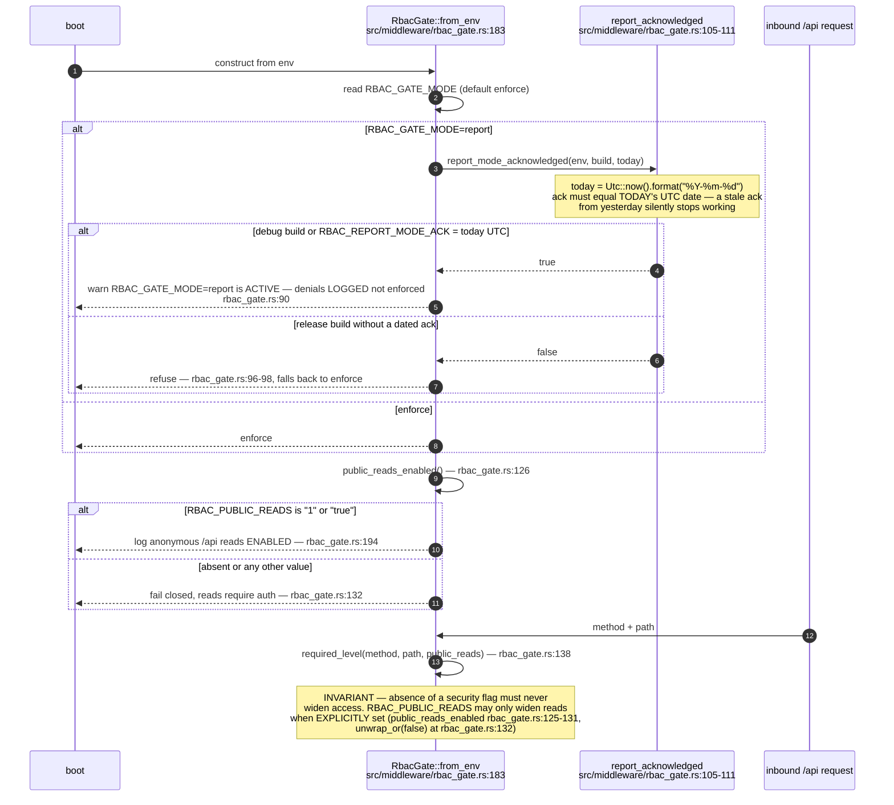
```mermaid
sequenceDiagram
    autonumber
    participant B as boot
    participant RG as RbacGate::from_env<br/>src/middleware/rbac_gate.rs:183
    participant RA as report_acknowledged<br/>src/middleware/rbac_gate.rs:105-111
    participant REQ as inbound /api request

    B->>RG: construct from env
    RG->>RG: read RBAC_GATE_MODE (default enforce)
    alt RBAC_GATE_MODE=report
        RG->>RA: report_mode_acknowledged(env, build, today)
        Note over RA: today = Utc::now().format("%Y-%m-%d")<br/>ack must equal TODAY's UTC date — a stale ack<br/>from yesterday silently stops working
        alt debug build or RBAC_REPORT_MODE_ACK = today UTC
            RA-->>RG: true
            RG-->>B: warn RBAC_GATE_MODE=report is ACTIVE — denials LOGGED not enforced<br/>rbac_gate.rs:90
        else release build without a dated ack
            RA-->>RG: false
            RG-->>B: refuse — rbac_gate.rs:96-98, falls back to enforce
        end
    else enforce
        RG-->>B: enforce
    end
    RG->>RG: public_reads_enabled() — rbac_gate.rs:126
    alt RBAC_PUBLIC_READS is "1" or "true"
        RG-->>B: log anonymous /api reads ENABLED — rbac_gate.rs:194
    else absent or any other value
        RG-->>B: fail closed, reads require auth — rbac_gate.rs:132
    end
    REQ->>RG: method + path
    RG->>RG: required_level(method, path, public_reads) — rbac_gate.rs:138
    Note over RG: INVARIANT — absence of a security flag must never<br/>widen access. RBAC_PUBLIC_READS may only widen reads<br/>when EXPLICITLY set (public_reads_enabled rbac_gate.rs:125-131,<br/>unwrap_or(false) at rbac_gate.rs:132)
```

## ES-10.6 VISIONCLAW_DEV_MODE — peer-agnostic LAN-local full bypass (ADR-2039)
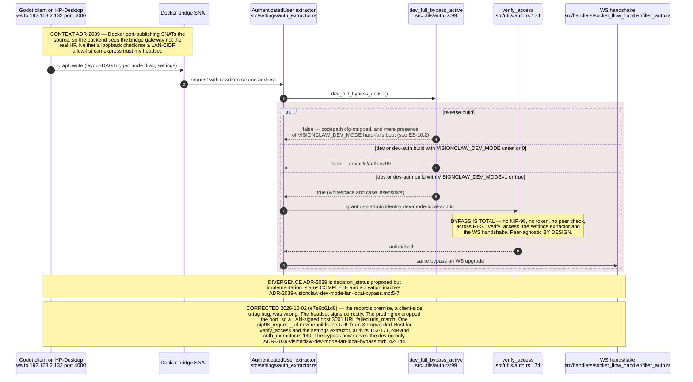
```mermaid
sequenceDiagram
    autonumber
    participant HP as Godot client on HP-Desktop<br/>ws to 192.168.2.132 port 4000
    participant DK as Docker bridge SNAT
    participant AX as AuthenticatedUser extractor<br/>src/settings/auth_extractor.rs
    participant DB as dev_full_bypass_active<br/>src/utils/auth.rs:99
    participant VA as verify_access<br/>src/utils/auth.rs:174
    participant WS as WS handshake<br/>src/handlers/socket_flow_handler/filter_auth.rs

    Note over HP,DK: CONTEXT ADR-2039 — Docker port-publishing SNATs the<br/>source, so the backend sees the bridge gateway not the<br/>real HP. Neither a loopback check nor a LAN-CIDR<br/>allow-list can express trust my headset.
    HP->>DK: graph write (layout-DAG trigger, node drag, settings)
    DK->>AX: request with rewritten source address
    AX->>DB: dev_full_bypass_active()
    rect rgb(240,230,230)
    alt release build
        DB-->>AX: false — codepath cfg-stripped, and mere presence<br/>of VISIONCLAW_DEV_MODE hard-fails boot (see ES-10.2)
    else dev or dev-auth build with VISIONCLAW_DEV_MODE unset or 0
        DB-->>AX: false — src/utils/auth.rs:99
    else dev or dev-auth build with VISIONCLAW_DEV_MODE=1 or true
        DB-->>AX: true (whitespace and case insensitive)
        AX->>VA: grant dev-admin identity dev-mode-local-admin
        Note over VA: BYPASS IS TOTAL — no NIP-98, no token, no peer check,<br/>across REST verify_access, the settings extractor and<br/>the WS handshake. Peer-agnostic BY DESIGN.
        VA-->>AX: authorised
        AX->>WS: same bypass on WS upgrade
    end
    end
    Note over HP,WS: DIVERGENCE ADR-2039 is decision_status proposed but<br/>implementation_status COMPLETE and activation inactive,<br/>ADR-2039-visionclaw-dev-mode-lan-local-bypass.md:5-7
    Note over HP,WS: CORRECTED 2026-10-02 (e7e6b61d8) — the record's premise, a client-side<br/>u-tag bug, was wrong. The headset signs correctly. The prod nginx dropped<br/>the port, so a LAN-signed host:3001 URL failed urls_match. One<br/>nip98_request_url now rebuilds the URL from X-Forwarded-Host for<br/>verify_access and the settings extractor, auth.rs:153-171,249 and<br/>auth_extractor.rs:149. The bypass now serves the dev rig only,<br/>ADR-2039-visionclaw-dev-mode-lan-local-bypass.md:142-144
```

## ES-10.7 Boot-time profile assertion and remaining decision divergence

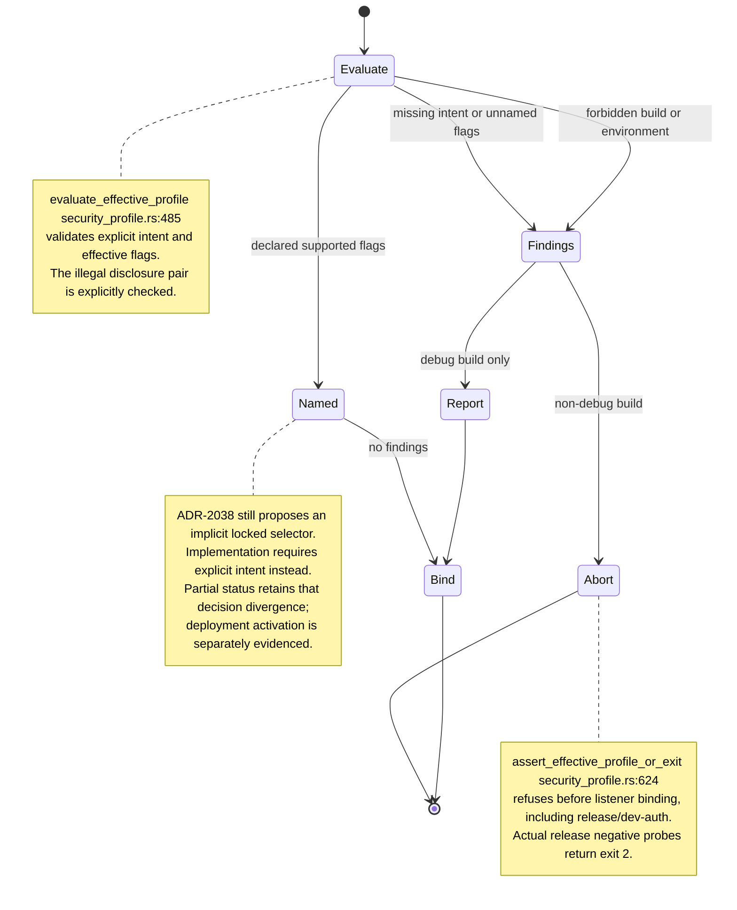
```mermaid
stateDiagram-v2
    [*] --> Evaluate
    Evaluate --> Named: declared supported flags
    Evaluate --> Findings: missing intent or unnamed flags
    Evaluate --> Findings: forbidden build or environment
    Named --> Bind: no findings
    Findings --> Abort: non-debug build
    Findings --> Report: debug build only
    Report --> Bind
    Abort --> [*]
    Bind --> [*]
    note right of Evaluate
        evaluate_effective_profile security_profile.rs:485
        validates explicit intent and effective flags.
        The illegal disclosure pair is explicitly checked.
    end note
    note right of Abort
        assert_effective_profile_or_exit security_profile.rs:624
        refuses before listener binding, including release/dev-auth.
        Actual release negative probes return exit 2.
    end note
    note right of Named
        ADR-2038 still proposes an implicit locked selector.
        Implementation requires explicit intent instead.
        Partial status retains that decision divergence;
        deployment activation is separately evidenced.
    end note
```

## ES-10.8 agentbox exposure policy — loopback-by-default with a sanctioned list (ADR-2013)
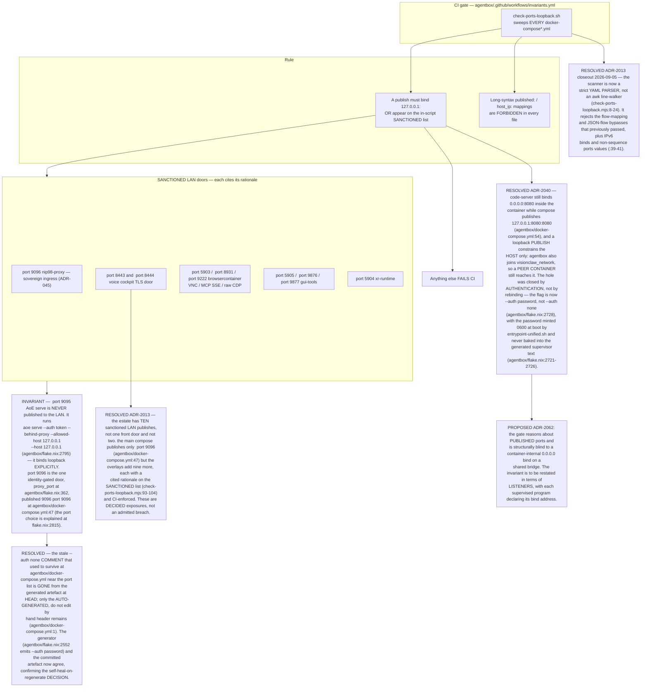
```mermaid
flowchart TB
    subgraph ci["CI gate — agentbox/.github/workflows/invariants.yml"]
        SC["check-ports-loopback.sh<br/>sweeps EVERY docker-compose*.yml"]
    end
    subgraph rule["Rule"]
        R1["A publish must bind 127.0.0.1:<br/>OR appear on the in-script SANCTIONED list"]
        R2["Long-syntax published: / host_ip: mappings<br/>are FORBIDDEN in every file"]
    end
    subgraph sanctioned["SANCTIONED LAN doors — each cites its rationale"]
        P1[" port 9096 nip98-proxy — sovereign ingress (ADR-045)"]
        P2[" port 8443 and  port 8444 voice cockpit TLS door"]
        P3[" port 5903 /  port 8931 /  port 9222 browsercontainer<br/>VNC / MCP SSE / raw CDP"]
        P4[" port 5905 /  port 9876 /  port 9877 gui-tools"]
        P5[" port 5904 xr-runtime"]
    end
    FAIL["Anything else FAILS CI"]
    INV["INVARIANT —  port 9095 AoE serve is NEVER published to the LAN. It runs<br/>aoe serve --auth token --behind-proxy --allowed-host 127.0.0.1<br/>--host 127.0.0.1 (agentbox/flake.nix:2795) — it binds loopback EXPLICITLY.<br/> port 9096 is the one identity-gated door, proxy_port at agentbox/flake.nix:362,<br/>published 9096 port 9096 at agentbox/docker-compose.yml:47 (the port choice is explained at flake.nix:2815)."]
    D1["RESOLVED ADR-2013 — the estate has TEN sanctioned LAN publishes,<br/>not one front door and not two. the main compose publishes only  port 9096<br/>(agentbox/docker-compose.yml:47) but the overlays add nine more, each with a<br/>cited rationale on the SANCTIONED list (check-ports-loopback.mjs:93-104)<br/>and CI-enforced. These are DECIDED exposures, not an admitted breach."]
    D2["RESOLVED ADR-2013 closeout 2026-09-05 — the scanner is now a<br/>strict YAML PARSER, not an awk line-walker<br/>(check-ports-loopback.mjs:8-24). It rejects the flow-mapping<br/>and JSON-flow bypasses that previously passed, plus IPv6<br/>binds and non-sequence ports values (:39-41)."]
    D3["RESOLVED ADR-2040 — code-server still binds 0.0.0.0:8080 inside the<br/>container while compose publishes 127.0.0.1:8080:8080<br/>(agentbox/docker-compose.yml:54), and a loopback PUBLISH constrains the<br/>HOST only: agentbox also joins visionclaw_network, so a PEER CONTAINER<br/>still reaches it. The hole was closed by AUTHENTICATION, not by<br/>rebinding — the flag is now --auth password, not --auth none<br/>(agentbox/flake.nix:2728), with the password minted 0600 at boot by<br/>entrypoint-unified.sh and never baked into the generated supervisor<br/>text (agentbox/flake.nix:2721-2726)."]
    D5["PROPOSED ADR-2062: the gate reasons about PUBLISHED ports and<br/>is structurally blind to a container-internal 0.0.0.0 bind on a<br/>shared bridge. The invariant is to be restated in terms of<br/>LISTENERS, with each supervised program declaring its bind address."]
    D4["RESOLVED — the stale --auth none COMMENT that used to survive at<br/>agentbox/docker-compose.yml near the port list is GONE from the<br/>generated artefact at HEAD; only the AUTO-GENERATED, do not edit by<br/>hand header remains (agentbox/docker-compose.yml:1). The generator<br/>(agentbox/flake.nix:2552 emits --auth password) and the committed<br/>artefact now agree, confirming the self-heal-on-regenerate DECISION."]

    SC --> R1
    SC --> R2
    R1 --> sanctioned
    R1 --> FAIL
    sanctioned --> INV
    P2 --> D1
    SC --> D2
    R1 --> D3
    INV --> D4
    D3 --> D5
```

## ES-10.10 agentbox credential custody register — roles and open acceptance evidence
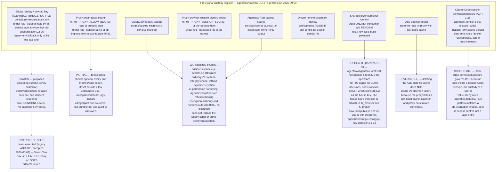
```mermaid
flowchart TB
    subgraph reg["Provisional custody register — agentbox/docs/SECURITY-profiles.md 2026-09-04"]
        C1["Bridge identity / unwrap key<br/>AGENTBOX_BRIDGE_SK_FILE default /run/secrets/nostr.key<br/>under role_isolation held by ab-identity, agentbox/config/role-accounts.json:22-26<br/>legacy env fallback only while the flag is off"]
        C2["Shared server publisher identity<br/>ADR-2012 per-consumer split PENDING<br/>relay key list is build-projected"]
        C3["Proxy break-glass bearer<br/>NIP98_PROXY_ALLOW_BEARER read at process start<br/>under role_isolation a file of ab-ingress, role-accounts.json:46-51"]
        C4["Proxy browser-session signing secret<br/>NIP98_PROXY_SESSION_SECRET or per-boot random<br/>under role_isolation a file of ab-ingress"]
        C5["AoE daemon token<br/>state file read by proxy with last-good cache"]
        C6["Dream remote-execution identity<br/>ssh/scp uses AMBIENT ssh config, no explicit identity file"]
        C7["VisionClaw legacy backup<br/>scripts/backup-secrets.sh: ZIP plus manifest"]
        C8["Agentbox Rust backup source<br/>services/secret-backup: tar inside age, owner-only output"]
        C9["Claude Code session permission posture (ADR-2116)<br/>agentbox.toml:642-657 [claude_code] bypassPermissions default<br/>plus deny rules (docker run/compose, ssh to machinelearn)"]
    end
    ST["STATUS — proposed governing surface. Every custodian,<br/>deployed location, rotation cadence and incident response<br/>time is UNCONFIRMED. No cadence is invented."]
    D1["PARTIAL — break-glass checks optional expiry and method/path scope.<br/>Unset bounds allow unbounded use. Acceptance/refusal logs include<br/>a fingerprint and counters, but durable per-use audit is unproven."]
    D2["TWO SOURCE PATHS — VisionClaw backup-secrets.sh still writes<br/>ordinary ZIP with an integrity check, without explicit encryption<br/>or permission hardening. Agentbox Rust backup refuses missing<br/>encryption authority and hardens output to 0600. Its existence<br/>does not replace the legacy script or prove deployed adoption."]
    D3["RESOLVED Q15 2026-10-03 — agentbox/agentbox.toml:160 now names b4165401 the operator's<br/>NIP-07 signer for 31403 decisions, not visionclaw-server, which signs 31402<br/>as the house key. The house key's own split is STAGED: K_browser and K_broker<br/>have null pubkeys and no use is withdrawn yet,<br/>agentbox/config/custody/g5-key-split.json:13-32"]
    D4["DIVERGENCE — deleting the AoE state file alone does NOT<br/>rotate the daemon token, because the proxy holds a<br/>last-good cache. Daemon and proxy must rotate coherently."]
    D5["DIVERGENCE SOPS never executed (legacy ADR-109, accepted<br/>2026-05-09) — VisionClaw .env is PLAINTEXT today, no SOPS<br/>artifacts in tree."]
    D6["SCOPED OUT — ADR-2116 permission posture governs WHO can run<br/>tools inside a Claude Code session, not custody of a secret<br/>value. Deny rules (agentbox.toml:657) are pattern matches a<br/>sh -c wrapper evades, so it is access control, not a vault entry."]

    reg --> ST
    C3 --> D1
    C7 --> D2
    C8 --> D2
    C2 --> D3
    C5 --> D4
    ST --> D5
    C9 --> D6
```

## ES-10.12 agentbox custody step 1 — who can reach a credential, flag off versus role_isolation
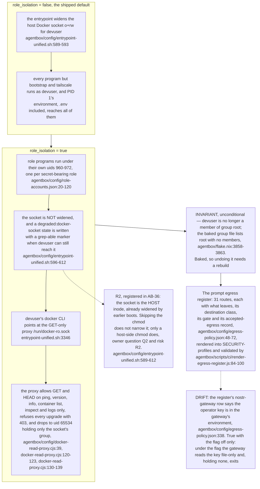
```mermaid
flowchart TB
    subgraph OFF["role_isolation = false, the shipped default"]
        direction TB
        O1["the entrypoint widens the host Docker socket o+rw for devuser<br/>agentbox/config/entrypoint-unified.sh:589-593"]
        O2["every program but bootstrap and tailscale runs as devuser, and PID 1's<br/>environment, .env included, reaches all of them"]
        O1 --> O2
    end
    subgraph ON["role_isolation = true"]
        direction TB
        A1["role programs run under their own uids 960-972, one per secret-bearing role<br/>agentbox/config/role-accounts.json:20-120"]
        A2["the socket is NOT widened, and a degraded:docker-socket state is written<br/>with a grep-able marker when devuser can still reach it<br/>agentbox/config/entrypoint-unified.sh:596-612"]
        A3["devuser's docker CLI points at the GET-only proxy /run/docker-ro.sock<br/>entrypoint-unified.sh:3346"]
        A4["the proxy allows GET and HEAD on ping, version, info, container list,<br/>inspect and logs only, refuses every upgrade with 403, and drops to uid 65534<br/>holding only the socket's group, agentbox/config/docker-read-proxy.cjs:39,<br/>docker-read-proxy.cjs:120-123, docker-read-proxy.cjs:130-139"]
        A1 --> A2 --> A3 --> A4
    end
    OFF --> ON
    GR["INVARIANT, unconditional — devuser is no longer a member of group root;<br/>the baked group file lists root with no members, agentbox/flake.nix:3858-3863.<br/>Baked, so undoing it needs a rebuild"]
    ON --> GR
    EG["The prompt egress register: 31 routes, each with what leaves, its destination class,<br/>its gate and its accepted-egress record, agentbox/config/egress-policy.json:48-72,<br/>rendered into SECURITY-profiles and validated by<br/>agentbox/scripts/ci/render-egress-register.js:84-100"]
    GR --> EG
    A2 -.-> OPEN2["R2, registered in AB-36: the socket is the HOST inode, already widened by earlier boots. Skipping the chmod<br/>does not narrow it; only a host-side chmod does, owner question Q2 and risk R2.<br/>agentbox/config/entrypoint-unified.sh:589-612"]
    EG -.-> DR["DRIFT: the register's nostr-gateway row says the operator key is in the gateway's<br/>environment, agentbox/config/egress-policy.json:338. True with the flag off only:<br/>under the flag the gateway reads the key file-only and, holding none, exits"]
```

**What it shows.** The agentbox half of the estate's custody posture after step 1. The flag-independent change is that devuser leaves group root. The flag-dependent changes are per-role accounts and the end of devuser's raw Docker socket, replaced by a read-only proxy. The prompt egress register is the companion catalogue of what can leave the container and on what authority.

**Why it is this way.** The custody design found three bypasses that voided any in-container boundary: host Docker access, root running devuser-influenced code, and secrets in PID 1's environment. Group-root membership was baked into the image, so its removal is unconditional. The rest ships behind `[security].role_isolation`, off by default, until the owner's boot rehearsal (agentbox AB-36).

**Invariant:** devuser is not a member of group root in any image built at this revision, flag on or off (`../project/agentbox/flake.nix:3858-3863`).

**Open:** under `role_isolation` the entrypoint stops widening the Docker socket but cannot narrow it: the socket is the host's inode and earlier boots left it `o+rw`, so the boot records `degraded:docker-socket` and a host-side `chmod` is owed (`../project/agentbox/config/entrypoint-unified.sh:596-612`, `../project/agentbox/docker-compose.override.yml:115-117`).

**Drift (egress register vs role isolation):** the `nostr-gateway` row states that the operator key is in the process environment (`../project/agentbox/config/egress-policy.json:338`); that holds only with the flag off, since under the flag the gateway takes the key from a role-secret file it does not hold (`../project/agentbox/docs/adr/ADR-2122-role-service-accounts-run-secrets-and-the-identity-port.md:231-232`).

## Custody audit qualification — 2026-09-07

ES-10.10 follows `proxy.mjs::verifyIdentity`, `breakGlassNotExpired` and `breakGlassScopeAllows`, the existing VisionClaw ZIP script, and Agentbox `services/secret-backup/src/main.rs::backup`. The encrypted implementation and legacy script coexist. No actual credential, backup, deployed configuration or restoration was inspected or exercised. Lifecycle acceptance remains open; see the [Agentbox audit](../../estate-review/2026-09-07-agentbox-audit.md).

The source closeout adds findings for missing profile intent and unnamed effective
flags, and refuses every finding in non-debug builds. Explicit intent is required;
no implicit locked profile is selected. That differs from ADR-2038's original
production-selector proposal, so the record remains partial pending owner decision.
Actual default release artefact probes rejected forbidden variables even when set
to zero; the receipt identifies that artefact and does not certify every image.

## ES-10.11 The sanctioned door list at this revision, and the one PROPOSED addition
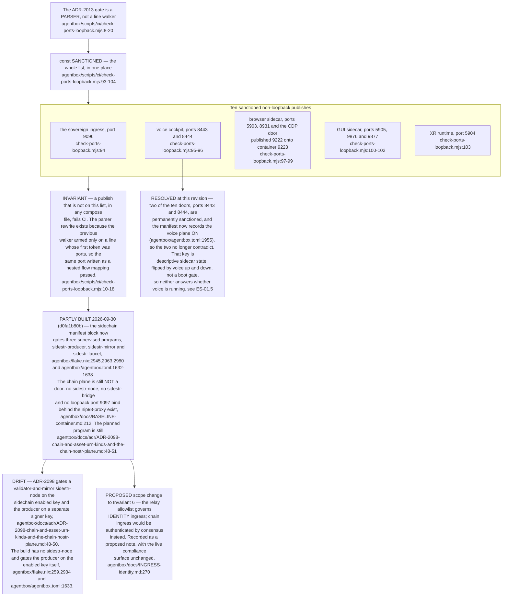
```mermaid
flowchart TB
    GATE["The ADR-2013 gate is a PARSER, not a line walker<br/>agentbox/scripts/ci/check-ports-loopback.mjs:8-20"]
    LIST["const SANCTIONED — the whole list, in one place<br/>agentbox/scripts/ci/check-ports-loopback.mjs:93-104"]
    GATE --> LIST

    subgraph DOORS["Ten sanctioned non-loopback publishes"]
        D0["the sovereign ingress, port 9096<br/>check-ports-loopback.mjs:94"]
        D1["voice cockpit, ports 8443 and 8444<br/>check-ports-loopback.mjs:95-96"]
        D2["browser sidecar, ports 5903, 8931 and the CDP door<br/>published 9222 onto container 9223<br/>check-ports-loopback.mjs:97-99"]
        D3["GUI sidecar, ports 5905, 9876 and 9877<br/>check-ports-loopback.mjs:100-102"]
        D4["XR runtime, port 5904<br/>check-ports-loopback.mjs:103"]
    end
    LIST --> DOORS

    INV["INVARIANT — a publish that is not on this list, in any compose<br/>file, fails CI. The parser rewrite exists because the previous<br/>walker armed only on a line whose first token was ports, so the<br/>same port written as a nested flow mapping passed.<br/>agentbox/scripts/ci/check-ports-loopback.mjs:10-18"]
    DOORS --> INV

    PROP["PARTLY BUILT 2026-09-30 (d0fa1b80b) — the sidechain manifest block now<br/>gates three supervised programs, sidestr-producer, sidestr-mirror and<br/>sidestr-faucet, agentbox/flake.nix:2945,2963,2980 and agentbox/agentbox.toml:1632-1638.<br/>The chain plane is still NOT a door: no sidestr-node, no sidestr-bridge<br/>and no loopback port 9097 bind behind the nip98-proxy exist,<br/>agentbox/docs/BASELINE-container.md:212. The planned program is still<br/>agentbox/docs/adr/ADR-2098-chain-and-asset-urn-kinds-and-the-chain-nostr-plane.md:48-51"]
    INV --> PROP
    GATEDRIFT["DRIFT — ADR-2098 gates a validator-and-mirror sidestr-node on the<br/>sidechain enabled key and the producer on a separate signer key,<br/>agentbox/docs/adr/ADR-2098-chain-and-asset-urn-kinds-and-the-chain-nostr-plane.md:48-50.<br/>The build has no sidestr-node and gates the producer on the<br/>enabled key itself, agentbox/flake.nix:259,2934 and agentbox/agentbox.toml:1633."]
    PROP --> GATEDRIFT

    NARROW["PROPOSED scope change to Invariant 6 — the relay allowlist governs<br/>IDENTITY ingress; chain ingress would be authenticated by consensus<br/>instead. Recorded as a proposed note, with the live compliance<br/>surface unchanged.<br/>agentbox/docs/INGRESS-identity.md:270"]
    PROP --> NARROW

    TENSION["RESOLVED at this revision — two of the ten doors, ports 8443 and 8444, are<br/>permanently sanctioned, and the manifest now records the voice plane ON<br/>(agentbox/agentbox.toml:1955), so the two no longer contradict. That key is<br/>descriptive sidecar state, flipped by voice up and down, not a boot gate,<br/>so neither answers whether voice is running. see ES-01.5"]
    D1 --> TENSION
```
