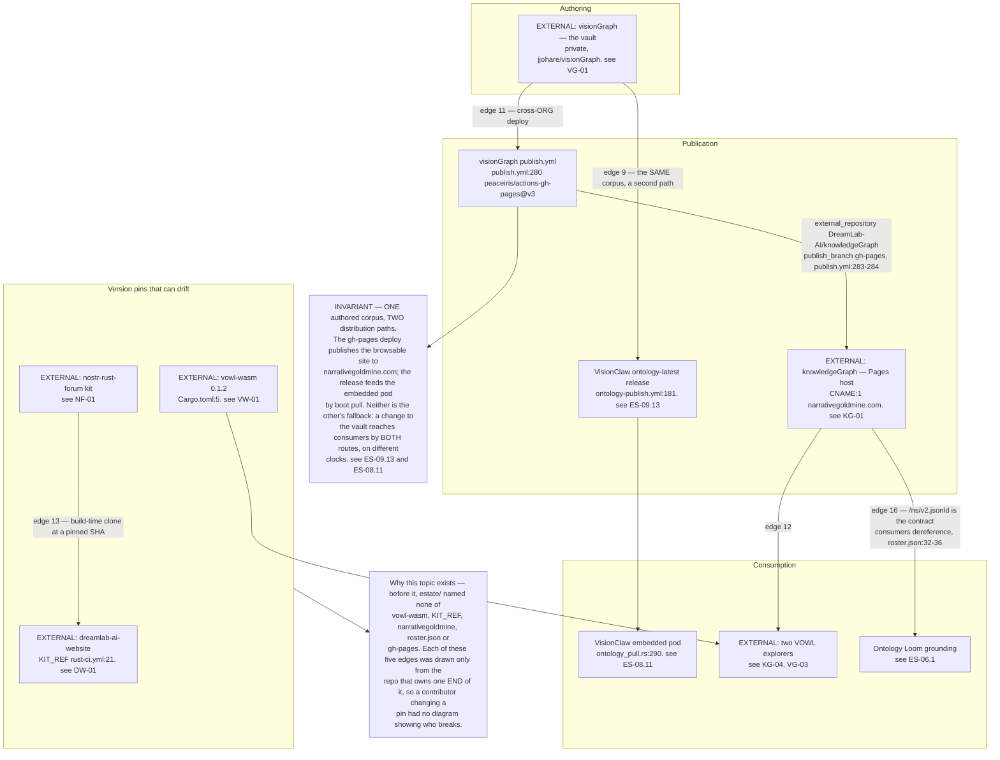
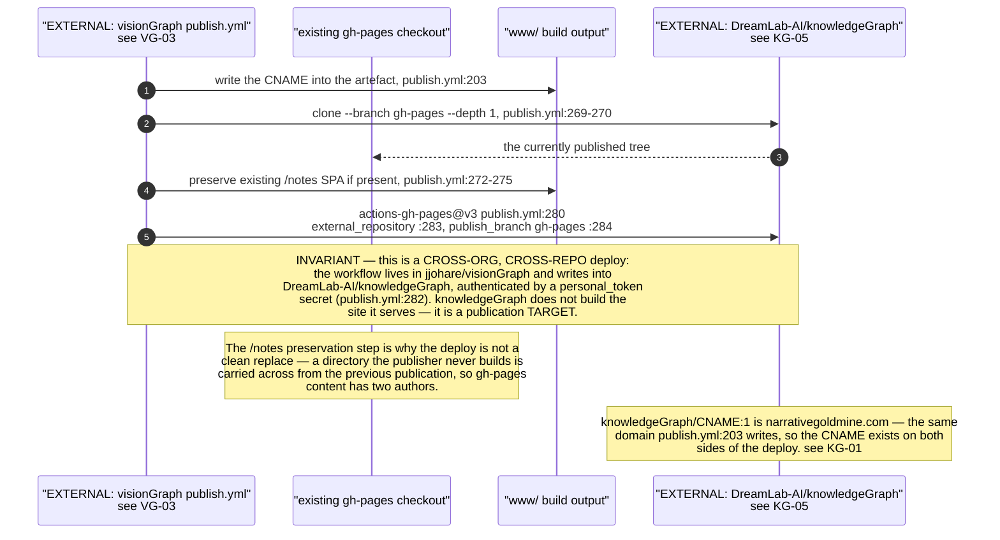
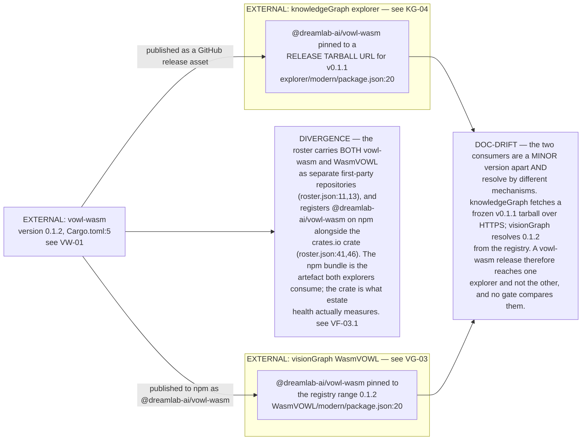
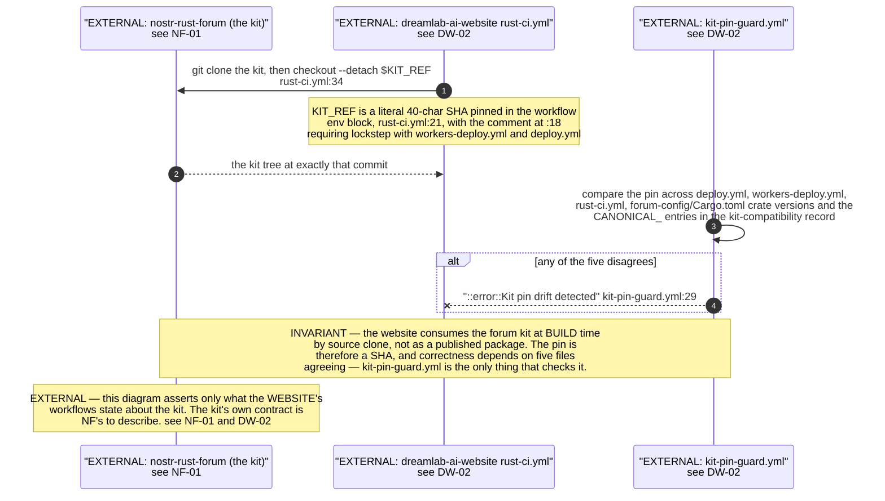
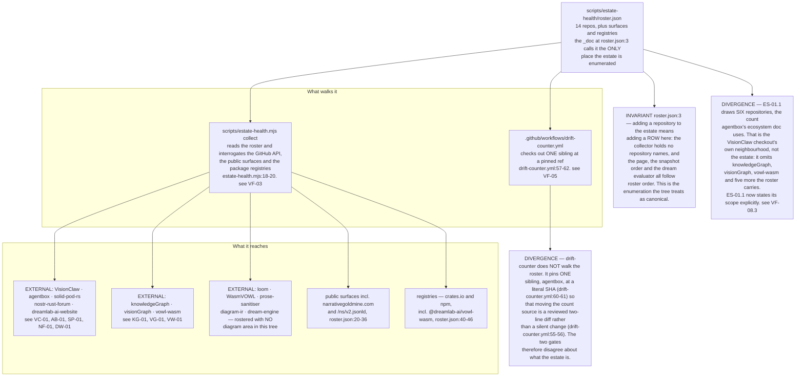

## ES-11.1 The publishing axis — five cross-repo edges, each previously drawn from one side only

## ES-11.2 Edge 11 — visionGraph publishes into another org's repo

## ES-11.3 Edge 12 — two VOWL explorers, two divergent bundle pins

## ES-11.4 Edge 13 — the forum kit pin, and the guard that keeps four files in lockstep

## ES-11.5 Edges 14 and 15 — the roster is the estate's only enumeration, and what reads it

