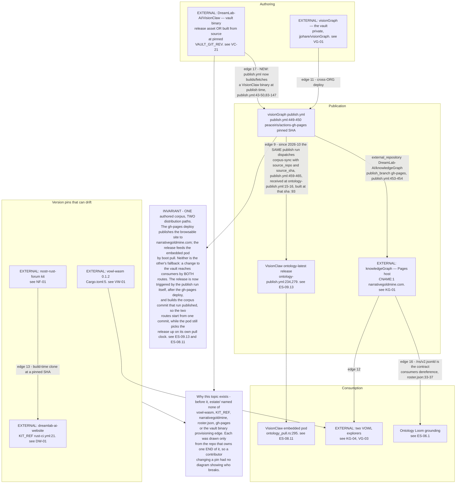
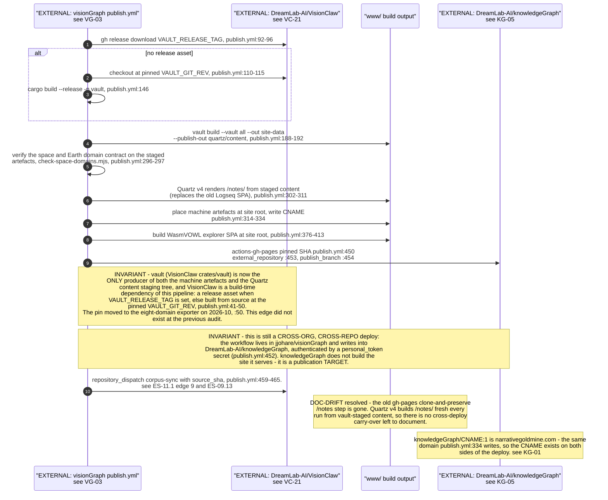
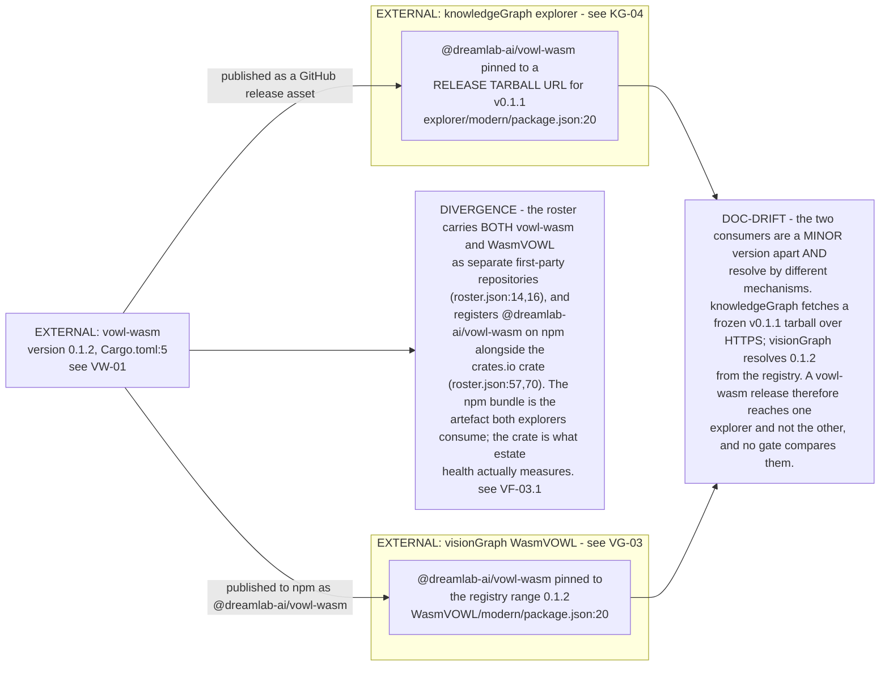
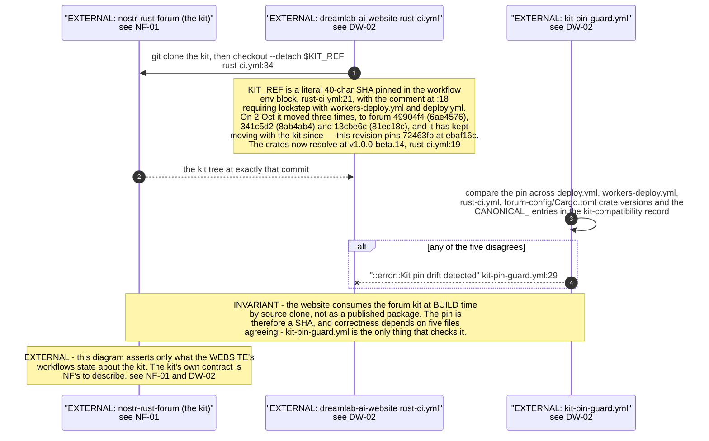
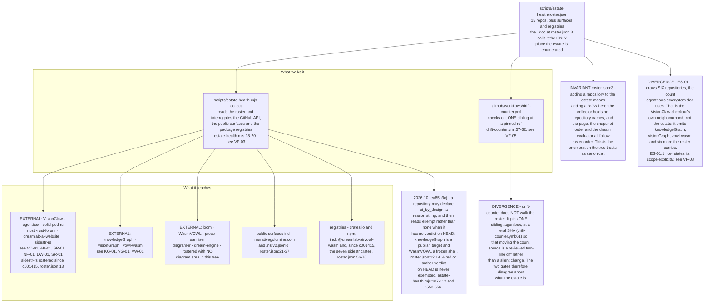

## ES-11.1 The publishing axis — six cross-repo edges, each previously drawn from one side only

```mermaid
flowchart TB
    subgraph AUTHOR["Authoring"]
        VG["EXTERNAL: visionGraph — the vault<br/>private, jjohare/visionGraph. see VG-01"]
        VC["EXTERNAL: DreamLab-AI/VisionClaw — vault binary<br/>release asset OR built from source<br/>at pinned VAULT_GIT_REV. see VC-21"]
    end
    subgraph PUB["Publication"]
        PUBYML["visionGraph publish.yml<br/>publish.yml:449-450 peaceiris/actions-gh-pages pinned SHA"]
        KG["EXTERNAL: knowledgeGraph — Pages host<br/>CNAME:1 narrativegoldmine.com. see KG-01"]
        REL["VisionClaw ontology-latest release<br/>ontology-publish.yml:234,279. see ES-09.13"]
    end
    subgraph CONSUME["Consumption"]
        POD["VisionClaw embedded pod<br/>ontology_pull.rs:295. see ES-08.11"]
        EXPL["EXTERNAL: two VOWL explorers<br/>see KG-04, VG-03"]
        LOOM["Ontology Loom grounding<br/>see ES-06.1"]
    end
    subgraph PINS["Version pins that can drift"]
        VW["EXTERNAL: vowl-wasm 0.1.2<br/>Cargo.toml:5. see VW-01"]
        NF["EXTERNAL: nostr-rust-forum kit<br/>see NF-01"]
        DW["EXTERNAL: dreamlab-ai-website<br/>KIT_REF rust-ci.yml:21. see DW-01"]
    end

    VC -->|"edge 17 - NEW: publish.yml now builds/fetches<br/>a VisionClaw binary at publish time, publish.yml:43-50,83-147"| PUBYML
    VG -->|"edge 11 - cross-ORG deploy"| PUBYML
    PUBYML -->|"external_repository DreamLab-AI/knowledgeGraph<br/>publish_branch gh-pages, publish.yml:453-454"| KG
    PUBYML -->|"edge 9 - since 2026-10 the SAME publish run dispatches<br/>corpus-sync with source_repo and source_sha, publish.yml:459-465,<br/>received at ontology-publish.yml:15-16, built at that sha :93"| REL
    REL --> POD
    KG -->|"edge 16 - /ns/v2.jsonld is the contract<br/>consumers dereference, roster.json:33-37"| LOOM
    KG -->|"edge 12"| EXPL
    VW --> EXPL
    NF -->|"edge 13 - build-time clone at a pinned SHA"| DW

    INV["INVARIANT - ONE authored corpus, TWO distribution paths.<br/>The gh-pages deploy publishes the browsable site to<br/>narrativegoldmine.com; the release feeds the embedded pod<br/>by boot pull. Neither is the other's fallback: a change to<br/>the vault reaches consumers by BOTH routes. The release is now<br/>triggered by the publish run itself, after the gh-pages deploy,<br/>and builds the corpus commit that run published, so the two<br/>routes start from one commit, while the pod still picks the<br/>release up on its own pull clock. see ES-09.13 and ES-08.11"]
    GAP["Why this topic exists - before it, estate/ named none of<br/>vowl-wasm, KIT_REF, narrativegoldmine, roster.json, gh-pages<br/>or the vault binary provisioning edge. Each was drawn only<br/>from the repo that owns one END of it, so a contributor<br/>changing a pin had no diagram showing who breaks."]

    PUBYML --> INV
    PINS --> GAP
    VC --> GAP
```

## ES-11.2 Edge 11 - visionGraph publishes into another org's repo, now via a VisionClaw-built vault binary and Quartz notes

```mermaid
sequenceDiagram
    autonumber
    participant VG as "EXTERNAL: visionGraph publish.yml"<br/>see VG-03
    participant VC as "EXTERNAL: DreamLab-AI/VisionClaw"<br/>see VC-21
    participant WWW as "www/ build output"
    participant KG as "EXTERNAL: DreamLab-AI/knowledgeGraph"<br/>see KG-05

    VG->>VC: gh release download VAULT_RELEASE_TAG, publish.yml:92-96
    alt no release asset
        VG->>VC: checkout at pinned VAULT_GIT_REV, publish.yml:110-115
        VG->>VG: cargo build --release -p vault, publish.yml:146
    end
    VG->>WWW: vault build --vault all --out site-data<br/>--publish-out quartz/content, publish.yml:188-192
    VG->>VG: verify the space and Earth domain contract on the staged<br/>artefacts, check-space-domains.mjs, publish.yml:296-297
    VG->>WWW: Quartz v4 renders /notes/ from staged content<br/>(replaces the old Logseq SPA), publish.yml:302-311
    VG->>WWW: place machine artefacts at site root, write CNAME<br/>publish.yml:314-334
    VG->>WWW: build WasmVOWL explorer SPA at site root, publish.yml:376-413
    VG->>KG: actions-gh-pages pinned SHA publish.yml:450<br/>external_repository :453, publish_branch :454
    Note over VG,VC: INVARIANT - vault (VisionClaw crates/vault) is now the<br/>ONLY producer of both the machine artefacts and the Quartz<br/>content staging tree, and VisionClaw is a build-time<br/>dependency of this pipeline: a release asset when<br/>VAULT_RELEASE_TAG is set, else built from source at the<br/>pinned VAULT_GIT_REV, publish.yml:41-50.<br/>The pin moved to the eight-domain exporter on 2026-10, :50. This edge did not<br/>exist at the previous audit.
    Note over VG,KG: INVARIANT - this is still a CROSS-ORG, CROSS-REPO deploy:<br/>the workflow lives in jjohare/visionGraph and writes into<br/>DreamLab-AI/knowledgeGraph, authenticated by a personal_token<br/>secret (publish.yml:452). knowledgeGraph does not build the<br/>site it serves - it is a publication TARGET.
    VG->>VC: repository_dispatch corpus-sync with source_sha, publish.yml:459-465.<br/>see ES-11.1 edge 9 and ES-09.13
    Note over WWW: DOC-DRIFT resolved - the old gh-pages clone-and-preserve<br/>/notes step is gone. Quartz v4 builds /notes/ fresh every<br/>run from vault-staged content, so there is no cross-deploy<br/>carry-over left to document.
    Note over KG: knowledgeGraph/CNAME:1 is narrativegoldmine.com - the same<br/>domain publish.yml:334 writes, so the CNAME exists on both<br/>sides of the deploy. see KG-01
```

## ES-11.3 Edge 12 - two VOWL explorers, two divergent bundle pins

```mermaid
flowchart LR
    CRATE["EXTERNAL: vowl-wasm<br/>version 0.1.2, Cargo.toml:5<br/>see VW-01"]

    subgraph KGE["EXTERNAL: knowledgeGraph explorer - see KG-04"]
        KGP["@dreamlab-ai/vowl-wasm pinned to a<br/>RELEASE TARBALL URL for v0.1.1<br/>explorer/modern/package.json:20"]
    end
    subgraph VGE["EXTERNAL: visionGraph WasmVOWL - see VG-03"]
        VGP["@dreamlab-ai/vowl-wasm pinned to<br/>the registry range 0.1.2<br/>WasmVOWL/modern/package.json:20"]
    end

    CRATE -->|"published as a GitHub release asset"| KGP
    CRATE -->|"published to npm as @dreamlab-ai/vowl-wasm"| VGP

    D1["DOC-DRIFT - the two consumers are a MINOR version apart AND<br/>resolve by different mechanisms. knowledgeGraph fetches a<br/>frozen v0.1.1 tarball over HTTPS; visionGraph resolves 0.1.2<br/>from the registry. A vowl-wasm release therefore reaches one<br/>explorer and not the other, and no gate compares them."]
    D2["DIVERGENCE - the roster carries BOTH vowl-wasm and WasmVOWL<br/>as separate first-party repositories (roster.json:14,16), and<br/>registers @dreamlab-ai/vowl-wasm on npm alongside the<br/>crates.io crate (roster.json:57,70). The npm bundle is the<br/>artefact both explorers consume; the crate is what estate<br/>health actually measures. see VF-03.1"]

    KGP --> D1
    VGP --> D1
    CRATE --> D2
```

## ES-11.4 Edge 13 - the forum kit pin, and the guard that keeps four files in lockstep

```mermaid
sequenceDiagram
    autonumber
    participant NF as "EXTERNAL: nostr-rust-forum (the kit)"<br/>see NF-01
    participant CI as "EXTERNAL: dreamlab-ai-website rust-ci.yml"<br/>see DW-02
    participant GUARD as "EXTERNAL: kit-pin-guard.yml"<br/>see DW-02

    CI->>NF: git clone the kit, then checkout --detach $KIT_REF<br/>rust-ci.yml:34
    Note over CI: KIT_REF is a literal 40-char SHA pinned in the workflow<br/>env block, rust-ci.yml:21, with the comment at :18<br/>requiring lockstep with workers-deploy.yml and deploy.yml.<br/>On 2 Oct it moved three times, to forum 49904f4 (6ae4576),<br/>341c5d2 (8ab4ab4) and 13cbe6c (81ec18c), and it has kept<br/>moving with the kit since — this revision pins 72463fb at ebaf16c.<br/>The crates now resolve at v1.0.0-beta.14, rust-ci.yml:19
    NF-->>CI: the kit tree at exactly that commit
    GUARD->>GUARD: compare the pin across deploy.yml, workers-deploy.yml,<br/>rust-ci.yml, forum-config/Cargo.toml crate versions and the<br/>CANONICAL_ entries in the kit-compatibility record
    alt any of the five disagrees
        GUARD--xCI: "::error::Kit pin drift detected" kit-pin-guard.yml:29
    end
    Note over NF,GUARD: INVARIANT - the website consumes the forum kit at BUILD time<br/>by source clone, not as a published package. The pin is<br/>therefore a SHA, and correctness depends on five files<br/>agreeing - kit-pin-guard.yml is the only thing that checks it.
    Note over NF: EXTERNAL - this diagram asserts only what the WEBSITE's<br/>workflows state about the kit. The kit's own contract is<br/>NF's to describe. see NF-01 and DW-02
```

## ES-11.5 Edges 14 and 15 - the roster is the estate's only enumeration, and what reads it

```mermaid
flowchart TB
    ROSTER["scripts/estate-health/roster.json<br/>15 repos, plus surfaces and registries<br/>the _doc at roster.json:3 calls it the ONLY<br/>place the estate is enumerated"]

    subgraph READERS["What walks it"]
        EH["scripts/estate-health.mjs collect<br/>reads the roster and interrogates the GitHub API,<br/>the public surfaces and the package registries<br/>estate-health.mjs:18-20. see VF-03"]
        DC[".github/workflows/drift-counter.yml<br/>checks out ONE sibling at a pinned ref<br/>drift-counter.yml:57-62. see VF-05"]
    end

    subgraph TARGETS["What it reaches"]
        R1["EXTERNAL: VisionClaw · agentbox · solid-pod-rs<br/>nostr-rust-forum · dreamlab-ai-website · sidestr-rs<br/>see VC-01, AB-01, SP-01, NF-01, DW-01, SR-01<br/>sidestr-rs rostered since c001415, roster.json:13"]
        R2["EXTERNAL: knowledgeGraph · visionGraph · vowl-wasm<br/>see KG-01, VG-01, VW-01"]
        R3["EXTERNAL: loom · WasmVOWL · prose-sanitiser<br/>diagram-ir · dream-engine - rostered with NO<br/>diagram area in this tree"]
        SURF["public surfaces incl. narrativegoldmine.com<br/>and /ns/v2.jsonld, roster.json:21-37"]
        REG["registries - crates.io and npm,<br/>incl. @dreamlab-ai/vowl-wasm and, since c001415,<br/>the seven sidestr crates, roster.json:56-70"]
    end

    ROSTER --> EH
    ROSTER --> DC
    EH --> R1
    EH --> R2
    EH --> R3
    EH --> SURF
    EH --> REG

    INV["INVARIANT roster.json:3 - adding a repository to the estate means<br/>adding a ROW here: the collector holds no repository names, and<br/>the page, the snapshot order and the dream evaluator all follow<br/>roster order. This is the enumeration the tree treats as canonical."]
    D1["DIVERGENCE - drift-counter does NOT walk the roster. It pins ONE<br/>sibling, agentbox, at a literal SHA (drift-counter.yml:61) so<br/>that moving the count source is a reviewed two-line diff rather<br/>than a silent change. The two gates therefore disagree about<br/>what the estate is."]
    D2["DIVERGENCE - ES-01.1 draws SIX repositories, the count<br/>agentbox's ecosystem doc uses. That is the VisionClaw checkout's<br/>own neighbourhood, not the estate: it omits knowledgeGraph,<br/>visionGraph, vowl-wasm and six more the roster carries.<br/>ES-01.1 now states its scope explicitly. see VF-08"]

    EXEMPT["2026-10 (ea85a3c) - a repository may declare ci_by_design, a<br/>reason string, and then reads exempt rather than none when it<br/>has no verdict on HEAD: knowledgeGraph is a publish target and<br/>WasmVOWL a frozen shell, roster.json:12,14. A red or amber verdict<br/>on HEAD is never exempted, estate-health.mjs:107-112 and :553-556."]
    EH --> EXEMPT
    ROSTER --> INV
    DC --> D1
    ROSTER --> D2
```
