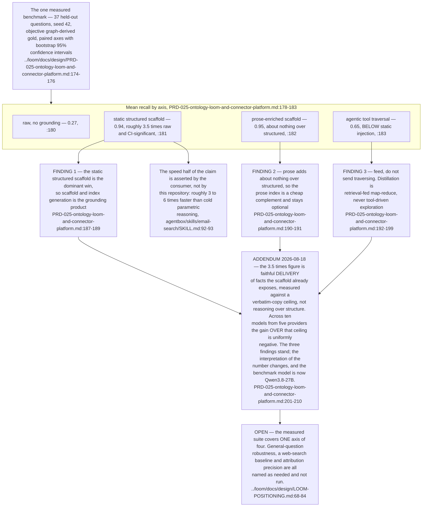
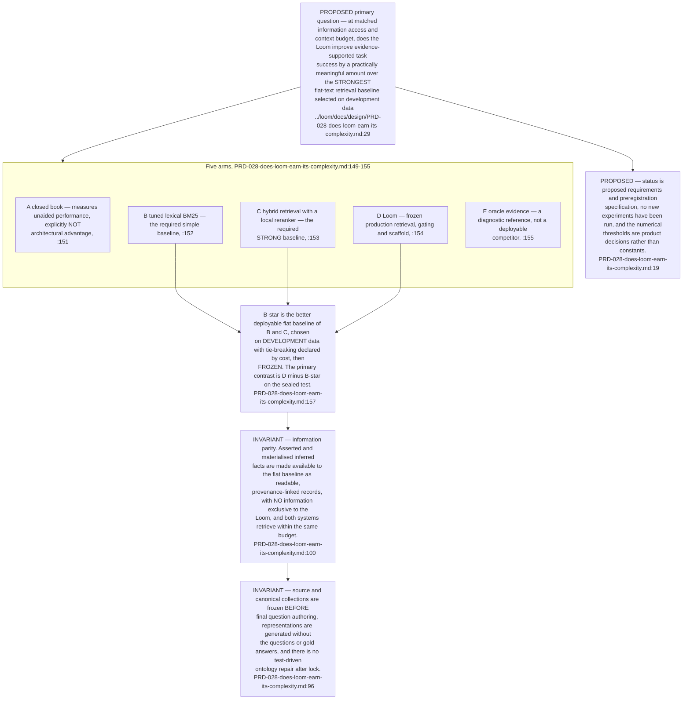
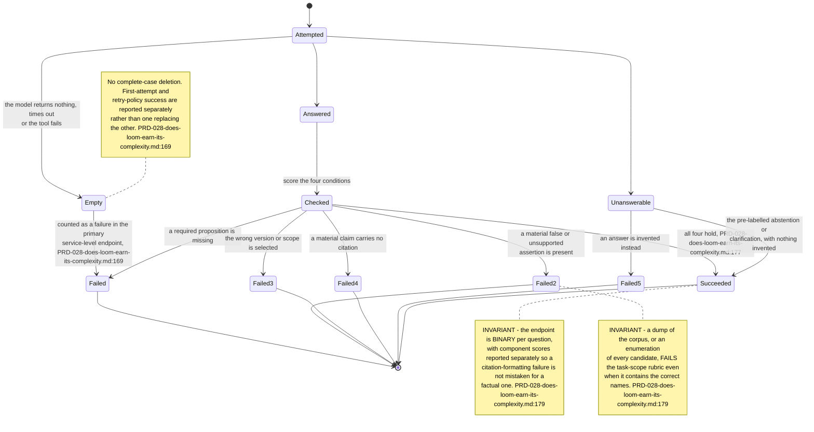
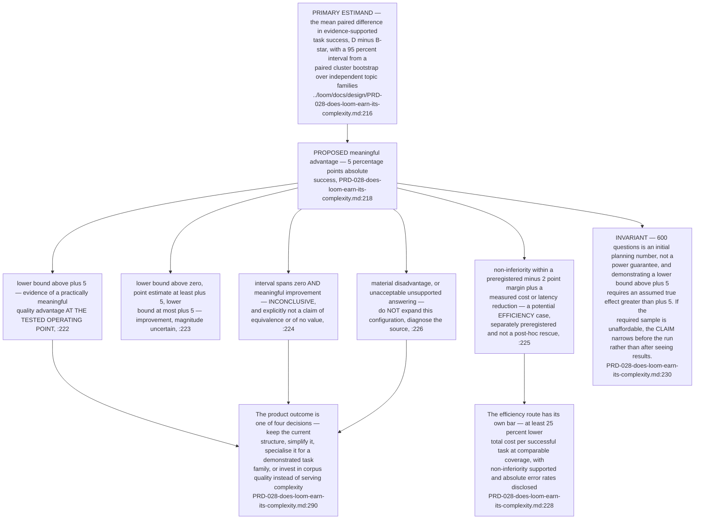
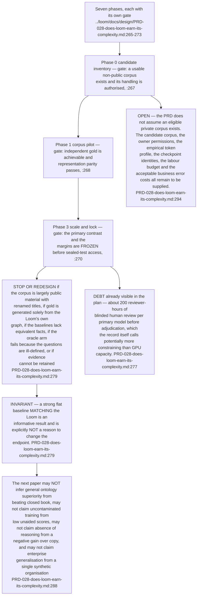
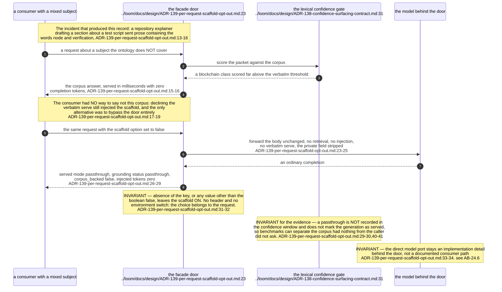
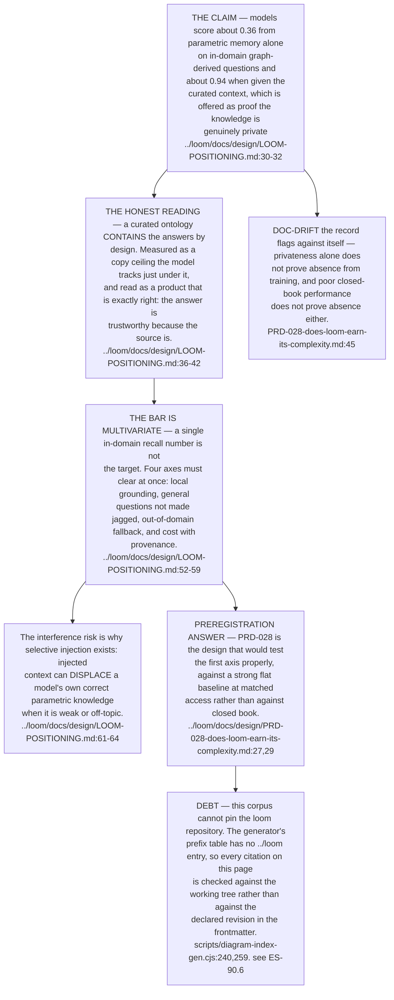

## For developers

PRD-028 is a preregistration, not a result. It fixes, in advance, what the Loom would have to
show to keep its structured serving path, and the conditions under which it would be judged not
to earn its complexity. Read the records before you read a benchmark number: the only measured
verdicts the estate holds are the three in PRD-025 §3.1, and the later addendum re-centres what
the headline figure means. Nothing in PRD-028 has been run.
The facade mechanics live in AB-24; this topic is about the evidence, not the wire.

## For the business

The Loom is the part of the estate that makes a local model answer accurately about our own
material. This topic records how we have agreed to find out whether that structure is worth its
cost, before we spend on it. The test is written down first, with the pass mark, the stopping
conditions and the honest ways it can fail, so the answer cannot be chosen after the fact.

## ES-12.1 What has been measured, and what the later reading changed

## ES-12.2 The preregistration — its question, and the arm it must beat

## ES-12.3 The endpoint — what counts as success, and what always fails

## ES-12.4 The decision table — every way the preregistration can end

## ES-12.5 The stop conditions, and the claims the next paper may not make

## ES-12.6 Why the facade can be told not to ground, and what that costs the evidence

## ES-12.7 The positioning claim the evaluation is built to test

