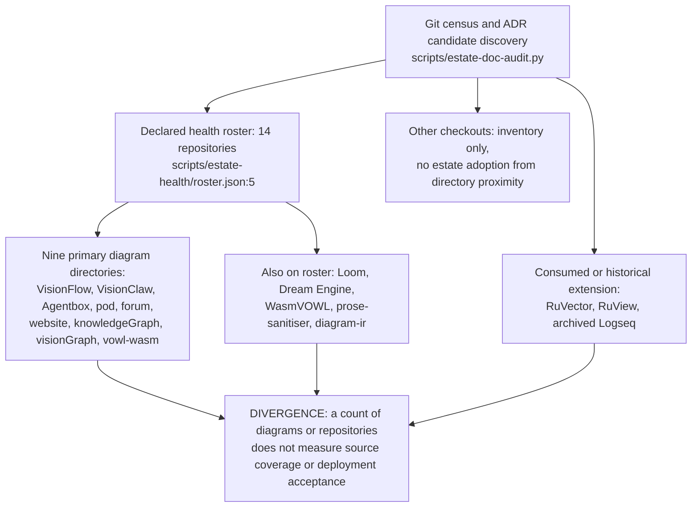
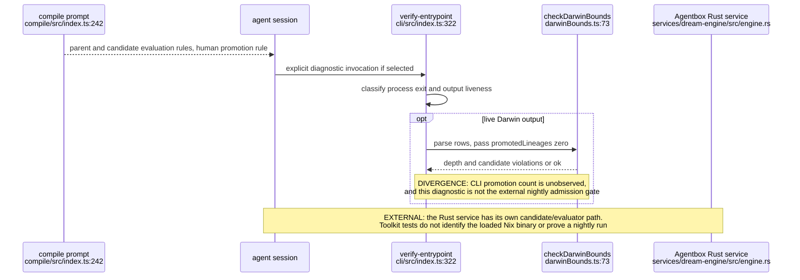
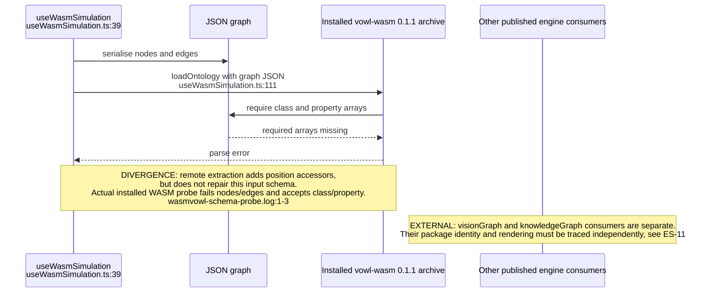
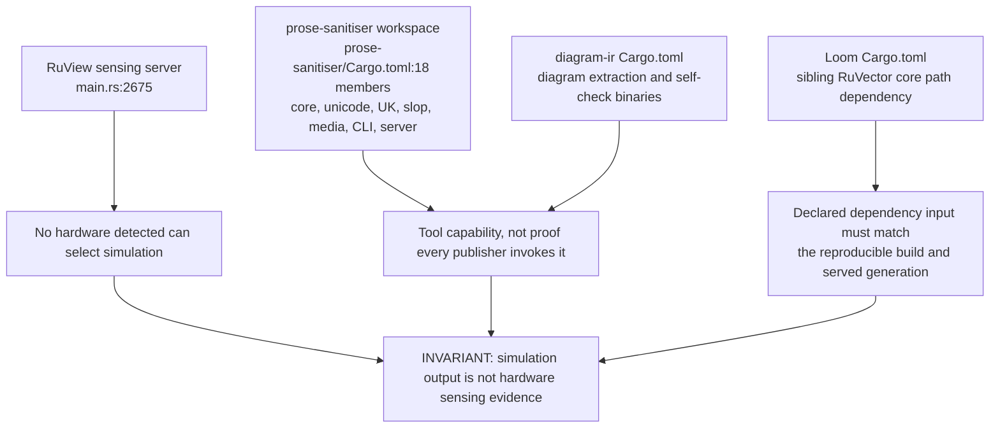
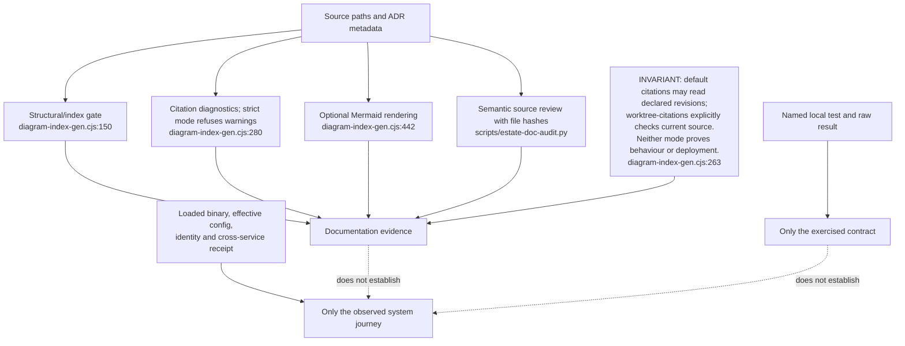
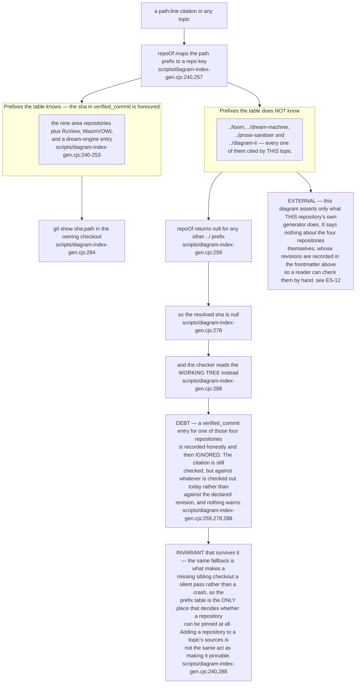

## ES-90.1 Three scopes — health roster, source review and workspace neighbours

## ES-90.2 Dream compiler, diagnostic and runtime are separate paths

## ES-90.3 WasmVOWL demo is a separate consumer from the published engine

## ES-90.4 Tool packages and sensing remain distinct acceptance surfaces

## ES-90.5 Evidence types do not imply one another

## ES-90.6 Which repositories the citation checker can actually pin, and which it cannot

