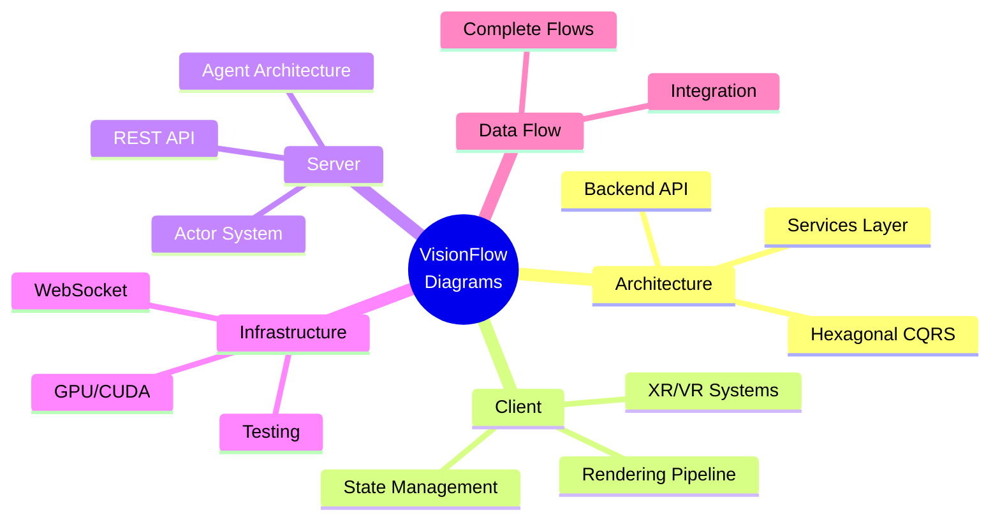

# Architecture Diagrams

Visual documentation of VisionFlow's system architecture, data flows, and component interactions.

## Overview

This section contains comprehensive **Mermaid diagrams** covering all aspects of VisionFlow's architecture. All diagrams use Mermaid for maintainability and version control.

## Categories

### Architecture Diagrams

System-level architecture visualizations.

| Diagram | Description |
|---------|-------------|
| [Backend API Architecture](./architecture/backend-api-architecture-complete.md) | Complete backend service architecture |
| [Hexagonal CQRS](./architecture/hexagonal-cqrs.md) | Core architectural pattern |

### Client Diagrams

Frontend and visualization documentation.

| Diagram | Description |
|---------|-------------|
| [Rendering Pipeline](./client/rendering/threejs-pipeline-complete.md) | Three.js visualization pipeline |
| [State Management](./client/state/state-management-complete.md) | Frontend state architecture |
| [XR Architecture](./client/xr/xr-architecture-complete.md) | VR/AR implementation details |

### Server Diagrams

Backend component documentation.

| Diagram | Description |
|---------|-------------|
| [Actor System](./server/actors/actor-system-complete.md) | Actor-based concurrency model |
| [Agent Architecture](./server/agents/agent-system-architecture.md) | Multi-agent orchestration |
| [REST API](./server/api/rest-api-architecture.md) | API endpoint structure |

### Infrastructure Diagrams

Deployment and operations documentation.

| Diagram | Description |
|---------|-------------|
| [GPU/CUDA Architecture](./infrastructure/gpu/cuda-architecture-complete.md) | GPU acceleration architecture |
| [WebSocket Protocol](./infrastructure/websocket/binary-protocol-complete.md) | Binary protocol specification |
| [Test Architecture](./infrastructure/testing/test-architecture.md) | Testing infrastructure |

### Data Flow Diagrams

System interaction documentation.

| Diagram | Description |
|---------|-------------|
| [Complete Data Flows](./data-flow/complete-data-flows.md) | End-to-end data flow documentation |

## Mermaid Library

Reusable diagram components and style guides.

| Document | Description |
|----------|-------------|
| [Style Guide](./mermaid-library/00-mermaid-style-guide.md) | Diagram styling standards |
| [System Architecture](./mermaid-library/01-system-architecture-overview.md) | High-level system diagrams |
| [Data Flow Diagrams](./mermaid-library/02-data-flow-diagrams.md) | Data flow templates |
| [Deployment Infrastructure](./mermaid-library/03-deployment-infrastructure.md) | Deployment diagrams |
| [Agent Orchestration](./mermaid-library/04-agent-orchestration.md) | Agent system diagrams |

## Diagram Standards

All diagrams in VisionFlow follow these standards:

1. **Format**: Mermaid.js (no ASCII diagrams)
2. **Theme**: Neutral theme for accessibility
3. **Sizing**: Max width containers for responsiveness
4. **Labels**: Clear, concise node labels
5. **Colors**: Consistent color coding by category

See the [Mermaid Style Guide](./mermaid-library/00-mermaid-style-guide.md) for detailed standards.
