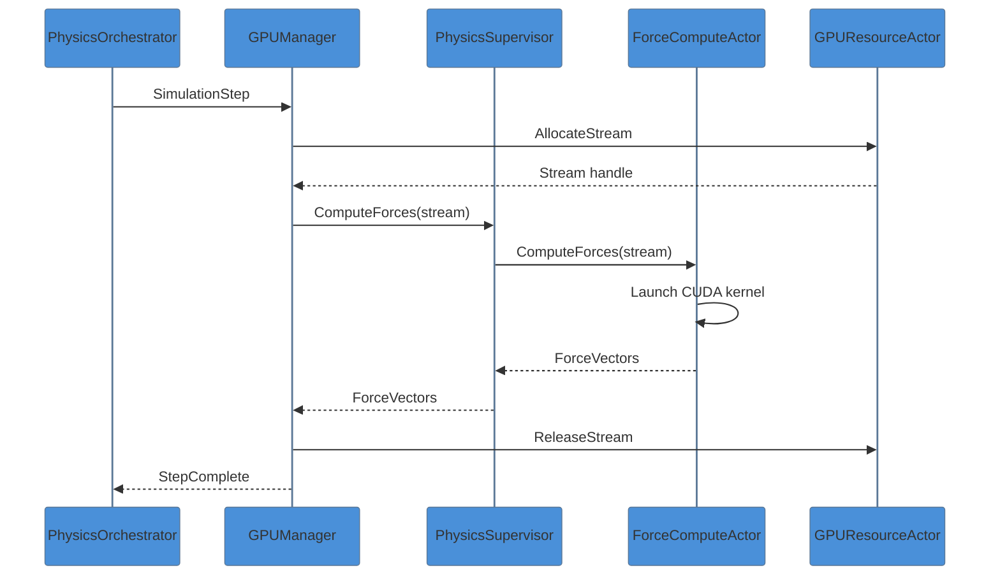
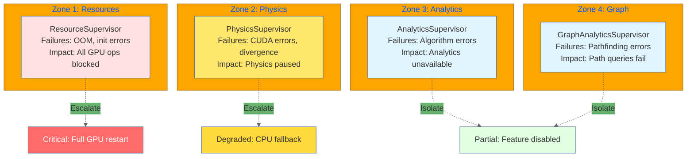

# GPU Supervisor Hierarchy

This document details the 4-supervisor pattern used by VisionFlow's GPU subsystem, replacing the flat hierarchy shown in older documentation.

## Overview

The GPU subsystem uses a hierarchical supervisor pattern where `GPUManagerActor` coordinates four specialized supervisors, each managing related GPU actors. This provides:
- Better fault isolation
- Grouped restart strategies
- Clear responsibility boundaries
- Efficient resource allocation

## Complete Hierarchy Diagram

```mermaid
%%{init: {'theme': 'base', 'themeVariables': {
  'primaryColor': '#4A90D9',
  'secondaryColor': '#67B26F',
  'tertiaryColor': '#FFA500',
  'primaryTextColor': '#333',
  'lineColor': '#666'
}}}%%
graph TB
    subgraph "GPU Manager (Coordinator)"
        GM[GPUManagerActor<br/>Coordinates all GPU subsystems<br/>Routes messages to supervisors]
    end

    subgraph "Resource Management"
        RS[ResourceSupervisor<br/>GPU initialization<br/>Timeout handling]
        RS --> GRA[GPUResourceActor<br/>Memory allocation<br/>Stream management]
    end

    subgraph "Physics Computation"
        PS[PhysicsSupervisor<br/>Force-directed layout<br/>Position updates]
        PS --> FCA[ForceComputeActor<br/>Barnes-Hut O(n log n)<br/>Verlet integration]
        PS --> SMA[StressMajorizationActor<br/>Layout optimization<br/>Energy minimization]
        PS --> CA[ConstraintActor<br/>Collision detection<br/>Hard constraints]
        PS --> OCA[OntologyConstraintActor<br/>OWL/RDF rules<br/>Semantic validation]
        PS --> SFA[SemanticForcesActor<br/>AI-driven forces<br/>Semantic clustering]
    end

    subgraph "Graph Analytics"
        AS[AnalyticsSupervisor<br/>Clustering & detection<br/>Centrality measures]
        AS --> CLA[ClusteringActor<br/>K-Means + Label Prop<br/>Community detection]
        AS --> ADA[AnomalyDetectionActor<br/>LOF + Z-Score<br/>Outlier identification]
        AS --> PRA[PageRankActor<br/>Centrality analysis<br/>Influence scoring]
    end

    subgraph "Path Analytics"
        GAS[GraphAnalyticsSupervisor<br/>Pathfinding<br/>Connectivity]
        GAS --> SPA[ShortestPathActor<br/>SSSP + APSP<br/>GPU Dijkstra/BFS]
        GAS --> CCA[ConnectedComponentsActor<br/>Union-Find<br/>Component labeling]
    end

    GM --> RS
    GM --> PS
    GM --> AS
    GM --> GAS

    style GM fill:#ff6b6b,color:#fff,stroke:#333,stroke-width:3px
    style RS fill:#ffe66d,stroke:#333
    style PS fill:#ffe66d,stroke:#333
    style AS fill:#ffe66d,stroke:#333
    style GAS fill:#ffe66d,stroke:#333
    style FCA fill:#e1ffe1,stroke:#333
    style SMA fill:#e1ffe1,stroke:#333
    style CA fill:#e1ffe1,stroke:#333
    style OCA fill:#e1ffe1,stroke:#333
    style SFA fill:#e1ffe1,stroke:#333
    style CLA fill:#e1ffe1,stroke:#333
    style ADA fill:#e1ffe1,stroke:#333
    style PRA fill:#e1ffe1,stroke:#333
    style SPA fill:#e1ffe1,stroke:#333
    style CCA fill:#e1ffe1,stroke:#333
    style GRA fill:#e1ffe1,stroke:#333
```

## Supervisor Details

### GPUManagerActor (Coordinator)

| Responsibility | Description |
|----------------|-------------|
| Message routing | Directs requests to appropriate supervisor |
| Resource coordination | Manages GPU memory budget across supervisors |
| Health monitoring | Aggregates health from all supervisors |
| Restart coordination | Handles cascading failures |

### ResourceSupervisor

| Child Actor | Kernels | Purpose |
|-------------|---------|---------|
| GPUResourceActor | N/A | Memory allocation, stream pool, cleanup |

**Fault Strategy**: Restart with exponential backoff, escalate after 3 failures

### PhysicsSupervisor

| Child Actor | Kernels | Purpose |
|-------------|---------|---------|
| ForceComputeActor | 37 | Force calculation, integration |
| StressMajorizationActor | 4 | Layout optimization |
| ConstraintActor | 5 | Collision detection |
| OntologyConstraintActor | 5 | OWL rule enforcement |
| SemanticForcesActor | 15 | AI clustering forces |

**Fault Strategy**: AllForOne restart (physics state is interdependent)

### AnalyticsSupervisor

| Child Actor | Kernels | Purpose |
|-------------|---------|---------|
| ClusteringActor | 12 | K-means, Louvain, label propagation |
| AnomalyDetectionActor | 4 | LOF, Z-score outliers |
| PageRankActor | 5 | Centrality scoring |

**Fault Strategy**: OneForOne restart (independent algorithms)

### GraphAnalyticsSupervisor

| Child Actor | Kernels | Purpose |
|-------------|---------|---------|
| ShortestPathActor | 4 | SSSP, APSP, landmarks |
| ConnectedComponentsActor | 3 | Union-find, component labeling |

**Fault Strategy**: OneForOne restart (independent algorithms)

## Message Flow



## Fault Isolation Zones



## Performance by Supervisor

| Supervisor | Actors | Total Kernels | Frame Budget | Typical Usage |
|------------|--------|---------------|--------------|---------------|
| ResourceSupervisor | 1 | 0 | N/A | Memory ops |
| PhysicsSupervisor | 5 | 66 | 8ms | Force computation |
| AnalyticsSupervisor | 3 | 21 | 4ms | On-demand |
| GraphAnalyticsSupervisor | 2 | 7 | 2ms | On-demand |
| **Total** | **11** | **87** (+ 7 utility) | **14ms** | - |

## Related Documentation

- [CUDA Architecture Complete](cuda-architecture-complete.md)
- [Actor System Complete](../../server/actors/actor-system-complete.md)
- [Physics Simulation Flow](../../data-flow/split/simulation-pipeline-flow.md)
