# WebSocket Binary Protocol - Complete System Documentation

## Table of Contents
1. [Protocol Versions](#protocol-versions)
2. [Message Type Hierarchy](#message-type-hierarchy)
3. [Binary Message Formats](#binary-message-formats)
4. [Frame Structure & Byte Layout](#frame-structure--byte-layout)
5. [Connection Lifecycle](#connection-lifecycle)
6. [Heartbeat & Keepalive](#heartbeat--keepalive)
7. [Multi-Client Broadcast](#multi-client-broadcast)
8. [Queue Management & Backpressure](#queue-management--backpressure)
9. [Data Flow Sequences](#data-flow-sequences)
10. [Error Handling & Recovery](#error-handling--recovery)

---

## Protocol Versions

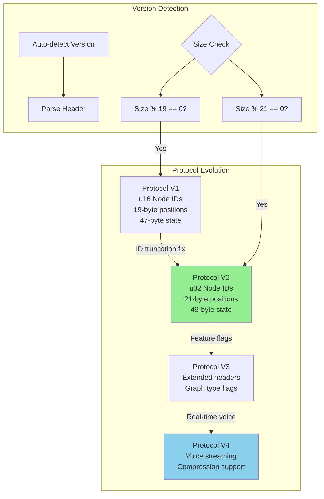
```mermaid
graph TB
    subgraph "Protocol Evolution"
        V1[Protocol V1<br/>u16 Node IDs<br/>19-byte positions<br/>47-byte state]
        V2[Protocol V2<br/>u32 Node IDs<br/>21-byte positions<br/>49-byte state]
        V3[Protocol V3<br/>Extended headers<br/>Graph type flags]
        V4[Protocol V4<br/>Voice streaming<br/>Compression support]

        V1 -->|ID truncation fix| V2
        V2 -->|Feature flags| V3
        V3 -->|Real-time voice| V4
    end

    subgraph "Version Detection"
        CHECK{Size Check}
        PARSE[Parse Header]
        V1_SIZE[Size % 19 == 0?]
        V2_SIZE[Size % 21 == 0?]
        AUTO[Auto-detect Version]

        CHECK --> V1_SIZE
        CHECK --> V2_SIZE
        V1_SIZE -->|Yes| V1
        V2_SIZE -->|Yes| V2
        AUTO --> PARSE
    end

    style V2 fill:#90EE90
    style V4 fill:#87CEEB
```

### Version Comparison Table

| Feature | V1 | V2 | V3 | V4 |
|---------|----|----|----|----|
| **Node ID Width** | 16-bit (u16) | 32-bit (u32) | 32-bit (u32) | 32-bit (u32) |
| **Max Node IDs** | 65,535 | 4,294,967,295 | 4,294,967,295 | 4,294,967,295 |
| **Position Update Size** | 19 bytes | 21 bytes | 21 bytes | 21 bytes |
| **Agent State Size** | 47 bytes | 49 bytes | 49 bytes | 49 bytes |
| **Graph Type Flags** | ❌ | ❌ | ✅ | ✅ |
| **Voice Streaming** | ❌ | ❌ | ❌ | ✅ |
| **Compression** | ❌ | ❌ | ✅ | ✅ |
| **Backward Compatible** | Legacy | ✅ | ✅ | ✅ |

---

## Message Type Hierarchy


```mermaid
graph TB
    ROOT[WebSocket Messages]

    ROOT --> CTRL[Control Messages<br/>0x30-0x3F]
    ROOT --> DATA[Data Messages<br/>0x01-0x0F]
    ROOT --> STREAM[Stream Messages<br/>0x10-0x2F]
    ROOT --> AGENT[Agent Messages<br/>0x20-0x2F]
    ROOT --> VOICE[Voice Messages<br/>0x40-0x4F]
    ROOT --> ERR[Error Messages<br/>0xFF]

    subgraph "Control 0x30-0x3F"
        CTRL --> CBITS[0x30: Control Bits]
        CTRL --> SSSP[0x31: SSSP Data]
        CTRL --> HAND[0x32: Handshake]
        CTRL --> HEART[0x33: Heartbeat]
    end

    subgraph "Data 0x01-0x0F"
        DATA --> GRAPH[0x01: Graph Update]
        DATA --> VDATA[0x02: Voice Data]
    end

    subgraph "Stream 0x10-0x1F"
        STREAM --> POS[0x10: Position Update]
        STREAM --> APOS[0x11: Agent Positions]
        STREAM --> VEL[0x12: Velocity Update]
    end

    subgraph "Agent 0x20-0x2F"
        AGENT --> FULL[0x20: Agent State Full]
        AGENT --> DELTA[0x21: Agent State Delta]
        AGENT --> HP[0x22: Agent Health]
    end

    subgraph "Voice 0x40-0x4F"
        VOICE --> VCHUNK[0x40: Voice Chunk]
        VOICE --> VSTART[0x41: Voice Start]
        VOICE --> VEND[0x42: Voice End]
    end

    style CTRL fill:#FFE4B5
    style DATA fill:#87CEEB
    style STREAM fill:#90EE90
    style AGENT fill:#DDA0DD
    style VOICE fill:#F0E68C
    style ERR fill:#FF6B6B
```

### Message Type Enum (TypeScript)

```typescript
enum MessageType {
  // Data Messages (0x01-0x0F)
  GRAPH_UPDATE = 0x01,      // Full graph data update
  VOICE_DATA = 0x02,        // Voice audio data

  // Stream Messages (0x10-0x1F)
  POSITION_UPDATE = 0x10,   // Node position changes
  AGENT_POSITIONS = 0x11,   // Multiple agent positions
  VELOCITY_UPDATE = 0x12,   // Velocity data

  // Agent Messages (0x20-0x2F)
  AGENT_STATE_FULL = 0x20,  // Complete agent state
  AGENT_STATE_DELTA = 0x21, // Incremental updates
  AGENT_HEALTH = 0x22,      // Health metrics only

  // Control Messages (0x30-0x3F)
  CONTROL_BITS = 0x30,      // Client control flags
  SSSP_DATA = 0x31,         // Shortest path data
  HANDSHAKE = 0x32,         // Connection handshake
  HEARTBEAT = 0x33,         // Keepalive ping

  // Voice Messages (0x40-0x4F)
  VOICE_CHUNK = 0x40,       // Audio chunk
  VOICE_START = 0x41,       // Stream start
  VOICE_END = 0x42,         // Stream end

  // Error Messages (0xFF)
  ERROR = 0xFF              // Error frame
}
```

---

## Binary Message Formats

### 1. Message Header (All Messages)

```
┌─────────────────────────────────────────────────┐
│              MESSAGE HEADER (4 bytes)           │
├─────────┬──────────┬────────────────────────────┤
│  Byte 0 │  Byte 1  │        Bytes 2-3          │
│  Type   │ Version  │     Payload Length        │
│ (u8)    │  (u8)    │       (u16 LE)            │
└─────────┴──────────┴────────────────────────────┘
```

**Byte Layout:**
- **Byte 0**: Message Type (MessageType enum)
- **Byte 1**: Protocol Version (1=V1, 2=V2, etc.)
- **Bytes 2-3**: Payload length in bytes (little-endian u16)

### 2. Graph Update Header (Extended, 5 bytes)

```
┌──────────────────────────────────────────────────────────┐
│          GRAPH UPDATE HEADER (5 bytes)                   │
├─────────┬──────────┬────────────────────┬────────────────┤
│  Byte 0 │  Byte 1  │     Bytes 2-3     │    Byte 4     │
│  0x01   │ Version  │  Payload Length   │  Graph Type   │
│         │          │     (u16 LE)      │     Flag      │
└─────────┴──────────┴───────────────────┴────────────────┘
```

**Graph Type Flags:**
- `0x01`: Knowledge Graph
- `0x02`: Ontology Graph

### 3. Position Update (V2, 21 bytes per node)

```
┌──────────────────────────────────────────────────────────────────┐
│                 POSITION UPDATE V2 (21 bytes)                    │
├──────────┬─────────────────────────────┬──────────────┬─────────┤
│ Bytes 0-3│       Bytes 4-15           │  Bytes 16-19 │ Byte 20 │
│ Node ID  │    Position (x,y,z)        │  Timestamp   │  Flags  │
│ (u32 LE) │  3 × f32 LE (12 bytes)     │   (u32 LE)   │  (u8)   │
└──────────┴─────────────────────────────┴──────────────┴─────────┘

Position Detail (12 bytes):
┌──────────┬──────────┬──────────┐
│  X (f32) │  Y (f32) │  Z (f32) │
│ Bytes 4-7│ Bytes 8-11│Bytes12-15│
└──────────┴──────────┴──────────┘
```

**Fields:**
- **Node ID** (4 bytes): Unique node identifier (u32)
- **Position** (12 bytes): 3D coordinates (3 × f32)
- **Timestamp** (4 bytes): Unix timestamp in ms (u32)
- **Flags** (1 byte): State flags (AgentStateFlags)

### 4. Agent State Full (V2, 49 bytes per agent)

```
┌─────────────────────────────────────────────────────────────────────┐
│                   AGENT STATE FULL V2 (49 bytes)                    │
├──────────┬─────────────┬─────────────┬────────────────────┬────────┤
│ Bytes 0-3│  Bytes 4-15 │ Bytes 16-27 │    Bytes 28-47    │ Byte 48│
│ Agent ID │  Position   │  Velocity   │   Metrics (20b)   │ Flags  │
│ (u32 LE) │ 3×f32 (12b) │ 3×f32 (12b) │    5×f32 (20b)    │  (u8)  │
└──────────┴─────────────┴─────────────┴────────────────────┴────────┘

Metrics Detail (20 bytes):
┌──────────┬──────────┬──────────┬──────────┬──────────┐
│  Health  │   CPU    │  Memory  │ Workload │  Tokens  │
│ (f32 4b) │(f32 4b)  │(f32 4b)  │(f32 4b)  │(u32 4b)  │
│ Bytes28-31│Bytes32-35│Bytes36-39│Bytes40-43│Bytes44-47│
└──────────┴──────────┴──────────┴──────────┴──────────┘
```

**Fields:**
- **Agent ID** (4 bytes): u32 unique identifier
- **Position** (12 bytes): 3D position (x, y, z)
- **Velocity** (12 bytes): 3D velocity (vx, vy, vz)
- **Health** (4 bytes): f32 health percentage (0.0-100.0)
- **CPU Usage** (4 bytes): f32 percentage (0.0-100.0)
- **Memory Usage** (4 bytes): f32 percentage (0.0-100.0)
- **Workload** (4 bytes): f32 current load (0.0-100.0)
- **Tokens** (4 bytes): u32 token count
- **Flags** (1 byte): AgentStateFlags bitfield

### 5. SSSP Data (V2, 12 bytes per node)

```
┌────────────────────────────────────────────────────────┐
│              SSSP DATA V2 (12 bytes)                   │
├──────────┬──────────┬──────────┬──────────────────────┤
│ Bytes 0-1│ Bytes 2-5│ Bytes 6-7│      Bytes 8-9      │
│ Node ID  │ Distance │ Parent   │       Flags         │
│ (u16 LE) │ (f32 LE) │ (u16 LE) │      (u16 LE)       │
└──────────┴──────────┴──────────┴──────────────────────┘
```

**Fields:**
- **Node ID** (2 bytes): u16 node identifier
- **Distance** (4 bytes): f32 shortest path distance
- **Parent ID** (2 bytes): u16 parent node in path
- **Flags** (2 bytes): u16 algorithm flags

### 6. Voice Chunk (Variable length)

```
┌─────────────────────────────────────────────────────────────┐
│              VOICE CHUNK (7 + N bytes)                      │
├──────────┬──────────┬──────┬──────────┬───────────────────┤
│ Bytes 0-1│ Bytes 2-3│Byte 4│ Bytes 5-6│    Bytes 7+      │
│ Agent ID │ Chunk ID │Format│Data Len  │   Audio Data     │
│ (u16 LE) │ (u16 LE) │ (u8) │ (u16 LE) │  (N bytes raw)   │
└──────────┴──────────┴──────┴──────────┴───────────────────┘
```

**Fields:**
- **Agent ID** (2 bytes): u16 speaking agent
- **Chunk ID** (2 bytes): u16 sequence number
- **Format** (1 byte): u8 audio format (0=PCM, 1=Opus, etc.)
- **Data Length** (2 bytes): u16 audio data size
- **Audio Data** (N bytes): Raw audio bytes

### 7. Control Bits (1 byte payload)

```
┌────────────────────────────────────┐
│      CONTROL BITS (1 byte)         │
├─────────────────────────────────────┤
│ Bit │ Flag                         │
├─────┼──────────────────────────────┤
│  0  │ PAUSE_UPDATES               │
│  1  │ HIGH_FREQUENCY              │
│  2  │ LOW_BANDWIDTH               │
│  3  │ VOICE_ENABLED               │
│  4  │ DEBUG_MODE                  │
│  5  │ FORCE_FULL_UPDATE           │
│  6  │ USER_INTERACTING            │
│  7  │ BACKGROUND_MODE             │
└─────┴──────────────────────────────┘
```

**Control Flags:**
```typescript
enum ControlFlags {
  PAUSE_UPDATES = 1 << 0,      // 0x01
  HIGH_FREQUENCY = 1 << 1,     // 0x02
  LOW_BANDWIDTH = 1 << 2,      // 0x04
  VOICE_ENABLED = 1 << 3,      // 0x08
  DEBUG_MODE = 1 << 4,         // 0x10
  FORCE_FULL_UPDATE = 1 << 5,  // 0x20
  USER_INTERACTING = 1 << 6,   // 0x40
  BACKGROUND_MODE = 1 << 7     // 0x80
}
```

### 8. Agent State Flags (1 byte bitfield)

```
┌────────────────────────────────────┐
│    AGENT STATE FLAGS (1 byte)      │
├─────────────────────────────────────┤
│ Bit │ Flag                         │
├─────┼──────────────────────────────┤
│  0  │ ACTIVE                      │
│  1  │ IDLE                        │
│  2  │ ERROR                       │
│  3  │ VOICE_ACTIVE                │
│  4  │ HIGH_PRIORITY               │
│  5  │ POSITION_CHANGED            │
│  6  │ METADATA_CHANGED            │
│  7  │ RESERVED                    │
└─────┴──────────────────────────────┘
```

---

## Frame Structure & Byte Layout

### Complete Binary Frame Structure

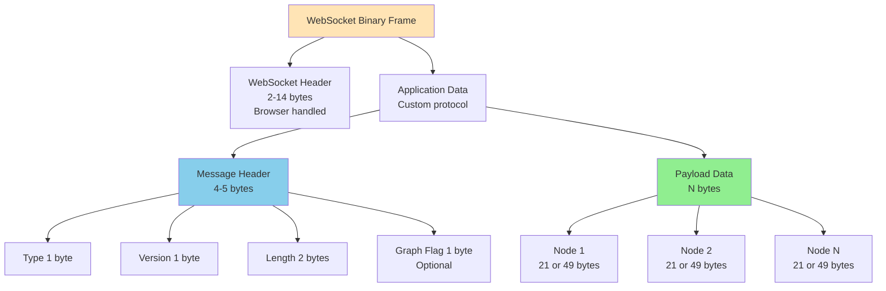
```mermaid
graph TB
    FRAME[WebSocket Binary Frame]

    FRAME --> WSHEADER[WebSocket Header<br/>2-14 bytes<br/>Browser handled]
    FRAME --> APPDATA[Application Data<br/>Custom protocol]

    APPDATA --> MSGHEADER[Message Header<br/>4-5 bytes]
    APPDATA --> PAYLOAD[Payload Data<br/>N bytes]

    MSGHEADER --> TYPE[Type 1 byte]
    MSGHEADER --> VER[Version 1 byte]
    MSGHEADER --> LEN[Length 2 bytes]
    MSGHEADER --> FLAG[Graph Flag 1 byte<br/>Optional]

    PAYLOAD --> NODE1[Node 1<br/>21 or 49 bytes]
    PAYLOAD --> NODE2[Node 2<br/>21 or 49 bytes]
    PAYLOAD --> NODEN[Node N<br/>21 or 49 bytes]

    style FRAME fill:#FFE4B5
    style MSGHEADER fill:#87CEEB
    style PAYLOAD fill:#90EE90
```

### Byte-Level Example: Position Update

```
Real Binary Example (Position Update for 2 nodes):

WebSocket Frame:
┌─────────┬─────────────────────────────────────────────────┐
│ WS Hdr  │           Application Payload (46 bytes)        │
└─────────┴─────────────────────────────────────────────────┘

Application Payload Breakdown:
┌────────────────────┬────────────────────────────────────────┐
│  Message Header(4) │         Payload (42 bytes)             │
├─────┬──────┬───────┼────────────────────┬───────────────────┤
│Type │ Ver  │ Len   │   Node 1 (21b)    │   Node 2 (21b)   │
│0x10 │ 0x02 │0x002A │                    │                   │
└─────┴──────┴───────┴────────────────────┴───────────────────┘

Hex Dump (46 bytes total):
00000000: 10 02 2A 00 │ 64 00 00 00 │ 00 00 80 3F │ 00 00 00 40
00000010: 00 00 40 40 │ E8 03 00 00 │ 01       │ C8 00 00 00
00000020: 00 00 A0 40 │ 00 00 C0 40 │ 00 00 E0 40 │ F4 01 00 00
00000030: 02

Decoded:
- Header: Type=0x10 (POSITION_UPDATE), Ver=0x02, Len=0x002A (42 bytes)
- Node 1: ID=100, Pos=(1.0,2.0,3.0), Time=1000, Flags=0x01
- Node 2: ID=200, Pos=(5.0,6.0,7.0), Time=500, Flags=0x02
```

### Client Binary Data Format (28 bytes)

```rust
// Rust server-side structure
#[repr(C)]
struct BinaryNodeDataClient {
    node_id: u32,   // 4 bytes
    x: f32,         // 4 bytes
    y: f32,         // 4 bytes
    z: f32,         // 4 bytes
    vx: f32,        // 4 bytes
    vy: f32,        // 4 bytes
    vz: f32,        // 4 bytes
}
// Total: 28 bytes (optimized for network)
```

### GPU Compute Format (48 bytes)

```rust
// Server-only extended format
#[repr(C)]
struct BinaryNodeDataGPU {
    node_id: u32,       // 4 bytes
    x: f32,             // 4 bytes
    y: f32,             // 4 bytes
    z: f32,             // 4 bytes
    vx: f32,            // 4 bytes
    vy: f32,            // 4 bytes
    vz: f32,            // 4 bytes
    sssp_distance: f32, // 4 bytes
    sssp_parent: i32,   // 4 bytes
    cluster_id: i32,    // 4 bytes
    centrality: f32,    // 4 bytes
    mass: f32,          // 4 bytes
}
// Total: 48 bytes (server GPU computations)
```

---

## Connection Lifecycle

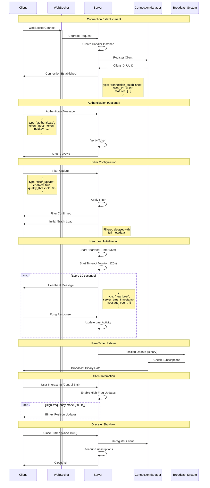
```mermaid
sequenceDiagram
    participant C as Client
    participant WS as WebSocket
    participant S as Server
    participant CM as ConnectionManager
    participant BC as Broadcast System

    Note over C,BC: Connection Establishment
    C->>WS: WebSocket Connect
    activate WS
    WS->>S: Upgrade Request
    S->>S: Create Handler Instance
    S->>CM: Register Client
    CM-->>S: Client ID: UUID
    S->>C: Connection Established
    Note right of S: {<br/>  type: "connection_established",<br/>  client_id: "uuid",<br/>  features: [...]<br/>}

    Note over C,BC: Authentication (Optional)
    C->>S: Authenticate Message
    Note right of C: {<br/>  type: "authenticate",<br/>  token: "nostr_token",<br/>  pubkey: "..."<br/>}
    S->>S: Verify Token
    S->>C: Auth Success

    Note over C,BC: Filter Configuration
    C->>S: Filter Update
    Note right of C: {<br/>  type: "filter_update",<br/>  enabled: true,<br/>  quality_threshold: 0.5<br/>}
    S->>S: Apply Filter
    S->>C: Filter Confirmed
    S->>C: Initial Graph Load
    Note right of S: Filtered dataset with<br/>full metadata

    Note over C,BC: Heartbeat Initialization
    S->>S: Start Heartbeat Timer (30s)
    S->>S: Start Timeout Monitor (120s)

    loop Every 30 seconds
        S->>C: Heartbeat Message
        Note right of S: {<br/>  type: "heartbeat",<br/>  server_time: timestamp,<br/>  message_count: N<br/>}
        C->>S: Pong Response
        S->>S: Update Last Activity
    end

    Note over C,BC: Real-Time Updates
    S->>BC: Position Update (Binary)
    BC->>CM: Check Subscriptions
    CM->>C: Broadcast Binary Data

    Note over C,BC: Client Interaction
    C->>S: User Interacting (Control Bits)
    S->>S: Enable High-Freq Updates
    loop High-frequency mode (60 Hz)
        S->>C: Binary Position Updates
    end

    Note over C,BC: Graceful Shutdown
    C->>S: Close Frame (Code 1000)
    S->>CM: Unregister Client
    S->>S: Cleanup Subscriptions
    S->>C: Close Ack
    deactivate WS
```

### Connection States

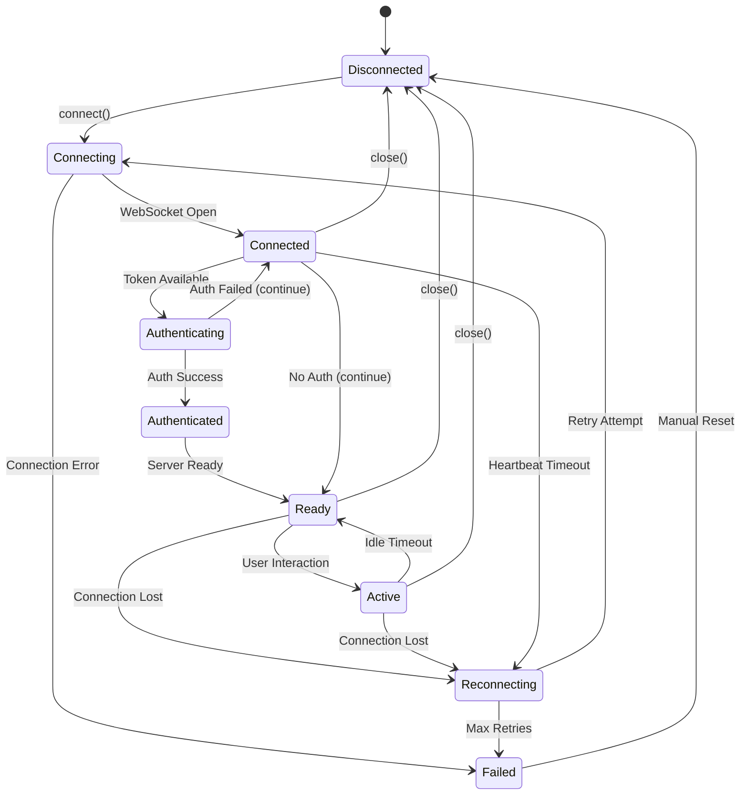
```mermaid
stateDiagram-v2
    [*] --> Disconnected
    Disconnected --> Connecting: connect()
    Connecting --> Connected: WebSocket Open
    Connecting --> Failed: Connection Error

    Connected --> Authenticating: Token Available
    Authenticating --> Authenticated: Auth Success
    Authenticating --> Connected: Auth Failed (continue)

    Authenticated --> Ready: Server Ready
    Connected --> Ready: No Auth (continue)

    Ready --> Active: User Interaction
    Active --> Ready: Idle Timeout

    Ready --> Reconnecting: Connection Lost
    Active --> Reconnecting: Connection Lost
    Connected --> Reconnecting: Heartbeat Timeout

    Reconnecting --> Connecting: Retry Attempt
    Reconnecting --> Failed: Max Retries

    Failed --> Disconnected: Manual Reset
    Active --> Disconnected: close()
    Ready --> Disconnected: close()
    Connected --> Disconnected: close()
```

---

## Heartbeat & Keepalive

```mermaid
sequenceDiagram
    participant C as Client
    participant S as Server
    participant T as Timers

    Note over C,S,T: Heartbeat System (30s interval)

    S->>T: Start Heartbeat Timer
    T-->>S: Trigger (every 30s)

    loop Every 30 seconds
        S->>C: Binary Heartbeat (0x33)
        Note right of S: MessageType::HEARTBEAT<br/>+ timestamp

        alt Client Responds (Normal)
            C->>S: Pong / Binary Ack
            S->>S: Update last_heartbeat
            Note right of S: Reset timeout counter
        else Client Silent (Warning)
            Note over S: Check elapsed time
            S->>S: Time > 60s?
            Note right of S: Yellow alert zone
        else Client Dead (Timeout)
            Note over S: Time > 120s
            S->>S: Close Connection (Code 4000)
            Note right of S: "Heartbeat timeout"
            S->>C: WebSocket Close Frame
        end
    end

    Note over C,S,T: Client-Side Ping/Pong

    loop Client can also ping
        C->>S: Ping (text "ping" or WS Ping)
        S->>C: Pong (text "pong" or WS Pong)
    end

    Note over C,S,T: Heartbeat Configuration

    rect rgb(255, 240, 200)
        Note right of S: HeartbeatConfig::default()<br/>- ping_interval: 30s<br/>- timeout: 120s
        Note right of S: HeartbeatConfig::fast()<br/>- ping_interval: 2s<br/>- timeout: 10s
        Note right of S: HeartbeatConfig::slow()<br/>- ping_interval: 15s<br/>- timeout: 60s
    end
```

### Heartbeat Constants (Rust Server)

```rust
// src/utils/socket_flow_constants.rs
pub const HEARTBEAT_INTERVAL: u64 = 30;     // seconds
pub const CLIENT_TIMEOUT: u64 = 60;         // seconds
pub const MAX_CLIENT_TIMEOUT: u64 = 3600;   // 1 hour max
```

### Heartbeat Message Format

```typescript
// Client receives
interface HeartbeatMessage {
  type: "heartbeat";
  server_time: number;          // Unix timestamp (ms)
  client_id: string;            // UUID
  message_count: number;        // Messages sent
  bytes_sent: number;           // Total bytes sent
  bytes_received: number;       // Total bytes received
  active_subscriptions: number; // Number of active subs
  uptime: number;               // Connection uptime (seconds)
}
```

---

## Multi-Client Broadcast Architecture

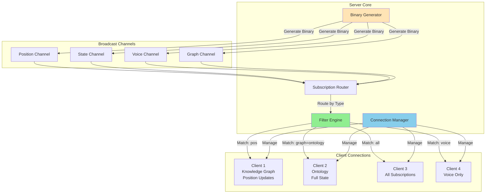
```mermaid
graph TB
    subgraph "Server Core"
        BG[Binary Generator]
        CM[Connection Manager]
        SUB[Subscription Router]
        FILTER[Filter Engine]
    end

    subgraph "Broadcast Channels"
        CH_POS[Position Channel]
        CH_STATE[State Channel]
        CH_VOICE[Voice Channel]
        CH_GRAPH[Graph Channel]
    end

    subgraph "Client Connections"
        C1[Client 1<br/>Knowledge Graph<br/>Position Updates]
        C2[Client 2<br/>Ontology<br/>Full State]
        C3[Client 3<br/>All Subscriptions]
        C4[Client 4<br/>Voice Only]
    end

    BG -->|Generate Binary| CH_POS
    BG -->|Generate Binary| CH_STATE
    BG -->|Generate Binary| CH_VOICE
    BG -->|Generate Binary| CH_GRAPH

    CH_POS --> SUB
    CH_STATE --> SUB
    CH_VOICE --> SUB
    CH_GRAPH --> SUB

    SUB -->|Route by Type| FILTER

    FILTER -->|Match: pos| C1
    FILTER -->|Match: graph=ontology| C2
    FILTER -->|Match: all| C3
    FILTER -->|Match: voice| C4

    CM -->|Manage| C1
    CM -->|Manage| C2
    CM -->|Manage| C3
    CM -->|Manage| C4

    style BG fill:#FFE4B5
    style CM fill:#87CEEB
    style FILTER fill:#90EE90
```

### Connection Manager Implementation

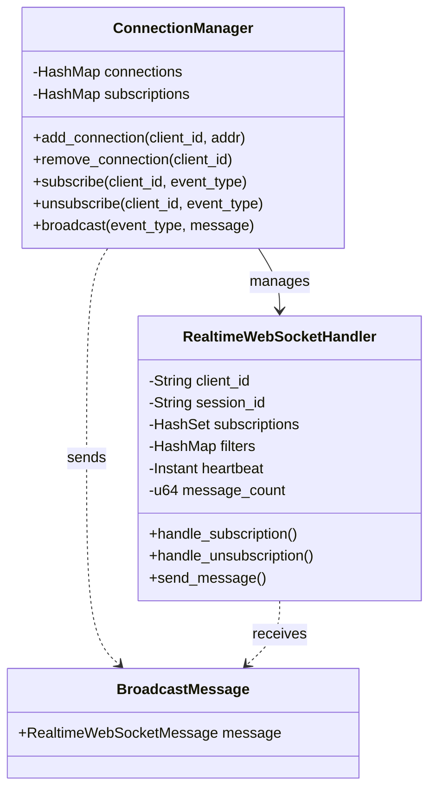
```mermaid
classDiagram
    class ConnectionManager {
        -HashMap connections
        -HashMap subscriptions
        +add_connection(client_id, addr)
        +remove_connection(client_id)
        +subscribe(client_id, event_type)
        +unsubscribe(client_id, event_type)
        +broadcast(event_type, message)
    }

    class RealtimeWebSocketHandler {
        -String client_id
        -String session_id
        -HashSet subscriptions
        -HashMap filters
        -Instant heartbeat
        -u64 message_count
        +handle_subscription()
        +handle_unsubscription()
        +send_message()
    }

    class BroadcastMessage {
        +RealtimeWebSocketMessage message
    }

    ConnectionManager --> RealtimeWebSocketHandler: manages
    ConnectionManager ..> BroadcastMessage: sends
    RealtimeWebSocketHandler ..> BroadcastMessage: receives
```

### Broadcast Flow

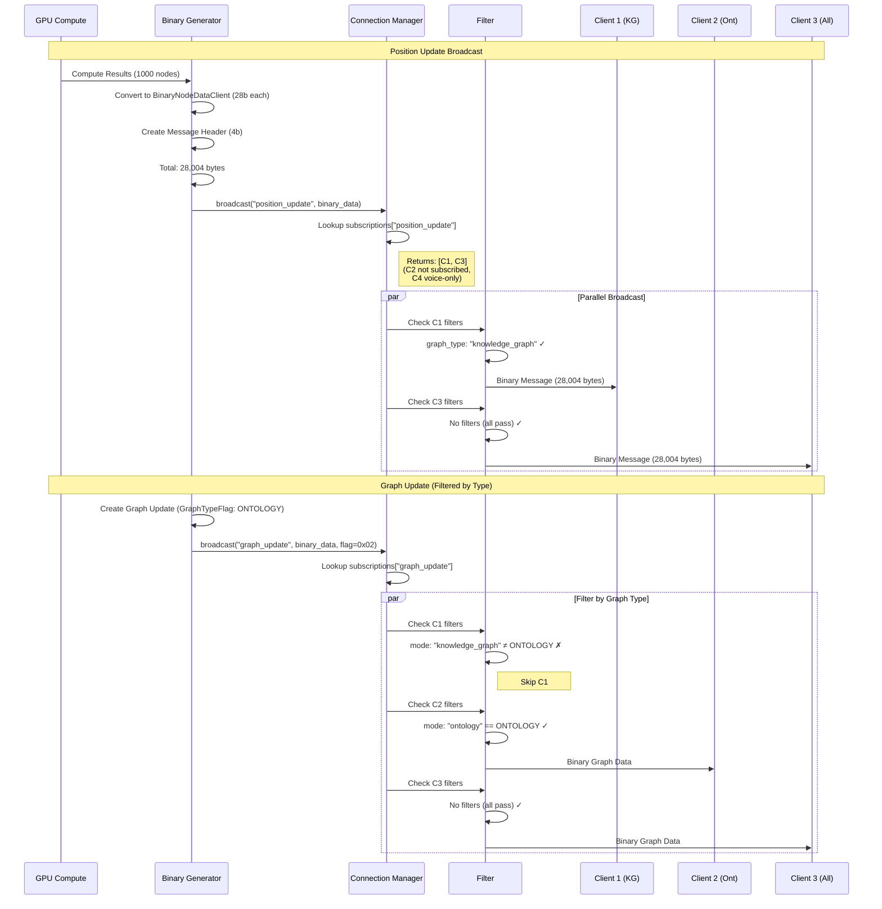
```mermaid
sequenceDiagram
    participant GPU as GPU Compute
    participant BG as Binary Generator
    participant CM as Connection Manager
    participant F as Filter
    participant C1 as Client 1 (KG)
    participant C2 as Client 2 (Ont)
    participant C3 as Client 3 (All)

    Note over GPU,C3: Position Update Broadcast

    GPU->>BG: Compute Results (1000 nodes)
    BG->>BG: Convert to BinaryNodeDataClient (28b each)
    BG->>BG: Create Message Header (4b)
    BG->>BG: Total: 28,004 bytes

    BG->>CM: broadcast("position_update", binary_data)

    CM->>CM: Lookup subscriptions["position_update"]
    Note right of CM: Returns: [C1, C3]<br/>(C2 not subscribed,<br/>C4 voice-only)

    par Parallel Broadcast
        CM->>F: Check C1 filters
        F->>F: graph_type: "knowledge_graph" ✓
        F->>C1: Binary Message (28,004 bytes)

        CM->>F: Check C3 filters
        F->>F: No filters (all pass) ✓
        F->>C3: Binary Message (28,004 bytes)
    end

    Note over GPU,C3: Graph Update (Filtered by Type)

    BG->>BG: Create Graph Update (GraphTypeFlag: ONTOLOGY)
    BG->>CM: broadcast("graph_update", binary_data, flag=0x02)

    CM->>CM: Lookup subscriptions["graph_update"]

    par Filter by Graph Type
        CM->>F: Check C1 filters
        F->>F: mode: "knowledge_graph" ≠ ONTOLOGY ✗
        Note right of F: Skip C1

        CM->>F: Check C2 filters
        F->>F: mode: "ontology" == ONTOLOGY ✓
        F->>C2: Binary Graph Data

        CM->>F: Check C3 filters
        F->>F: No filters (all pass) ✓
        F->>C3: Binary Graph Data
    end
```

---

## Queue Management & Backpressure

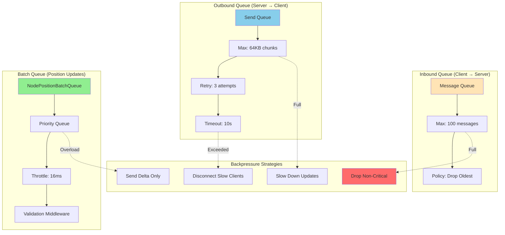
```mermaid
graph TB
    subgraph "Inbound Queue (Client → Server)"
        IQ[Message Queue]
        IQ_SIZE[Max: 100 messages]
        IQ_POLICY[Policy: Drop Oldest]

        IQ --> IQ_SIZE
        IQ_SIZE --> IQ_POLICY
    end

    subgraph "Outbound Queue (Server → Client)"
        OQ[Send Queue]
        OQ_SIZE[Max: 64KB chunks]
        OQ_RETRY[Retry: 3 attempts]
        OQ_TIMEOUT[Timeout: 10s]

        OQ --> OQ_SIZE
        OQ_SIZE --> OQ_RETRY
        OQ_RETRY --> OQ_TIMEOUT
    end

    subgraph "Batch Queue (Position Updates)"
        BQ[NodePositionBatchQueue]
        BQ_PRIORITY[Priority Queue]
        BQ_THROTTLE[Throttle: 16ms]
        BQ_VALIDATE[Validation Middleware]

        BQ --> BQ_PRIORITY
        BQ_PRIORITY --> BQ_THROTTLE
        BQ_THROTTLE --> BQ_VALIDATE
    end

    subgraph "Backpressure Strategies"
        BP_DROP[Drop Non-Critical]
        BP_SLOW[Slow Down Updates]
        BP_DELTA[Send Delta Only]
        BP_DISCONNECT[Disconnect Slow Clients]
    end

    IQ_SIZE -.->|Full| BP_DROP
    OQ_SIZE -.->|Full| BP_SLOW
    BQ_PRIORITY -.->|Overload| BP_DELTA
    OQ_TIMEOUT -.->|Exceeded| BP_DISCONNECT

    style IQ fill:#FFE4B5
    style OQ fill:#87CEEB
    style BQ fill:#90EE90
    style BP_DROP fill:#FF6B6B
```

### Queue Implementation Details

```typescript
// Client-side queue management
class WebSocketService {
  private messageQueue: QueuedMessage[] = [];
  private maxQueueSize: number = 100;
  private positionBatchQueue: NodePositionBatchQueue;

  queueMessage(type: 'text' | 'binary', data: string | ArrayBuffer) {
    if (this.messageQueue.length >= this.maxQueueSize) {
      // Drop oldest message
      const removed = this.messageQueue.shift();
      logger.warn('Message queue full, removed oldest message');
    }

    this.messageQueue.push({
      type,
      data,
      timestamp: Date.now(),
      retries: 0
    });
  }

  async processMessageQueue() {
    const messagesToProcess = [...this.messageQueue];
    this.messageQueue = [];

    for (const msg of messagesToProcess) {
      try {
        this.socket.send(msg.data);
      } catch (error) {
        msg.retries++;
        if (msg.retries < 3) {
          this.messageQueue.push(msg);
        } else {
          logger.error('Dropped message after 3 retries');
        }
      }
    }
  }
}
```

### Batch Queue with Priority

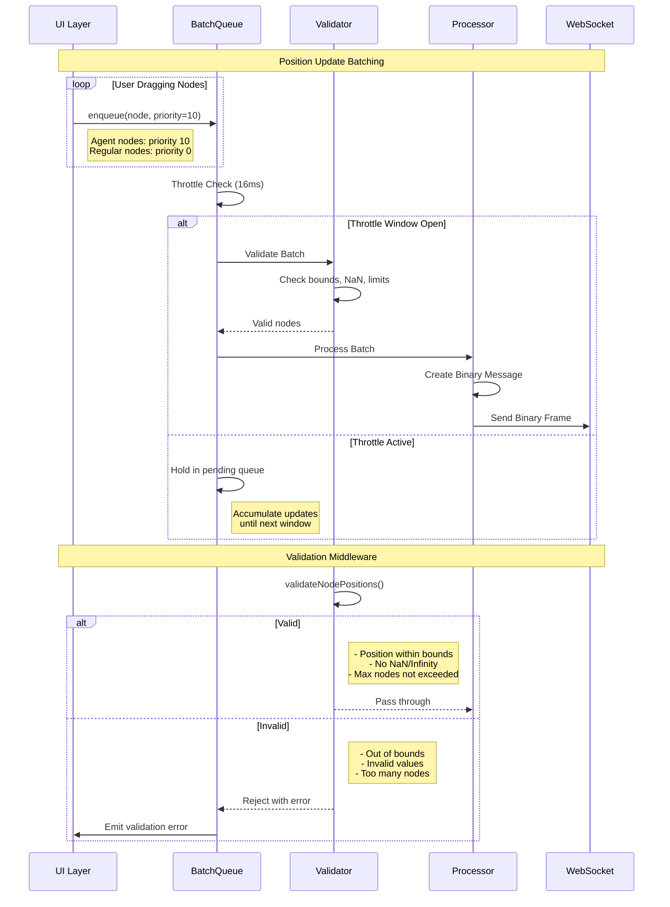
```mermaid
sequenceDiagram
    participant UI as UI Layer
    participant Q as BatchQueue
    participant V as Validator
    participant P as Processor
    participant WS as WebSocket

    Note over UI,WS: Position Update Batching

    loop User Dragging Nodes
        UI->>Q: enqueue(node, priority=10)
        Note right of UI: Agent nodes: priority 10<br/>Regular nodes: priority 0
    end

    Q->>Q: Throttle Check (16ms)

    alt Throttle Window Open
        Q->>V: Validate Batch
        V->>V: Check bounds, NaN, limits
        V-->>Q: Valid nodes

        Q->>P: Process Batch
        P->>P: Create Binary Message
        P->>WS: Send Binary Frame
    else Throttle Active
        Q->>Q: Hold in pending queue
        Note right of Q: Accumulate updates<br/>until next window
    end

    Note over UI,WS: Validation Middleware

    V->>V: validateNodePositions()

    alt Valid
        Note right of V: - Position within bounds<br/>- No NaN/Infinity<br/>- Max nodes not exceeded
        V-->>P: Pass through
    else Invalid
        Note right of V: - Out of bounds<br/>- Invalid values<br/>- Too many nodes
        V-->>Q: Reject with error
        Q->>UI: Emit validation error
    end
```

---

## Data Flow Sequences

### 1. Initial Connection & Graph Load

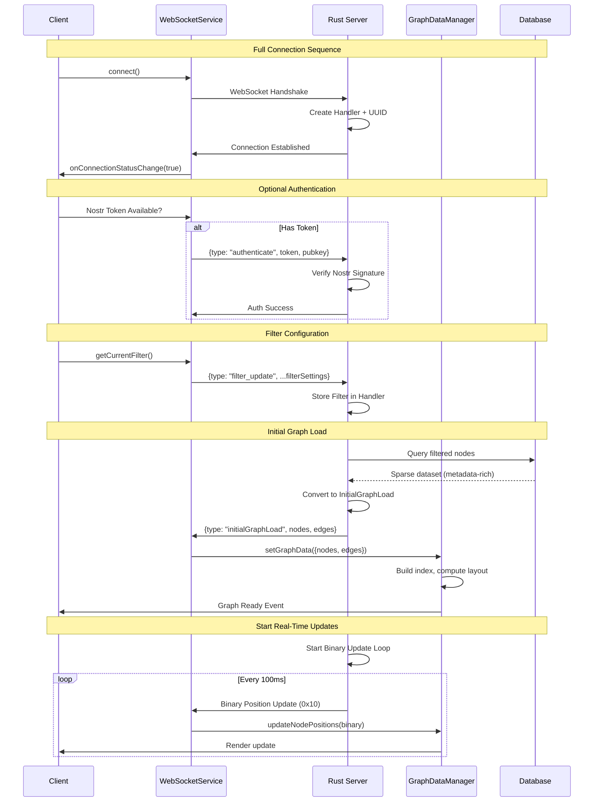
```mermaid
sequenceDiagram
    participant C as Client
    participant WS as WebSocketService
    participant S as Rust Server
    participant G as GraphDataManager
    participant DB as Database

    Note over C,DB: Full Connection Sequence

    C->>WS: connect()
    WS->>S: WebSocket Handshake
    S->>S: Create Handler + UUID
    S->>WS: Connection Established
    WS->>C: onConnectionStatusChange(true)

    Note over C,DB: Optional Authentication
    C->>WS: Nostr Token Available?
    alt Has Token
        WS->>S: {type: "authenticate", token, pubkey}
        S->>S: Verify Nostr Signature
        S->>WS: Auth Success
    end

    Note over C,DB: Filter Configuration
    C->>WS: getCurrentFilter()
    WS->>S: {type: "filter_update", ...filterSettings}
    S->>S: Store Filter in Handler

    Note over C,DB: Initial Graph Load
    S->>DB: Query filtered nodes
    DB-->>S: Sparse dataset (metadata-rich)
    S->>S: Convert to InitialGraphLoad
    S->>WS: {type: "initialGraphLoad", nodes, edges}
    WS->>G: setGraphData({nodes, edges})
    G->>G: Build index, compute layout
    G->>C: Graph Ready Event

    Note over C,DB: Start Real-Time Updates
    S->>S: Start Binary Update Loop
    loop Every 100ms
        S->>WS: Binary Position Update (0x10)
        WS->>G: updateNodePositions(binary)
        G->>C: Render update
    end
```

### 2. User Interaction with Position Updates

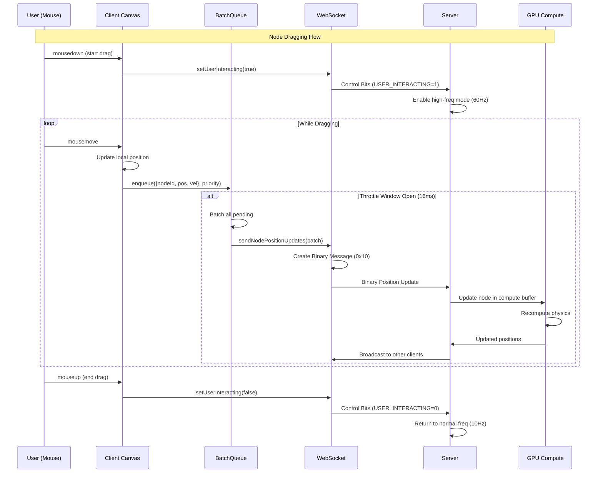
```mermaid
sequenceDiagram
    participant U as User (Mouse)
    participant C as Client Canvas
    participant Q as BatchQueue
    participant WS as WebSocket
    participant S as Server
    participant GPU as GPU Compute

    Note over U,GPU: Node Dragging Flow

    U->>C: mousedown (start drag)
    C->>WS: setUserInteracting(true)
    WS->>S: Control Bits (USER_INTERACTING=1)
    S->>S: Enable high-freq mode (60Hz)

    loop While Dragging
        U->>C: mousemove
        C->>C: Update local position
        C->>Q: enqueue({nodeId, pos, vel}, priority)

        alt Throttle Window Open (16ms)
            Q->>Q: Batch all pending
            Q->>WS: sendNodePositionUpdates(batch)
            WS->>WS: Create Binary Message (0x10)
            WS->>S: Binary Position Update
            S->>GPU: Update node in compute buffer
            GPU->>GPU: Recompute physics
            GPU->>S: Updated positions
            S->>WS: Broadcast to other clients
        end
    end

    U->>C: mouseup (end drag)
    C->>WS: setUserInteracting(false)
    WS->>S: Control Bits (USER_INTERACTING=0)
    S->>S: Return to normal freq (10Hz)
```

### 3. Filter Update & Graph Refresh

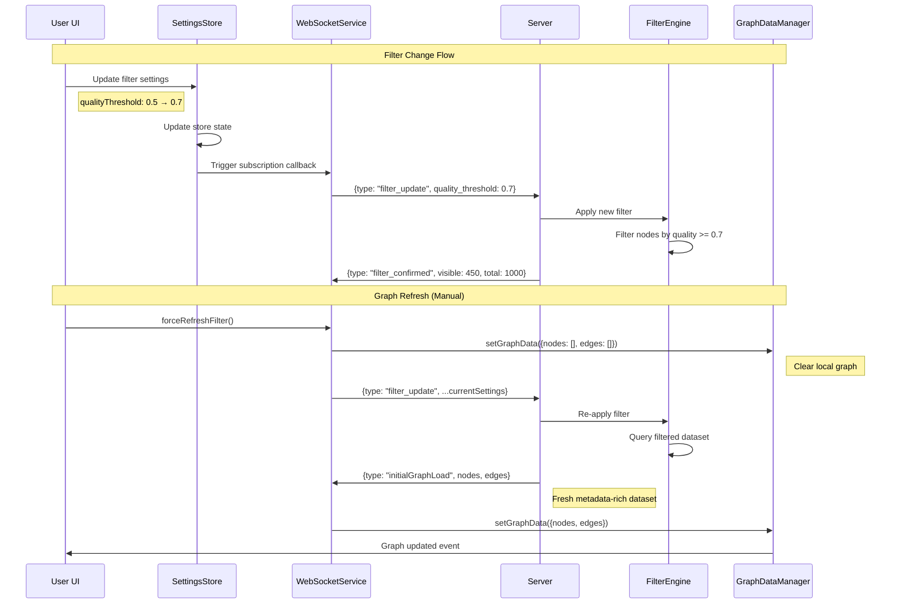
```mermaid
sequenceDiagram
    participant U as User UI
    participant SS as SettingsStore
    participant WS as WebSocketService
    participant S as Server
    participant F as FilterEngine
    participant G as GraphDataManager

    Note over U,G: Filter Change Flow

    U->>SS: Update filter settings
    Note right of U: qualityThreshold: 0.5 → 0.7
    SS->>SS: Update store state
    SS->>WS: Trigger subscription callback

    WS->>S: {type: "filter_update", quality_threshold: 0.7}
    S->>F: Apply new filter
    F->>F: Filter nodes by quality >= 0.7
    S->>WS: {type: "filter_confirmed", visible: 450, total: 1000}

    Note over U,G: Graph Refresh (Manual)

    U->>WS: forceRefreshFilter()
    WS->>G: setGraphData({nodes: [], edges: []})
    Note right of G: Clear local graph
    WS->>S: {type: "filter_update", ...currentSettings}
    S->>F: Re-apply filter
    F->>F: Query filtered dataset
    S->>WS: {type: "initialGraphLoad", nodes, edges}
    Note right of S: Fresh metadata-rich dataset
    WS->>G: setGraphData({nodes, edges})
    G->>U: Graph updated event
```

### 4. Agent State Synchronization

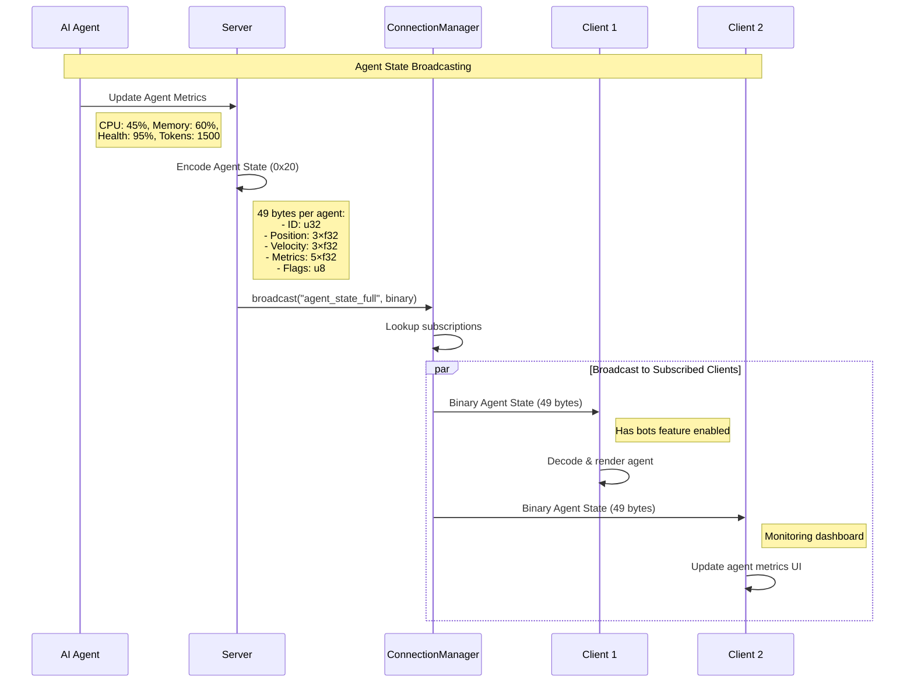
```mermaid
sequenceDiagram
    participant A as AI Agent
    participant S as Server
    participant CM as ConnectionManager
    participant C1 as Client 1
    participant C2 as Client 2

    Note over A,C2: Agent State Broadcasting

    A->>S: Update Agent Metrics
    Note right of A: CPU: 45%, Memory: 60%,<br/>Health: 95%, Tokens: 1500

    S->>S: Encode Agent State (0x20)
    Note right of S: 49 bytes per agent:<br/>- ID: u32<br/>- Position: 3×f32<br/>- Velocity: 3×f32<br/>- Metrics: 5×f32<br/>- Flags: u8

    S->>CM: broadcast("agent_state_full", binary)

    CM->>CM: Lookup subscriptions

    par Broadcast to Subscribed Clients
        CM->>C1: Binary Agent State (49 bytes)
        Note right of C1: Has bots feature enabled
        C1->>C1: Decode & render agent

        CM->>C2: Binary Agent State (49 bytes)
        Note right of C2: Monitoring dashboard
        C2->>C2: Update agent metrics UI
    end
```

### 5. Voice Streaming

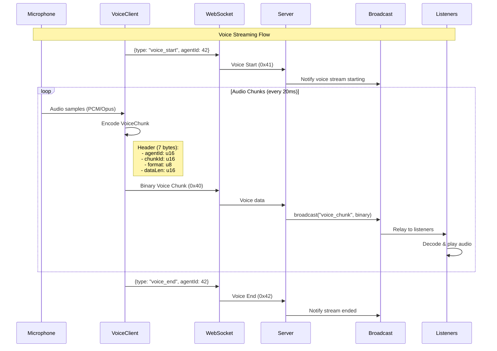
```mermaid
sequenceDiagram
    participant M as Microphone
    participant VC as VoiceClient
    participant WS as WebSocket
    participant S as Server
    participant BC as Broadcast
    participant L as Listeners

    Note over M,L: Voice Streaming Flow

    VC->>WS: {type: "voice_start", agentId: 42}
    WS->>S: Voice Start (0x41)
    S->>BC: Notify voice stream starting

    loop Audio Chunks (every 20ms)
        M->>VC: Audio samples (PCM/Opus)
        VC->>VC: Encode VoiceChunk
        Note right of VC: Header (7 bytes):<br/>- agentId: u16<br/>- chunkId: u16<br/>- format: u8<br/>- dataLen: u16
        VC->>WS: Binary Voice Chunk (0x40)
        WS->>S: Voice data
        S->>BC: broadcast("voice_chunk", binary)
        BC->>L: Relay to listeners
        L->>L: Decode & play audio
    end

    VC->>WS: {type: "voice_end", agentId: 42}
    WS->>S: Voice End (0x42)
    S->>BC: Notify stream ended
```

---

## Error Handling & Recovery

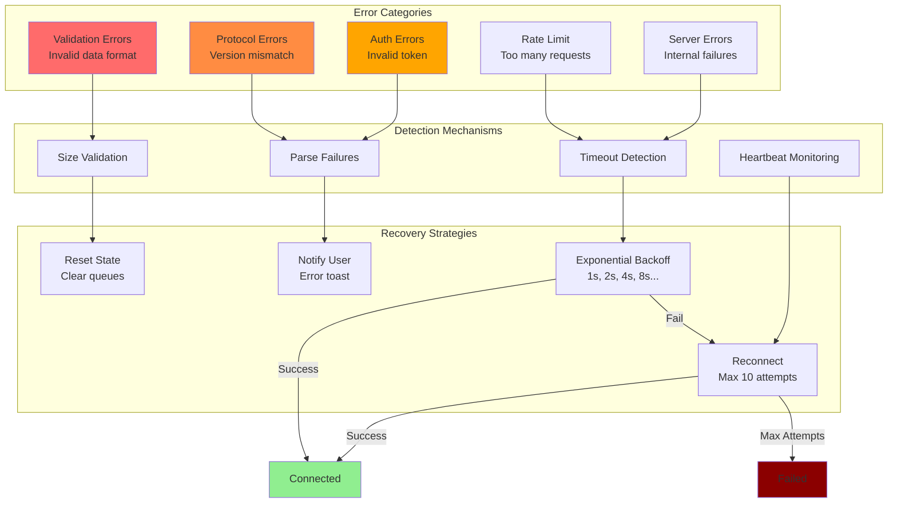
```mermaid
graph TB
    subgraph "Error Categories"
        ERR_VAL[Validation Errors<br/>Invalid data format]
        ERR_PROTO[Protocol Errors<br/>Version mismatch]
        ERR_AUTH[Auth Errors<br/>Invalid token]
        ERR_RATE[Rate Limit<br/>Too many requests]
        ERR_SERVER[Server Errors<br/>Internal failures]
    end

    subgraph "Detection Mechanisms"
        DETECT_SIZE[Size Validation]
        DETECT_PARSE[Parse Failures]
        DETECT_TIMEOUT[Timeout Detection]
        DETECT_HB[Heartbeat Monitoring]
    end

    subgraph "Recovery Strategies"
        RETRY[Exponential Backoff<br/>1s, 2s, 4s, 8s...]
        RECON[Reconnect<br/>Max 10 attempts]
        RESET[Reset State<br/>Clear queues]
        NOTIFY[Notify User<br/>Error toast]
    end

    ERR_VAL --> DETECT_SIZE
    ERR_PROTO --> DETECT_PARSE
    ERR_AUTH --> DETECT_PARSE
    ERR_RATE --> DETECT_TIMEOUT
    ERR_SERVER --> DETECT_TIMEOUT

    DETECT_SIZE --> RESET
    DETECT_PARSE --> NOTIFY
    DETECT_TIMEOUT --> RETRY
    DETECT_HB --> RECON

    RETRY -->|Success| CONNECTED[Connected]
    RETRY -->|Fail| RECON
    RECON -->|Success| CONNECTED
    RECON -->|Max Attempts| FAILED[Failed]

    style ERR_VAL fill:#FF6B6B
    style ERR_PROTO fill:#FF8C42
    style ERR_AUTH fill:#FFA500
    style CONNECTED fill:#90EE90
    style FAILED fill:#8B0000
```

### Error Frame Format

```typescript
interface WebSocketErrorFrame {
  code: string;                    // Error code (e.g., "VALIDATION_ERROR")
  message: string;                 // Human-readable message
  category: 'validation' | 'server' | 'protocol' | 'auth' | 'rate_limit';
  details?: any;                   // Additional context
  retryable: boolean;              // Can retry?
  retryAfter?: number;             // Retry delay (ms)
  affectedPaths?: string[];        // Which data paths failed
  timestamp: number;               // Unix timestamp (ms)
}
```

### Error Handling Sequence

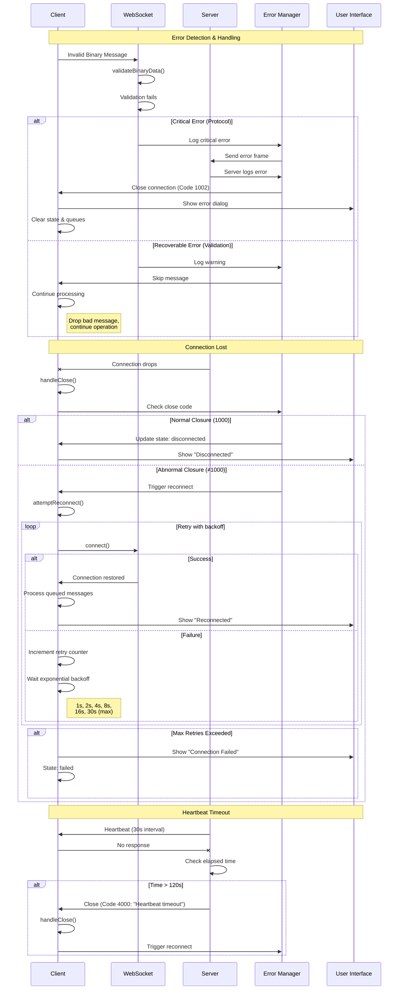
```mermaid
sequenceDiagram
    participant C as Client
    participant WS as WebSocket
    participant S as Server
    participant EM as Error Manager
    participant UI as User Interface

    Note over C,UI: Error Detection & Handling

    C->>WS: Invalid Binary Message
    WS->>WS: validateBinaryData()
    WS->>WS: Validation fails

    alt Critical Error (Protocol)
        WS->>EM: Log critical error
        EM->>S: Send error frame
        S->>EM: Server logs error
        EM->>C: Close connection (Code 1002)
        C->>UI: Show error dialog
        C->>C: Clear state & queues
    else Recoverable Error (Validation)
        WS->>EM: Log warning
        EM->>C: Skip message
        C->>C: Continue processing
        Note right of C: Drop bad message,<br/>continue operation
    end

    Note over C,UI: Connection Lost

    S-xC: Connection drops
    C->>C: handleClose()
    C->>EM: Check close code

    alt Normal Closure (1000)
        EM->>C: Update state: disconnected
        C->>UI: Show "Disconnected"
    else Abnormal Closure (≠1000)
        EM->>C: Trigger reconnect
        C->>C: attemptReconnect()

        loop Retry with backoff
            C->>WS: connect()
            alt Success
                WS->>C: Connection restored
                C->>C: Process queued messages
                C->>UI: Show "Reconnected"
            else Failure
                C->>C: Increment retry counter
                C->>C: Wait exponential backoff
                Note right of C: 1s, 2s, 4s, 8s,<br/>16s, 30s (max)
            end
        end

        alt Max Retries Exceeded
            C->>UI: Show "Connection Failed"
            C->>C: State: failed
        end
    end

    Note over C,UI: Heartbeat Timeout

    S->>C: Heartbeat (30s interval)
    C-xS: No response
    S->>S: Check elapsed time

    alt Time > 120s
        S->>C: Close (Code 4000: "Heartbeat timeout")
        C->>C: handleClose()
        C->>EM: Trigger reconnect
    end
```

### Reconnection Logic

```typescript
class WebSocketService {
  private reconnectAttempts: number = 0;
  private maxReconnectAttempts: number = 10;
  private reconnectInterval: number = 1000; // Base delay
  private maxReconnectDelay: number = 30000; // Max 30s

  attemptReconnect(): void {
    if (this.reconnectAttempts < this.maxReconnectAttempts) {
      this.reconnectAttempts++;

      // Exponential backoff with jitter
      const baseDelay = 1000;
      const exponentialDelay = baseDelay * Math.pow(2, this.reconnectAttempts - 1);
      const delay = Math.min(exponentialDelay, this.maxReconnectDelay);
      const jitter = Math.random() * 1000; // 0-1s jitter

      setTimeout(() => {
        this.connect()
          .catch(() => this.attemptReconnect());
      }, delay + jitter);
    } else {
      this.updateConnectionState('failed', 'Max reconnect attempts reached');
    }
  }
}
```

---

## Compression & Encoding Strategies

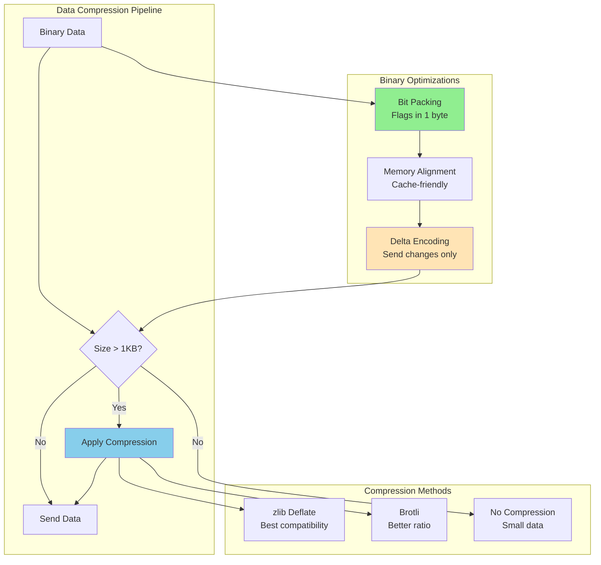
```mermaid
graph TB
    subgraph "Data Compression Pipeline"
        INPUT[Binary Data]
        SIZE_CHECK{Size > 1KB?}
        COMPRESS[Apply Compression]
        SEND[Send Data]

        INPUT --> SIZE_CHECK
        SIZE_CHECK -->|Yes| COMPRESS
        SIZE_CHECK -->|No| SEND
        COMPRESS --> SEND
    end

    subgraph "Compression Methods"
        ZLIB[zlib Deflate<br/>Best compatibility]
        BROTLI[Brotli<br/>Better ratio]
        NONE[No Compression<br/>Small data]

        COMPRESS --> ZLIB
        COMPRESS --> BROTLI
        SIZE_CHECK -->|No| NONE
    end

    subgraph "Binary Optimizations"
        PACK[Bit Packing<br/>Flags in 1 byte]
        ALIGN[Memory Alignment<br/>Cache-friendly]
        DELTA[Delta Encoding<br/>Send changes only]

        INPUT --> PACK
        PACK --> ALIGN
        ALIGN --> DELTA
        DELTA --> SIZE_CHECK
    end

    style COMPRESS fill:#87CEEB
    style PACK fill:#90EE90
    style DELTA fill:#FFE4B5
```

### Constants (Rust Server)

```rust
// src/utils/socket_flow_constants.rs
pub const COMPRESSION_THRESHOLD: usize = 1024;  // 1KB
pub const ENABLE_COMPRESSION: bool = true;
pub const BINARY_CHUNK_SIZE: usize = 64 * 1024; // 64KB
pub const MAX_MESSAGE_SIZE: usize = 100 * 1024 * 1024; // 100MB
```

---

## Performance Metrics

### Bandwidth Calculations

```typescript
// Calculate bandwidth for different scenarios
function calculateBandwidth(agentCount: number, updateRateHz: number) {
  const positionSize = 21; // V2 position update
  const stateSize = 49;    // V2 full state
  const voiceSize = 8000;  // 8KB/s per agent (estimate)

  return {
    positionOnly: agentCount * positionSize * updateRateHz,
    fullState: agentCount * stateSize * updateRateHz,
    withVoice: (agentCount * stateSize * updateRateHz) + (agentCount * voiceSize)
  };
}

// Example: 100 agents at 60 Hz
// Position only: 100 * 21 * 60 = 126 KB/s
// Full state: 100 * 49 * 60 = 294 KB/s
// With voice: 294 KB/s + 800 KB/s = 1.094 MB/s
```

### Protocol Efficiency

| Scenario | JSON Size | Binary Size | Savings |
|----------|-----------|-------------|---------|
| 1 Position Update | ~150 bytes | 21 bytes | 86% |
| 100 Positions | ~15 KB | 2.1 KB | 86% |
| 1 Agent State | ~300 bytes | 49 bytes | 84% |
| 100 Agent States | ~30 KB | 4.9 KB | 84% |

---

## Configuration Summary

### Client Configuration (TypeScript)

```typescript
interface WebSocketConfig {
  reconnect: {
    maxAttempts: 10;
    baseDelay: 1000;      // 1s
    maxDelay: 30000;      // 30s
    backoffFactor: 2;
  };
  heartbeat: {
    interval: 30000;      // 30s
    timeout: 10000;       // 10s
  };
  compression: true;
  binaryProtocol: true;
}
```

### Server Configuration (Rust)

```rust
pub const HEARTBEAT_INTERVAL: u64 = 30;      // seconds
pub const CLIENT_TIMEOUT: u64 = 60;          // seconds
pub const MAX_MESSAGE_SIZE: usize = 100 * 1024 * 1024; // 100MB
pub const BINARY_CHUNK_SIZE: usize = 64 * 1024;        // 64KB
pub const POSITION_UPDATE_RATE: u32 = 5;     // 5 Hz default
pub const METADATA_UPDATE_RATE: u32 = 1;     // 1 Hz metadata
```

---

## Conclusion

This binary protocol system provides:

1. **Efficiency**: 84-86% bandwidth reduction vs JSON
2. **Scalability**: Supports millions of node IDs (u32)
3. **Versioning**: Backward-compatible protocol evolution
4. **Real-time**: 60Hz updates for interactive scenarios
5. **Reliability**: Heartbeat monitoring, reconnection logic
6. **Multi-client**: Efficient broadcast with subscription filtering
7. **Voice**: Low-latency voice streaming support
8. **Error Handling**: Comprehensive recovery mechanisms

The system handles 100 agents at 60Hz with only ~1.1 MB/s bandwidth including voice, making it suitable for large-scale multi-agent simulations.
