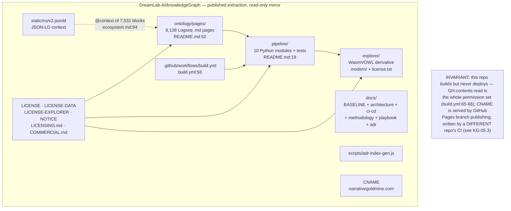
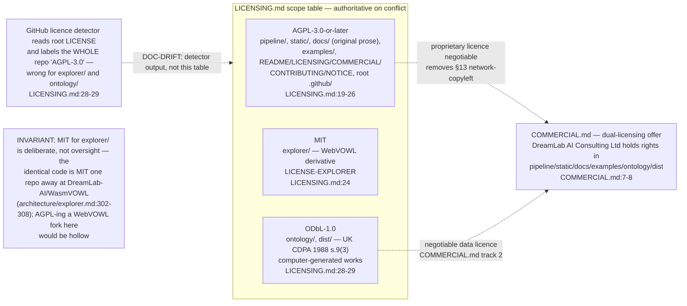
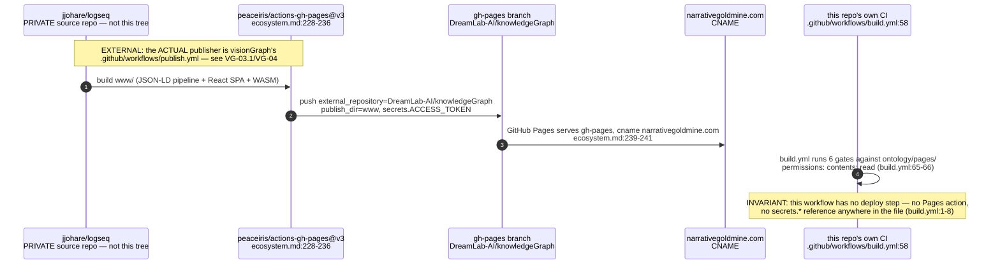
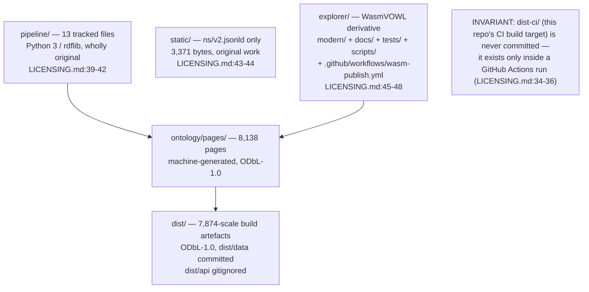

## KG-01.1 Repository composition — a corpus, a pipeline and a viewer in one tree

## KG-01.2 Licensing scope — three licences, one repository, one governing file

## KG-01.3 Publication topology — this repo is the deploy TARGET, not the publisher

## KG-01.4 What each path is (file-count summary, verified 2026-07-25)

