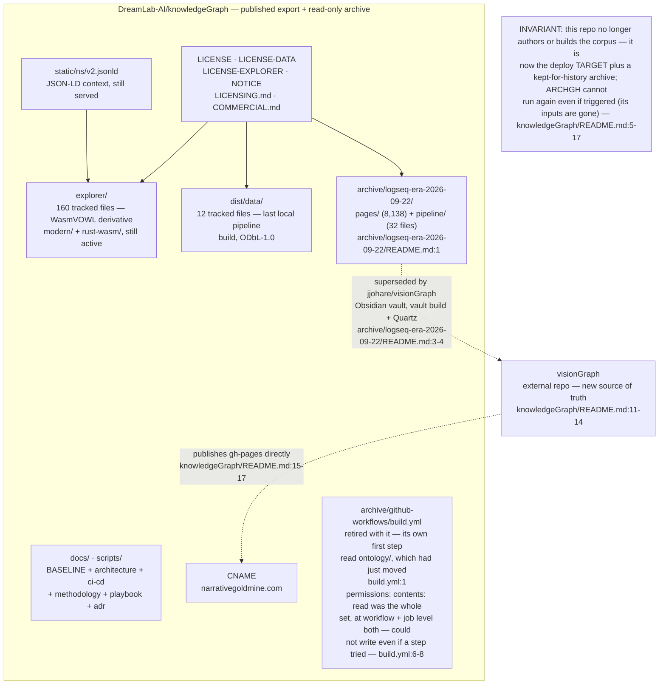
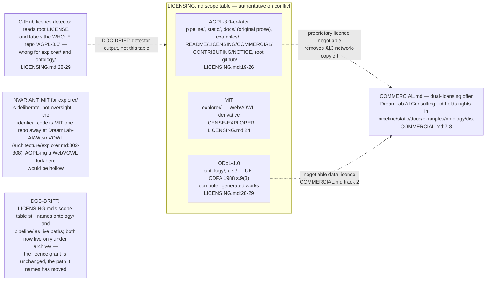

## KG-01.1 Repository composition — a published corpus, a retired local pipeline, a live viewer

```mermaid
flowchart TB
    subgraph REPO["DreamLab-AI/knowledgeGraph — published export + read-only archive"]
        EXP["explorer/<br/>160 tracked files — WasmVOWL derivative<br/>modern/ + rust-wasm/, still active"]
        STATIC["static/ns/v2.jsonld<br/>JSON-LD context, still served"]
        DIST["dist/data/<br/>12 tracked files — last local pipeline<br/>build, ODbL-1.0"]
        DOCSN["docs/ · scripts/<br/>BASELINE + architecture + ci-cd<br/>+ methodology + playbook + adr"]
        LIC["LICENSE · LICENSE-DATA<br/>LICENSE-EXPLORER · NOTICE<br/>LICENSING.md · COMMERCIAL.md"]
        CNAME["CNAME<br/>narrativegoldmine.com"]
        ARCHIVE["archive/logseq-era-2026-09-22/<br/>pages/ (8,138) + pipeline/ (32 files)<br/>archive/logseq-era-2026-09-22/README.md:1"]
        ARCHGH["archive/github-workflows/build.yml<br/>retired with it — its own first step<br/>read ontology/, which had just moved<br/>build.yml:1<br/>permissions: contents: read was the whole<br/>set, at workflow + job level both — could<br/>not write even if a step tried — build.yml:6-8"]
    end
    ARCHIVE -.->|"superseded by jjohare/visionGraph<br/>Obsidian vault, vault build + Quartz<br/>archive/logseq-era-2026-09-22/README.md:3-4"| VG["visionGraph<br/>external repo — new source of truth<br/>knowledgeGraph/README.md:11-14"]
    VG -.->|"publishes gh-pages directly<br/>knowledgeGraph/README.md:15-17"| CNAME
    STATIC --> EXP
    LIC --> ARCHIVE
    LIC --> EXP
    LIC --> DIST
    note1["INVARIANT: this repo no longer authors or builds the corpus — it is<br/>now the deploy TARGET plus a kept-for-history archive; ARCHGH cannot<br/>run again even if triggered (its inputs are gone) — knowledgeGraph/README.md:5-17"]
```

## KG-01.2 Licensing scope — three licences, one repository, one governing file

```mermaid
flowchart LR
    subgraph SCOPE["LICENSING.md scope table — authoritative on conflict"]
        direction TB
        AGPL["AGPL-3.0-or-later<br/>pipeline/, static/, docs/ (original prose),<br/>examples/, README/LICENSING/COMMERCIAL/<br/>CONTRIBUTING/NOTICE, root .github/<br/>LICENSING.md:19-26"]
        MIT["MIT<br/>explorer/ — WebVOWL derivative<br/>LICENSE-EXPLORER<br/>LICENSING.md:24"]
        ODBL["ODbL-1.0<br/>ontology/, dist/ — UK CDPA 1988 s.9(3)<br/>computer-generated works<br/>LICENSING.md:28-29"]
    end
    GHDETECT["GitHub licence detector reads root LICENSE<br/>and labels the WHOLE repo 'AGPL-3.0' —<br/>wrong for explorer/ and ontology/<br/>LICENSING.md:28-29"]
    GHDETECT -.->|"DOC-DRIFT: detector output, not this table"| SCOPE
    COMM["COMMERCIAL.md — dual-licensing offer<br/>DreamLab AI Consulting Ltd holds rights in<br/>pipeline/static/docs/examples/ontology/dist<br/>COMMERCIAL.md:7-8"]
    AGPL -.->|"proprietary licence negotiable<br/>removes §13 network-copyleft"| COMM
    ODBL -.->|"negotiable data licence<br/>COMMERCIAL.md track 2"| COMM
    note1["INVARIANT: MIT for explorer/ is deliberate, not oversight — the<br/>identical code is MIT one repo away at DreamLab-AI/WasmVOWL<br/>(architecture/explorer.md:302-308); AGPL-ing a WebVOWL fork here<br/>would be hollow"]
    note2["DOC-DRIFT: LICENSING.md's scope table still names ontology/ and<br/>pipeline/ as live paths; both now live only under archive/ —<br/>the licence grant is unchanged, the path it names has moved"]
```
