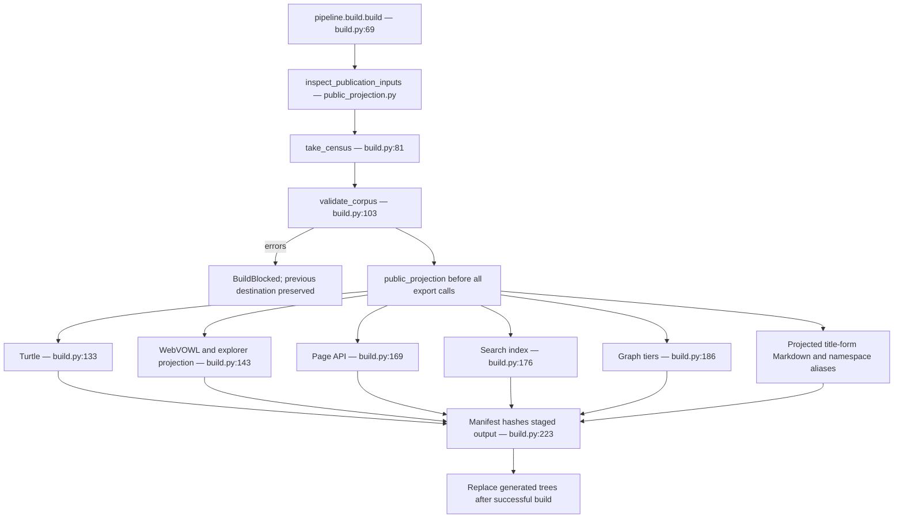
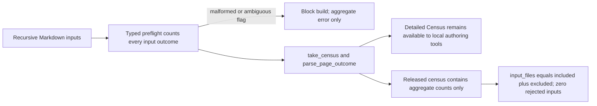
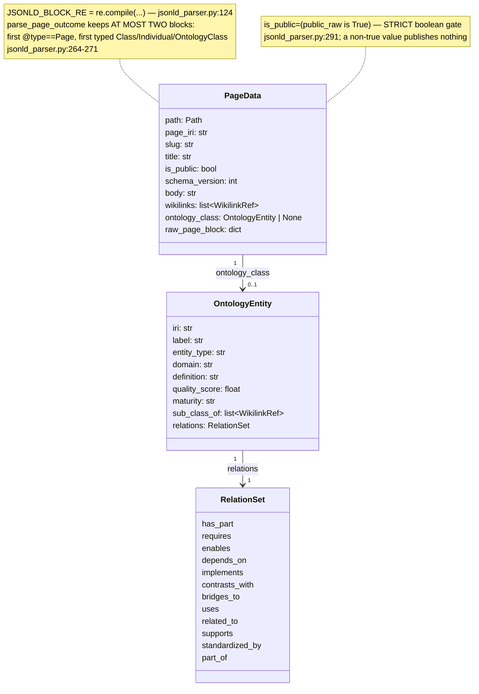
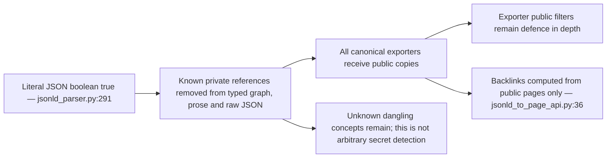
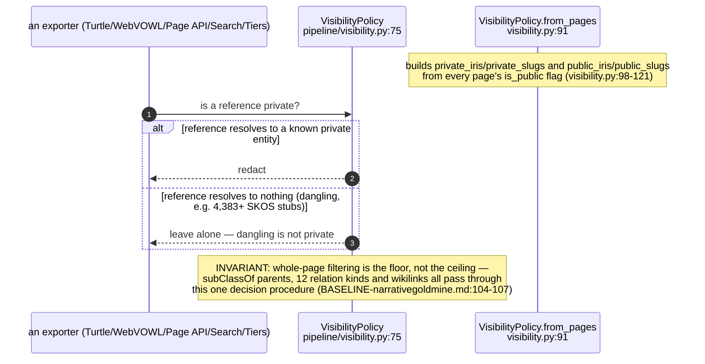
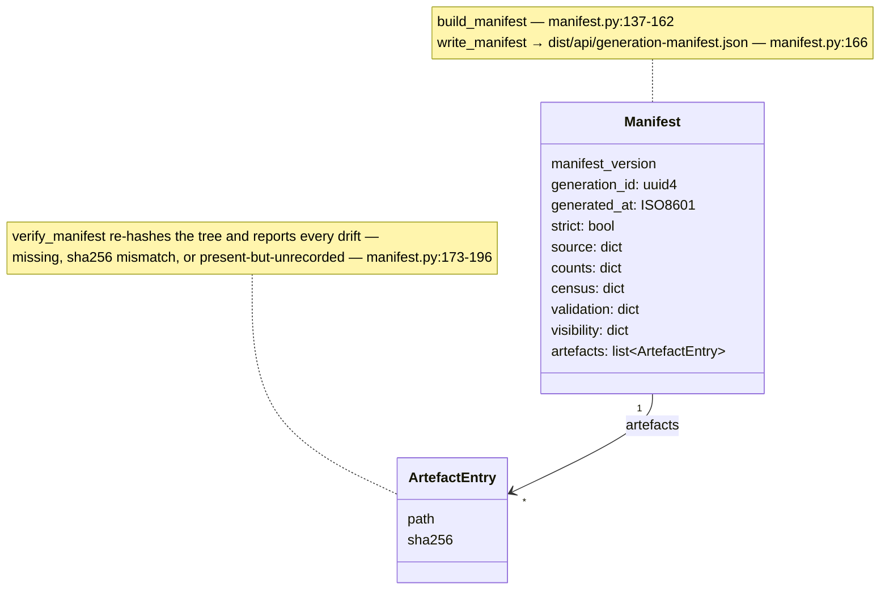

## KG-02.1 Canonical build — safety boundary before every exporter

## KG-02.2 Input accounting and authoring diagnostics

## KG-02.3 Parse — JSON-LD block extraction and the PageData model

## KG-02.4 Whole-page permission and reference filtering

## KG-02.5 Visibility — redacting references to private entities, not just private pages

## KG-02.6 Generation manifest — every artefact SHA-256'd against the source revision

Execution qualification — 2026-09-07: `public_projection.py` adds an input preflight in every build mode, public-only graph/prose projection, safe title-form markdown and fresh staging. Detailed census diagnostics remain available to local authoring callers; released census/validation artefacts contain aggregate counts. Successful rebuilds remove stale generated private pages, while rejected builds preserve the prior destination. See [execution evidence](../../estate-review/closeout/2026-09-07-execution-federation.md).
