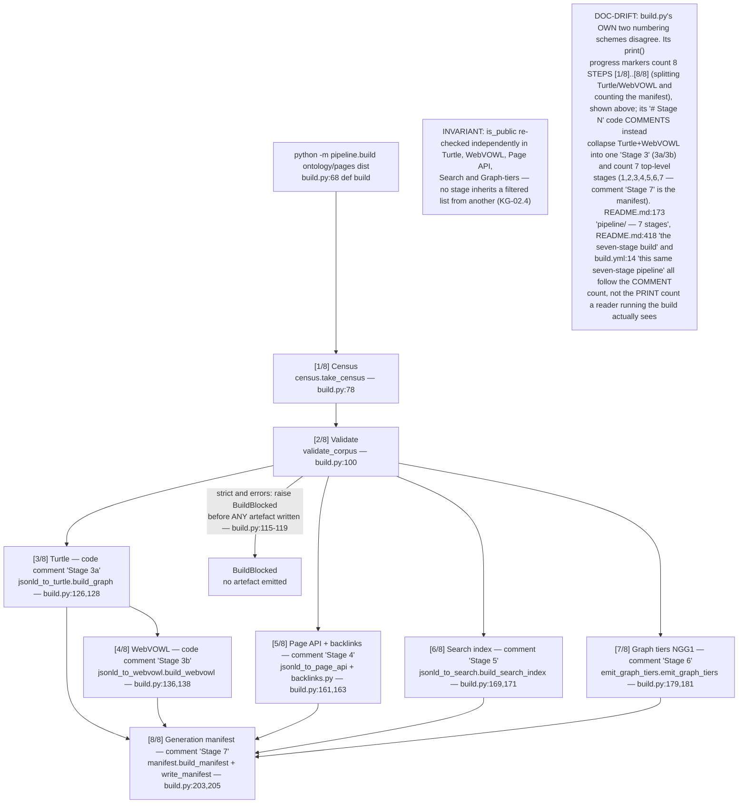
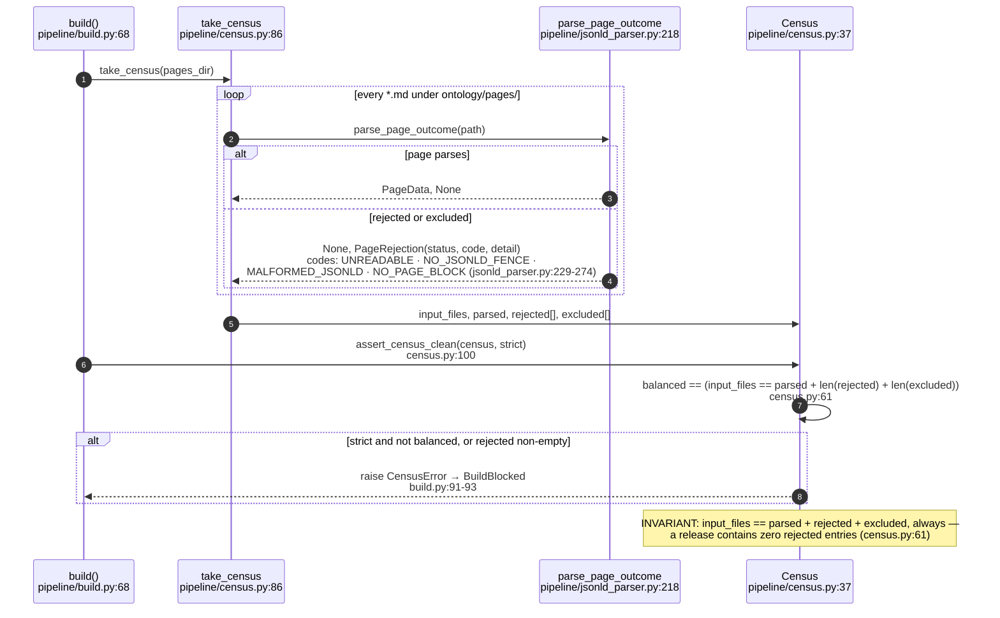
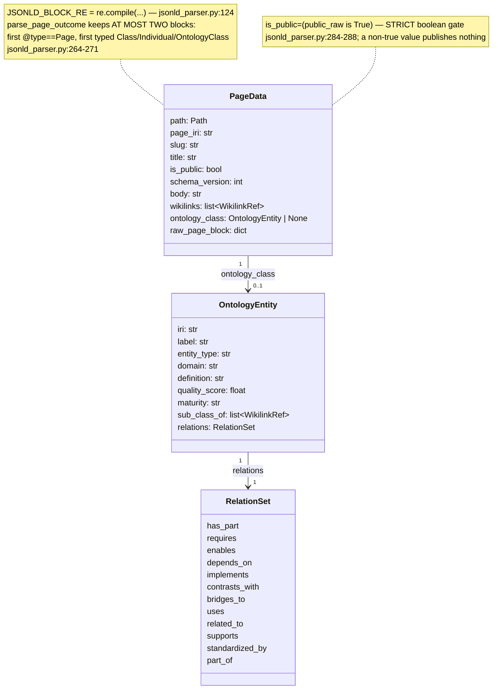
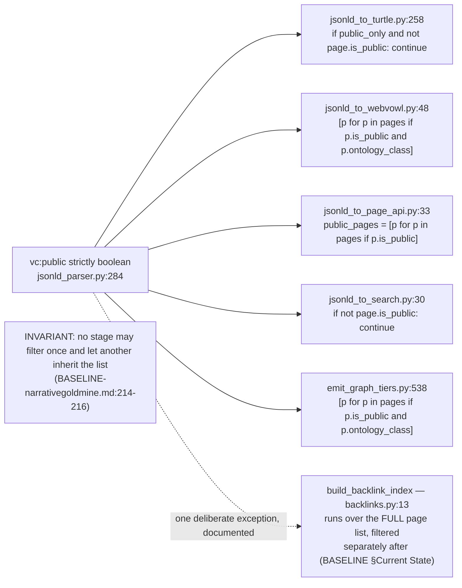
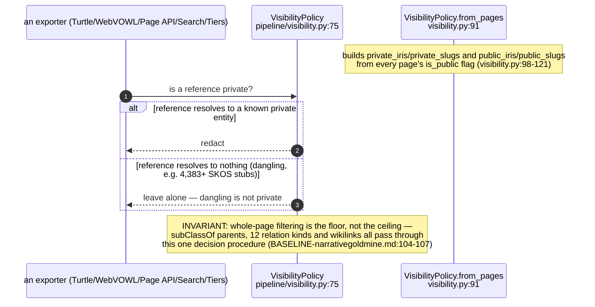
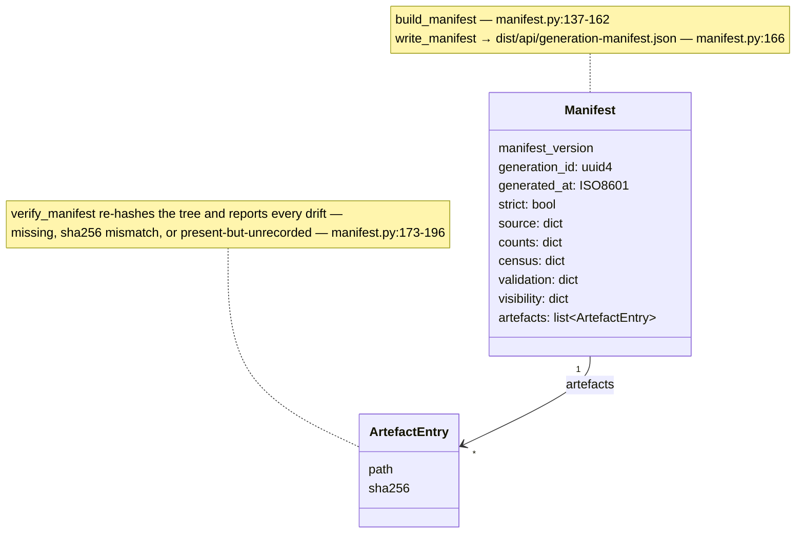

## KG-02.1 build() — the pipeline's OWN two stage counts disagree

## KG-02.2 Census — every input file accounted for, or the build refuses

## KG-02.3 Parse — JSON-LD block extraction and the PageData model

## KG-02.4 is_public — one gate, checked independently in every stage

## KG-02.5 Visibility — redacting references to private entities, not just private pages

## KG-02.6 Generation manifest — every artefact SHA-256'd against the source revision

