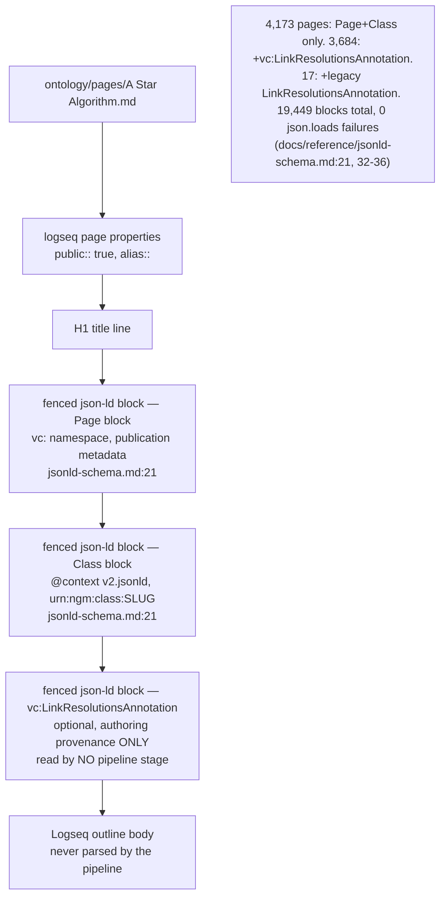
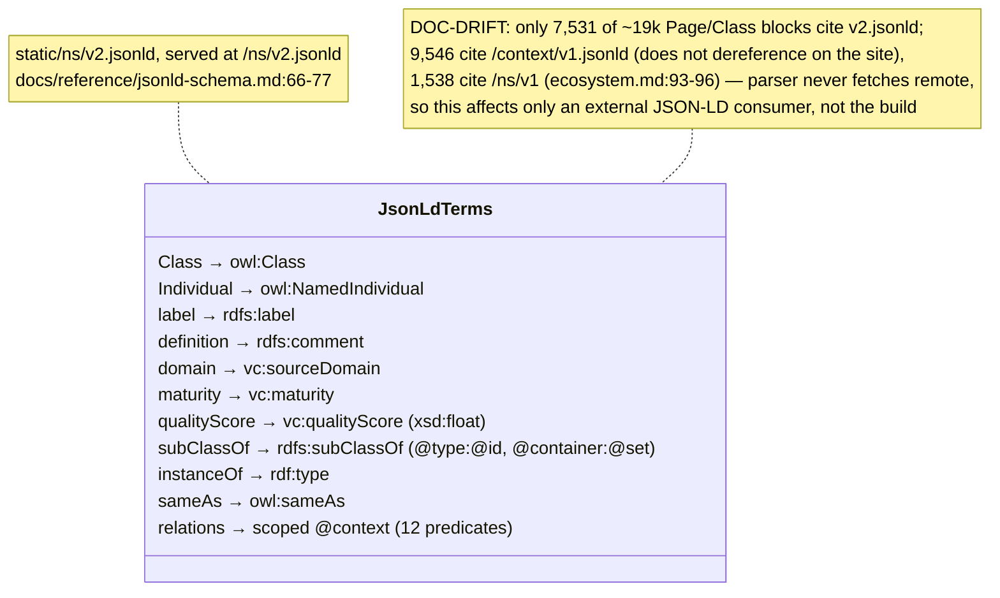
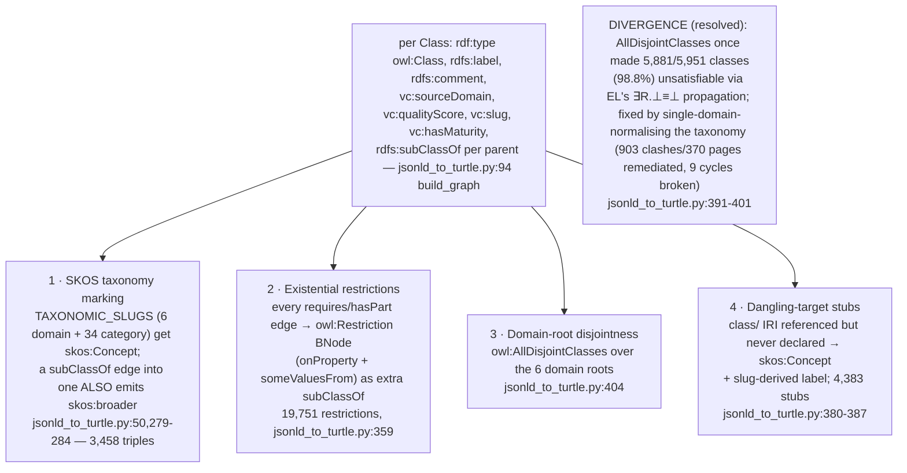
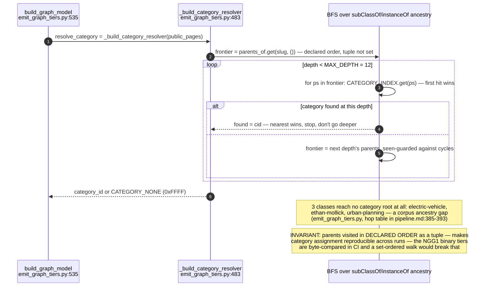
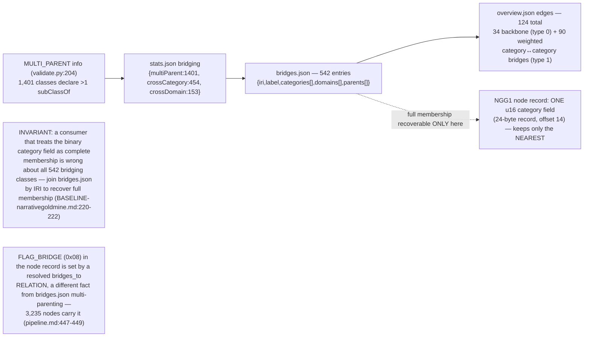

## KG-03.1 Page anatomy — two-to-three fenced json-ld blocks per Logseq page

## KG-03.2 v2.jsonld context — term mapping onto owl/rdfs/skos/prov/vc

## KG-03.3 Turtle emission — per-class triples plus four structures with no JSON-LD source

## KG-03.4 Category resolution — breadth-first walk to the NEAREST ancestor category

## KG-03.5 Bridging — multiple inheritance the 24-byte NGG1 record cannot hold

