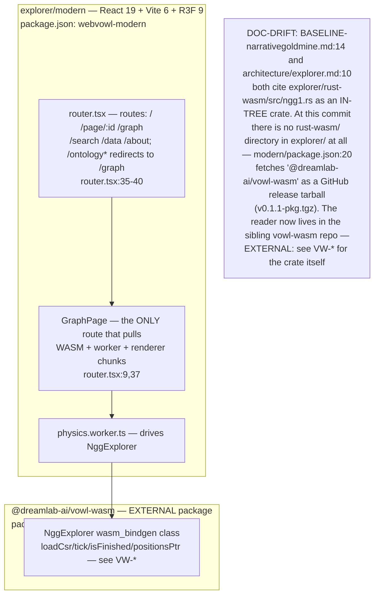
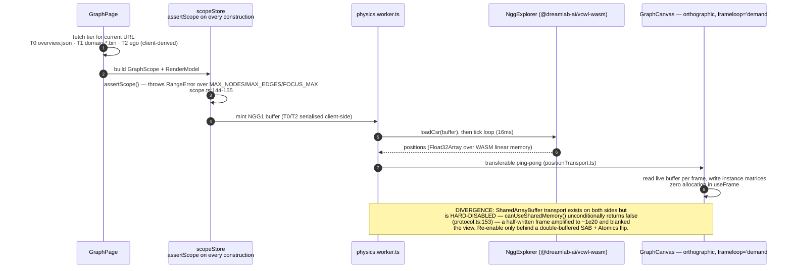
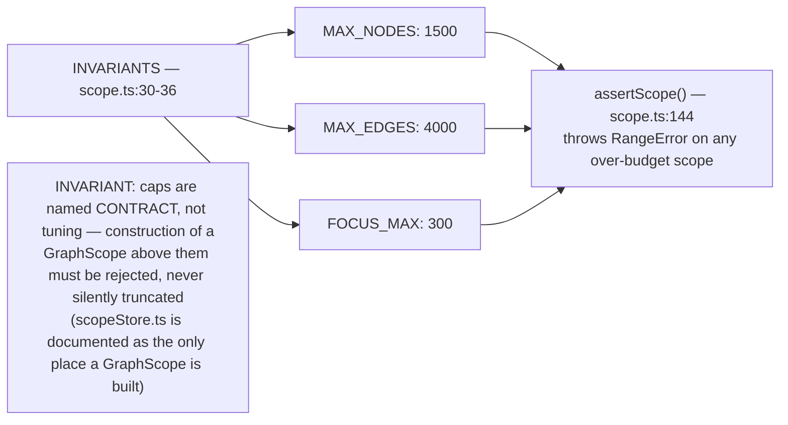
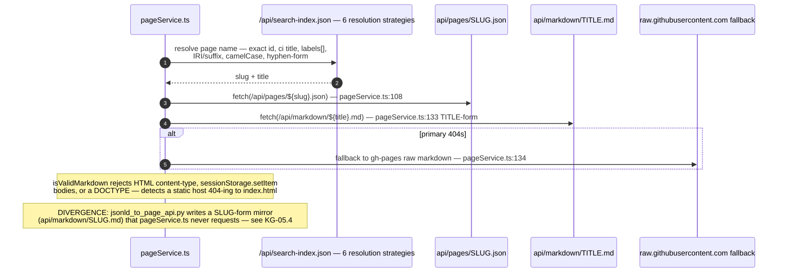
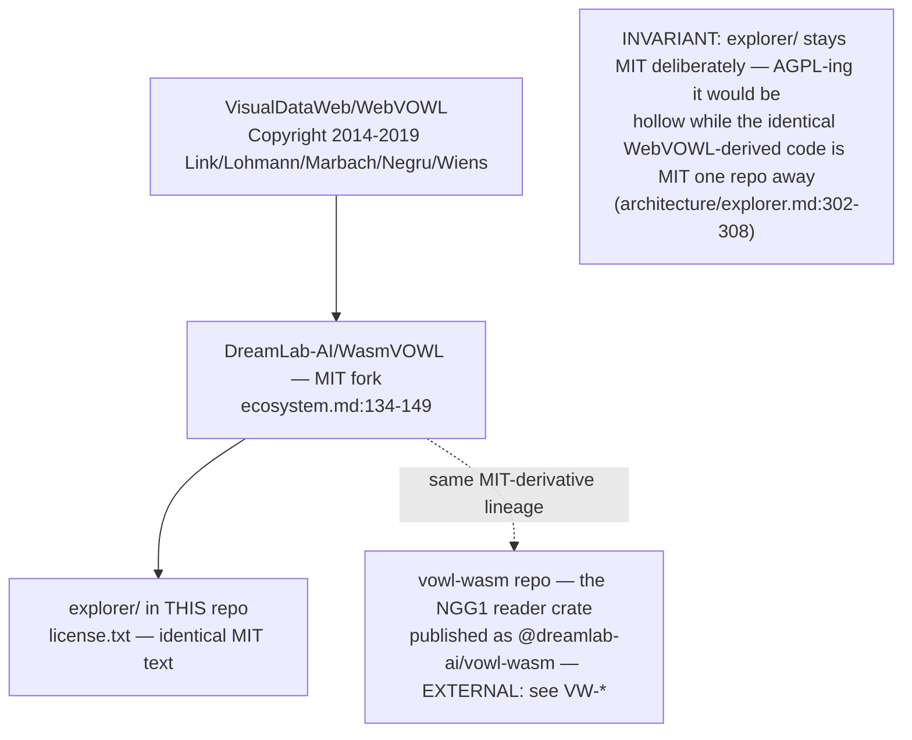

## KG-04.1 Explorer topology — MIT viewer over AGPL-built, ODbL-licensed data

## KG-04.2 NGG1 tier data flow — fetch → parse → worker tick → instanced render

## KG-04.3 Scope contract — the caps assertScope enforces

## KG-04.4 Page content — fetched by slug (structured) and by title (prose), independently

## KG-04.5 Licence — MIT viewer, deliberately not AGPL

