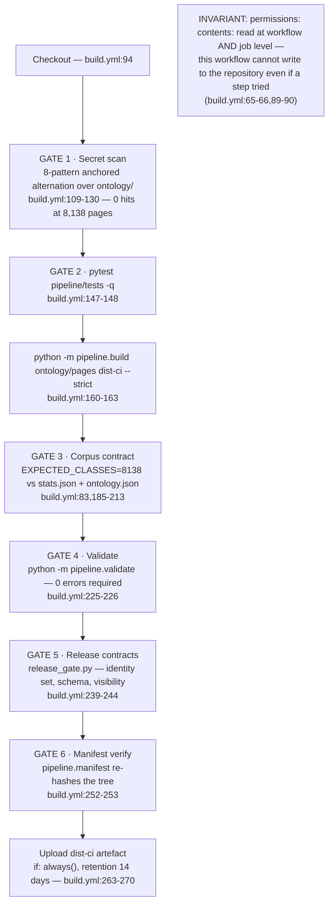
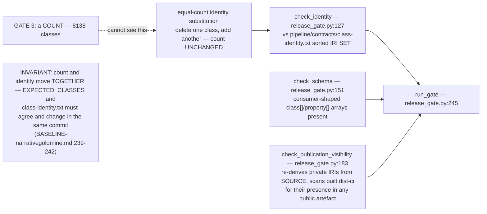
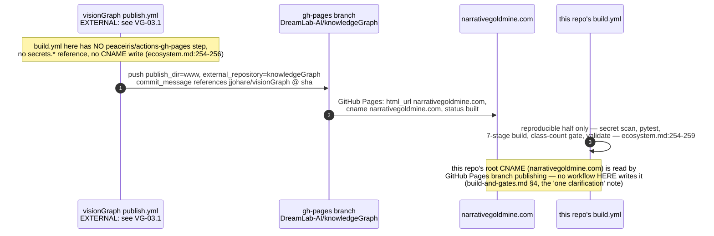
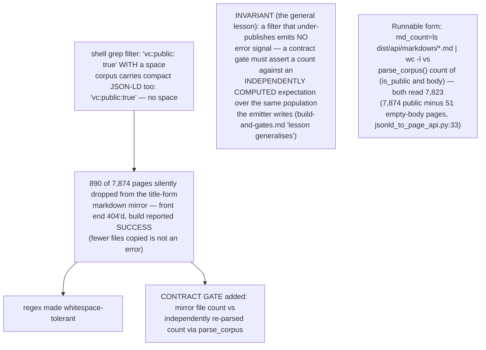

## KG-05.1 build.yml — six gates, cheapest first, no deploy step

## KG-05.2 Gate 5 — release_gate.py catches what the count alone cannot

## KG-05.3 Publication topology — deploy lives in visionGraph's workflow, not here

## KG-05.4 Gates added because something broke — the markdown-mirror incident

