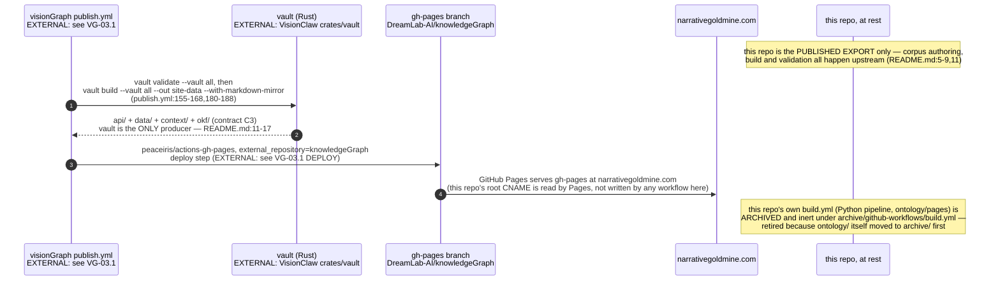
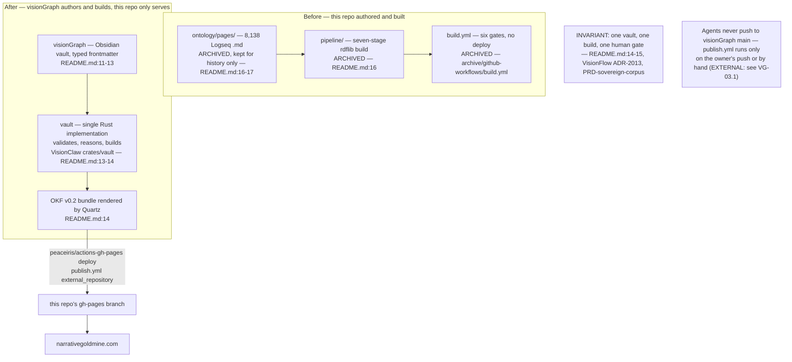

## KG-05.3 Publication topology — this repo is a pure published export, visionGraph's publish.yml is the sole builder

```mermaid
sequenceDiagram
    autonumber
    participant VG as visionGraph publish.yml<br/>EXTERNAL: see VG-03.1
    participant VAULT as vault (Rust)<br/>EXTERNAL: VisionClaw crates/vault
    participant PAGES as gh-pages branch<br/>DreamLab-AI/knowledgeGraph
    participant SITE as narrativegoldmine.com
    participant THIS as this repo, at rest

    Note over THIS: this repo is the PUBLISHED EXPORT only — corpus authoring,<br/>build and validation all happen upstream (README.md:5-9,11)
    VG->>VAULT: vault validate --vault all, then<br/>vault build --vault all --out site-data --with-markdown-mirror<br/>(publish.yml:155-168,180-188)
    VAULT-->>VG: api/ + data/ + context/ + okf/ (contract C3)<br/>vault is the ONLY producer — README.md:11-17
    VG->>PAGES: peaceiris/actions-gh-pages, external_repository=knowledgeGraph<br/>deploy step (EXTERNAL: see VG-03.1 DEPLOY)
    PAGES->>SITE: GitHub Pages serves gh-pages at narrativegoldmine.com<br/>(this repo's root CNAME is read by Pages, not written by any workflow here)
    Note over THIS: this repo's own build.yml (Python pipeline, ontology/pages) is<br/>ARCHIVED and inert under archive/github-workflows/build.yml —<br/>retired because ontology/ itself moved to archive/ first
```
- **DIVERGENCE:** the governing doc (`build-and-gates.md:1-3`) still describes `build.yml` as this repo's active "reproducible half" running six gates; the workflow it names has been moved to `archive/github-workflows/` and no longer runs — the doc has not been updated to match the retirement.

## KG-05.5 Sovereignty transition — from active builder to published export

```mermaid
flowchart TB
    subgraph BEFORE["Before — this repo authored and built"]
        OLDONT["ontology/pages/ — 8,138 Logseq .md<br/>ARCHIVED, kept for history only — README.md:16-17"]
        OLDPIPE["pipeline/ — seven-stage rdflib build<br/>ARCHIVED — README.md:16"]
        OLDCI["build.yml — six gates, no deploy<br/>ARCHIVED — archive/github-workflows/build.yml"]
        OLDONT --> OLDPIPE --> OLDCI
    end
    subgraph AFTER["After — visionGraph authors and builds, this repo only serves"]
        VGVAULT["visionGraph — Obsidian vault, typed frontmatter<br/>README.md:11-13"]
        RUSTVAULT["vault — single Rust implementation<br/>validates, reasons, builds<br/>VisionClaw crates/vault — README.md:13-14"]
        OKF["OKF v0.2 bundle rendered by Quartz<br/>README.md:14"]
        VGVAULT --> RUSTVAULT --> OKF
    end
    OKF -->|"peaceiris/actions-gh-pages deploy<br/>publish.yml external_repository"| GHPAGES["this repo's gh-pages branch"]
    GHPAGES --> SITE2["narrativegoldmine.com"]
    note1["INVARIANT: one vault, one build, one human gate<br/>— README.md:14-15, VisionFlow ADR-2013, PRD-sovereign-corpus"]
    note2["Agents never push to visionGraph main — publish.yml runs only<br/>on the owner's push or by hand (EXTERNAL: see VG-03.1)"]
```
- This repo's published artefact is pure TBox (8,138 classes, zero individuals) served from `gh-pages`; nothing here computes it any more.

Audit qualification — 2026-09-07: earlier evidence in this topic predates the 2026-09-23 retirement of `build.yml` and no longer describes the live system; superseded by the sovereignty transition above. See the [federation audit](../../estate-review/2026-09-07-federation-audit.md) for the historical record.
