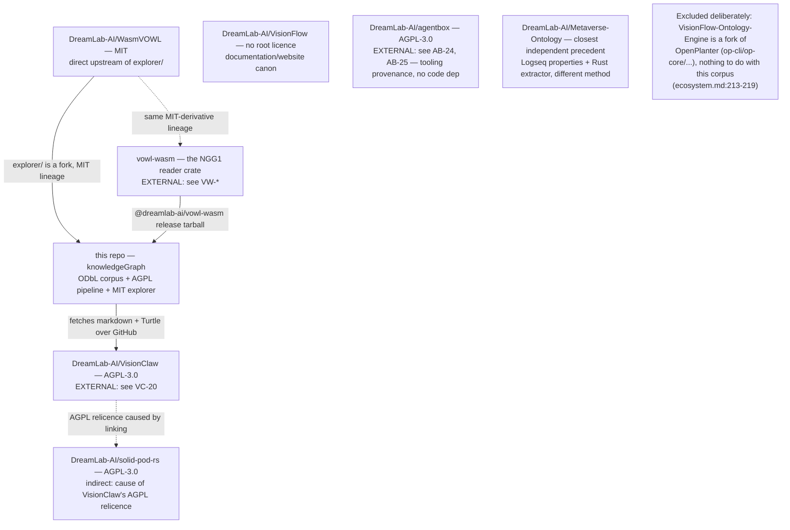
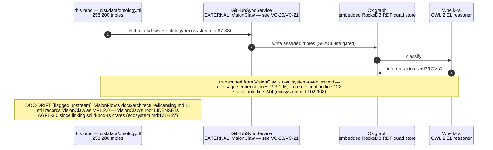
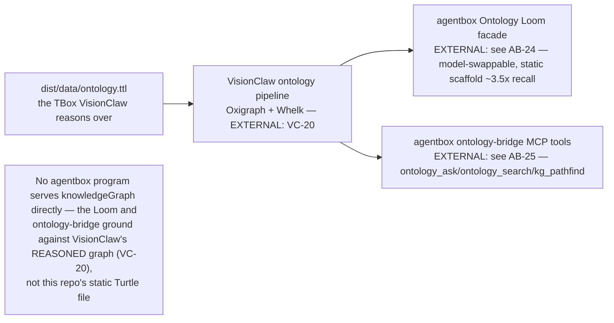
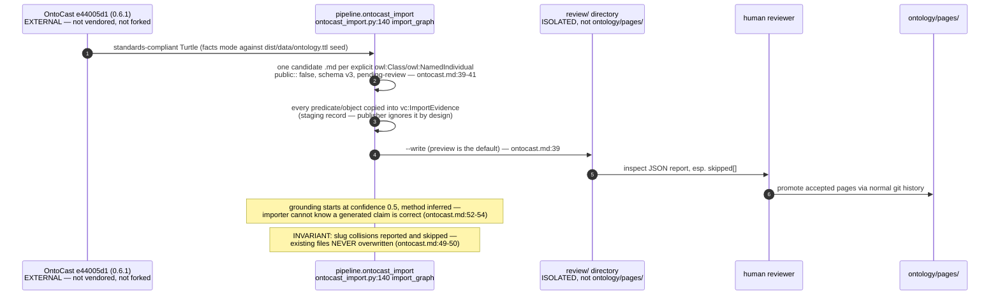

## KG-06.1 Sibling repository map — what actually depends on what

## KG-06.2 VisionClaw ingest — static artefact becomes a live, reasoned graph

## KG-06.3 agentbox — Loom grounding and the ontology-bridge MCP server

## KG-06.4 OntoCast integration — RDF-to-Logseq staging boundary, never a direct write

