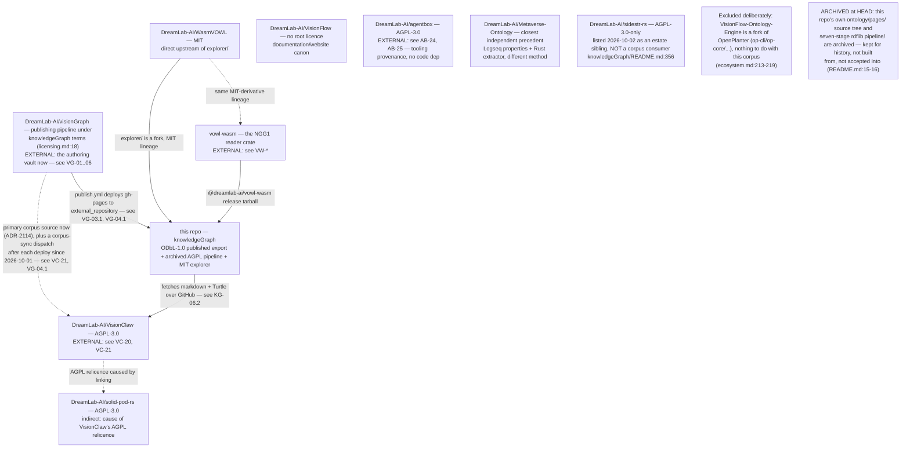
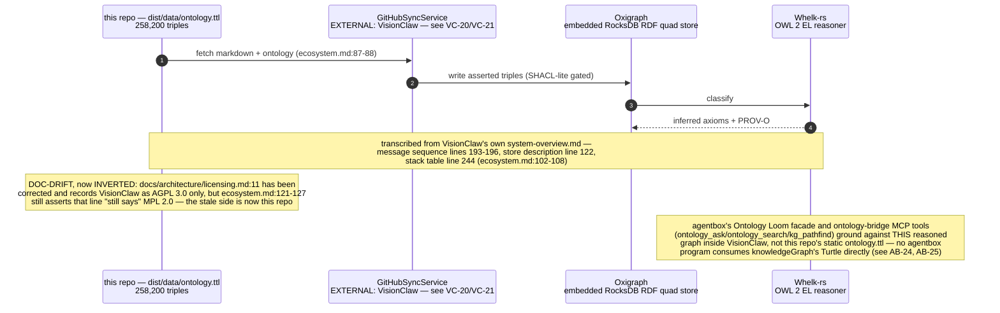
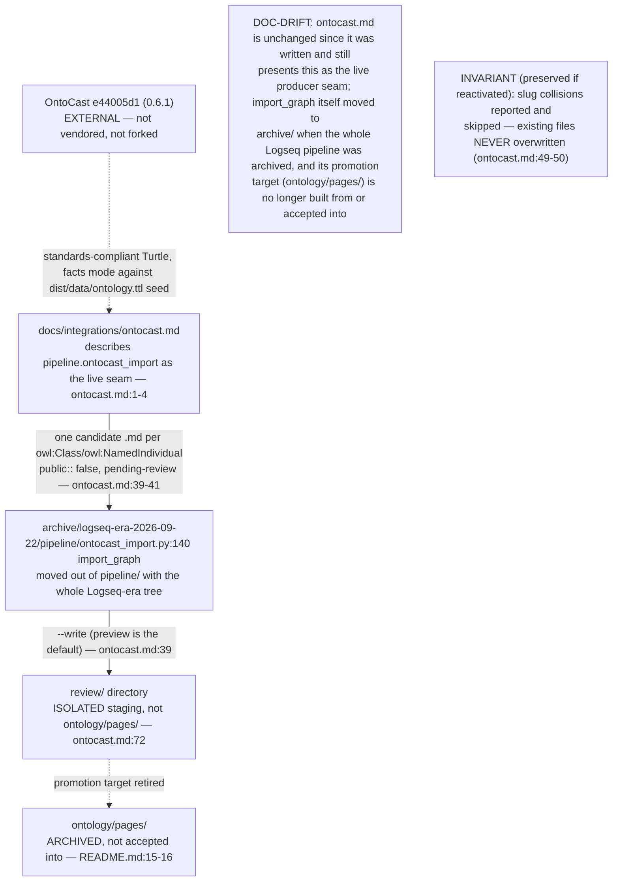

## KG-06.1 Sibling repository map — what actually depends on what

```mermaid
flowchart TB
    VG["DreamLab-AI/visionGraph — publishing pipeline under<br/>knowledgeGraph terms #40;licensing.md:18#41;<br/>EXTERNAL: the authoring vault now — see VG-01..06"]
    KG["this repo — knowledgeGraph<br/>ODbL-1.0 published export + archived AGPL pipeline + MIT explorer"]
    VC["DreamLab-AI/VisionClaw — AGPL-3.0<br/>EXTERNAL: see VC-20, VC-21"]
    WV["DreamLab-AI/WasmVOWL — MIT<br/>direct upstream of explorer/"]
    VW["vowl-wasm — the NGG1 reader crate<br/>EXTERNAL: see VW-*"]
    VF["DreamLab-AI/VisionFlow — no root licence<br/>documentation/website canon"]
    AB["DreamLab-AI/agentbox — AGPL-3.0<br/>EXTERNAL: see AB-24, AB-25 — tooling provenance, no code dep"]
    MO["DreamLab-AI/Metaverse-Ontology — closest independent precedent<br/>Logseq properties + Rust extractor, different method"]
    SPR["DreamLab-AI/solid-pod-rs — AGPL-3.0<br/>indirect: cause of VisionClaw's AGPL relicence"]
    SSR["DreamLab-AI/sidestr-rs — AGPL-3.0-only<br/>listed 2026-10-02 as an estate sibling, NOT a corpus consumer<br/>knowledgeGraph/README.md:356"]
    VG -->|"publish.yml deploys gh-pages to external_repository — see VG-03.1, VG-04.1"| KG
    VG -.->|"primary corpus source now #40;ADR-2114#41;, plus a corpus-sync dispatch<br/>after each deploy since 2026-10-01 — see VC-21, VG-04.1"| VC
    KG -->|"fetches markdown + Turtle over GitHub — see KG-06.2"| VC
    WV -->|"explorer/ is a fork, MIT lineage"| KG
    WV -.->|"same MIT-derivative lineage"| VW
    VW -->|"@dreamlab-ai/vowl-wasm release tarball"| KG
    VC -.->|"AGPL relicence caused by linking"| SPR
    note1["Excluded deliberately: VisionFlow-Ontology-Engine is a fork of<br/>OpenPlanter #40;op-cli/op-core/...#41;, nothing to do with this corpus<br/>#40;ecosystem.md:213-219#41;"]
    note2["ARCHIVED at HEAD: this repo's own ontology/pages/ source tree and<br/>seven-stage rdflib pipeline/ are archived — kept for history, not built<br/>from, not accepted into #40;README.md:15-16#41;"]
```
- **No dependency edge for sidestr-rs:** the README added it to the sibling table on 2026-10-02 with the explicit qualifier "Estate sibling, not a corpus consumer" (`../knowledgeGraph/README.md:356`), so it appears on the map with no arrow; nothing in this repo reads or is read by it.
- **Authoring moved:** the corpus of record is now visionGraph's Obsidian vault, not this repo's `ontology/pages/` — see VG-01 for the vault contract and VG-04.3 for the two independent distribution paths that both start from it.

## KG-06.2 VisionClaw ingest — static artefact becomes a live, reasoned graph

```mermaid
sequenceDiagram
    autonumber
    participant KG as this repo — dist/data/ontology.ttl<br/>258,200 triples
    participant SYNC as GitHubSyncService<br/>EXTERNAL: VisionClaw — see VC-20/VC-21
    participant OXI as Oxigraph<br/>embedded RocksDB RDF quad store
    participant WHELK as Whelk-rs<br/>OWL 2 EL reasoner

    KG->>SYNC: fetch markdown + ontology #40;ecosystem.md:87-88#41;
    SYNC->>OXI: write asserted triples #40;SHACL-lite gated#41;
    OXI->>WHELK: classify
    WHELK-->>OXI: inferred axioms + PROV-O
    Note over KG,WHELK: transcribed from VisionClaw's own system-overview.md —<br/>message sequence lines 193-196, store description line 122,<br/>stack table line 244 #40;ecosystem.md:102-108#41;
    Note over KG: DOC-DRIFT, now INVERTED: docs/architecture/licensing.md:11 has been<br/>corrected and records VisionClaw as AGPL 3.0 only, but ecosystem.md:121-127<br/>still asserts that line "still says" MPL 2.0 — the stale side is now this repo
    Note over WHELK: agentbox's Ontology Loom facade and ontology-bridge MCP tools<br/>#40;ontology_ask/ontology_search/kg_pathfind#41; ground against THIS reasoned<br/>graph inside VisionClaw, not this repo's static ontology.ttl — no agentbox<br/>program consumes knowledgeGraph's Turtle directly #40;see AB-24, AB-25#41;
```
- **Drift (ecosystem.md vs licensing.md):** `../knowledgeGraph/docs/ecosystem.md:125-127` says VisionClaw is "**not** MPL 2.0 today, despite what VisionFlow's `docs/architecture/licensing.md` line 11 still says"; that line now reads "AGPL 3.0 only" with the MPL relicense marked as proposed (`docs/architecture/licensing.md:11`), so the two agree and only the commentary is stale.
- **Secondary path, not default (see VC-21, VG-04.1):** VisionClaw's `CorpusSource` port now defaults to the visionGraph vault directly (ADR-2114); this GitHub-fetch sequence, still an accurate transcription of VisionClaw's own docs, is the remaining path from this repo's published `dist/data/ontology.ttl` rather than the primary ingest route.
- **Consumption point (folded from removed KG-06.2):** no agentbox program serves knowledgeGraph directly — the Loom facade (EXTERNAL, see AB-24: model-swappable, static scaffold ~3.5x recall) and the ontology-bridge MCP tools (EXTERNAL, see AB-25) ground against VisionClaw's WHELK-reasoned graph above (VC-20), never this repo's published Turtle file.

## KG-06.4 OntoCast integration — archived with the Logseq pipeline, doc still describes it as live

```mermaid
flowchart TB
    OC["OntoCast e44005d1 #40;0.6.1#41;<br/>EXTERNAL — not vendored, not forked"]
    DOC["docs/integrations/ontocast.md<br/>describes pipeline.ontocast_import as the live seam — ontocast.md:1-4"]
    ARCH["archive/logseq-era-2026-09-22/pipeline/ontocast_import.py:140 import_graph<br/>moved out of pipeline/ with the whole Logseq-era tree"]
    REVIEW["review/ directory<br/>ISOLATED staging, not ontology/pages/ — ontocast.md:72"]
    CORPUS["ontology/pages/<br/>ARCHIVED, not accepted into — README.md:15-16"]

    OC -.->|"standards-compliant Turtle, facts mode against dist/data/ontology.ttl seed"| DOC
    DOC -->|"one candidate .md per owl:Class/owl:NamedIndividual<br/>public:: false, pending-review — ontocast.md:39-41"| ARCH
    ARCH -->|"--write #40;preview is the default#41; — ontocast.md:39"| REVIEW
    REVIEW -.->|"promotion target retired"| CORPUS
    note1["DOC-DRIFT: ontocast.md is unchanged since it was written and still<br/>presents this as the live producer seam; import_graph itself moved to<br/>archive/ when the whole Logseq pipeline was archived, and its promotion<br/>target #40;ontology/pages/#41; is no longer built from or accepted into"]
    note2["INVARIANT #40;preserved if reactivated#41;: slug collisions reported and<br/>skipped — existing files NEVER overwritten #40;ontocast.md:49-50#41;"]
```
- **Status:** historical, not operational, at HEAD — `pipeline/ontocast_import.py` no longer exists on that path; only the archived copy above does.
