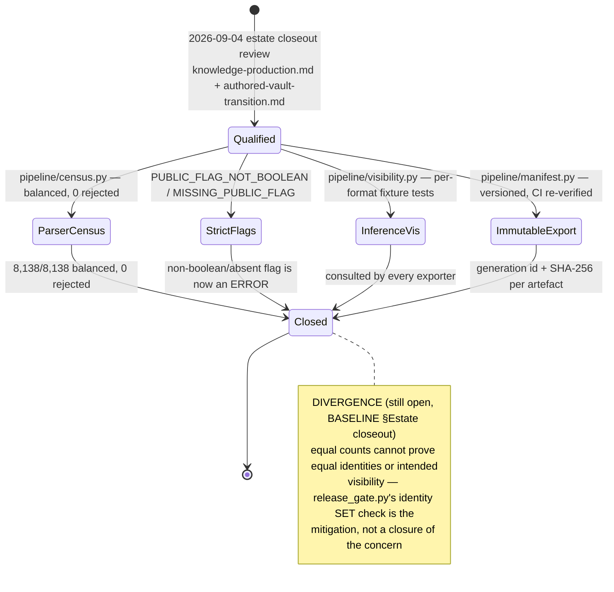
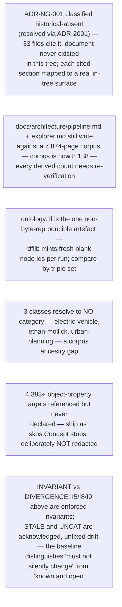

## KG-07.1 The 11 baseline invariants

```mermaid
flowchart TB
    I1["1 · vc:public is the ONLY publication gate — strictly boolean,<br/>re-checked in every output stage"]
    I2["2 · NGG1 node record is 24 bytes, one u16 category —<br/>writer + both readers pinned to a 183-byte golden fixture"]
    I3["3 · Bridged membership recoverable ONLY from bridges.json —<br/>binary category is nearest, not membership"]
    I4["4 · Pipeline deterministic within a day for every artefact<br/>EXCEPT ontology.ttl — compare that one by triple set"]
    I5["5 · Corpus is synthetic-AI-generated-under-human-direction,<br/>surfaced from data #40;ATTRIBUTED_TO, CORPUS_NATURE#41;, never rebranded"]
    I6["6 · EXPECTED_CLASSES in build.yml must equal the true class<br/>count, moved in lockstep with any corpus change"]
    I7["7 · SharedArrayBuffer transport stays disabled until a<br/>double-buffered SAB with Atomics-gated flip lands"]
    I8["8 · Every input file accounted for — input_files == parsed<br/>+ rejected + excluded; a release has zero rejected"]
    I9["9 · No public artefact contains a private identifier —<br/>visibility.py at every output, release gate re-scans"]
    I10["10 · Count and identity move together — EXPECTED_CLASSES<br/>and class-identity.txt agree, same commit"]
    I11["11 · Every export carries a generation manifest — source rev,<br/>generation id, counts, SHA-256 per artefact"]
    note1["BASELINE-narrativegoldmine.md:212-245 — numbered 1-11 verbatim"]
```

## KG-07.2 Estate closeout — four 2026-09-04 qualifications, closed 2026-09-05

## KG-07.3 Open items the baseline flags — what remains unresolved, by design or not

