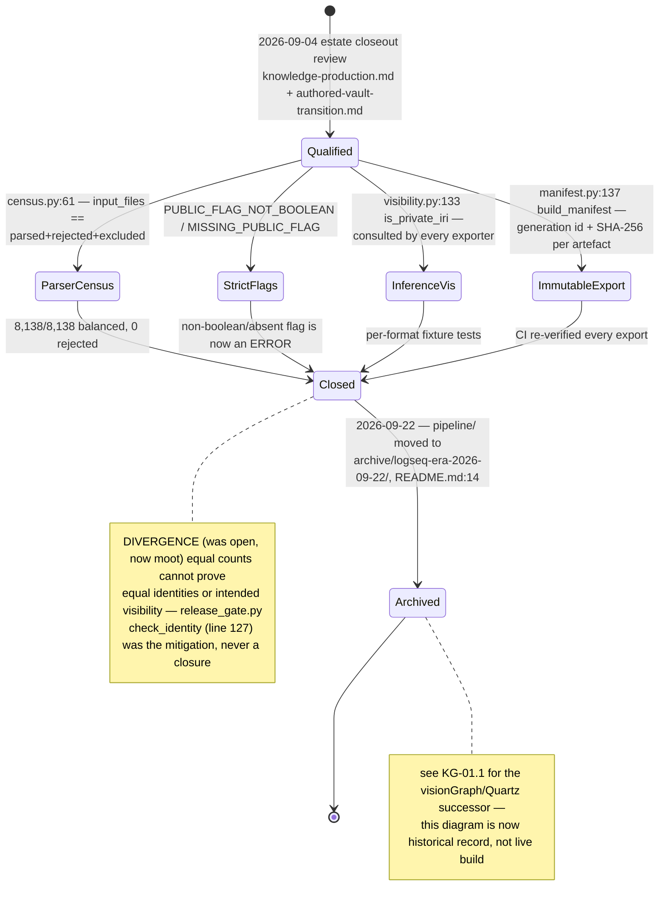
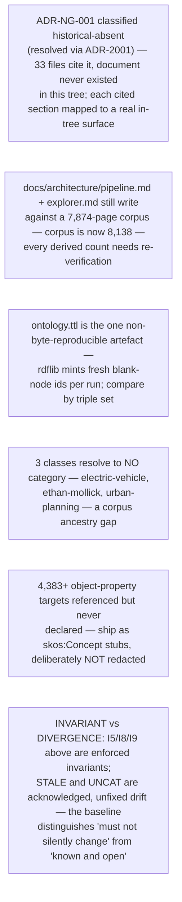

## KG-07.1 The 11 baseline invariants

```mermaid
flowchart TB
    I1["1 · vc:public is the ONLY publication gate — strictly boolean,<br/>re-checked in every output stage"]
    I2["2 · NGG1 node record is 24 bytes, one u16 category —<br/>writer + both readers pinned to a 183-byte golden fixture"]
    I3["3 · Bridged membership recoverable ONLY from bridges.json —<br/>binary category is nearest, not membership"]
    I4["4 · Bundle is NOT byte-deterministic — manifest UUID/time<br/>and Turtle blank-node ids vary; verify each generation<br/>against its own manifest, compare RDF by triple set"]
    I5["5 · Corpus is synthetic-AI-generated-under-human-direction,<br/>surfaced from data #40;ATTRIBUTED_TO, CORPUS_NATURE#41;, never rebranded"]
    I6["6 · EXPECTED_CLASSES in build.yml must equal the true class<br/>count, moved in lockstep with any corpus change"]
    I7["7 · SharedArrayBuffer transport stays disabled until a<br/>double-buffered SAB with Atomics-gated flip lands"]
    I8["8 · Every input file accounted for — input_files == parsed<br/>+ rejected + excluded; a release has zero rejected"]
    I9["9 · No public artefact contains a private identifier —<br/>visibility.py at every output, release gate re-scans"]
    I10["10 · Count and identity move together — EXPECTED_CLASSES<br/>and class-identity.txt agree, same commit"]
    I11["11 · Every export carries a generation manifest — source rev,<br/>generation id, counts, SHA-256 per artefact"]
    note1["BASELINE-narrativegoldmine.md:182-214 — numbered 1-11 verbatim"]
```

## KG-07.2 Estate closeout, now archived — four 2026-09-04 qualifications, closed 2026-09-05, pipeline retired 2026-09-22

```mermaid
stateDiagram-v2
    [*] --> Qualified: 2026-09-04 estate closeout review<br/>knowledge-production.md + authored-vault-transition.md
    Qualified --> ParserCensus: census.py:61 — input_files ==<br/>parsed+rejected+excluded
    Qualified --> StrictFlags: PUBLIC_FLAG_NOT_BOOLEAN / MISSING_PUBLIC_FLAG
    Qualified --> InferenceVis: visibility.py:133 is_private_iri —<br/>consulted by every exporter
    Qualified --> ImmutableExport: manifest.py:137 build_manifest —<br/>generation id + SHA-256 per artefact
    ParserCensus --> Closed: 8,138/8,138 balanced, 0 rejected
    StrictFlags --> Closed: non-boolean/absent flag is now an ERROR
    InferenceVis --> Closed: per-format fixture tests
    ImmutableExport --> Closed: CI re-verified every export
    Closed --> Archived: 2026-09-22 — pipeline/ moved to<br/>archive/logseq-era-2026-09-22/, README.md:14
    Archived --> [*]
    note right of Closed: DIVERGENCE #40;was open, now moot#41; equal counts cannot prove<br/>equal identities or intended visibility — release_gate.py<br/>check_identity #40;line 127#41; was the mitigation, never a closure
    note right of Archived: see KG-01.1 for the visionGraph/Quartz successor —<br/>this diagram is now historical record, not live build
```

## KG-07.3 Open items the baseline flags — what remains unresolved, by design or not

```mermaid
flowchart LR
    ADRNG["ADR-NG-001 classified historical-absent<br/>#40;resolved via ADR-2001#41; — 33 files cite it, document never existed<br/>in this tree; each cited section mapped to a real in-tree surface"]
    STALE["docs/architecture/pipeline.md + explorer.md still write<br/>against a 7,874-page corpus — corpus is now 8,138 —<br/>every derived count needs re-verification"]
    TTLNODET["ontology.ttl is the one non-byte-reproducible artefact —<br/>rdflib mints fresh blank-node ids per run; compare by triple set"]
    UNCAT["3 classes resolve to NO category — electric-vehicle,<br/>ethan-mollick, urban-planning — a corpus ancestry gap"]
    STUBS["4,383+ object-property targets referenced but never<br/>declared — ship as skos:Concept stubs, deliberately NOT redacted"]
    note1["INVARIANT vs DIVERGENCE: I5/I8/I9 above are enforced invariants;<br/>STALE and UNCAT are acknowledged, unfixed drift — the baseline<br/>distinguishes 'must not silently change' from 'known and open'"]
```
