# Mermaid Diagram Style Guide & Standards

## Purpose

This style guide establishes consistent notation, colors, themes, and complexity guidelines for all Mermaid diagrams in the VisionFlow documentation corpus.

## 1. Diagram Types & When to Use

### Graph/Flowchart (`graph TB`)
**Use for:** System architecture, component relationships, hierarchies
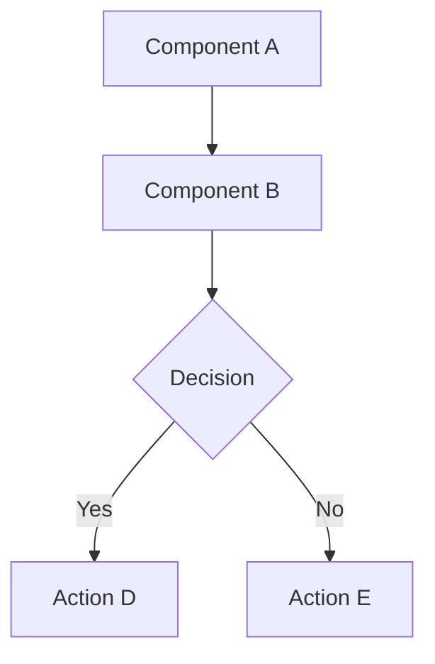

### Sequence Diagram (`sequenceDiagram`)
**Use for:** Request/response flows, protocol interactions, time-based processes
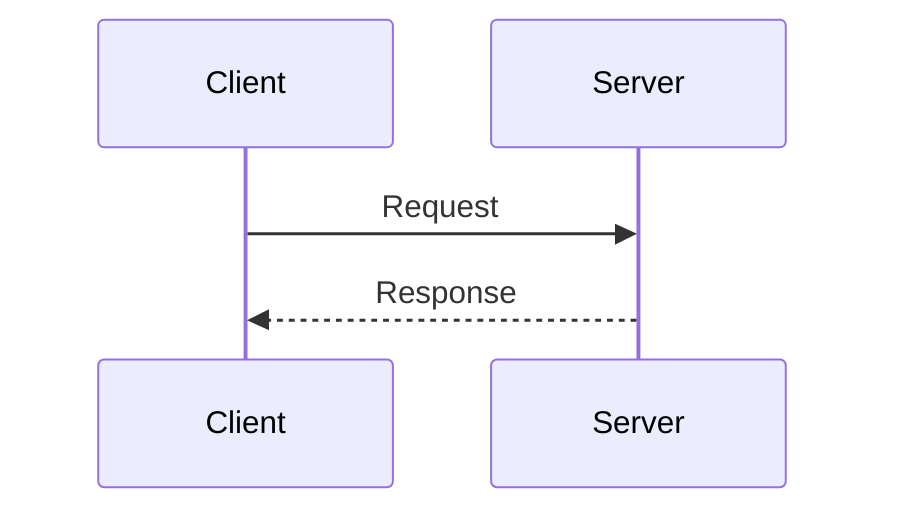

### State Diagram (`stateDiagram-v2`)
**Use for:** Actor lifecycles, state machines, workflow states
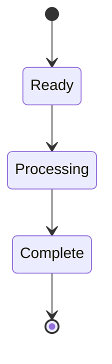

### Entity Relationship (`erDiagram`)
**Use for:** Database schemas, data models, relationships
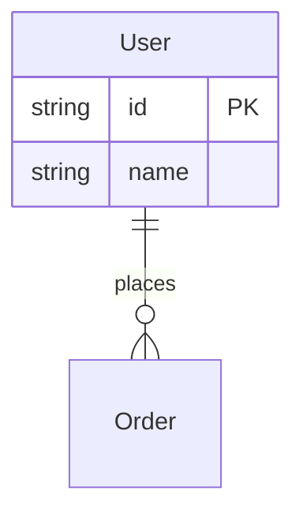

### Class Diagram (`classDiagram`)
**Use for:** Object-oriented design, type hierarchies, interfaces
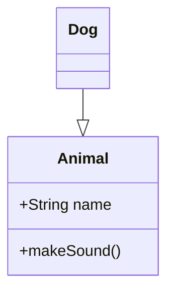

### Gantt Chart (`gantt`)
**Use for:** Project timelines, milestones, schedules
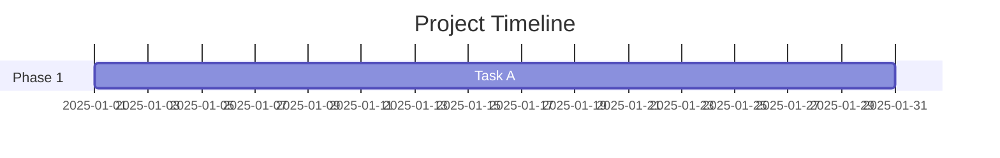

## 2. Color Scheme & Semantic Meaning

### Standard Color Palette

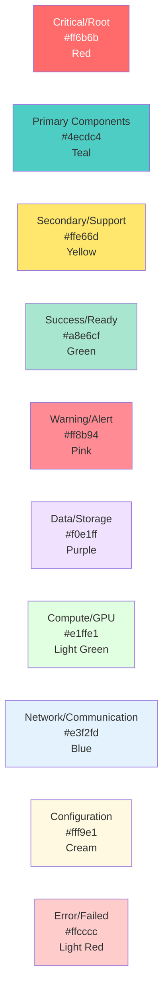

### Color Application Rules

1. **Root/Supervisor Nodes**: `#ff6b6b` (Red) with white text
2. **Core Components**: `#4ecdc4` (Teal)
3. **Secondary/Support**: `#ffe66d` (Yellow)
4. **Ready/Success States**: `#a8e6cf` (Green)
5. **Warning/Alert**: `#ff8b94` (Pink)
6. **Databases/Storage**: `#f0e1ff` (Purple)
7. **GPU/Compute**: `#e1ffe1` (Light Green)
8. **Network/WebSocket**: `#e3f2fd` (Blue)
9. **Configuration**: `#fff9e1` (Cream)
10. **Error/Failed**: `#ffcccc` (Light Red)

## 3. Node Formatting Standards

### Basic Node Syntax
```
NodeID[Label Text<br/>Additional Info]
```

### Multi-line Labels
Use `<br/>` for line breaks:
```
WebSocket[WebSocket Service<br/>Binary Protocol V4<br/>50k Concurrent Connections]
```

### Node Metadata Format
```
Component[Component Name<br/>Primary Function<br/>Key Metric/Detail]
```

Example:
```
GSA[GraphStateActor<br/>7-State Machine<br/>In-memory Graph State]
```

## 4. Edge/Connection Standards

### Arrow Types

| Syntax | Visual | Meaning |
|--------|--------|---------|
| `-->` | Solid arrow | Direct dependency, data flow |
| `-.->` | Dashed arrow | Async/indirect, replication |
| `==>` | Thick arrow | Primary/critical path |
| `<-->` | Bidirectional | Two-way communication |
| `--o` | Circle end | One-to-many relationship |
| `--x` | Cross end | Prevented/blocked |

### Edge Labels
```
A -->|Label Text| B
A -.->|Async Replication| B
```

## 5. Subgraph Organization

### Hierarchical Structure
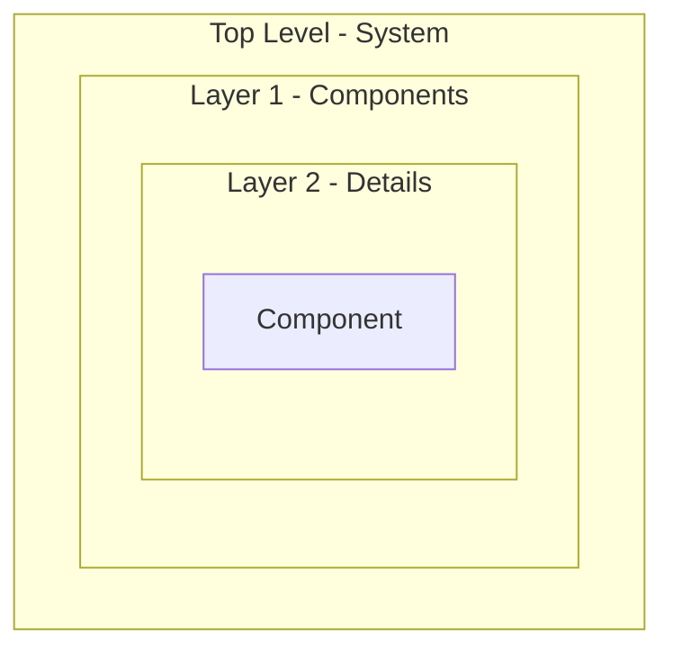

### Subgraph Naming
- Use quotes for multi-word names
- Include layer/purpose in name
- Use consistent indentation

### Direction Control
```
subgraph "Name"
    direction TB  %% Top to Bottom
    direction LR  %% Left to Right
end
```

## 6. Complexity Guidelines

### Simple Diagrams (5-15 nodes)
- High-level overviews
- Quick reference
- Introductory concepts

### Medium Diagrams (15-40 nodes)
- Component interactions
- Subsystem architecture
- Typical workflows

### Complex Diagrams (40-100 nodes)
- Complete system architecture
- Comprehensive data flows
- Full component inventory

### Maximum Complexity (100+ nodes)
- Use sparingly
- Break into multiple related diagrams
- Provide cross-references

## 7. Reusable Diagram Templates

### Template 1: Three-Layer Architecture
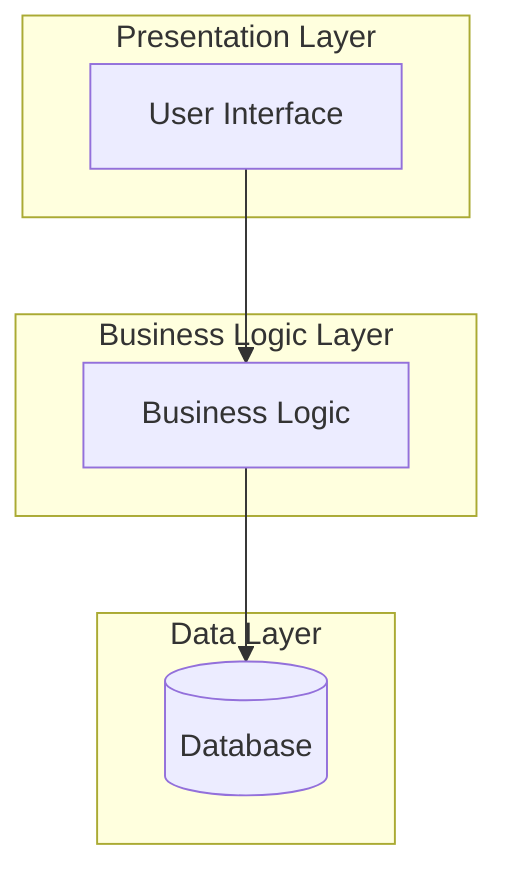

### Template 2: Request/Response Flow
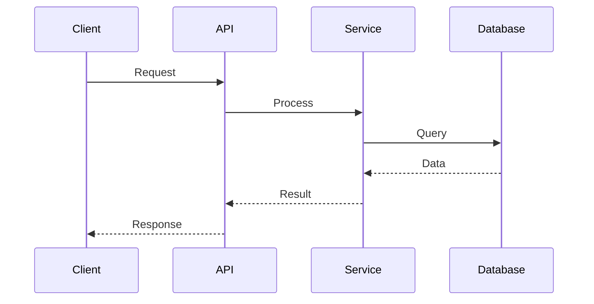

### Template 3: State Machine
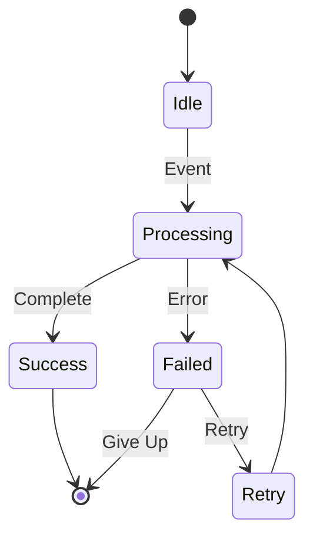

### Template 4: Actor Supervision
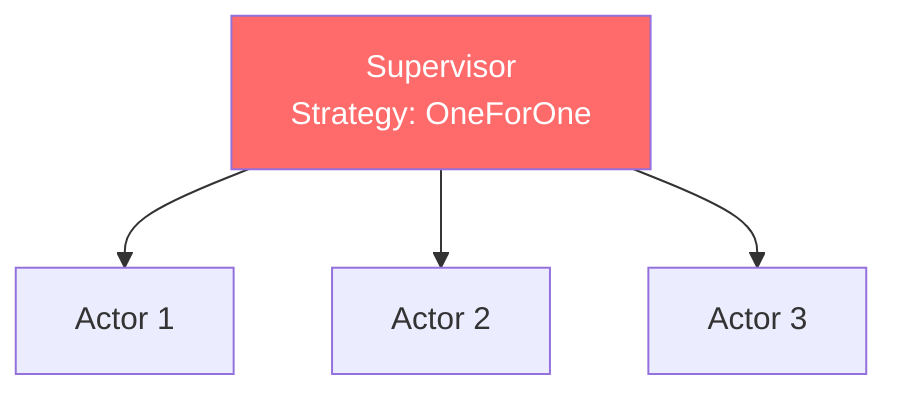

## 8. Best Practices

### DO:
- Use consistent colors across related diagrams
- Keep node labels concise (3 lines max)
- Group related components in subgraphs
- Add notes for complex logic
- Use semantic colors (red for critical, green for ready)
- Include metrics where relevant
- Cross-reference related diagrams

### DON'T:
- Mix color schemes within a diagram
- Create diagrams with >100 nodes without justification
- Use inconsistent arrow styles
- Omit important relationships to simplify
- Use unclear abbreviations
- Nest subgraphs more than 3 levels deep

## 9. Documentation Integration

### Diagram Header Template
```markdown
## Diagram Title

**Purpose:** Brief description
**Complexity:** Simple/Medium/Complex
**Related Diagrams:** Links to related docs

[Mermaid diagram code]

**Key Components:**
- Component 1: Description
- Component 2: Description

**Notes:**
- Important detail 1
- Important detail 2
```

### Cross-Reference Format
```markdown
See also:
- [System Architecture](01-system-architecture-overview.md#section)
- [Data Flows](02-data-flow-diagrams.md#github-sync)
```

## 10. Validation Checklist

Before committing a new Mermaid diagram:

- [ ] Diagram renders without errors
- [ ] Colors follow the style guide
- [ ] Node labels are clear and concise
- [ ] Subgraphs are logically organized
- [ ] Complexity is appropriate for purpose
- [ ] All components are labeled
- [ ] Direction is clear (TB/LR)
- [ ] Related diagrams are cross-referenced
- [ ] Diagram matches code implementation
- [ ] Documentation header is complete

## 11. Tools & Validation

### Local Validation
```bash
# Install Mermaid CLI
npm install -g @mermaid-js/mermaid-cli

# Validate diagram syntax
mmdc -i diagram.mmd -o /dev/null

# Generate SVG
mmdc -i diagram.mmd -o diagram.svg
```

### Online Editors
- Mermaid Live Editor: https://mermaid.live
- VS Code Extension: "Mermaid Preview"

### CI/CD Integration
```yaml
# .github/workflows/validate-diagrams.yml
name: Validate Mermaid Diagrams
on: [push, pull_request]
jobs:
  validate:
    runs-on: ubuntu-latest
    steps:
      - uses: actions/checkout@v4
      - run: npm install -g @mermaid-js/mermaid-cli
      - run: find docs -name "*.md" -exec mmdc -i {} -o /dev/null \;
```

## 12. Performance Considerations

### Rendering Performance

| Nodes | Performance | Best For |
|-------|-------------|----------|
| < 20 | Instant | Quick references |
| 20-50 | Fast (<1s) | Standard diagrams |
| 50-100 | Moderate (1-3s) | Complex systems |
| 100+ | Slow (3-10s) | Comprehensive docs |

### Optimization Tips
1. Split large diagrams into related smaller ones
2. Use external links instead of embedding everything
3. Lazy-load complex diagrams
4. Generate static SVGs for heavy pages

## 13. Accessibility

### Alt Text
```markdown
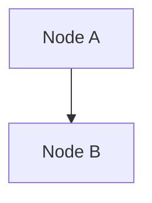
*Figure 1: System architecture showing connection from Node A to Node B*
```

### Screen Reader Support
- Use descriptive node labels
- Provide text summary below diagram
- Include structured data (tables) where applicable

## 14. Version Control

### Diagram Versioning
```markdown
**Last Updated:** 2025-12-18
**Diagram Version:** 2.1
**Changes:** Added GPU cluster, updated colors
```

### Migration Path
When updating diagrams:
1. Archive old version in `/archive/diagrams/`
2. Update cross-references
3. Document changes in commit message
4. Update related documentation

---

**Document Version:** 1.0
**Last Updated:** 2025-12-18
**Authority:** VisionFlow Documentation Team
