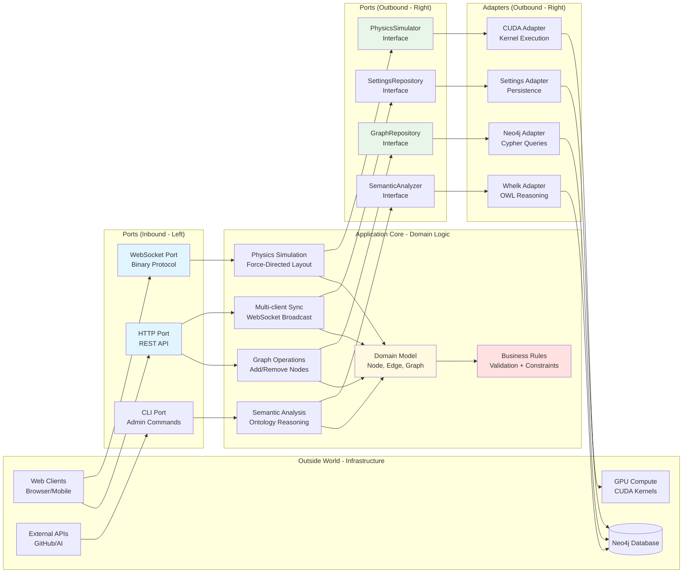
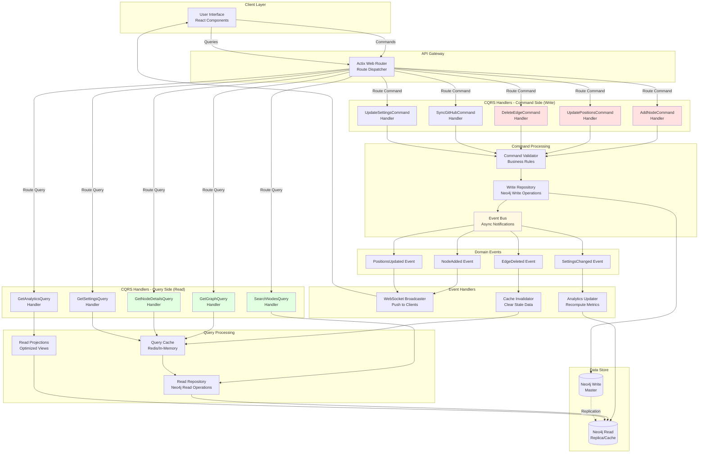
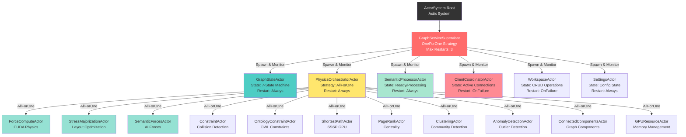
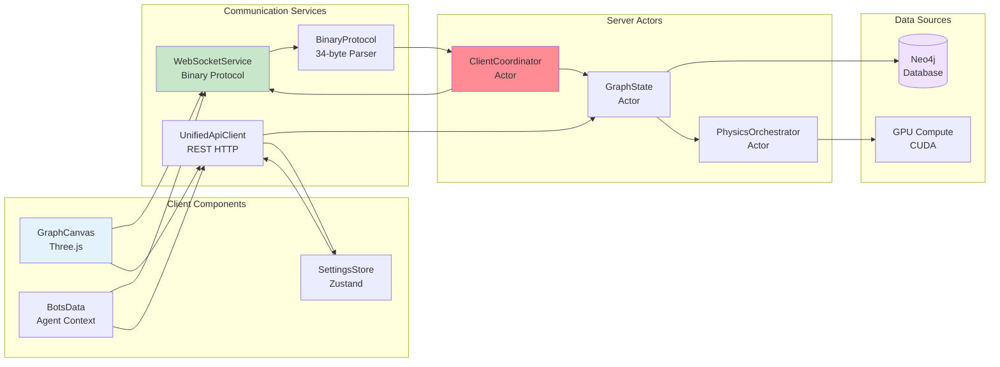

# System Architecture Overview - Complete Mermaid Diagrams

## 1. Full System Architecture

```mermaid
graph TB
    subgraph "Client Layer"
        Browser[Web Browser<br/>React + Three.js]
        XR[XR/VR Devices<br/>Meta Quest 3]
        Mobile[Mobile Clients<br/>iOS/Android]
    end

    subgraph "Presentation Layer"
        WebUI[Web UI<br/>React 18 + TypeScript]
        ThreeJS[Three.js Renderer<br/>WebGL 2.0]
        XRRuntime[WebXR Runtime<br/>Hand Tracking]
    end

    subgraph "Communication Layer"
        WS[WebSocket Server<br/>Binary Protocol V4]
        REST[REST API<br/>Actix Web 4.11]
        Voice[Voice WebSocket<br/>Whisper STT + Kokoro TTS]
    end

    subgraph "Application Layer - Hexagonal Core"
        direction TB

        subgraph "Ports (9 Interfaces)"
            P1[GraphRepository]
            P2[KnowledgeGraphRepository]
            P3[OntologyRepository]
            P4[SettingsRepository]
            P5[PhysicsSimulator]
            P6[SemanticAnalyzer]
            P7[GpuPhysicsAdapter]
            P8[GpuSemanticAnalyzer]
            P9[InferenceEngine]
        end

        subgraph "Business Logic"
            CQRS[CQRS Handlers<br/>~114 Commands/Queries]
            Domain[Domain Services<br/>Graph Operations]
            Workflow[Workflow Engine<br/>Multi-step Processes]
        end

        subgraph "Adapters (12 Implementations)"
            A1[Neo4jAdapter]
            A2[Neo4jGraphRepository]
            A3[Neo4jSettingsRepository]
            A4[Neo4jOntologyRepository]
            A5[GpuSemanticAnalyzerAdapter]
            A6[ActixPhysicsAdapter]
        end
    end

    subgraph "Actor System (21 Actors)"
        Supervisor[GraphServiceSupervisor<br/>Fault Tolerance]

        subgraph "Core Actors"
            GSA[GraphStateActor<br/>7-State Machine]
            PO[PhysicsOrchestratorActor<br/>GPU Coordinator]
            SP[SemanticProcessorActor<br/>AI Analysis]
            CC[ClientCoordinatorActor<br/>Multi-client Sync]
        end

        subgraph "GPU Actors (11)"
            FC[ForceComputeActor]
            SM[StressMajorizationActor]
            SF[SemanticForcesActor]
            CA[ConstraintActor]
            OC[OntologyConstraintActor]
            SPA[ShortestPathActor]
            PR[PageRankActor]
            CLA[ClusteringActor]
            AD[AnomalyDetectionActor]
            CCO[ConnectedComponentsActor]
            GR[GPUResourceActor]
        end

        subgraph "Support Actors"
            WA[WorkspaceActor]
            SA[SettingsActor]
            OSA[OptimizedSettingsActor]
        end
    end

    subgraph "Infrastructure Layer"
        subgraph "Database"
            Neo4j[(Neo4j 5.13<br/>Graph Database)]
            OWL[OWL Ontologies<br/>Whelk Reasoner]
        end

        subgraph "GPU Compute"
            CUDA[CUDA 12.4<br/>87 Kernels]
            Physics[Physics Engine<br/>Barnes-Hut + Verlet]
            ML[ML Algorithms<br/>Clustering + Pathfinding]
        end

        subgraph "External Services"
            GitHub[GitHub API<br/>Markdown Sync]
            AI[AI Services<br/>Claude + Perplexity]
            Auth[Nostr Auth<br/>Decentralized Identity]
        end
    end

    subgraph "Data Storage"
        GraphData[(Knowledge Graph<br/>Nodes + Edges)]
        Ontologies[(Ontology Store<br/>OWL Classes)]
        UserSettings[(User Settings<br/>Per-client Config)]
        Workspaces[(Workspaces<br/>Multi-tenant Data)]
    end

    Browser --> WebUI
    XR --> XRRuntime
    Mobile --> WebUI

    WebUI --> ThreeJS
    ThreeJS --> WS
    WebUI --> REST
    XRRuntime --> Voice

    WS --> CC
    REST --> CQRS
    Voice --> SP

    CQRS --> P1
    CQRS --> P2
    CQRS --> P3
    CQRS --> P4
    Domain --> P5
    Domain --> P6
    Workflow --> P7
    Workflow --> P8
    SP --> P9

    P1 --> A2
    P2 --> A1
    P3 --> A4
    P4 --> A3
    P5 --> A6
    P6 --> A5
    P7 --> A6
    P8 --> A5

    A1 --> Neo4j
    A2 --> Neo4j
    A3 --> Neo4j
    A4 --> Neo4j
    A4 --> OWL

    A5 --> CUDA
    A6 --> CUDA

    Supervisor --> GSA
    Supervisor --> PO
    Supervisor --> SP
    Supervisor --> CC
    Supervisor --> WA
    Supervisor --> SA
    Supervisor --> OSA

    PO --> FC
    PO --> SM
    PO --> SF
    PO --> CA
    PO --> OC
    PO --> SPA
    PO --> PR
    PO --> CLA
    PO --> AD
    PO --> CCO
    PO --> GR

    GSA --> Neo4j
    CC --> WS

    FC --> Physics
    SPA --> ML
    CLA --> ML
    PR --> ML

    Neo4j --> GraphData
    Neo4j --> Ontologies
    Neo4j --> UserSettings
    Neo4j --> Workspaces

    GitHub --> A1
    AI --> SP
    Auth --> A3

    style Browser fill:#e1f5ff
    style Supervisor fill:#ff6b6b,color:#fff
    style Neo4j fill:#f0e1ff
    style CUDA fill:#e1ffe1
    style CQRS fill:#fff9e1
```

## 2. Hexagonal Architecture Pattern

## 3. CQRS Pattern Implementation

## 4. Actor System Supervision Tree

---

---

## Related Documentation

- [Deployment & Infrastructure Diagrams](03-deployment-infrastructure.md)
- [Complete System Data Flow Documentation](../data-flow/complete-data-flows.md)
- [ASCII Diagram Deprecation - Complete Report](../../ASCII_DEPRECATION_COMPLETE.md)
- [Server Architecture](../../concepts/architecture/core/server.md)
- [Hexagonal Architecture Migration Status Report](../../architecture/HEXAGONAL_ARCHITECTURE_STATUS.md)

## 5. Component Interaction Matrix

