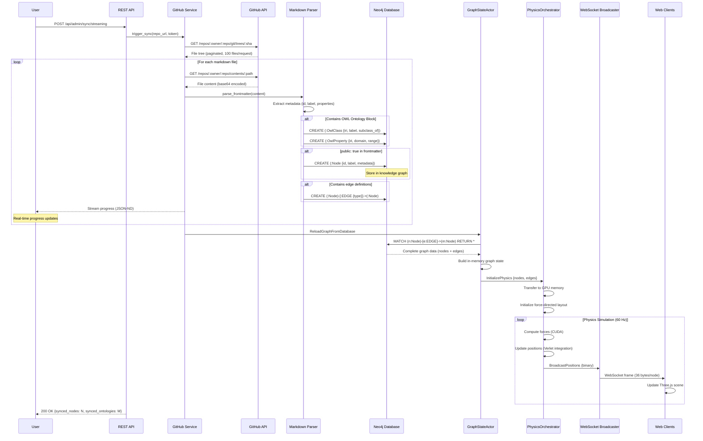
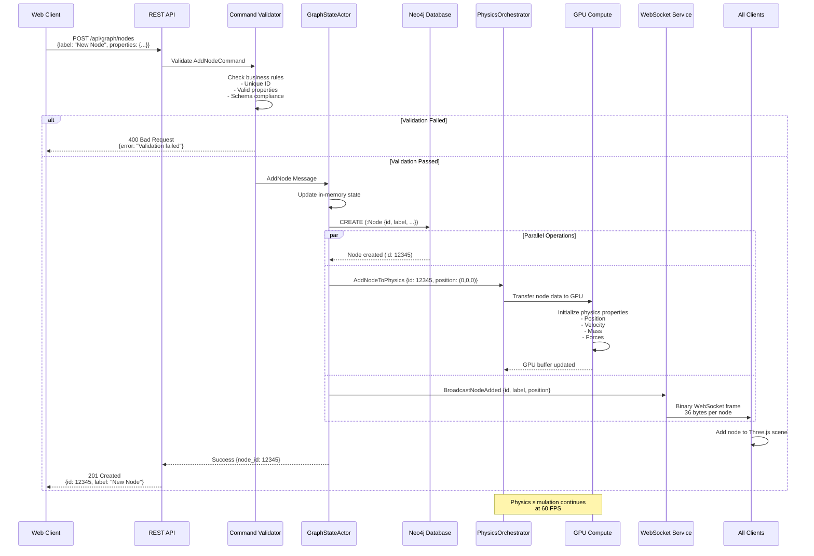
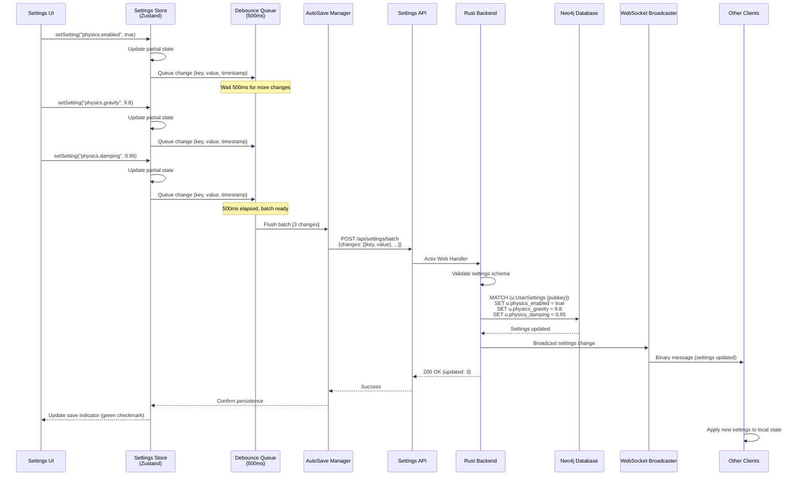
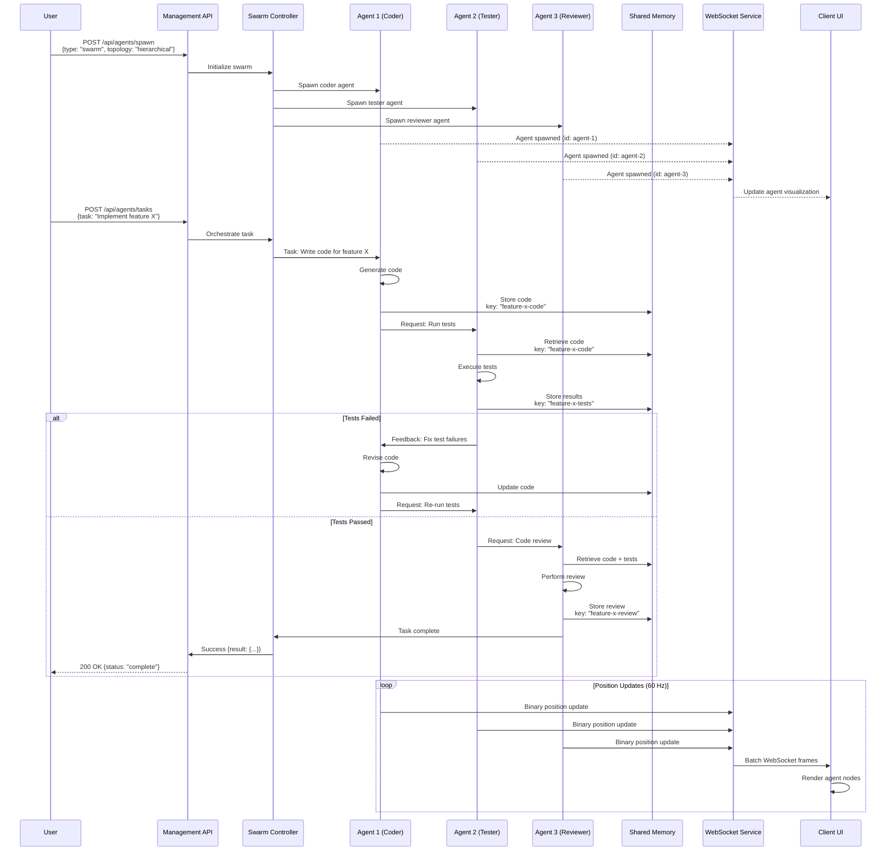
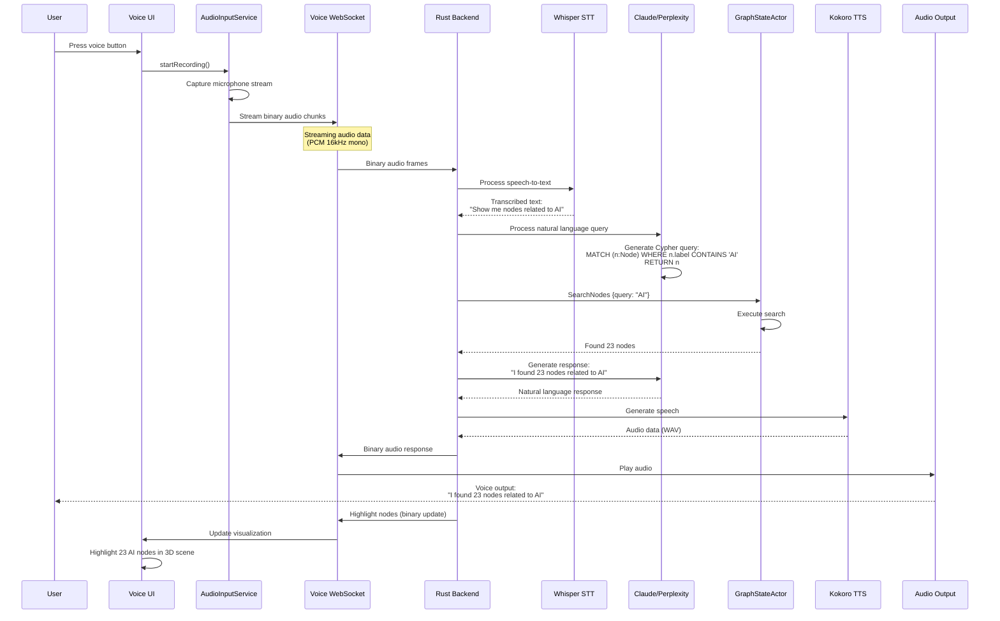
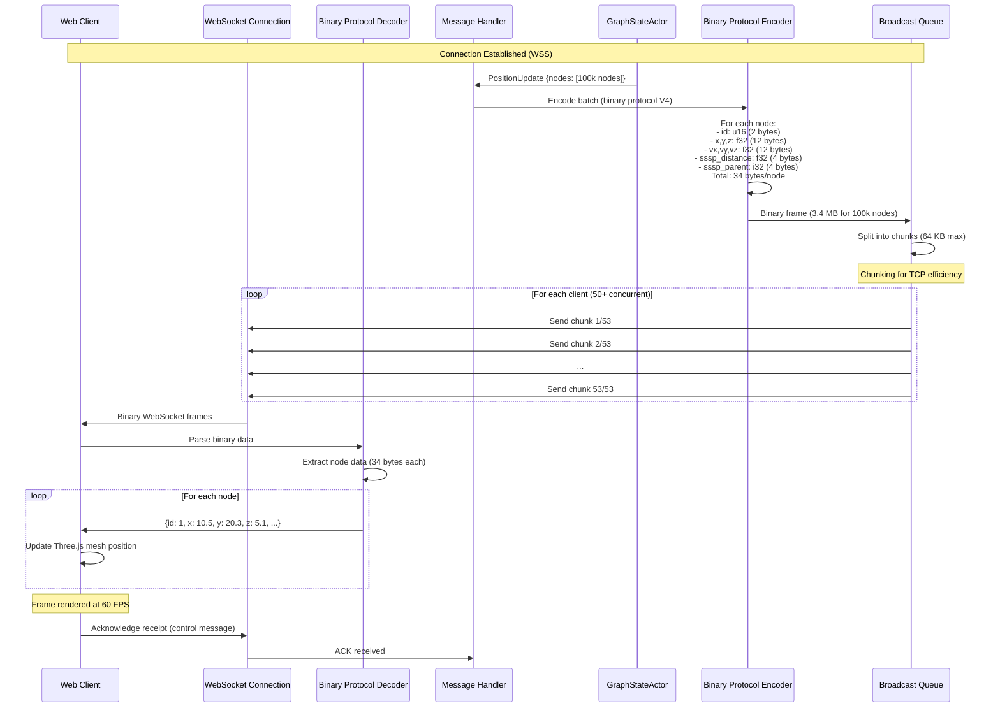
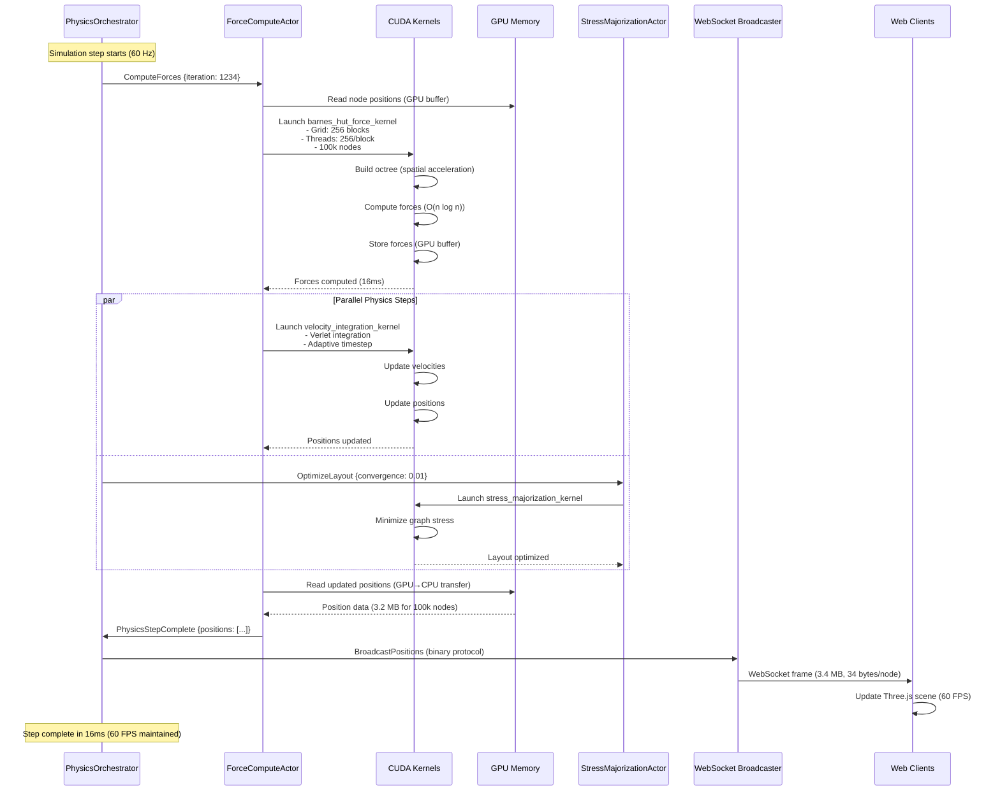
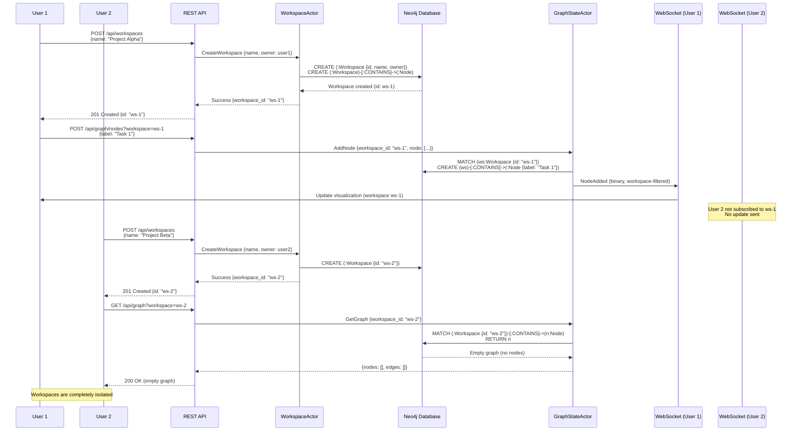

# Data Flow Diagrams - End-to-End Processes

## 1. GitHub Sync - Complete Flow

## 2. Real-time Graph Update Flow

## 3. Settings Update Flow (Debounced)

## 4. Agent Coordination Flow

## 5. Voice Interaction Flow

## 6. WebSocket Binary Protocol Flow

## 7. GPU Physics Simulation Flow

## 8. Multi-Workspace Flow

