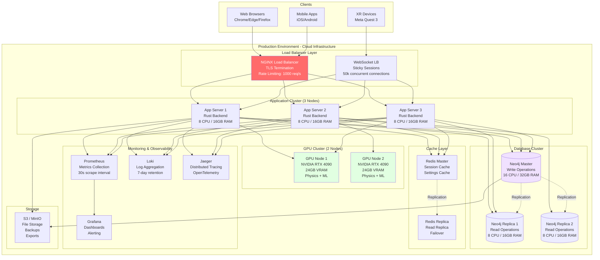
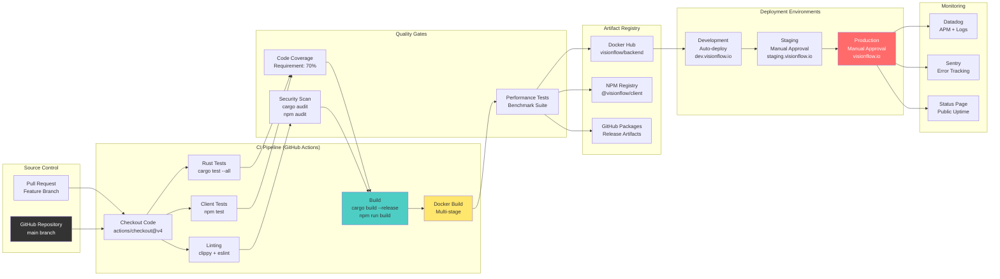
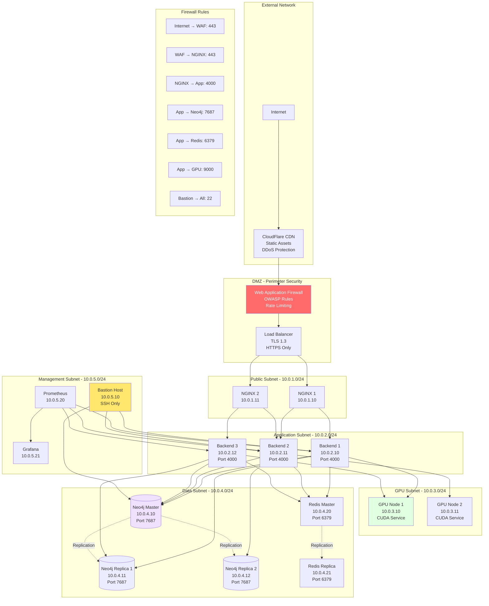
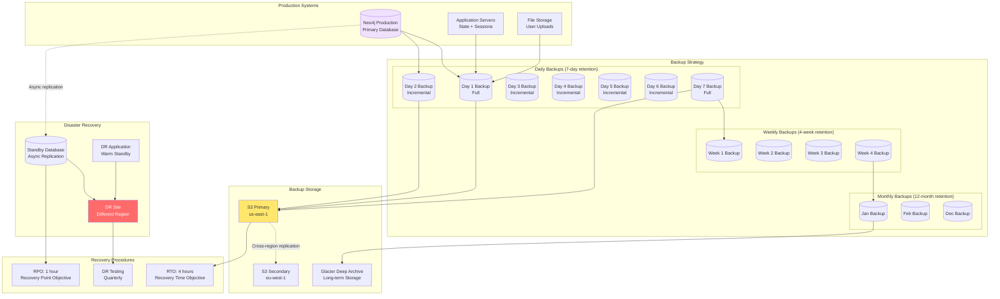

# Deployment & Infrastructure Diagrams

## 1. Deployment Topology



## 2. Docker Container Architecture

```mermaid
graph TB
    subgraph "Docker Host - Multi-User Development Environment"
        subgraph "Primary Container: turbo-flow-unified"
            direction TB

            subgraph "User Isolation"
                DevUser[devuser UID:1000<br/>Primary Development<br/>Claude Code]
                GeminiUser[gemini-user UID:1001<br/>Gemini Flow<br/>66 Agents]
                OpenAIUser[openai-user UID:1002<br/>OpenAI Codex<br/>API Integration]
                ZaiUser[zai-user UID:1003<br/>Z.AI Service<br/>Port 9600]
            end

            subgraph "Services (Supervisord)"
                MgmtAPI[Management API<br/>Port 9090<br/>FastAPI]
                ZaiService[Z.AI Service<br/>Port 9600<br/>4 Workers]
                VNC[VNC Server<br/>Port 5901<br/>Desktop Access]
                SSH[SSH Server<br/>Port 22<br/>Mapped to 2222]
                CodeServer[code-server<br/>Port 8080<br/>VS Code Web]
            end

            subgraph "Development Tools"
                Rust[Rust 1.75+<br/>Cargo + Clippy]
                Python[Python 3.11<br/>Poetry + pip]
                Node[Node.js 20<br/>npm + pnpm]
                CUDA[CUDA 12.4<br/>Toolkit + Drivers]
            end

            subgraph "MCP Servers (5)"
                ClaudeFlow[claude-flow@alpha<br/>Swarm Orchestration]
                RuvSwarm[ruv-swarm<br/>Advanced Coordination]
                FlowNexus[flow-nexus@latest<br/>Cloud Features]
                GeminiFlow[gemini-flow<br/>66 Agents]
                Custom[Custom MCP Servers<br/>Project-specific]
            end

            subgraph "tmux Workspace (8 Windows)"
                W0[Win 0: Claude-Main<br/>Primary Shell]
                W1[Win 1: Claude-Agent<br/>Agent Execution]
                W2[Win 2: Services<br/>Supervisord Monitor]
                W3[Win 3: Development<br/>Python/Rust/CUDA]
                W4[Win 4: Logs<br/>Service Logs]
                W5[Win 5: System<br/>htop Monitoring]
                W6[Win 6: VNC-Status<br/>VNC Info]
                W7[Win 7: SSH-Shell<br/>General Shell]
            end
        end

        subgraph "Volume Mounts"
            WorkspaceVol[/workspace<br/>Project Files<br/>Persistent]
            CacheVol[/cache<br/>Build Cache<br/>Ephemeral]
            LogsVol[/logs<br/>Service Logs<br/>Persistent]
        end

        subgraph "Network"
            Bridge[Docker Bridge<br/>turbo-net]
        end
    end

    subgraph "Host Machine"
        Ports[Exposed Ports:<br/>2222 → SSH<br/>5901 → VNC<br/>8080 → code-server<br/>9090 → Management API]
        HostGPU[NVIDIA GPU<br/>Passthrough]
    end

    DevUser --> MgmtAPI
    DevUser --> ZaiService
    GeminiUser --> GeminiFlow
    ZaiUser --> ZaiService

    MgmtAPI --> ClaudeFlow
    MgmtAPI --> RuvSwarm
    MgmtAPI --> FlowNexus

    DevUser --> W0
    DevUser --> W1
    DevUser --> W3

    Rust --> WorkspaceVol
    Python --> WorkspaceVol
    Node --> WorkspaceVol
    CUDA --> HostGPU

    VNC --> Ports
    SSH --> Ports
    CodeServer --> Ports
    MgmtAPI --> Ports

    WorkspaceVol --> Bridge
    CacheVol --> Bridge
    LogsVol --> Bridge

    style DevUser fill:#4ecdc4
    style MgmtAPI fill:#ffe66d
    style ZaiService fill:#ff8b94
    style ClaudeFlow fill:#a8e6cf
```

## 3. Database Schema ER Diagram

```mermaid
erDiagram
    Node ||--o{ Edge : "connects"
    Node {
        u32 id PK
        string label
        string metadata_id
        string public
        string owl_class_iri FK
        jsonb properties
    }

    Edge {
        u32 id PK
        u32 source_id FK
        u32 target_id FK
        string edge_type
        jsonb properties
    }

    OwlClass ||--o{ Node : "classifies"
    OwlClass ||--o{ OwlProperty : "has"
    OwlClass {
        string iri PK
        string label
        string[] subclass_of
        string[] disjoint_with
        string[] equivalent_classes
        jsonb annotations
    }

    OwlProperty {
        string iri PK
        string label
        string[] domain
        string[] range
        string property_type
        jsonb restrictions
    }

    UserSettings ||--o{ VisualizationSettings : "has"
    UserSettings ||--o{ PhysicsSettings : "configures"
    UserSettings {
        string pubkey PK
        boolean is_power_user
        datetime created_at
        datetime updated_at
        string default_workspace_id FK
    }

    VisualizationSettings {
        string pubkey PK_FK
        boolean enable_bloom
        boolean physics_enabled
        float node_size
        float edge_width
        string color_scheme
        jsonb advanced_config
    }

    PhysicsSettings {
        string pubkey PK_FK
        float gravity
        float damping
        float spring_strength
        float repulsion
        boolean use_gpu
        jsonb constraints
    }

    Workspace ||--o{ Node : "contains"
    Workspace ||--o{ UserSettings : "owned_by"
    Workspace {
        string id PK
        string name
        string owner_pubkey FK
        datetime created_at
        datetime updated_at
        boolean is_public
        jsonb metadata
    }

    Agent ||--o{ AgentTask : "executes"
    Agent ||--o{ AgentMetrics : "reports"
    Agent {
        string id PK
        string type
        string status
        string swarm_id FK
        jsonb capabilities
        datetime spawned_at
    }

    AgentTask {
        string id PK
        string agent_id FK
        string task_type
        string status
        jsonb input_data
        jsonb output_data
        datetime created_at
        datetime completed_at
    }

    AgentMetrics {
        string agent_id PK_FK
        float cpu_usage
        float memory_usage
        int tasks_completed
        int tasks_failed
        datetime timestamp
    }

    Swarm ||--o{ Agent : "coordinates"
    Swarm {
        string id PK
        string topology
        int max_agents
        string strategy
        datetime created_at
        jsonb configuration
    }
```

## 4. CI/CD Pipeline



## 5. Network Architecture



---

---

## Related Documentation

- [System Architecture Overview - Complete Mermaid Diagrams](01-system-architecture-overview.md)
- [Complete System Data Flow Documentation](../data-flow/complete-data-flows.md)
- [ASCII Diagram Deprecation - Complete Report](../../ASCII_DEPRECATION_COMPLETE.md)
- [Agent Orchestration & Multi-Agent Systems](04-agent-orchestration.md)
- [Server Architecture](../../concepts/architecture/core/server.md)

## 6. Backup & Disaster Recovery


