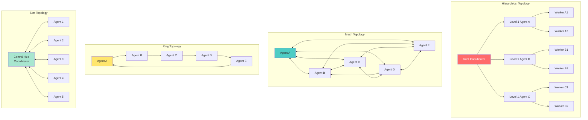
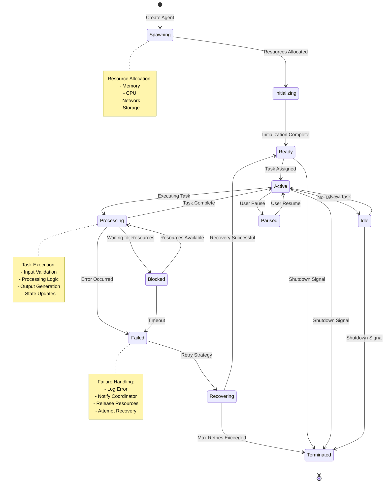
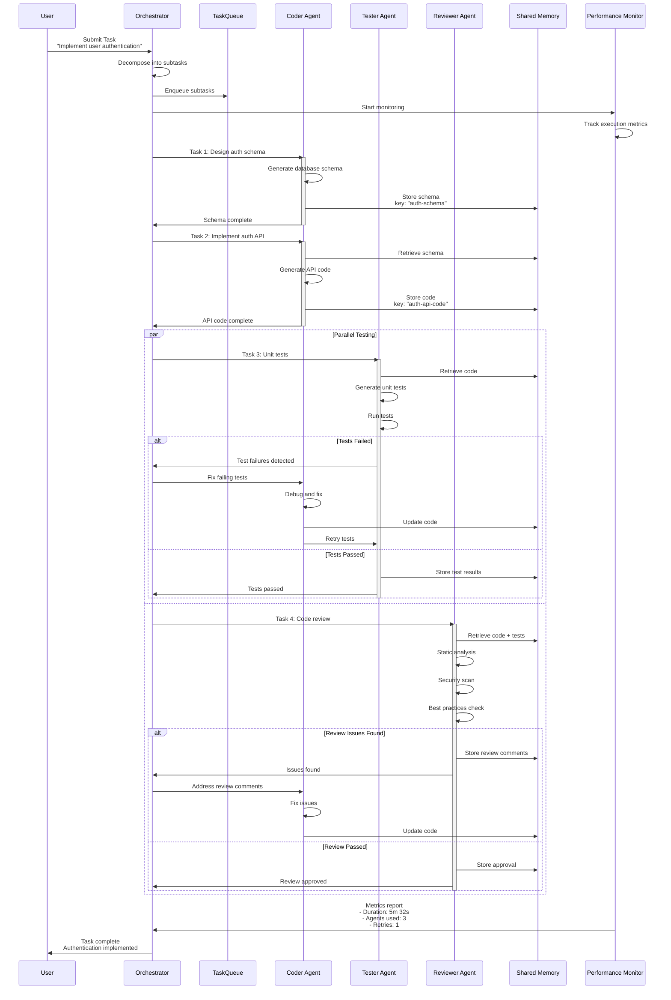
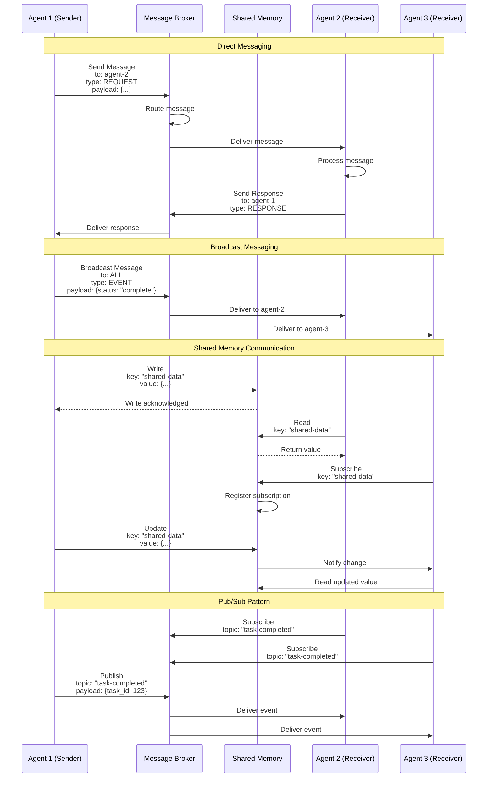
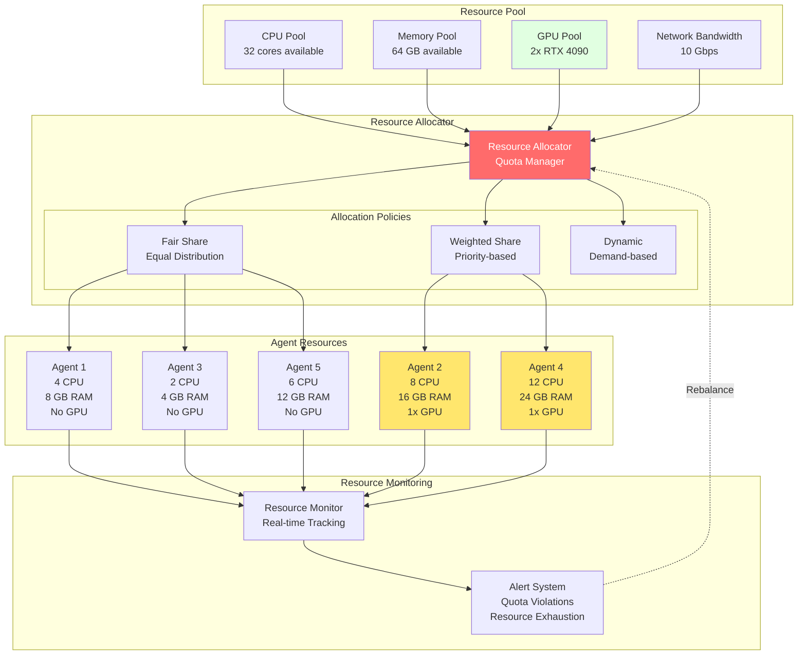

# Agent Orchestration & Multi-Agent Systems

## 1. Agent Type Hierarchy

```mermaid
graph TB
    Root[Base Agent Interface<br/>IAgent]

    subgraph "Coordinator Agents"
        HC[Hierarchical Coordinator<br/>Tree Topology<br/>Top-down Control]
        MC[Mesh Coordinator<br/>Peer-to-peer<br/>Democratic]
        AC[Adaptive Coordinator<br/>Dynamic Topology<br/>Self-organizing]
        CIC[Collective Intelligence Coordinator<br/>Swarm Behavior<br/>Emergent Strategy]
    end

    subgraph "Task Execution Agents"
        Coder[Coder Agent<br/>Code Generation<br/>17 Languages]
        Tester[Tester Agent<br/>Test Generation<br/>Unit + Integration]
        Reviewer[Reviewer Agent<br/>Code Review<br/>Quality Gates]
        Researcher[Researcher Agent<br/>Information Gathering<br/>Web + Documentation]
        Analyst[Analyst Agent<br/>Data Analysis<br/>Pattern Recognition]
    end

    subgraph "Specialized Agents"
        Architect[System Architect<br/>Architecture Design<br/>Patterns + Best Practices]
        BackendDev[Backend Developer<br/>API Development<br/>Database Design]
        MLDev[ML Developer<br/>Model Training<br/>Data Pipeline]
        DevOps[CI/CD Engineer<br/>Deployment<br/>Infrastructure]
    end

    subgraph "Support Agents"
        Memory[Memory Manager<br/>Shared State<br/>Cross-agent Communication]
        Monitor[Performance Monitor<br/>Metrics Collection<br/>Anomaly Detection]
        Logger[Audit Logger<br/>Action Tracking<br/>Compliance]
    end

    Root --> HC
    Root --> MC
    Root --> AC
    Root --> CIC

    Root --> Coder
    Root --> Tester
    Root --> Reviewer
    Root --> Researcher
    Root --> Analyst

    Root --> Architect
    Root --> BackendDev
    Root --> MLDev
    Root --> DevOps

    Root --> Memory
    Root --> Monitor
    Root --> Logger

    style Root fill:#333,color:#fff
    style HC fill:#ff6b6b,color:#fff
    style Coder fill:#4ecdc4
    style Architect fill:#ffe66d
```



## 2. Swarm Topology Patterns



## 3. Agent Lifecycle State Machine



## 4. Task Orchestration Flow



## 5. Consensus Mechanism (Byzantine)

```mermaid
graph TB
    subgraph "Consensus Round 1"
        direction TB

        subgraph "Proposal Phase"
            Leader[Leader Agent<br/>Proposes Value: X]
            Leader --> A1[Agent 1<br/>Receives X]
            Leader --> A2[Agent 2<br/>Receives X]
            Leader --> A3[Agent 3<br/>Receives X]
            Leader --> A4[Agent 4 (Byzantine)<br/>Receives X]
            Leader --> A5[Agent 5<br/>Receives X]
        end

        subgraph "Voting Phase"
            A1 --> V1[Vote: Accept X]
            A2 --> V2[Vote: Accept X]
            A3 --> V3[Vote: Accept X]
            A4 --> V4[Vote: Reject X<br/>Malicious]
            A5 --> V5[Vote: Accept X]
        end

        subgraph "Quorum Check"
            V1 --> Q[Quorum Calculator]
            V2 --> Q
            V3 --> Q
            V4 --> Q
            V5 --> Q

            Q --> QResult[Result: 4/5 Accept<br/>80% > 67% threshold<br/>✅ Consensus Reached]
        end
    end

    subgraph "Commit Phase"
        QResult --> Commit[Commit Value X]
        Commit --> Memory[(Shared Memory<br/>X committed)]
        Memory --> Broadcast[Broadcast to All Agents]
    end

    subgraph "Byzantine Fault Tolerance"
        A4 --> Detect[Anomaly Detection]
        Detect --> Isolate[Isolate Byzantine Agent]
        Isolate --> Report[Report to Orchestrator]
        Report --> Action[Action: Remove from Swarm]
    end

    style Leader fill:#ff6b6b,color:#fff
    style A4 fill:#ffcccc
    style QResult fill:#a8e6cf
    style Commit fill:#4ecdc4
```

## 6. Agent Communication Protocol



## 7. Load Balancing & Scheduling

```mermaid
graph TB
    subgraph "Task Queue"
        Queue[(Priority Queue<br/>1000 pending tasks)]
    end

    subgraph "Scheduler"
        Scheduler[Task Scheduler<br/>Load Balancer]

        subgraph "Scheduling Strategies"
            RR[Round Robin<br/>Simple Distribution]
            LB[Least Busy<br/>Min Active Tasks]
            Cap[Capability Match<br/>Agent Skills]
            Prio[Priority-based<br/>Urgent First]
        end
    end

    subgraph "Agent Pool"
        A1[Agent 1<br/>Load: 20%<br/>Tasks: 2]
        A2[Agent 2<br/>Load: 80%<br/>Tasks: 8]
        A3[Agent 3<br/>Load: 40%<br/>Tasks: 4]
        A4[Agent 4<br/>Load: 10%<br/>Tasks: 1]
        A5[Agent 5<br/>Load: 60%<br/>Tasks: 6]
    end

    subgraph "Metrics Collector"
        Metrics[Performance Metrics<br/>- CPU Usage<br/>- Memory Usage<br/>- Task Completion Time<br/>- Error Rate]
    end

    Queue --> Scheduler

    Scheduler --> RR
    Scheduler --> LB
    Scheduler --> Cap
    Scheduler --> Prio

    RR -.->|Next in rotation| A1
    LB -.->|Lowest load| A4
    Cap -.->|Best match| A3
    Prio -.->|Urgent task| A1

    Scheduler --> A1
    Scheduler --> A2
    Scheduler --> A3
    Scheduler --> A4
    Scheduler --> A5

    A1 --> Metrics
    A2 --> Metrics
    A3 --> Metrics
    A4 --> Metrics
    A5 --> Metrics

    Metrics --> Scheduler

    style Queue fill:#fff9e1
    style Scheduler fill:#ff6b6b,color:#fff
    style A4 fill:#a8e6cf
    style A2 fill:#ffcccc
```

---

---

## Related Documentation

- [Agent/Bot System Architecture](../server/agents/agent-system-architecture.md)
- [VisionFlow Architecture Diagrams - Complete Corpus](../README.md)
- [VisionFlow Complete Architecture Documentation](../../ARCHITECTURE_COMPLETE.md)
- [Blender MCP Unified System Architecture](../../architecture/blender-mcp-unified-architecture.md)
- [What is VisionFlow?](../../OVERVIEW.md)

## 8. Agent Resource Management


