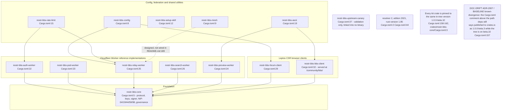
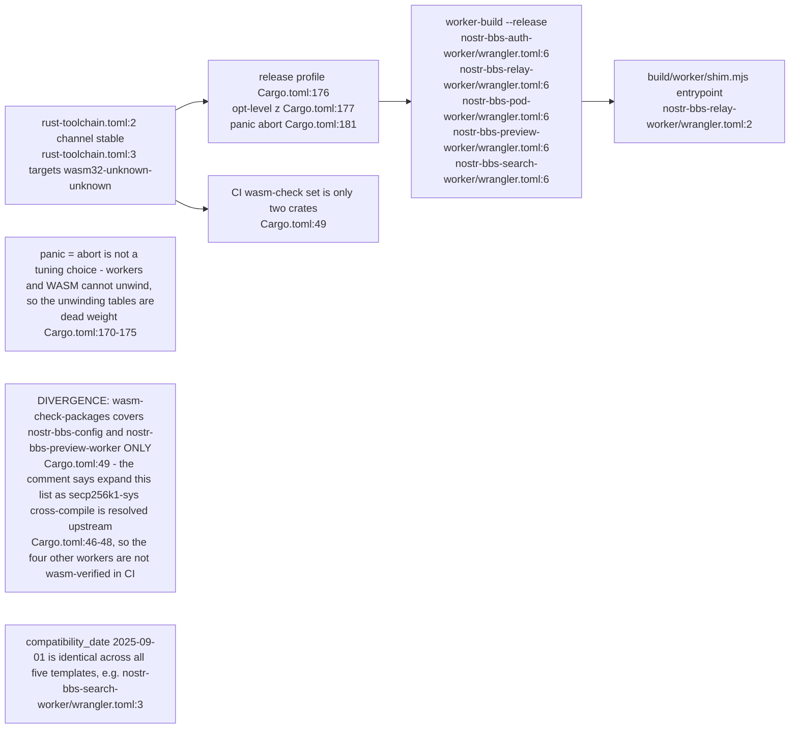
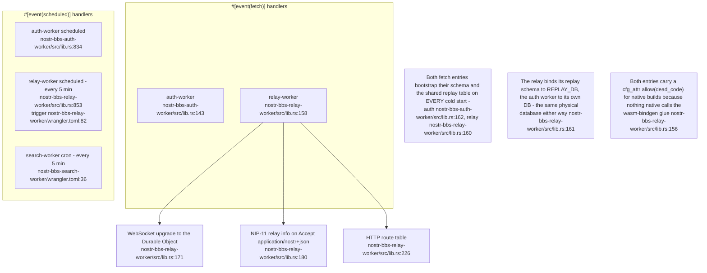
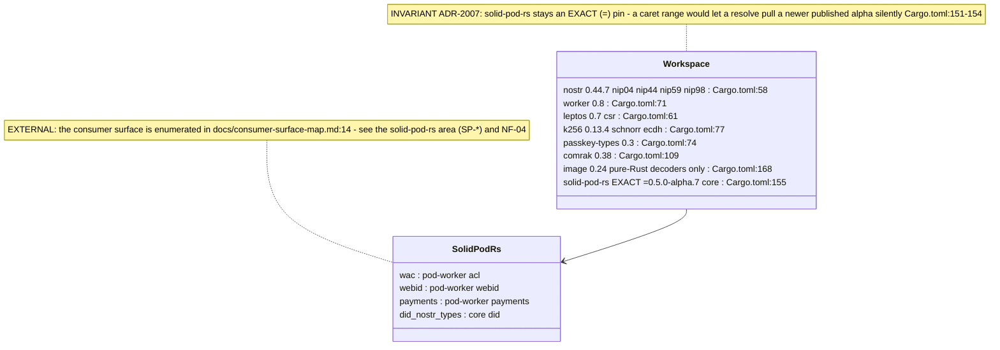
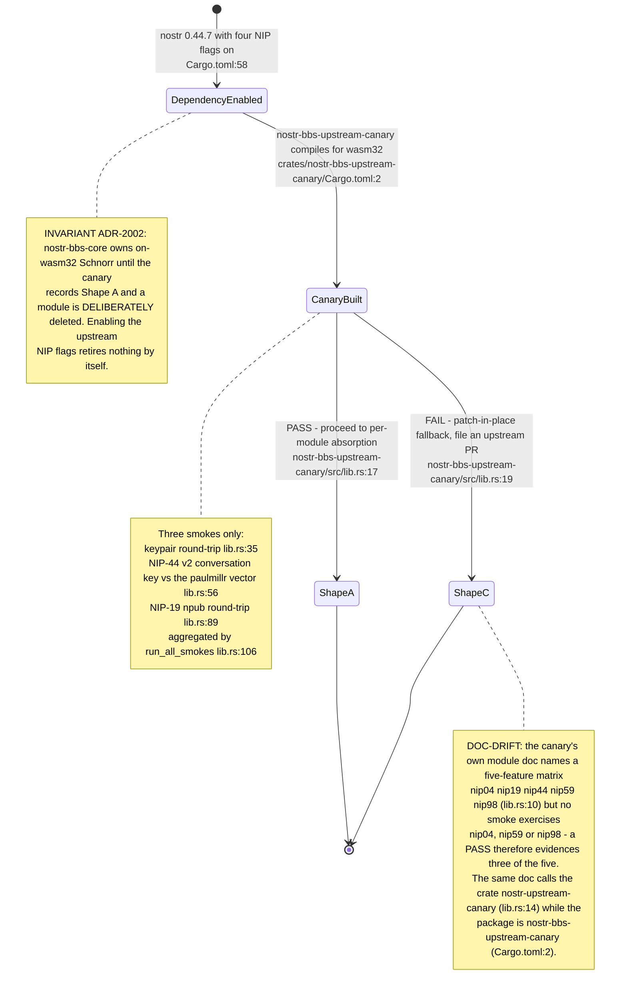
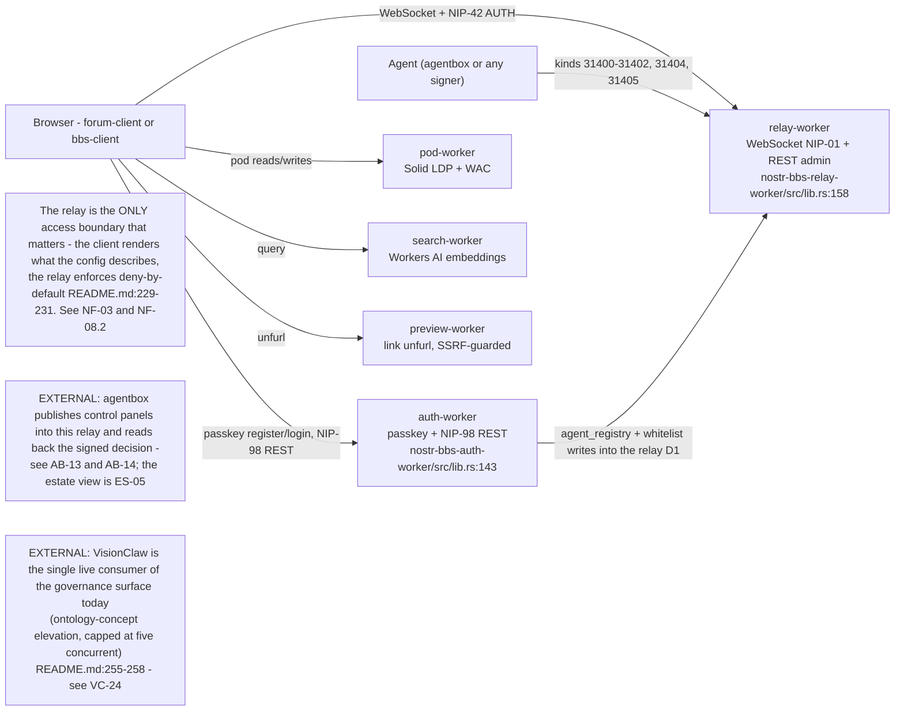

## NF-01.1 Fourteen crates in four layers

## NF-01.2 Build matrix — one target, one release profile

## NF-01.3 Worker entry points and their triggers

## NF-01.4 Pinned dependency spine

## NF-01.5 Upstream `nostr` absorption — canary-first, nothing deleted

## NF-01.6 Where each Worker sits in a request

