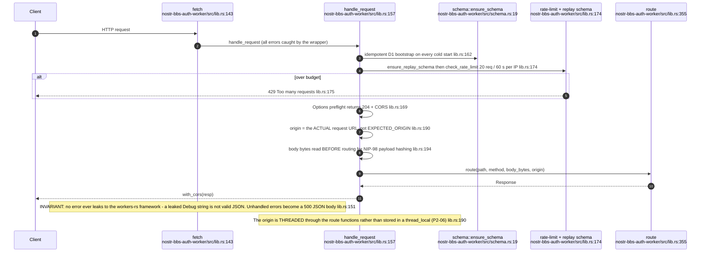
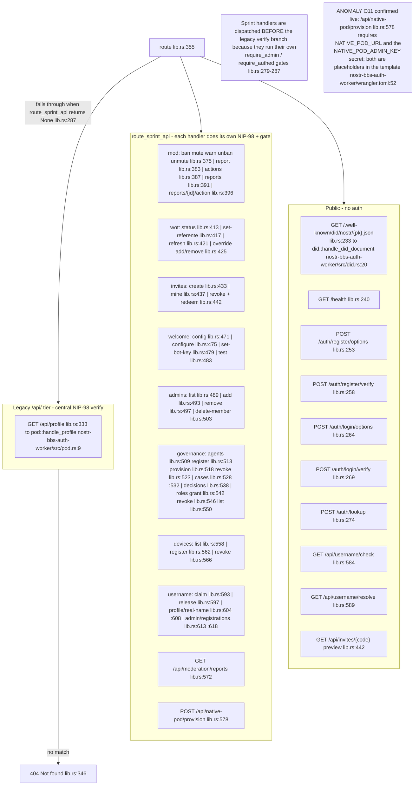
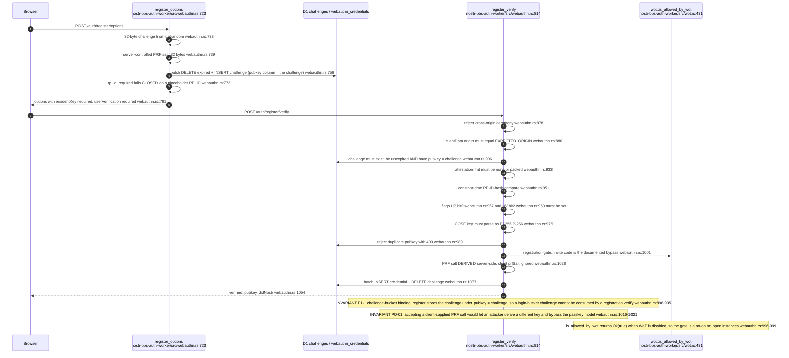
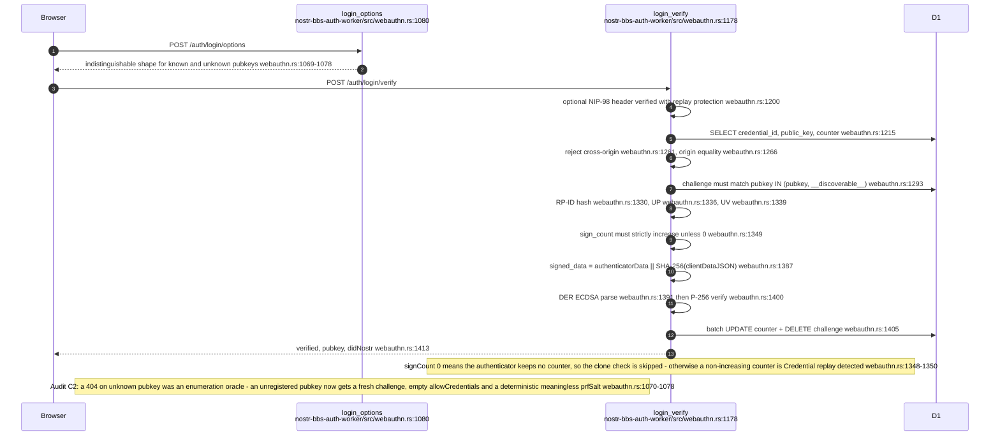
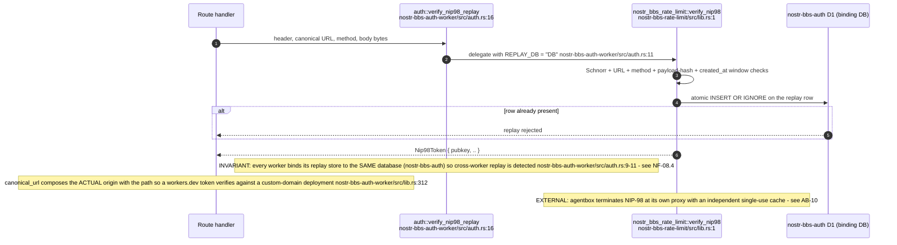
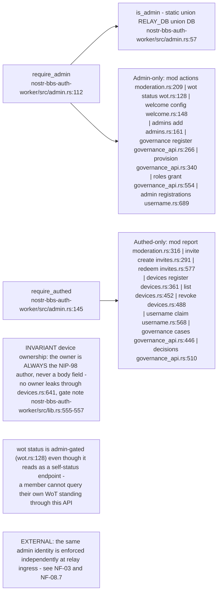
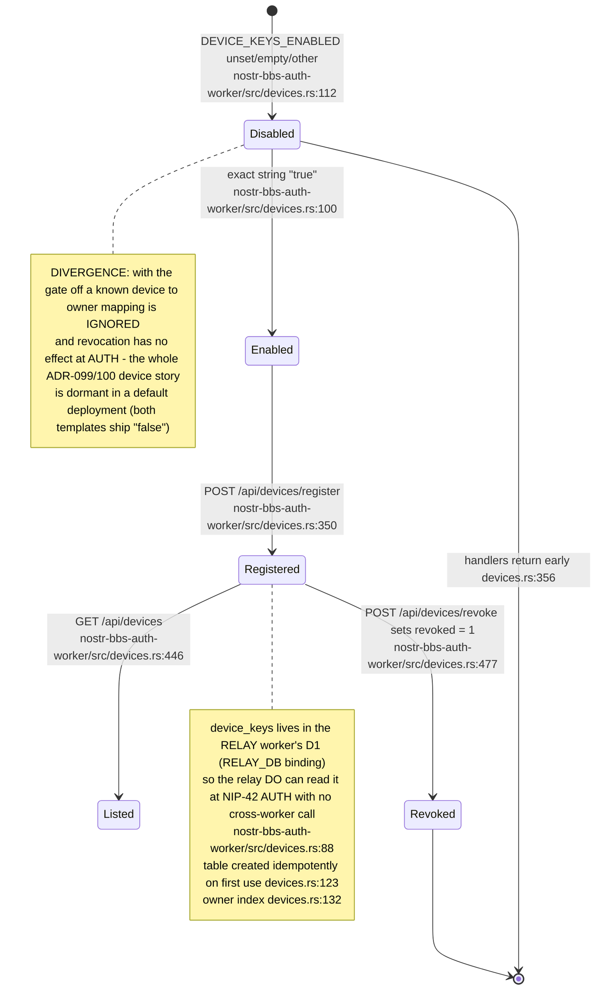
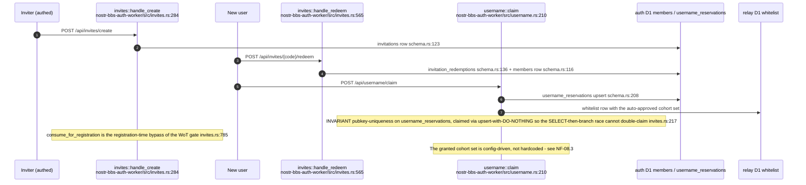
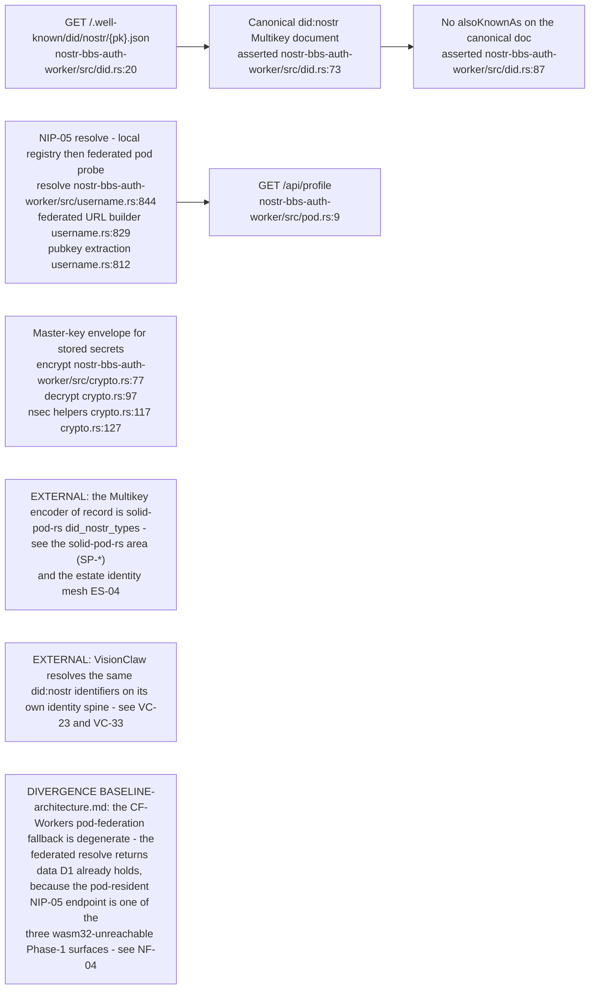

## NF-02.1 Request entry — bootstrap, rate limit, body pre-read, dispatch

## NF-02.2 Route table — public, sprint-API and legacy tiers

## NF-02.3 Passkey registration — the full verify chain

## NF-02.4 Passkey login — assertion verification and clone detection

## NF-02.5 NIP-98 gate and the single-use replay store

## NF-02.6 The two gates every sprint handler chooses between

## NF-02.7 Device-key registry — default-off, dual-worker gate, relay-owned table

## NF-02.8 Membership creation paths — invite redemption and username claim

## NF-02.9 Identity surfaces the auth worker publishes

