## NF-03.1 Worker entry — three doors into the relay

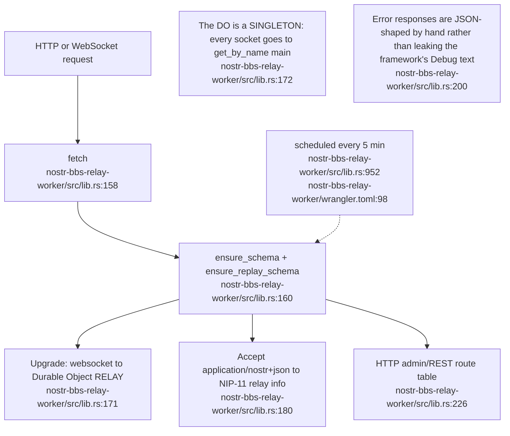

## NF-03.2 NIP-42 AUTH — the verdict table

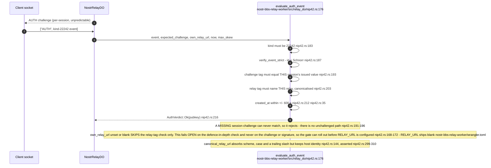

## NF-03.3 AUTH_MODE — the write gate and the protected-read set

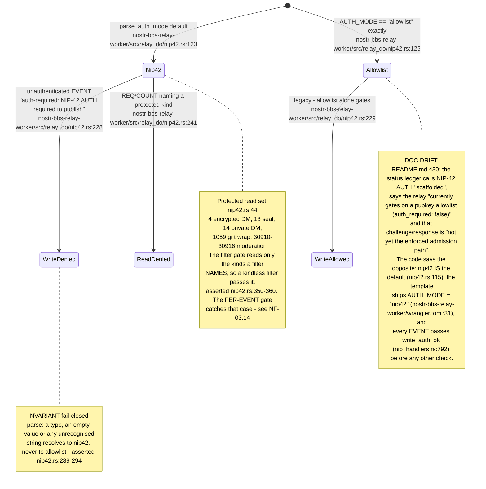

## NF-03.4 EVENT admission pipeline — every gate, in order

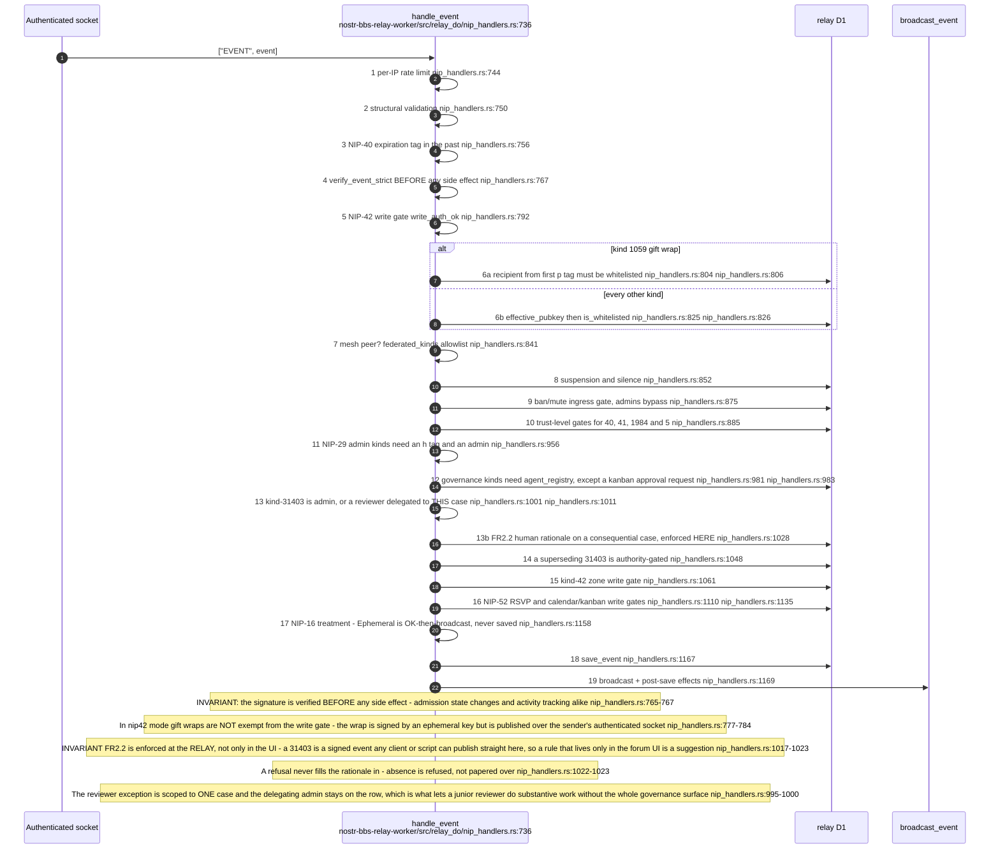

## NF-03.5 Gift-wrap admission — recipient-keyed, never author-keyed

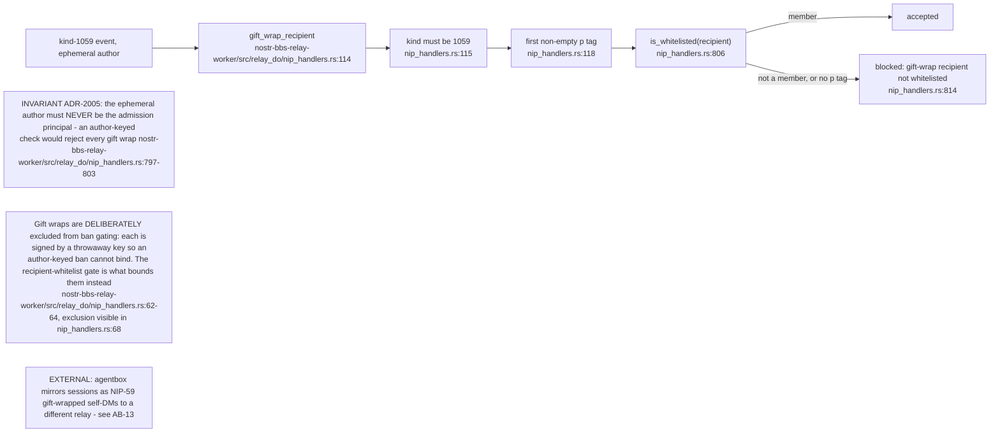

## NF-03.6 Ban gating — which kinds a banned author may not publish

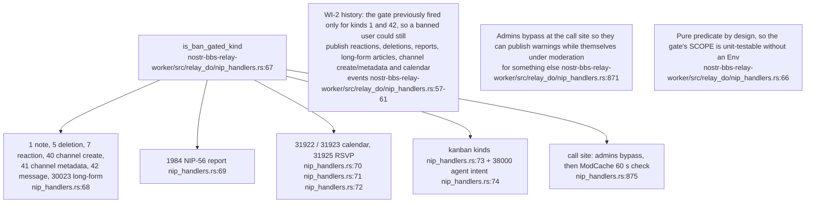

## NF-03.7 Trust-level gates on the admission path

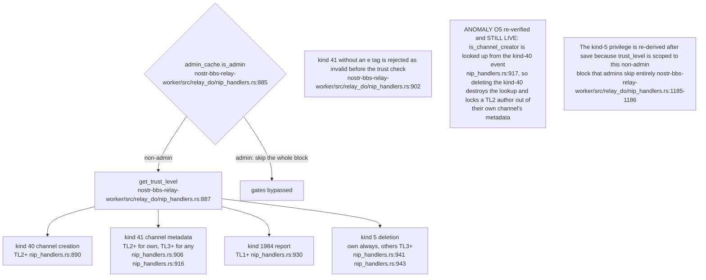

## NF-03.8 The trust ladder — promotion, hysteresis, and what is never demoted

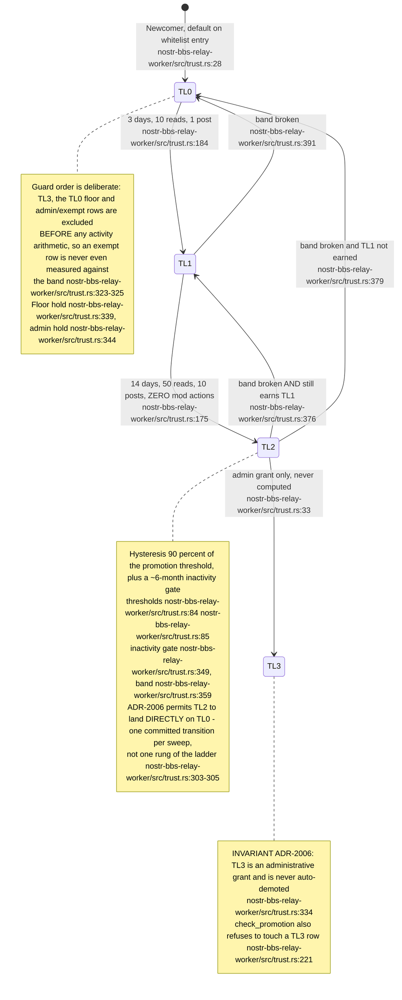

## NF-03.9 Why a demotion did NOT happen — the named hold reasons

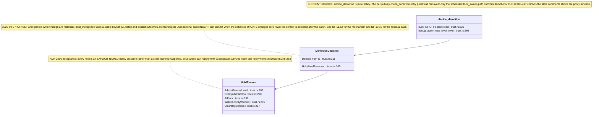

## NF-03.10 Post-save effects — activity, moderation mirror, governance projection

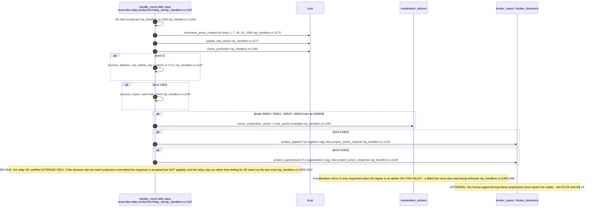

## NF-03.11 Structural validation limits

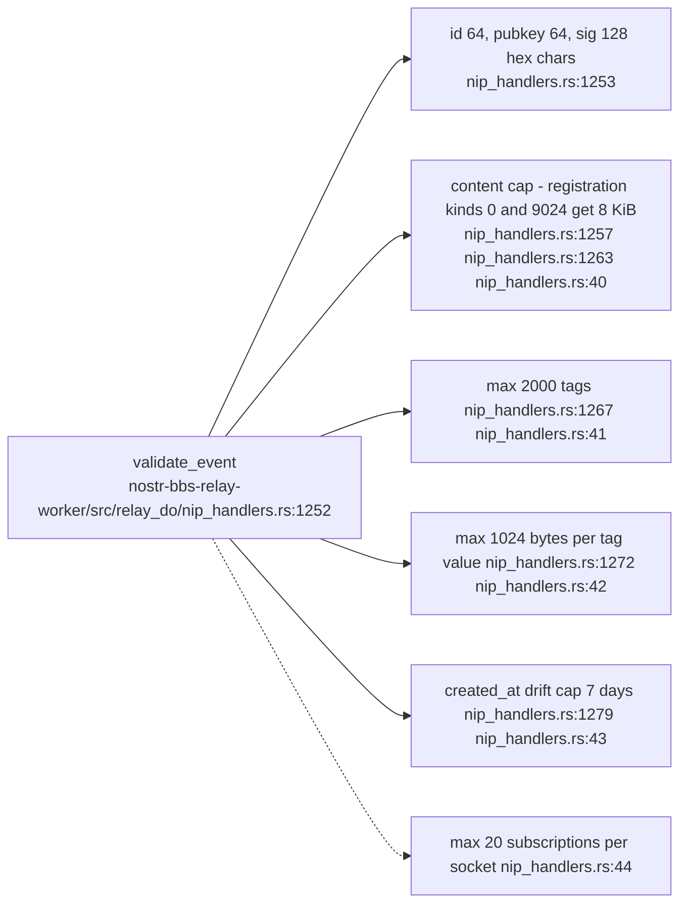

## NF-03.12 Zone enforcement on writes

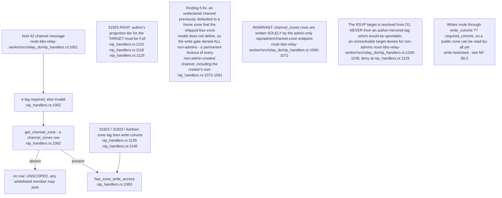

## NF-03.13 Mesh federation — configured, gated, and not actually wired

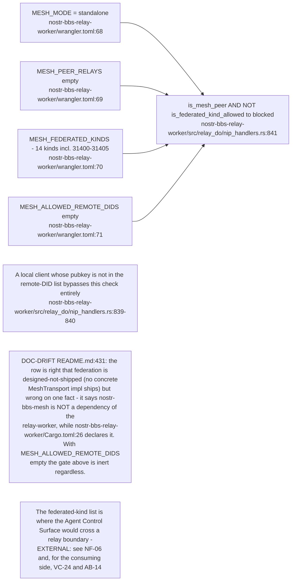

## NF-03.14 Protected reads — the filter gate, the stored filter, and the per-event gate

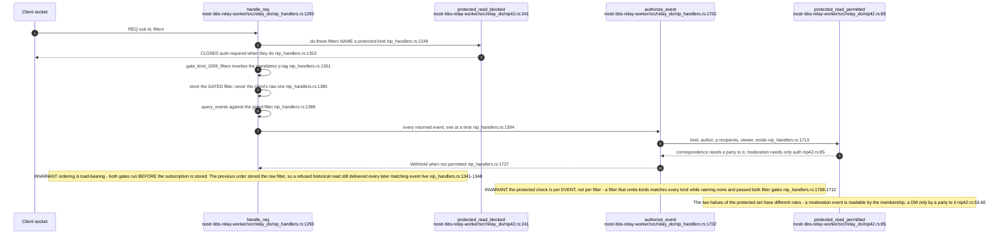
