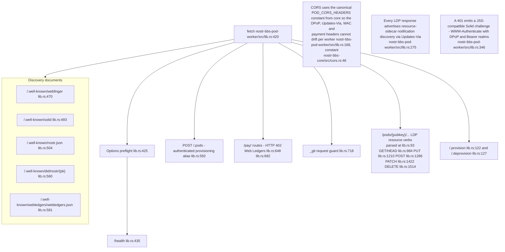
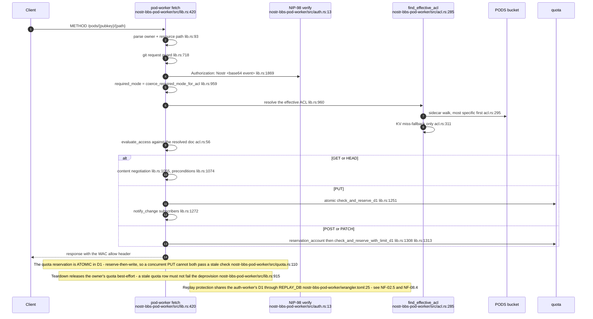
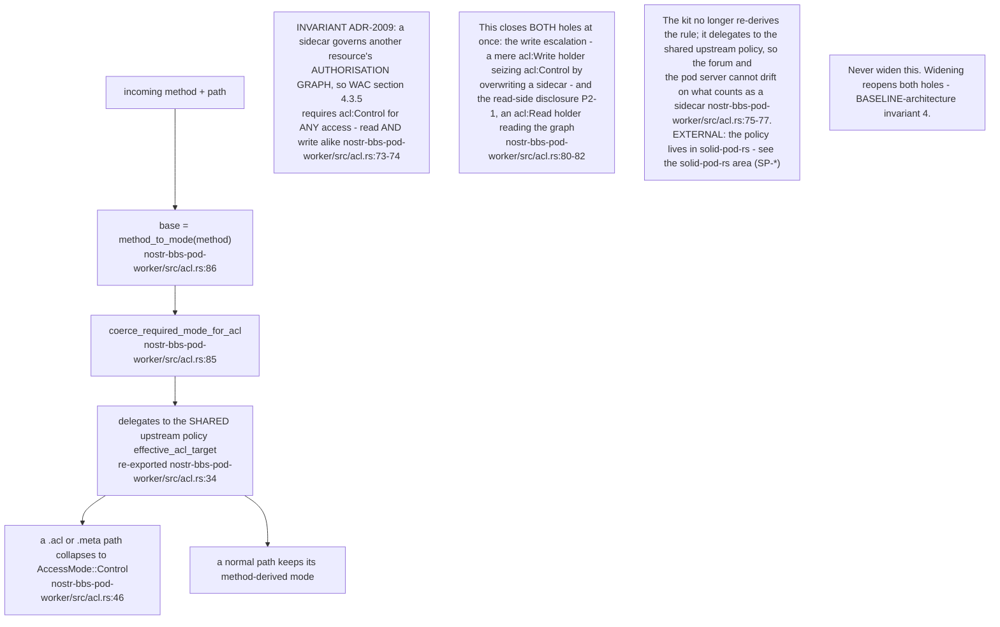
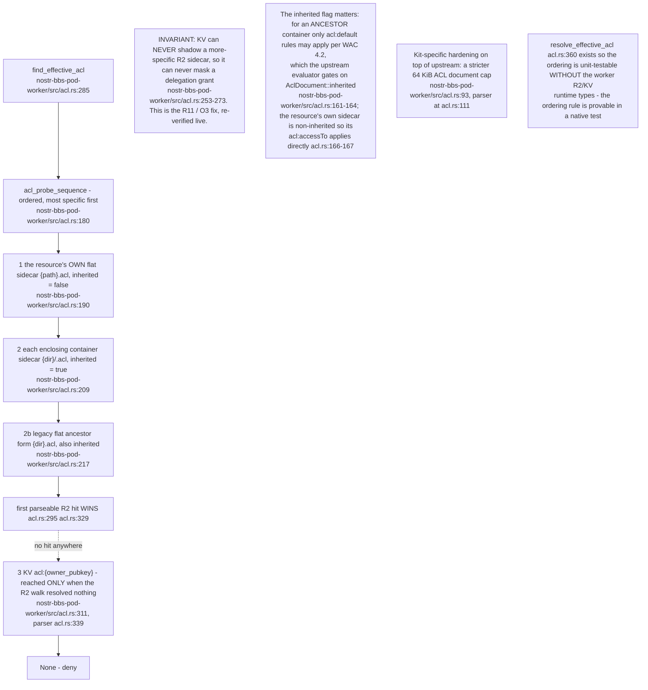
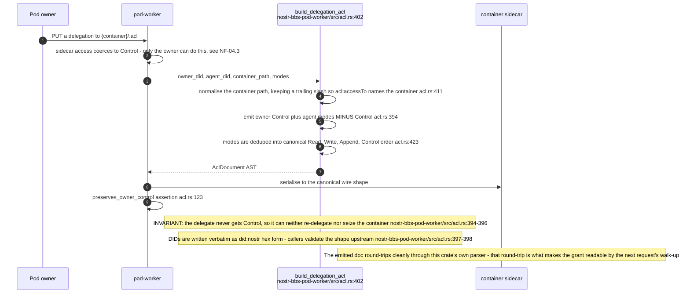
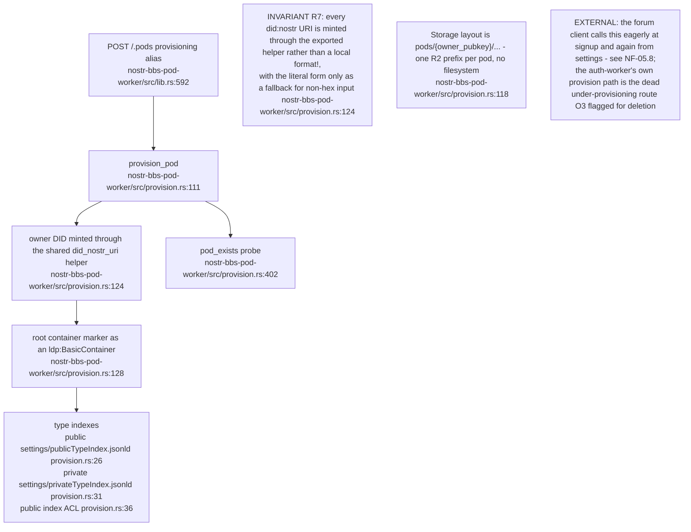
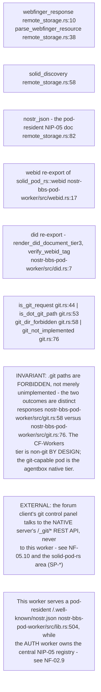
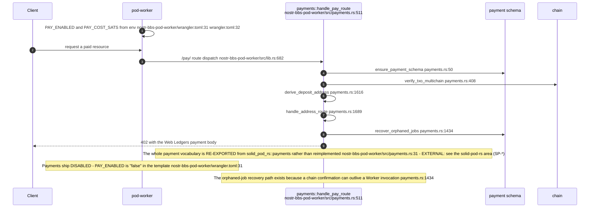
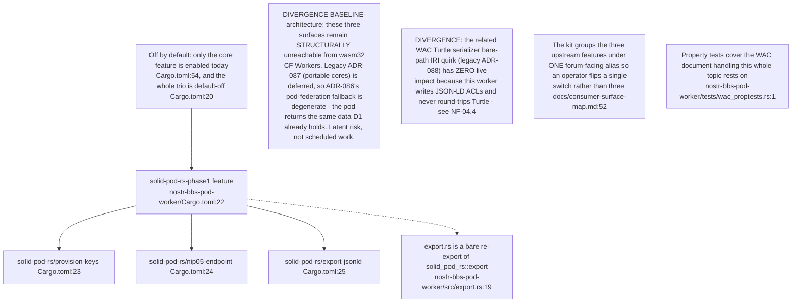

## NF-04.1 Route surface

## NF-04.2 A resource request, end to end

## NF-04.3 The sidecar escalation guard — ADR-2009

## NF-04.4 ACL resolution order — R2 authoritative, KV fallback only

## NF-04.5 Container delegation — the owner is never coerced out

## NF-04.6 Pod provisioning

## NF-04.7 The LDP mechanics around each verb

```mermaid
classDiagram
    class ContentNegotiation {
        parse_accept : content_negotiation.rs:27
        negotiate : content_negotiation.rs:86
        is_rdf_type : content_negotiation.rs:146
        ensure_solid_context : content_negotiation.rs:157
        JSONLD TURTLE NTRIPLES HTML : content_negotiation.rs:7
    }
    class Conditional {
        check_preconditions ETag : conditional.rs:14
        parse_range : conditional.rs:39
    }
    class Container {
        is_container : container.rs:10
        list_container : container.rs:16
        resolve_slug : container.rs:73
    }
    class Patch {
        apply_patches : patch.rs:15
    }
    class Notifications {
        subscribe : notifications.rs:25
        unsubscribe : notifications.rs:53
        notify_change : notifications.rs:94
    }
    class Contexts {
        foaf solid acl did-v1 bundled inline : contexts.rs:15
        context_for_iri : contexts.rs:38
    }
    class Quota {
        INBOX_QUOTA 5 MiB : quota.rs:23
        reservation_account : quota.rs:26
        check_and_reserve_d1 : quota.rs:110
        get/set_quota_d1 : quota.rs:167
        legacy KV path : quota.rs:216
    }

    note for Contexts "JSON-LD contexts are compiled INTO the worker<br/>with include_str! rather than fetched - a Worker<br/>cannot depend on an outbound context fetch at<br/>request time contexts.rs:15"
    note for Quota "Two quota backends coexist - the D1 path is<br/>authoritative and atomic quota.rs:110 while a<br/>legacy KV path survives quota.rs:216, the same<br/>R2-authoritative / KV-legacy shape as the ACL resolver"
    note for Patch "apply_patches is the PATCH verb's whole<br/>surface patch.rs:15, reached from lib.rs:1422"
```

## NF-04.8 Discovery, identity and the git boundary

## NF-04.9 HTTP 402 payments

## NF-04.10 The three wasm32-unreachable Phase-1 surfaces

