## NF-05.1 Forum client boot and the FORUM_BASE discipline

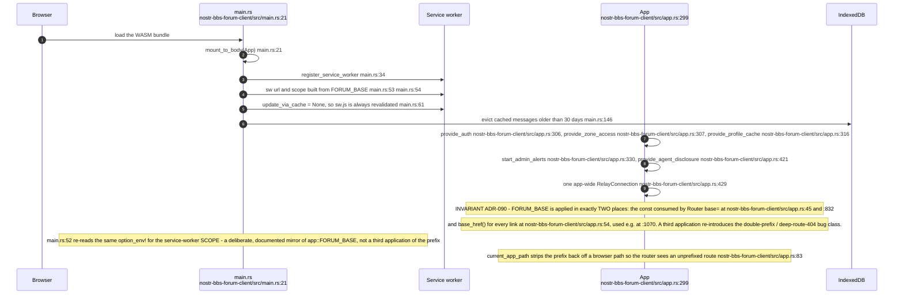

## NF-05.2 Route table

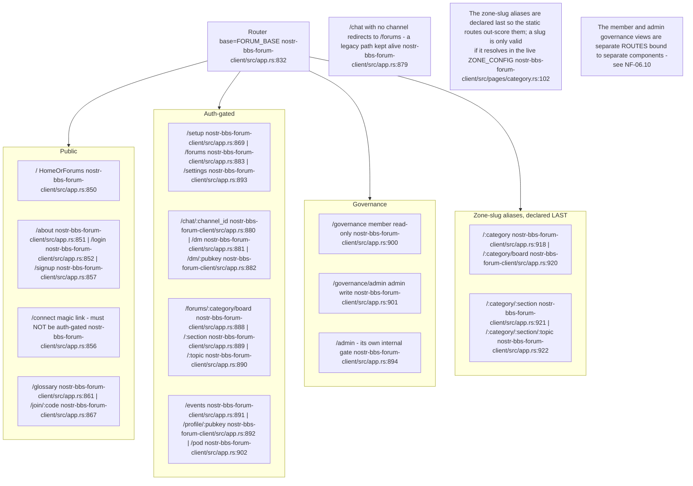

## NF-05.3 Passkey identity — register, log in, derive

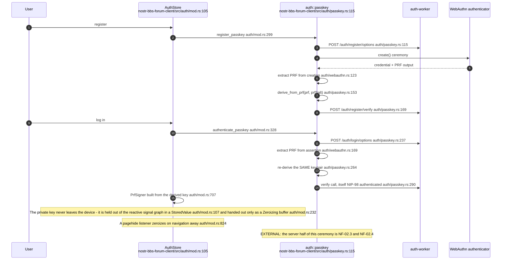

## NF-05.4 Three identity backends behind one signing seam

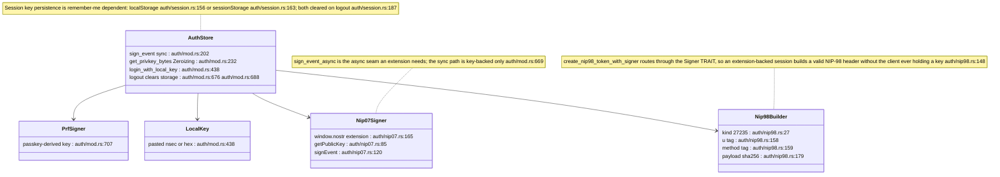

## NF-05.5 Relay transport — frames in and out

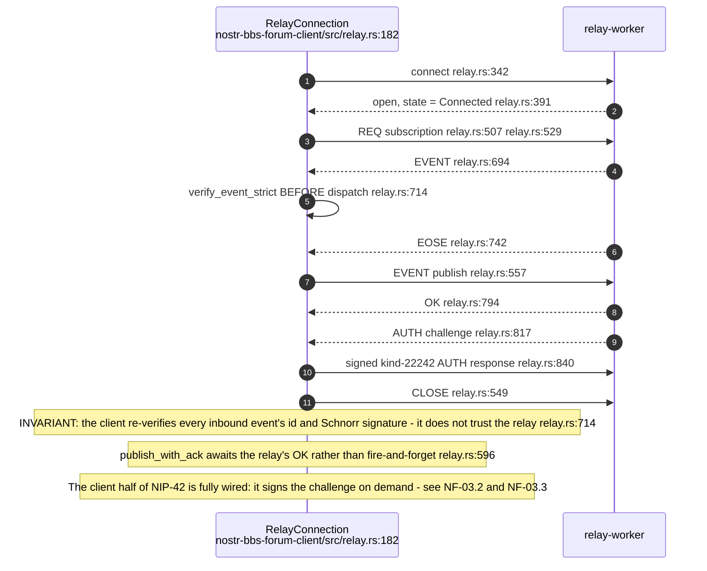

## NF-05.6 Derived, never accumulated — the counting invariant

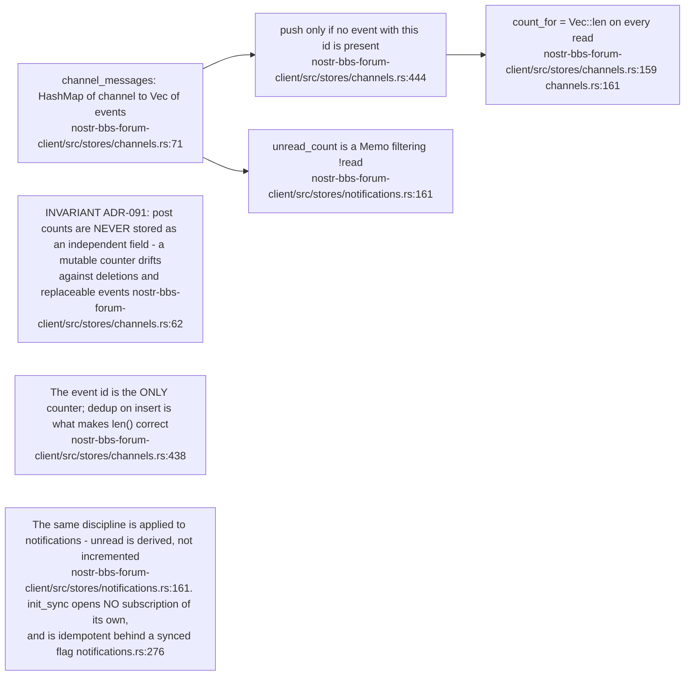

## NF-05.7 Config projection into the browser

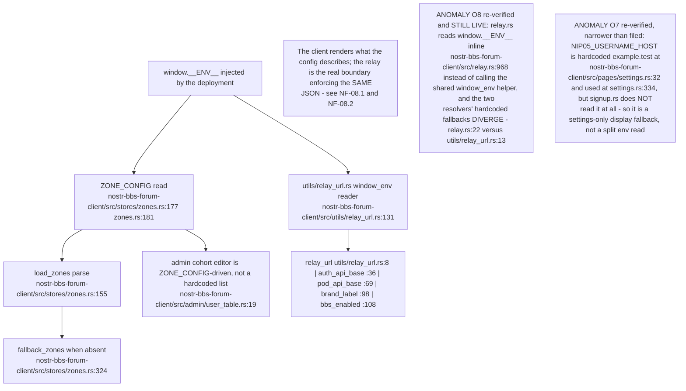

## NF-05.8 Signup — key, recovery sheet, pod

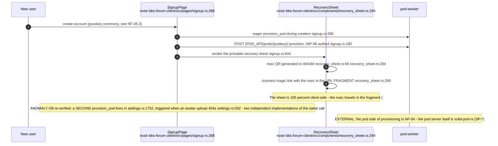

## NF-05.9 Direct messages — two wraps per message, and why history exists

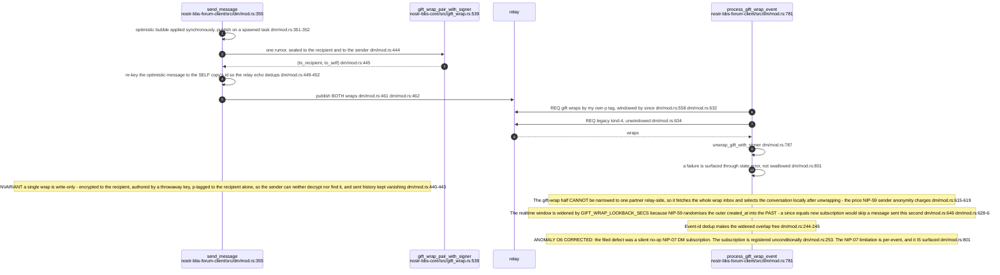

## NF-05.10 Feature surfaces the forum client calls out to

```mermaid
flowchart LR
    THREAD["thread reply - kind 42 e-tagging the topic root<br/>nostr-bbs-forum-client/src/pages/thread.rs:637<br/>edit/delete via kind 5 thread.rs:821"]
    CHAN["channel message - kind 42<br/>nostr-bbs-forum-client/src/pages/channel.rs:803"]
    EVENTS["calendar - kind 31923 events, 31925 RSVPs<br/>nostr-bbs-forum-client/src/pages/events.rs:129 events.rs:187"]
    SEARCH["global search - kind-40 channel names over the relay<br/>global_search.rs:426 plus semantic search over the worker<br/>global_search.rs:317, one runtime-resolved base<br/>nostr-bbs-forum-client/src/utils/search_client.rs:109"]
    BADGE["agent disclosure over public HTTP GET<br/>nostr-bbs-forum-client/src/components/agent_badge.rs:317"]
    GIT["pod git control panel - _git/status :213 stage :272 unstage :310<br/>discard :359 commit :385 diff :434 log :466<br/>nostr-bbs-forum-client/src/components/git_panel.rs:213"]
    POD["pod browser - {POD_API}/pods/{pubkey} and /HEAD<br/>nostr-bbs-forum-client/src/pages/pod_browser.rs:513 pod_browser.rs:586"]
    ADMINT["admin actions - POST /api/admin/suspend :266 and /api/admin/silence :678, NIP-98 signed<br/>nostr-bbs-forum-client/src/admin/user_table.rs:266"]

    N1["DOC-DRIFT consumer-surface-map: the map lists the git panel as calling /.well-known/apps, but the<br/>client fetches and PUTs /apps/manifest.json instead - git_panel.rs:893 and git_panel.rs:946; no<br/>.well-known path exists anywhere in the crate"]
    N2["Calendar: only 31923 (time-based) and 31925 (RSVP) are used client-side. Kind 31922 (date-based),<br/>which the relay ban-gates and zone-gates, has no client surface - see NF-03.6 and NF-03.12"]
    N3["Semantic search goes to the search worker over HTTP, not to the relay - see NF-07"]
    N4["Both search entry points now resolve ONE runtime base through search_api_base rather than two<br/>disagreeing compile-time constants nostr-bbs-forum-client/src/utils/search_client.rs:109,<br/>and the search worker fails CLOSED, so a message in an openly readable channel must be ingested with<br/>public true or it is indexed and permanently unfindable - see NF-07.4"]
```

## NF-05.11 Retro BBS client — session adoption and key custody

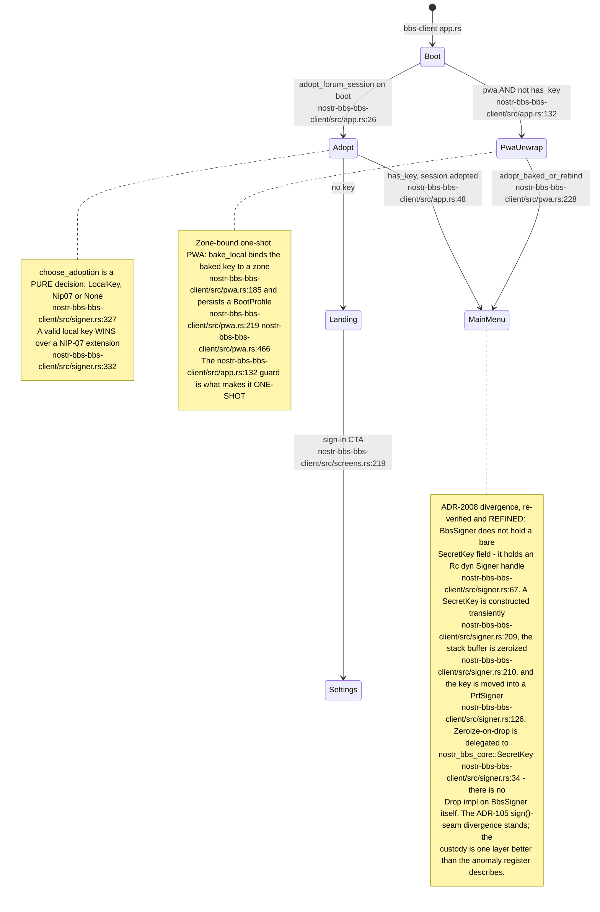

## NF-05.12 BBS screen machine and its own surfaces

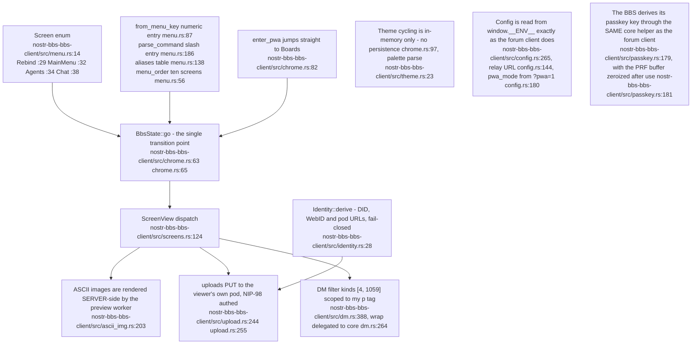

## NF-05.13 Notification ingress — why a reply addressed to you is not burned

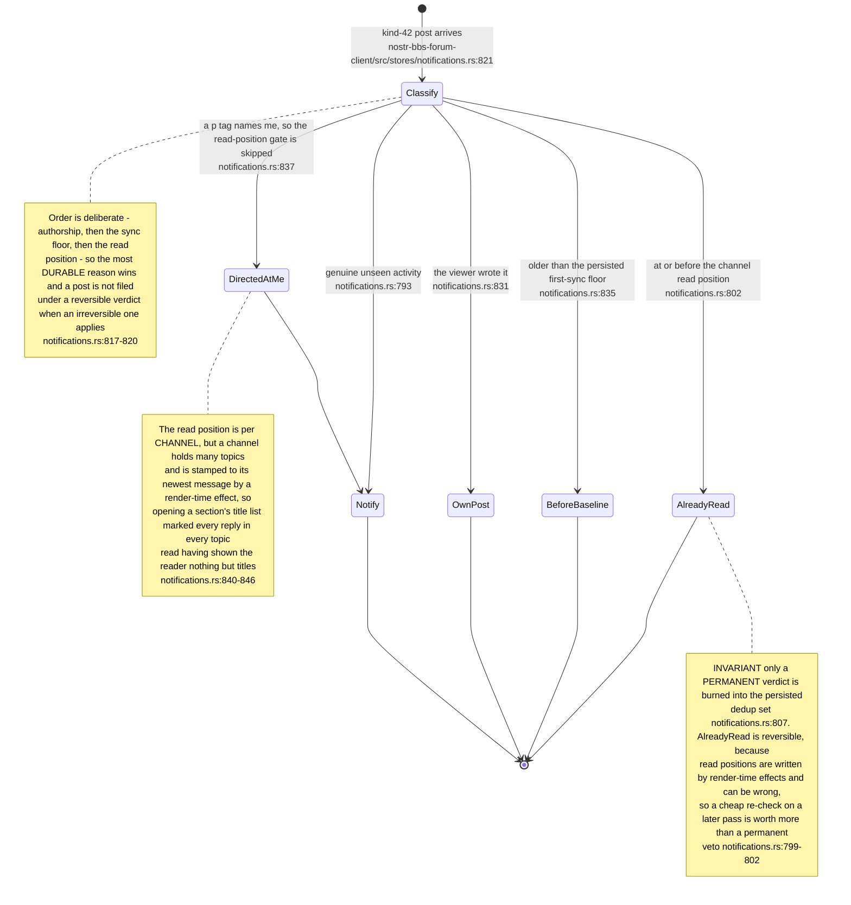

## NF-05.14 Search from the client — one base, two paths

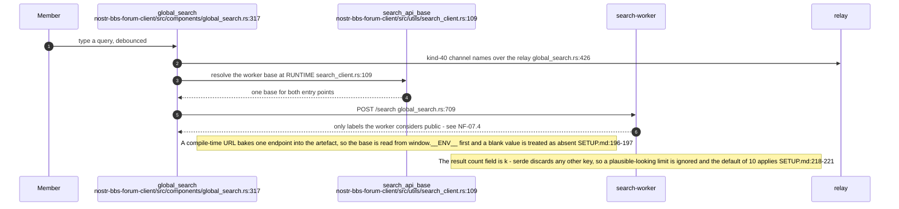
