## NF-06.1 The six kinds and their publishers

```mermaid
classDiagram
    class ACSKinds {
        KIND_PANEL_DEFINITION 31400 : nostr-bbs-core/src/governance.rs:27
        KIND_PANEL_STATE 31401 : nostr-bbs-core/src/governance.rs:28
        KIND_ACTION_REQUEST 31402 : nostr-bbs-core/src/governance.rs:29
        KIND_ACTION_RESPONSE 31403 : nostr-bbs-core/src/governance.rs:30
        KIND_PANEL_UPDATE 31404 : nostr-bbs-core/src/governance.rs:31
        KIND_PANEL_RETIRED 31405 : nostr-bbs-core/src/governance.rs:32
        GOVERNANCE_KIND_RANGE 31400..=31405 : nostr-bbs-core/src/governance.rs:34
    }
    class TypedPayloads {
        PanelDefinition : nostr-bbs-core/src/governance.rs:102
        ActionRequest : nostr-bbs-core/src/governance.rs:1078
        ActionResponse : nostr-bbs-core/src/governance.rs:1104
    }
    class RegisteredAgent {
        agent registry record : nostr-bbs-core/src/governance.rs:1232
    }
    ACSKinds --> TypedPayloads
    ACSKinds --> RegisteredAgent

    note for ACSKinds "This repo OWNS the 31400-31405 schema for the estate. Every kind constant is re-exported at crate level so no consumer hardcodes a number nostr-bbs-core/src/lib.rs:134"
    note for TypedPayloads "DOC-DRIFT: the README table (README.md:237-243) and this module's own doc table (nostr-bbs-core/src/governance.rs:9-16) name six types, but only THREE have a Rust struct - PanelDefinition, ActionRequest and ActionResponse. PanelState, PanelUpdate and PanelRetired exist as kind constants and doc rows only."
    note for RegisteredAgent "INVARIANT: only kinds 31400, 31401, 31402, 31404 and 31405 are agent-published. 31403 is the HUMAN half - see NF-06.3"
```

## NF-06.2 Addressability and validation

## NF-06.3 Publish path — agent asks, human signs

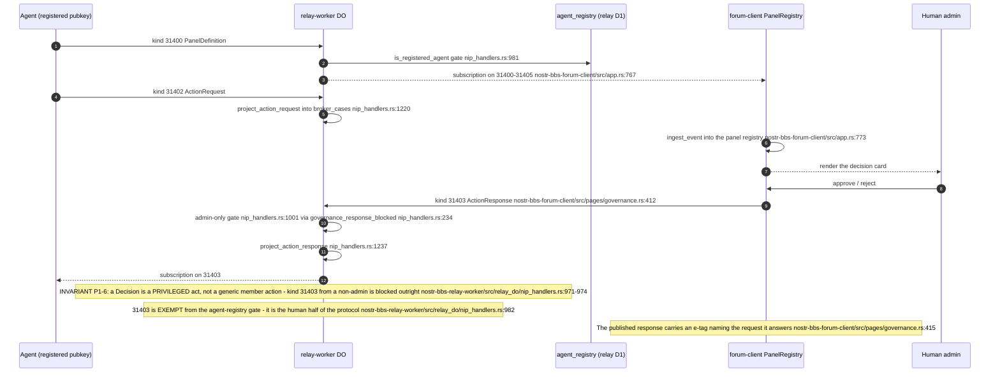

## NF-06.4 The two gates a governance event must pass at ingress

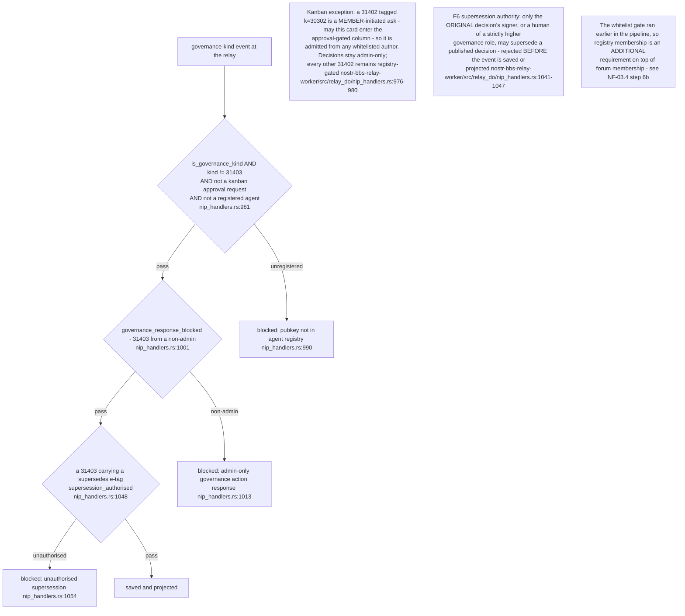

## NF-06.5 Risk tiers — the agent's own declaration

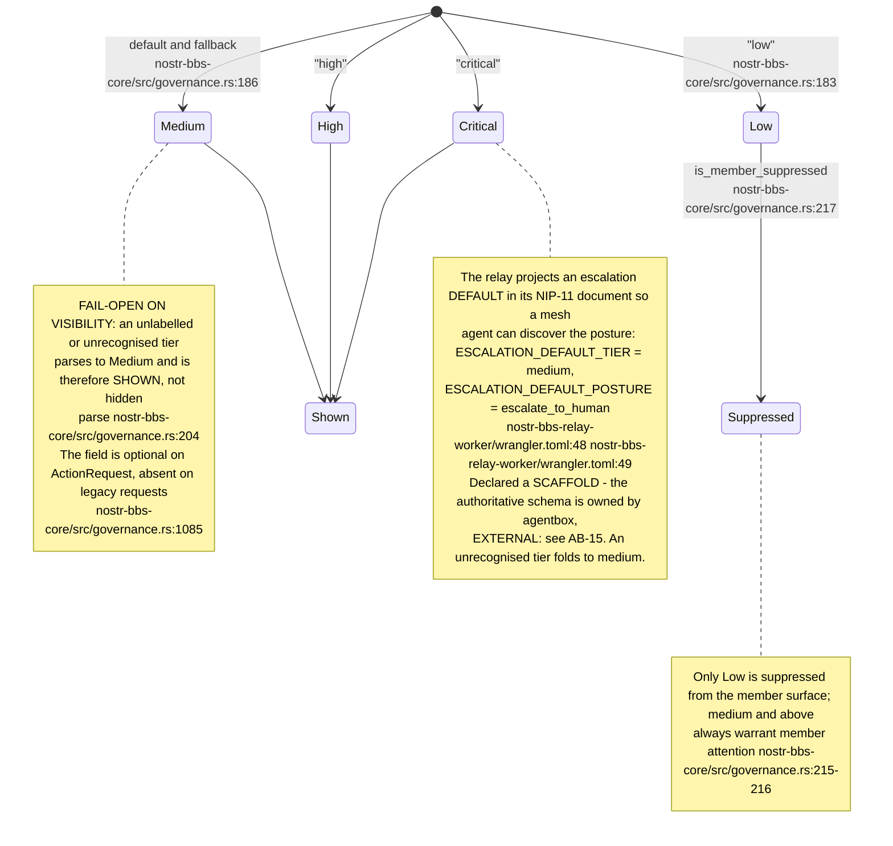

## NF-06.6 The broker case aggregate

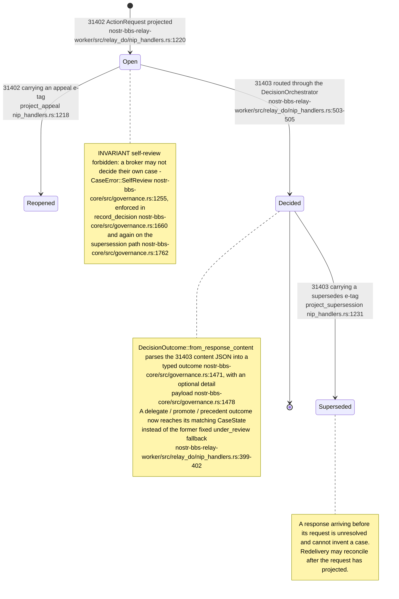

## NF-06.7 ADR-2010 receipt stages — what the relay's OK actually certifies

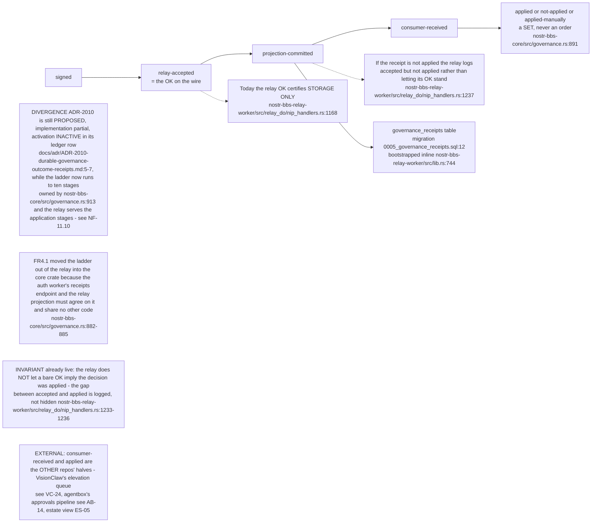

## NF-06.8 D1 projection tables

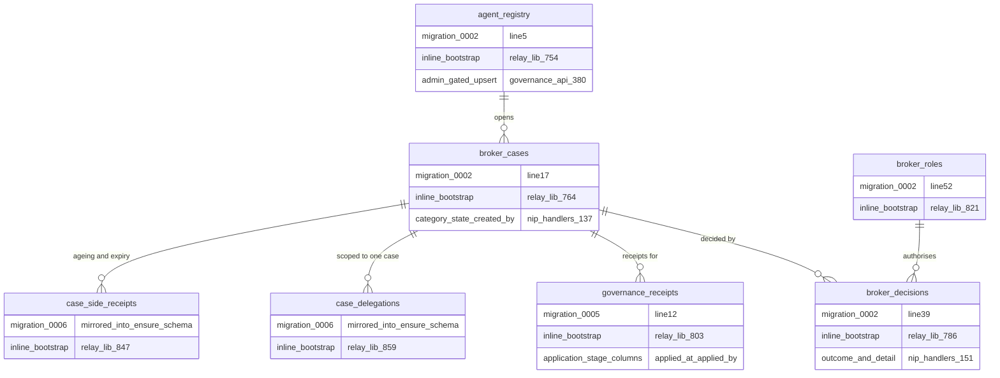

The auth-worker writes `agent_registry` and `whitelist` through the shared `RELAY_DB`
binding so the relay DO can read the registry at admission with no cross-worker call
(`nostr-bbs-auth-worker/src/governance_api.rs:30`).

## NF-06.9 Agent lifecycle through the auth-worker REST surface

## NF-06.10 Consumers of the surface

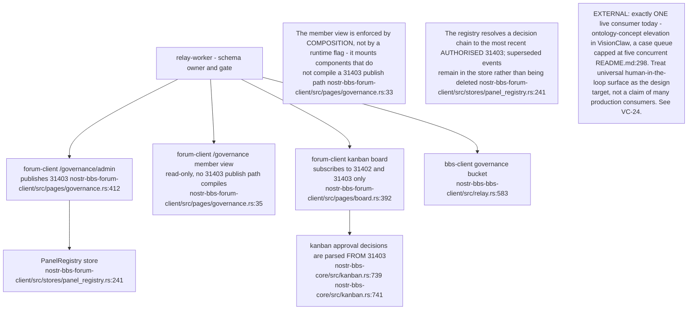

## NF-06.11 Guarded relay projection and separate consumer receipts

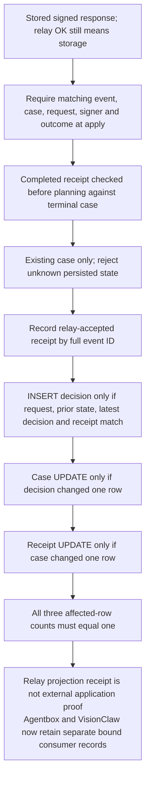

## NF-06.12 Task properties set the escalation boundary — ADR-2011, live on main

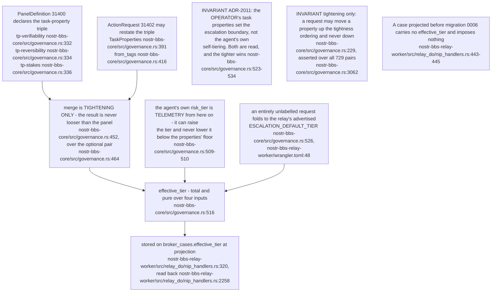

## NF-06.13 Who may decide a 31403, and what a consequential decision must carry

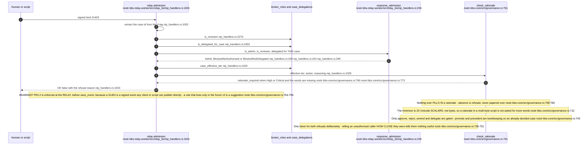

## NF-06.14 Calibration sampling and seeded probes — what the relay actually enforces

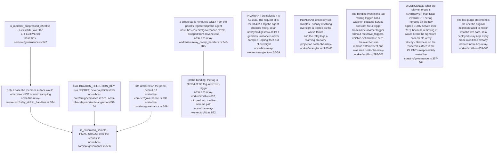

## NF-06.15 Two stale-identity classes the registry closed

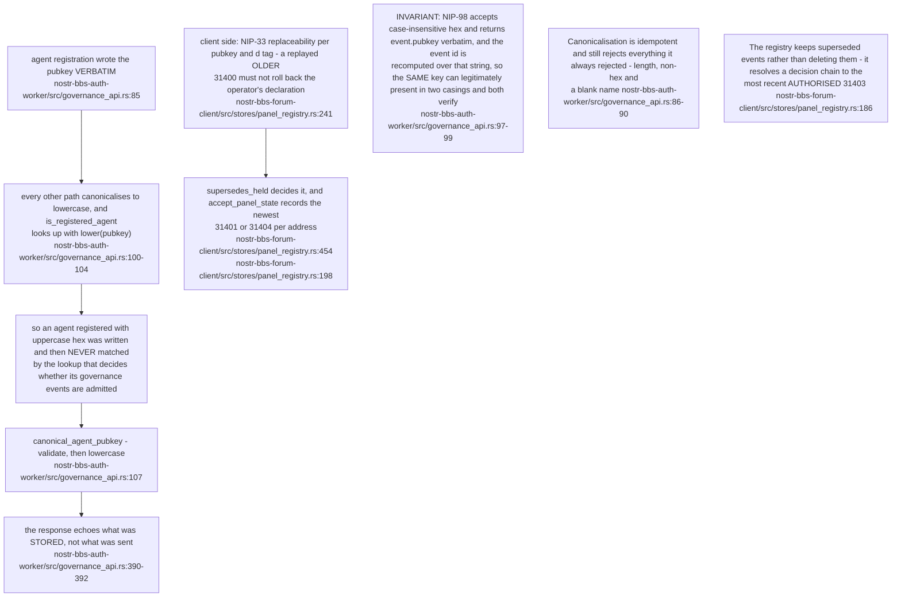
