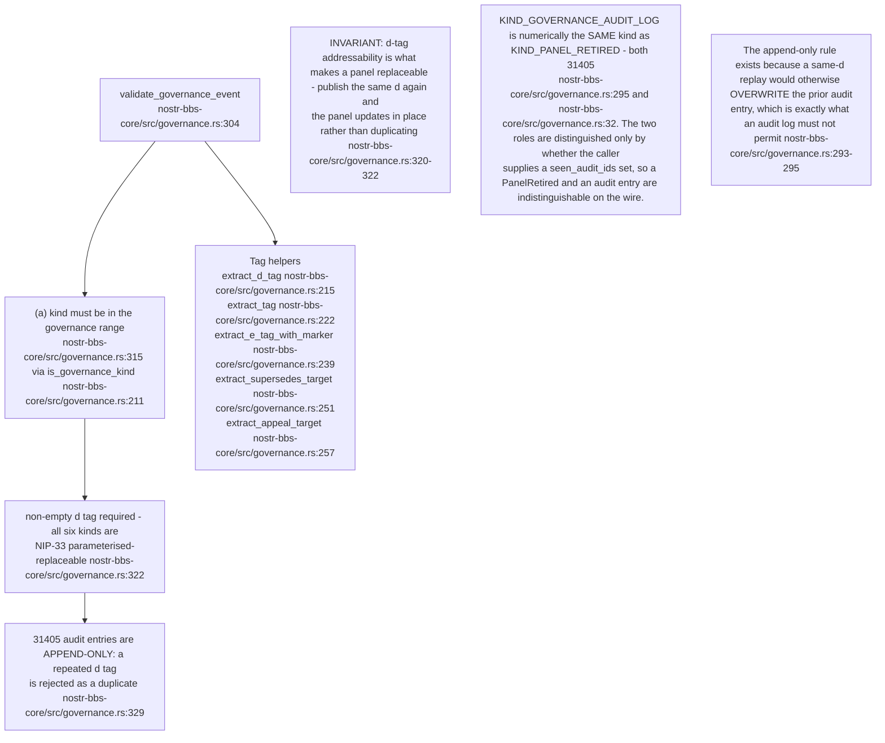
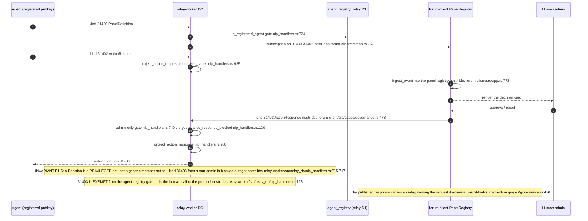
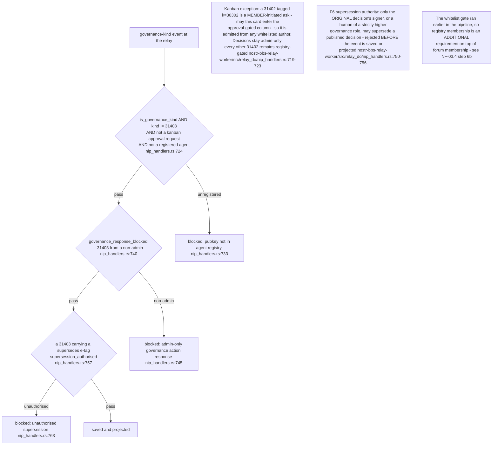
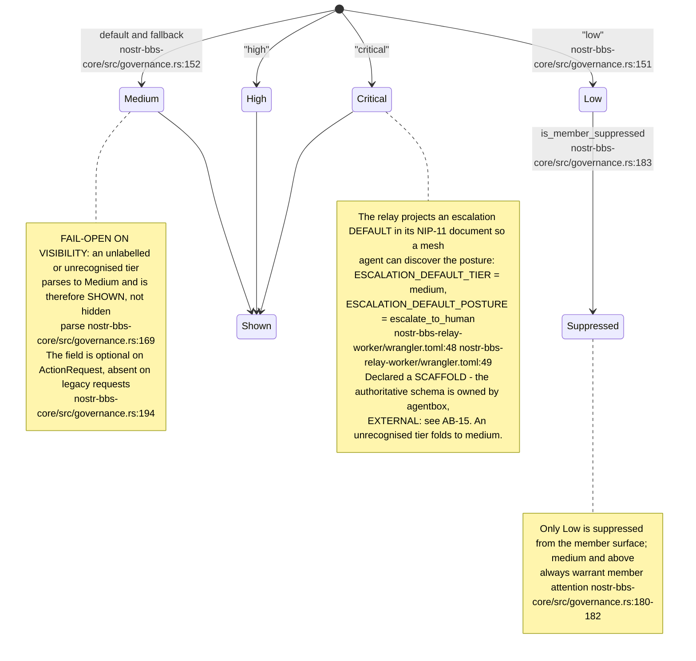
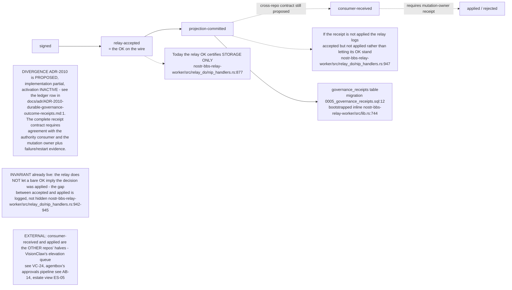
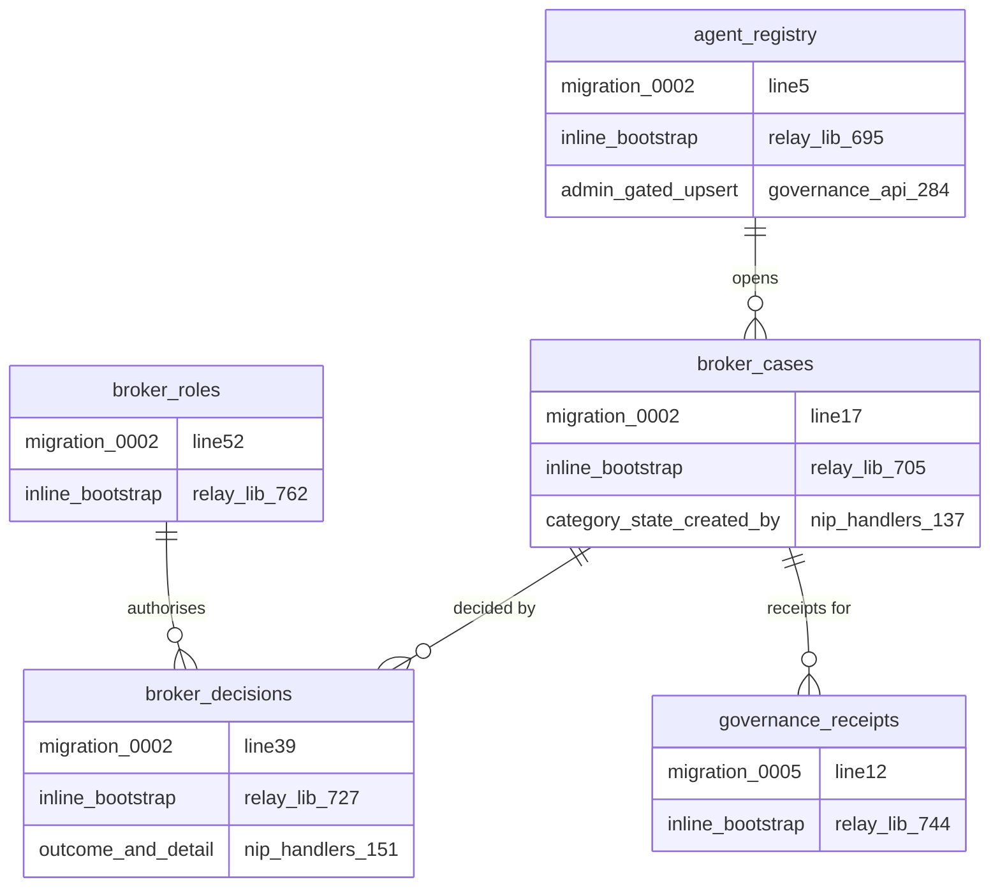
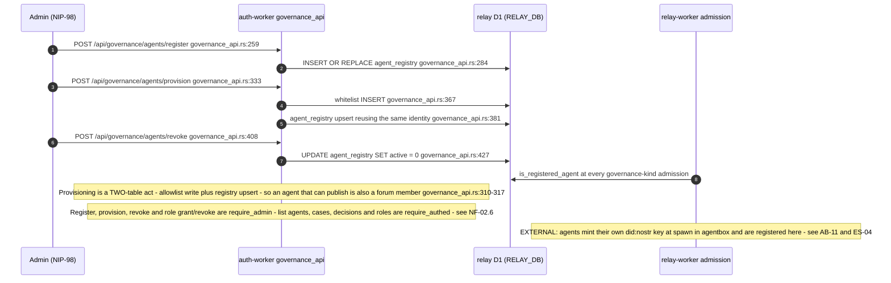
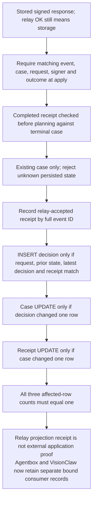

## NF-06.1 The six kinds and their publishers

## NF-06.2 Addressability and validation

## NF-06.3 Publish path — agent asks, human signs

## NF-06.4 The two gates a governance event must pass at ingress

## NF-06.5 Risk tiers — the agent's own declaration

## NF-06.6 The broker case aggregate

## NF-06.7 ADR-2010 receipt stages — what the relay's OK actually certifies

## NF-06.8 D1 projection tables

The auth-worker writes `agent_registry` and `whitelist` through the shared `RELAY_DB`
binding so the relay DO can read the registry at admission with no cross-worker call
(`nostr-bbs-auth-worker/src/governance_api.rs:30`).

## NF-06.9 Agent lifecycle through the auth-worker REST surface

## NF-06.10 Consumers of the surface

## NF-06.11 Guarded relay projection and separate consumer receipts

Execution update, 2026-09-07: request redelivery uses INSERT OR IGNORE and cannot reset an already-decided case. D1 statements execute serially in one transaction, and each dependent write requires its predecessor to change one row. Three exact-SQL projection tests cover wrong/missing request/case/receipt, prior decision/state races, duplicate commits and rollback on receipt failure; native relay tests cover correlation mismatch and unknown-state rejection. The earlier default-case and unconditional-update findings remain in the [audit](../../estate-review/2026-09-07-federation-audit.md). Agentbox now signs operation/digest and records received/outcome receipts; VisionClaw journals exact requests and claims PR application. Live D1 and external application are not certified by local tests.
