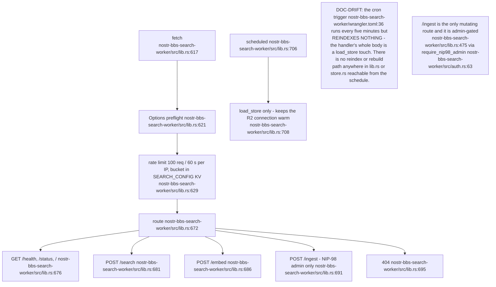
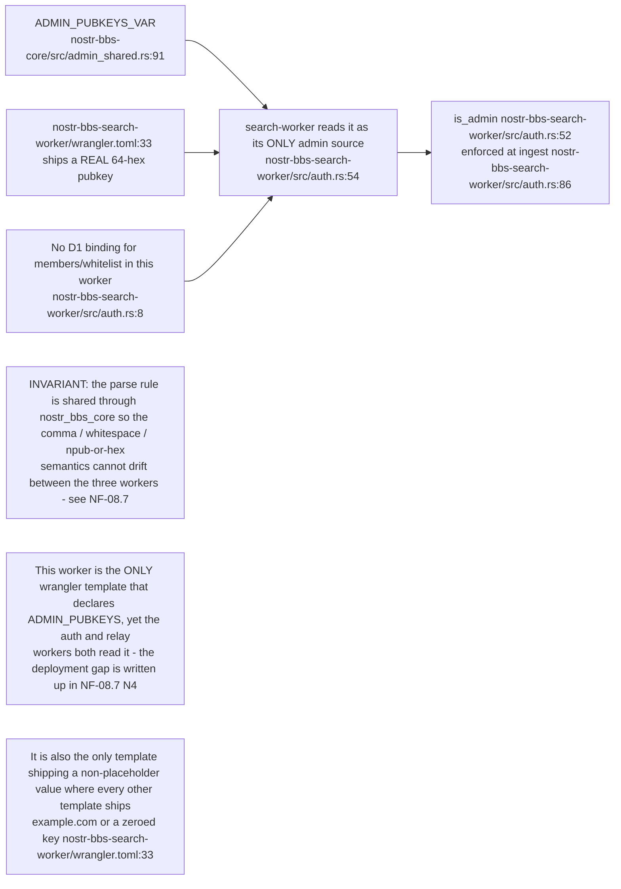
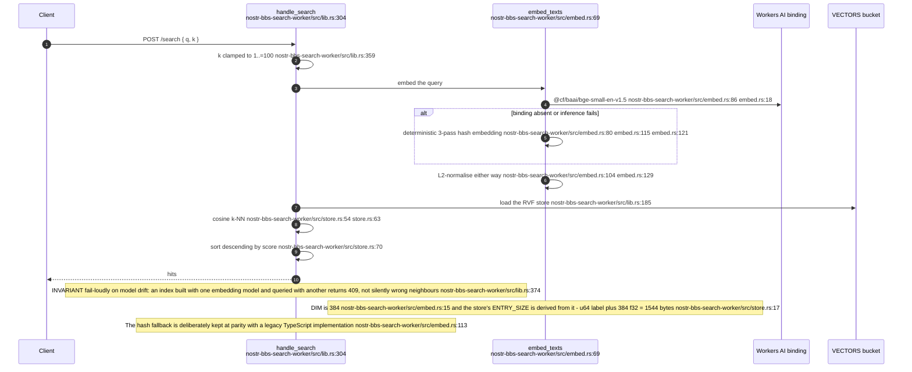
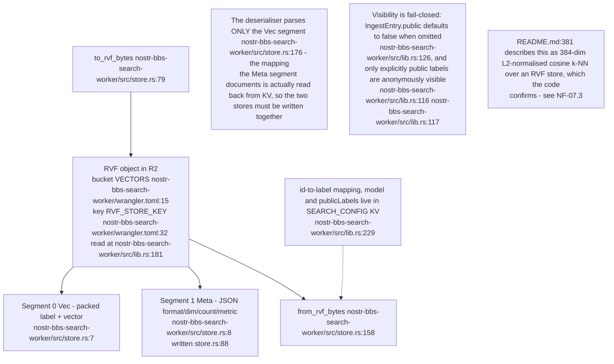
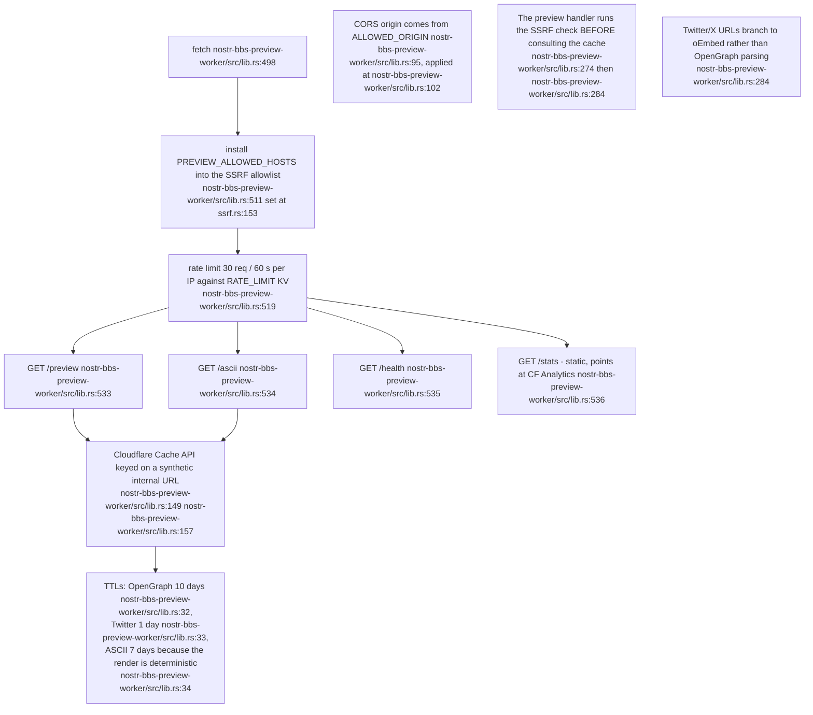
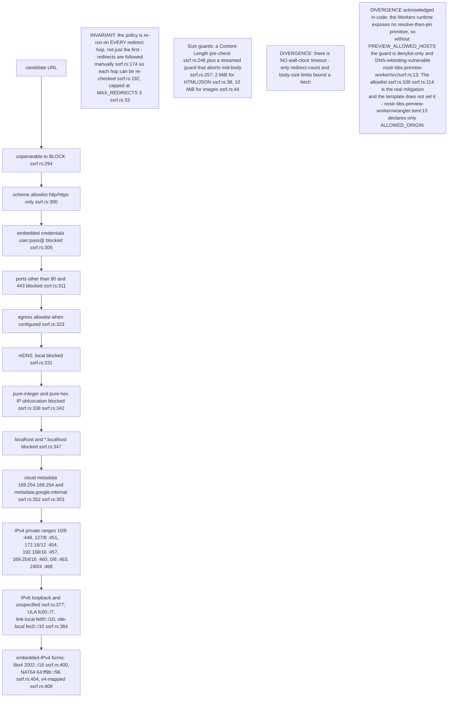
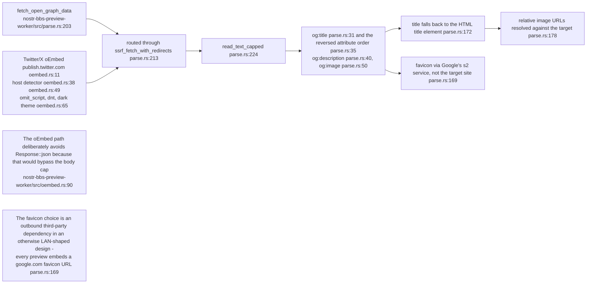
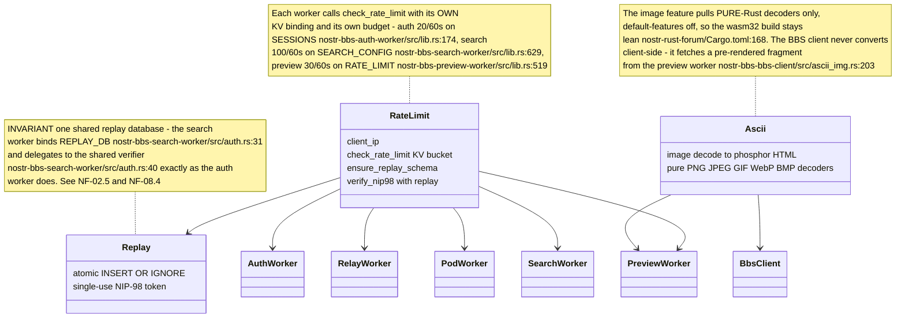

## NF-07.1 search-worker — routes and gates

## NF-07.2 The third admin authority — static-only, and the only real key in a template

## NF-07.3 Semantic search — embeddings and the RVF store

## NF-07.4 RVF format and where the pieces live

## NF-07.5 preview-worker — routes, caching and origin policy

## NF-07.6 The SSRF guard — every blocked class

## NF-07.7 Unfurl extraction

## NF-07.8 Shared utilities every worker links

