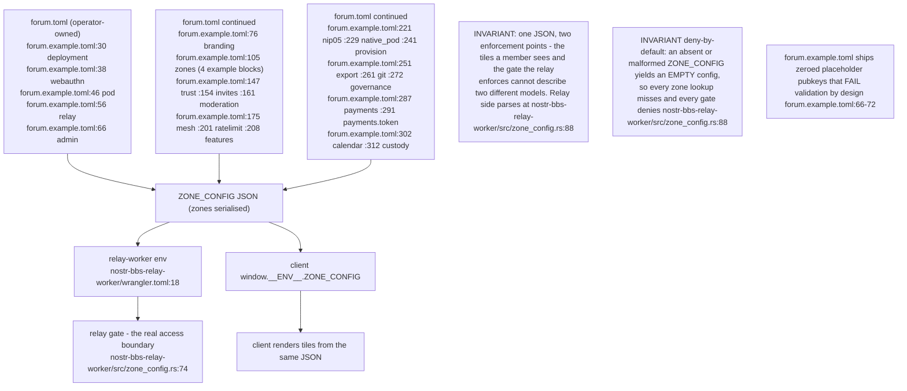
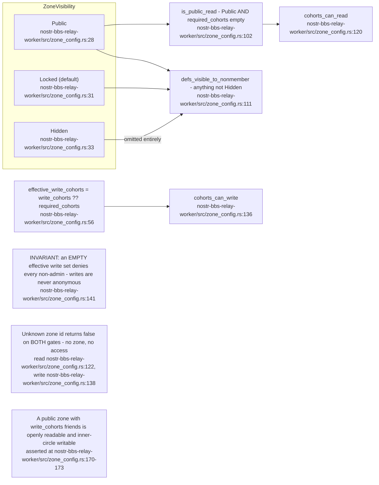
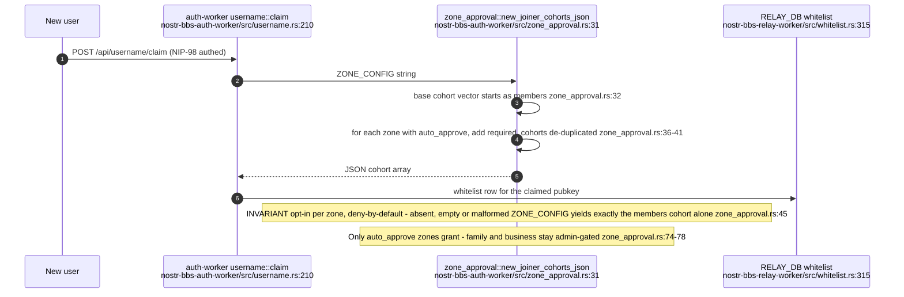
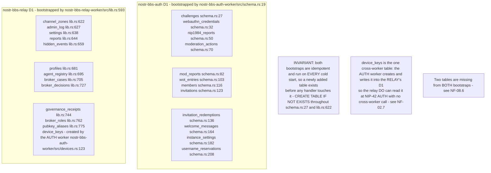
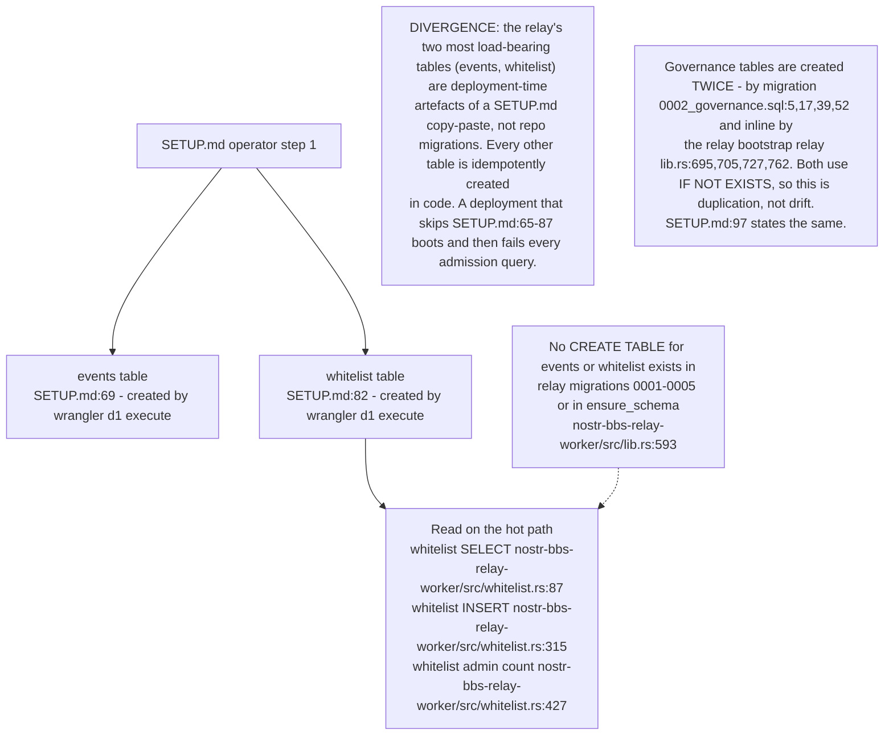
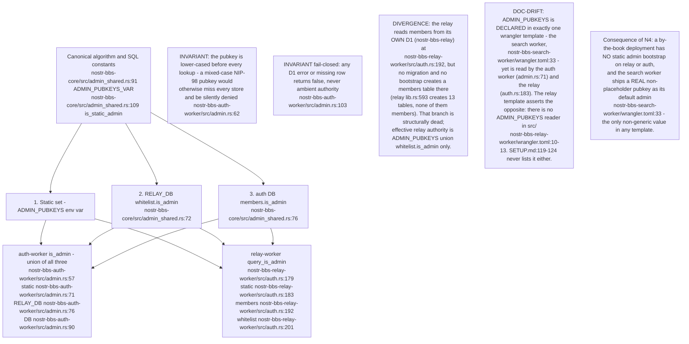
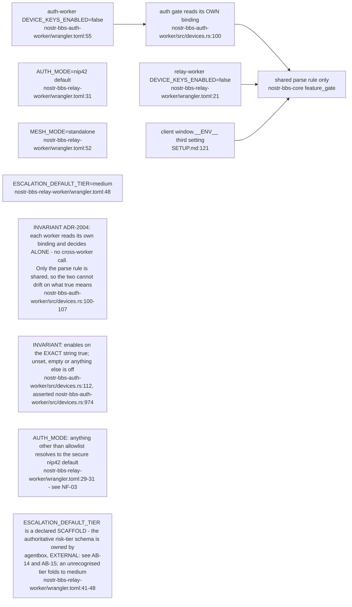

## NF-08.1 forum.toml — the single source of access truth and its projection

## NF-08.2 Zone visibility and the read/write gate lattice

## NF-08.3 Auto-approval of a new joiner — config-driven cohort grant

## NF-08.4 Persistent stores — which worker binds which D1, KV and R2

```mermaid
flowchart TB
    subgraph d1["D1 databases"]
        AUTHDB["nostr-bbs-auth<br/>auth-worker DB nostr-bbs-auth-worker/wrangler.toml:9"]
        RELDB["nostr-bbs-relay<br/>relay-worker DB nostr-bbs-relay-worker/wrangler.toml:58"]
    end
    subgraph kv["KV namespaces"]
        SESS["SESSIONS nostr-bbs-auth-worker/wrangler.toml:23"]
        PODMETA["POD_META nostr-bbs-pod-worker/wrangler.toml:16"]
        RL["RATE_LIMIT nostr-bbs-preview-worker/wrangler.toml:9"]
        SCFG["SEARCH_CONFIG nostr-bbs-search-worker/wrangler.toml:19"]
        KVALIAS["KV - same physical id as SESSIONS nostr-bbs-auth-worker/wrangler.toml:38"]
    end
    subgraph r2["R2 buckets"]
        PODS["nostr-bbs-pods nostr-bbs-pod-worker/wrangler.toml:10"]
        VECS["nostr-bbs-vectors nostr-bbs-search-worker/wrangler.toml:15"]
    end
    subgraph do["Durable Object"]
        RELAYDO["RELAY class NostrRelayDO<br/>nostr-bbs-relay-worker/wrangler.toml:74 sqlite class :78"]
    end

    AUTHW["auth-worker"] --> AUTHDB
    AUTHW -->|"RELAY_DB nostr-bbs-auth-worker/wrangler.toml:18"| RELDB
    AUTHW --> SESS
    AUTHW --> KVALIAS
    AUTHW -->|"POD_META backwards-compat reads nostr-bbs-auth-worker/wrangler.toml:30"| PODMETA
    AUTHW -->|"PODS nostr-bbs-auth-worker/wrangler.toml:42"| PODS
    RELAYW["relay-worker"] --> RELDB
    RELAYW -->|"REPLAY_DB points at nostr-bbs-auth nostr-bbs-relay-worker/wrangler.toml:69"| AUTHDB
    RELAYW --> RELAYDO
    PODW["pod-worker"] --> PODS
    PODW --> PODMETA
    PODW -->|"REPLAY_DB nostr-bbs-pod-worker/wrangler.toml:25"| AUTHDB
    SEARCHW["search-worker"] --> VECS
    SEARCHW --> SCFG
    SEARCHW -->|"REPLAY_DB nostr-bbs-search-worker/wrangler.toml:25"| AUTHDB
    PREVW["preview-worker"] --> RL

    N1["INVARIANT: NIP-98 replay lives in ONE database - every worker binds REPLAY_DB (or DB) to<br/>nostr-bbs-auth so cross-worker replay is detected nostr-bbs-relay-worker/wrangler.toml:63-70"]
    N2["ANOMALY O11 still live: KV and SESSIONS are the SAME physical namespace id<br/>nostr-bbs-auth-worker/wrangler.toml:24 and :39 - key-collision risk across the two logical uses"]
    N3["The auth-worker RELAY_DB database_id is a ZERO placeholder that every deployment must override<br/>nostr-bbs-auth-worker/wrangler.toml:20 - shipped unusable on purpose"]
```

## NF-08.5 Table map — who creates each table and who reads it

Both workers bootstrap idempotently on every cold start — the auth worker at
`nostr-bbs-auth-worker/src/schema.rs:19`, the relay at `nostr-bbs-relay-worker/src/lib.rs:593`.

## NF-08.6 The two tables no code in this repo creates

## NF-08.7 Admin authority — three sources, one union, and where they disagree

## NF-08.8 Cross-worker feature gates that must be set in lockstep

