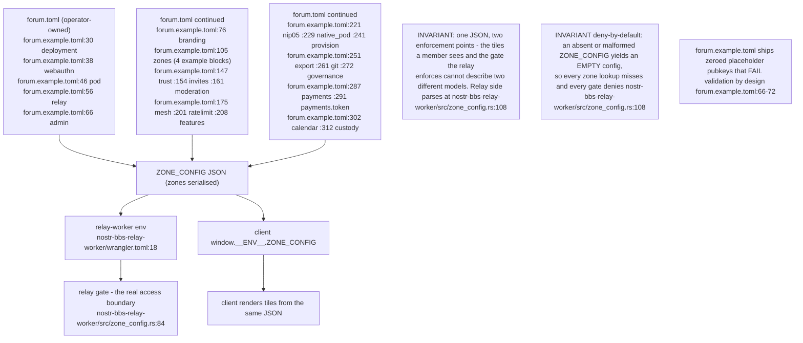
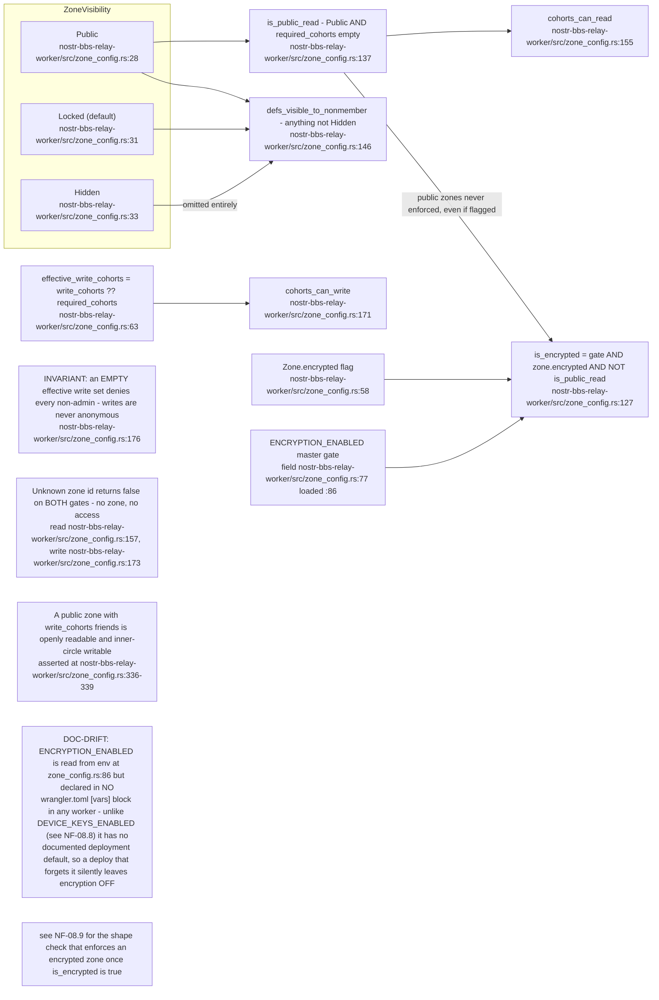
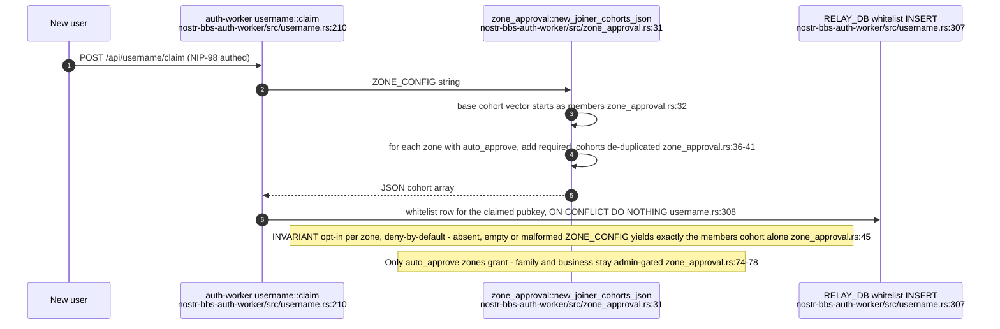
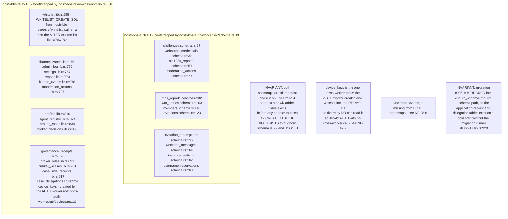
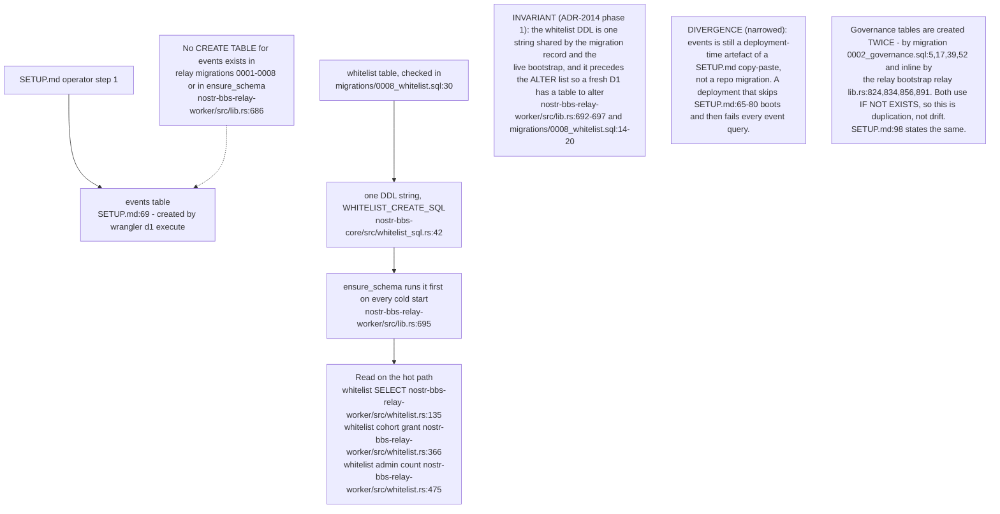
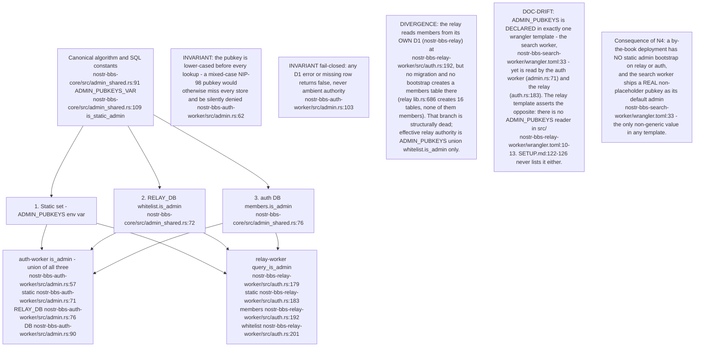
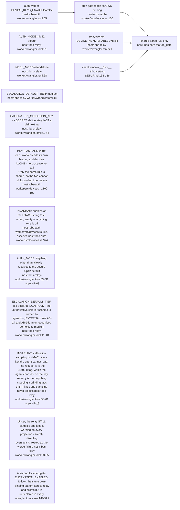
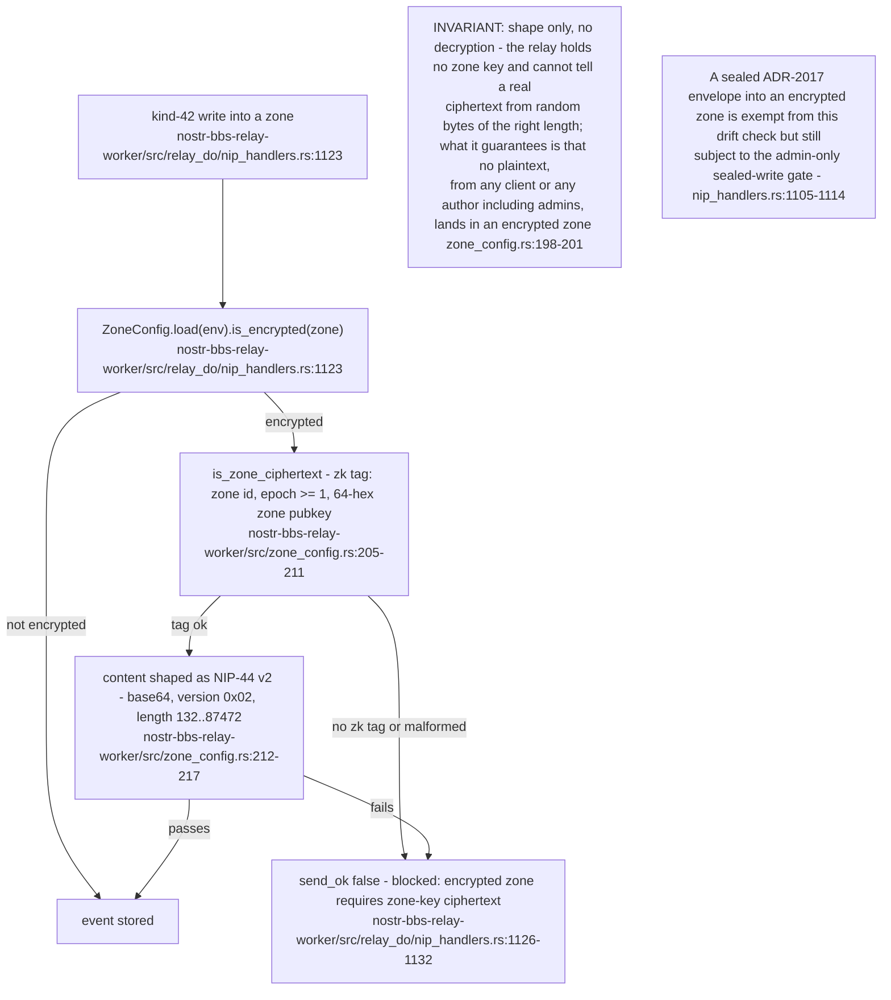

## NF-08.1 forum.toml — the single source of access truth and its projection

```mermaid
flowchart TB
    TOML["forum.toml (operator-owned)<br/>forum.example.toml:30 deployment<br/>forum.example.toml:38 webauthn<br/>forum.example.toml:46 pod<br/>forum.example.toml:56 relay<br/>forum.example.toml:66 admin"]
    TOML2["forum.toml continued<br/>forum.example.toml:76 branding<br/>forum.example.toml:105 zones (4 example blocks)<br/>forum.example.toml:147 trust :154 invites :161 moderation<br/>forum.example.toml:175 mesh :201 ratelimit :208 features"]
    TOML3["forum.toml continued<br/>forum.example.toml:221 nip05 :229 native_pod :241 provision<br/>forum.example.toml:251 export :261 git :272 governance<br/>forum.example.toml:287 payments :291 payments.token<br/>forum.example.toml:302 calendar :312 custody"]
    ZC["ZONE_CONFIG JSON (zones serialised)"]
    RELAYENV["relay-worker env<br/>nostr-bbs-relay-worker/wrangler.toml:18"]
    CLIENTENV["client window.__ENV__.ZONE_CONFIG"]
    GATE["relay gate - the real access boundary<br/>nostr-bbs-relay-worker/src/zone_config.rs:84"]
    TILES["client renders tiles from the same JSON"]

    TOML --> ZC
    TOML2 --> ZC
    TOML3 --> ZC
    ZC --> RELAYENV --> GATE
    ZC --> CLIENTENV --> TILES

    N1["INVARIANT: one JSON, two enforcement points - the tiles a member sees and the gate the relay<br/>enforces cannot describe two different models. Relay side parses at nostr-bbs-relay-worker/src/zone_config.rs:108"]
    N2["INVARIANT deny-by-default: an absent or malformed ZONE_CONFIG yields an EMPTY config,<br/>so every zone lookup misses and every gate denies nostr-bbs-relay-worker/src/zone_config.rs:108"]
    N3["forum.example.toml ships zeroed placeholder pubkeys that FAIL validation by design forum.example.toml:66-72"]
```

## NF-08.2 Zone visibility and the read/write gate lattice

```mermaid
flowchart LR
    subgraph vis["ZoneVisibility"]
        PUB["Public<br/>nostr-bbs-relay-worker/src/zone_config.rs:28"]
        LOCK["Locked (default)<br/>nostr-bbs-relay-worker/src/zone_config.rs:31"]
        HID["Hidden<br/>nostr-bbs-relay-worker/src/zone_config.rs:33"]
    end
    READ["cohorts_can_read<br/>nostr-bbs-relay-worker/src/zone_config.rs:155"]
    WRITE["cohorts_can_write<br/>nostr-bbs-relay-worker/src/zone_config.rs:171"]
    PUBR["is_public_read - Public AND required_cohorts empty<br/>nostr-bbs-relay-worker/src/zone_config.rs:137"]
    DEFS["defs_visible_to_nonmember - anything not Hidden<br/>nostr-bbs-relay-worker/src/zone_config.rs:146"]
    EFF["effective_write_cohorts = write_cohorts ?? required_cohorts<br/>nostr-bbs-relay-worker/src/zone_config.rs:63"]
    ZENC["Zone.encrypted flag<br/>nostr-bbs-relay-worker/src/zone_config.rs:58"]
    MGATE["ENCRYPTION_ENABLED master gate<br/>field nostr-bbs-relay-worker/src/zone_config.rs:77 loaded :86"]
    ISENC["is_encrypted = gate AND zone.encrypted AND NOT is_public_read<br/>nostr-bbs-relay-worker/src/zone_config.rs:127"]

    PUB --> PUBR --> READ
    LOCK --> DEFS
    PUB --> DEFS
    HID -->|"omitted entirely"| DEFS
    EFF --> WRITE
    ZENC --> ISENC
    MGATE --> ISENC
    PUBR -->|"public zones never enforced, even if flagged"| ISENC

    N1["INVARIANT: an EMPTY effective write set denies every non-admin - writes are never anonymous<br/>nostr-bbs-relay-worker/src/zone_config.rs:176"]
    N2["Unknown zone id returns false on BOTH gates - no zone, no access<br/>read nostr-bbs-relay-worker/src/zone_config.rs:157, write nostr-bbs-relay-worker/src/zone_config.rs:173"]
    N3["A public zone with write_cohorts friends is openly readable and inner-circle writable<br/>asserted at nostr-bbs-relay-worker/src/zone_config.rs:336-339"]
    N4["DOC-DRIFT: ENCRYPTION_ENABLED is read from env at zone_config.rs:86 but declared in NO<br/>wrangler.toml [vars] block in any worker - unlike DEVICE_KEYS_ENABLED (see NF-08.8) it has no<br/>documented deployment default, so a deploy that forgets it silently leaves encryption OFF"]
    N5["see NF-08.9 for the shape check that enforces an encrypted zone once is_encrypted is true"]
```

## NF-08.3 Auto-approval of a new joiner — config-driven cohort grant

```mermaid
sequenceDiagram
    autonumber
    participant U as New user
    participant AW as auth-worker username::claim<br/>nostr-bbs-auth-worker/src/username.rs:210
    participant ZA as zone_approval::new_joiner_cohorts_json<br/>nostr-bbs-auth-worker/src/zone_approval.rs:31
    participant D1 as RELAY_DB whitelist INSERT<br/>nostr-bbs-auth-worker/src/username.rs:307

    U->>AW: POST /api/username/claim (NIP-98 authed)
    AW->>ZA: ZONE_CONFIG string
    ZA->>ZA: base cohort vector starts as members zone_approval.rs:32
    ZA->>ZA: for each zone with auto_approve, add required_cohorts de-duplicated zone_approval.rs:36-41
    ZA-->>AW: JSON cohort array
    AW->>D1: whitelist row for the claimed pubkey, ON CONFLICT DO NOTHING username.rs:308

    Note over ZA: INVARIANT opt-in per zone, deny-by-default - absent, empty or malformed ZONE_CONFIG yields exactly the members cohort alone zone_approval.rs:45
    Note over ZA: Only auto_approve zones grant - family and business stay admin-gated zone_approval.rs:74-78
```

## NF-08.4 Persistent stores — which worker binds which D1, KV and R2

```mermaid
flowchart TB
    subgraph d1["D1 databases"]
        AUTHDB["nostr-bbs-auth<br/>auth-worker DB nostr-bbs-auth-worker/wrangler.toml:9"]
        RELDB["nostr-bbs-relay<br/>relay-worker DB nostr-bbs-relay-worker/wrangler.toml:74"]
    end
    subgraph kv["KV namespaces"]
        SESS["SESSIONS nostr-bbs-auth-worker/wrangler.toml:23"]
        PODMETA["POD_META nostr-bbs-pod-worker/wrangler.toml:16"]
        RL["RATE_LIMIT nostr-bbs-preview-worker/wrangler.toml:9"]
        SCFG["SEARCH_CONFIG nostr-bbs-search-worker/wrangler.toml:19"]
        KVALIAS["KV - same physical id as SESSIONS nostr-bbs-auth-worker/wrangler.toml:38"]
    end
    subgraph r2["R2 buckets"]
        PODS["nostr-bbs-pods nostr-bbs-pod-worker/wrangler.toml:10"]
        VECS["nostr-bbs-vectors nostr-bbs-search-worker/wrangler.toml:15"]
    end
    subgraph do["Durable Object"]
        RELAYDO["RELAY class NostrRelayDO<br/>nostr-bbs-relay-worker/wrangler.toml:90 sqlite class :95"]
    end

    AUTHW["auth-worker"] --> AUTHDB
    AUTHW -->|"RELAY_DB nostr-bbs-auth-worker/wrangler.toml:18"| RELDB
    AUTHW --> SESS
    AUTHW --> KVALIAS
    AUTHW -->|"POD_META backwards-compat reads nostr-bbs-auth-worker/wrangler.toml:30"| PODMETA
    AUTHW -->|"PODS nostr-bbs-auth-worker/wrangler.toml:42"| PODS
    RELAYW["relay-worker"] --> RELDB
    RELAYW -->|"REPLAY_DB points at nostr-bbs-auth nostr-bbs-relay-worker/wrangler.toml:85"| AUTHDB
    RELAYW --> RELAYDO
    PODW["pod-worker"] --> PODS
    PODW --> PODMETA
    PODW -->|"REPLAY_DB nostr-bbs-pod-worker/wrangler.toml:25"| AUTHDB
    SEARCHW["search-worker"] --> VECS
    SEARCHW --> SCFG
    SEARCHW -->|"REPLAY_DB nostr-bbs-search-worker/wrangler.toml:25"| AUTHDB
    PREVW["preview-worker"] --> RL

    N1["INVARIANT: NIP-98 replay lives in ONE database - every worker binds REPLAY_DB (or DB) to<br/>nostr-bbs-auth so cross-worker replay is detected nostr-bbs-relay-worker/wrangler.toml:79-86"]
    N2["ANOMALY O11 still live: KV and SESSIONS are the SAME physical namespace id<br/>nostr-bbs-auth-worker/wrangler.toml:24 and :39 - key-collision risk across the two logical uses"]
    N3["The auth-worker RELAY_DB database_id is a ZERO placeholder that every deployment must override<br/>nostr-bbs-auth-worker/wrangler.toml:20 - shipped unusable on purpose"]
    N4["PROPOSED, NOT BUILT: ADR-2012 demotes the pod-worker payment D1 from ledger to a height-stamped<br/>derived view over the sidestr chain, with a staleness bound that is an error<br/>ADR-2012-d1-ledger-becomes-a-chain-view.md:5-6 ADR-2012-d1-ledger-becomes-a-chain-view.md:37-41.<br/>Nothing in this store map changes until it is built - see NF-04.11"]
```

## NF-08.5 Table map — who creates each table and who reads it

```mermaid
flowchart TB
    subgraph authd1["nostr-bbs-auth D1 - bootstrapped by nostr-bbs-auth-worker/src/schema.rs:19"]
        A1["challenges schema.rs:27<br/>webauthn_credentials schema.rs:32<br/>nip1984_reports schema.rs:50<br/>moderation_actions schema.rs:70"]
        A2["mod_reports schema.rs:82<br/>wot_entries schema.rs:103<br/>members schema.rs:116<br/>invitations schema.rs:123"]
        A3["invitation_redemptions schema.rs:136<br/>welcome_messages schema.rs:164<br/>instance_settings schema.rs:182<br/>username_reservations schema.rs:208"]
    end
    subgraph relayd1["nostr-bbs-relay D1 - bootstrapped by nostr-bbs-relay-worker/src/lib.rs:686"]
        R0["whitelist lib.rs:695 - WHITELIST_CREATE_SQL from nostr-bbs-core/src/whitelist_sql.rs:42<br/>then the ALTER column list lib.rs:701-714"]
        R1["channel_zones lib.rs:751<br/>admin_log lib.rs:756<br/>settings lib.rs:767<br/>reports lib.rs:773<br/>hidden_events lib.rs:788<br/>moderation_actions lib.rs:797"]
        R2["profiles lib.rs:810<br/>agent_registry lib.rs:824<br/>broker_cases lib.rs:834<br/>broker_decisions lib.rs:856"]
        R3["governance_receipts lib.rs:873<br/>broker_roles lib.rs:891<br/>pubkey_aliases lib.rs:904<br/>case_side_receipts lib.rs:917<br/>case_delegations lib.rs:929<br/>device_keys - created by the AUTH worker nostr-bbs-auth-worker/src/devices.rs:123"]
    end

    N1["INVARIANT: both bootstraps are idempotent and run on EVERY cold start, so a newly added table exists<br/>before any handler touches it - CREATE TABLE IF NOT EXISTS throughout schema.rs:27 and lib.rs:751"]
    N2["device_keys is the one cross-worker table: the AUTH worker creates and writes it into the RELAY's D1<br/>so the relay DO can read it at NIP-42 AUTH with no cross-worker call - see NF-02.7"]
    N3["One table, events, is missing from BOTH bootstraps - see NF-08.6"]
    N4["INVARIANT: migration 0006 is MIRRORED into ensure_schema, the live schema path, so the<br/>application-receipt and delegation tables exist on a cold start without the migration runner<br/>lib.rs:917 lib.rs:929"]
```

Both workers bootstrap idempotently on every cold start — the auth worker at
`nostr-bbs-auth-worker/src/schema.rs:19`, the relay at `nostr-bbs-relay-worker/src/lib.rs:686`.

## NF-08.6 Where the relay's two load-bearing tables come from

```mermaid
flowchart TB
    SETUP["SETUP.md operator step 1"]
    EVENTS["events table<br/>SETUP.md:69 - created by wrangler d1 execute"]
    MIG["whitelist table, checked in<br/>migrations/0008_whitelist.sql:30"]
    CORE["one DDL string, WHITELIST_CREATE_SQL<br/>nostr-bbs-core/src/whitelist_sql.rs:42"]
    ENS["ensure_schema runs it first on every cold start<br/>nostr-bbs-relay-worker/src/lib.rs:695"]
    READERS["Read on the hot path<br/>whitelist SELECT nostr-bbs-relay-worker/src/whitelist.rs:135<br/>whitelist cohort grant nostr-bbs-relay-worker/src/whitelist.rs:366<br/>whitelist admin count nostr-bbs-relay-worker/src/whitelist.rs:475"]
    NOCREATE["No CREATE TABLE for events exists in<br/>relay migrations 0001-0008 or in ensure_schema<br/>nostr-bbs-relay-worker/src/lib.rs:686"]

    SETUP --> EVENTS
    MIG --> CORE
    CORE --> ENS
    ENS --> READERS
    NOCREATE -.-> EVENTS

    N1["INVARIANT (ADR-2014 phase 1): the whitelist DDL is one string shared by the migration record and the<br/>live bootstrap, and it precedes the ALTER list so a fresh D1 has a table to alter<br/>nostr-bbs-relay-worker/src/lib.rs:692-697 and migrations/0008_whitelist.sql:14-20"]
    N2["DIVERGENCE (narrowed): events is still a deployment-time artefact of a SETUP.md copy-paste,<br/>not a repo migration. A deployment that skips SETUP.md:65-80 boots and then fails every event query."]
    N3["Governance tables are created TWICE - by migration 0002_governance.sql:5,17,39,52 and inline by<br/>the relay bootstrap relay lib.rs:824,834,856,891. Both use IF NOT EXISTS, so this is duplication, not drift.<br/>SETUP.md:98 states the same."]
```

**What it shows.** Until 1a26e51 neither `events` nor `whitelist` was created
by any code in the repository. The whitelist now has a checked-in migration
(`migrations/0008_whitelist.sql:30`) and the relay bootstrap runs the same
statement, `WHITELIST_CREATE_SQL` (`nostr-bbs-core/src/whitelist_sql.rs:42`),
before its column `ALTER`s (`nostr-bbs-relay-worker/src/lib.rs:695`). `events` is still
created only by the operator's copy-paste from `SETUP.md:69`.

**Why it is this way.** ADR-2014 phase 1 checked the table in because admission
reads `expires_at`, which no DDL created at all (`migrations/0008_whitelist.sql:5-8`).

**Debt:** the relay `events` table is still created only by `SETUP.md:69`; no
migration and no bootstrap creates it (`nostr-bbs-relay-worker/src/lib.rs:686`).

## NF-08.7 Admin authority — three sources, one union, and where they disagree

```mermaid
flowchart TB
    CANON["Canonical algorithm and SQL constants<br/>nostr-bbs-core/src/admin_shared.rs:91 ADMIN_PUBKEYS_VAR<br/>nostr-bbs-core/src/admin_shared.rs:109 is_static_admin"]
    S1["1. Static set - ADMIN_PUBKEYS env var"]
    S2["2. RELAY_DB whitelist.is_admin<br/>nostr-bbs-core/src/admin_shared.rs:72"]
    S3["3. auth DB members.is_admin<br/>nostr-bbs-core/src/admin_shared.rs:76"]
    AUTHIS["auth-worker is_admin - union of all three<br/>nostr-bbs-auth-worker/src/admin.rs:57<br/>static nostr-bbs-auth-worker/src/admin.rs:71<br/>RELAY_DB nostr-bbs-auth-worker/src/admin.rs:76<br/>DB nostr-bbs-auth-worker/src/admin.rs:90"]
    RELIS["relay-worker query_is_admin<br/>nostr-bbs-relay-worker/src/auth.rs:179<br/>static nostr-bbs-relay-worker/src/auth.rs:183<br/>members nostr-bbs-relay-worker/src/auth.rs:192<br/>whitelist nostr-bbs-relay-worker/src/auth.rs:201"]

    CANON --> S1 & S2 & S3
    S1 & S2 & S3 --> AUTHIS
    S1 & S2 & S3 --> RELIS

    N1["INVARIANT: the pubkey is lower-cased before every lookup - a mixed-case NIP-98 pubkey would<br/>otherwise miss every store and be silently denied nostr-bbs-auth-worker/src/admin.rs:62"]
    N2["INVARIANT fail-closed: any D1 error or missing row returns false, never ambient authority<br/>nostr-bbs-auth-worker/src/admin.rs:103"]
    N3["DIVERGENCE: the relay reads members from its OWN D1 (nostr-bbs-relay) at<br/>nostr-bbs-relay-worker/src/auth.rs:192, but no migration and no bootstrap creates a members table there<br/>(relay lib.rs:686 creates 16 tables, none of them members). That branch is structurally dead;<br/>effective relay authority is ADMIN_PUBKEYS union whitelist.is_admin only."]
    N4["DOC-DRIFT: ADMIN_PUBKEYS is DECLARED in exactly one wrangler template - the search worker,<br/>nostr-bbs-search-worker/wrangler.toml:33 - yet is read by the auth worker (admin.rs:71) and the relay<br/>(auth.rs:183). The relay template asserts the opposite: there is no ADMIN_PUBKEYS reader in src/<br/>nostr-bbs-relay-worker/wrangler.toml:10-13. SETUP.md:122-126 never lists it either."]
    N5["Consequence of N4: a by-the-book deployment has NO static admin bootstrap on relay or auth,<br/>and the search worker ships a REAL non-placeholder pubkey as its default admin<br/>nostr-bbs-search-worker/wrangler.toml:33 - the only non-generic value in any template."]
```

## NF-08.8 Cross-worker feature gates that must be set in lockstep

```mermaid
flowchart LR
    DKA["auth-worker DEVICE_KEYS_ENABLED=false<br/>nostr-bbs-auth-worker/wrangler.toml:55"]
    DKR["relay-worker DEVICE_KEYS_ENABLED=false<br/>nostr-bbs-relay-worker/wrangler.toml:21"]
    DKC["client window.__ENV__ third setting<br/>SETUP.md:133-136"]
    GATEFN["auth gate reads its OWN binding<br/>nostr-bbs-auth-worker/src/devices.rs:100"]
    SHARED["shared parse rule only<br/>nostr-bbs-core feature_gate"]
    AM["AUTH_MODE=nip42 default<br/>nostr-bbs-relay-worker/wrangler.toml:31"]
    MESH["MESH_MODE=standalone<br/>nostr-bbs-relay-worker/wrangler.toml:68"]
    ESC["ESCALATION_DEFAULT_TIER=medium<br/>nostr-bbs-relay-worker/wrangler.toml:48"]
    CAL["CALIBRATION_SELECTION_KEY - a SECRET, deliberately NOT a plaintext var<br/>nostr-bbs-relay-worker/wrangler.toml:51-54"]

    DKA --> GATEFN --> SHARED
    DKR --> SHARED
    DKC --> SHARED

    N1["INVARIANT ADR-2004: each worker reads its own binding and decides ALONE - no cross-worker call.<br/>Only the parse rule is shared, so the two cannot drift on what true means<br/>nostr-bbs-auth-worker/src/devices.rs:100-107"]
    N2["INVARIANT: enables on the EXACT string true; unset, empty or anything else is off<br/>nostr-bbs-auth-worker/src/devices.rs:112, asserted nostr-bbs-auth-worker/src/devices.rs:974"]
    N3["AUTH_MODE: anything other than allowlist resolves to the secure nip42 default<br/>nostr-bbs-relay-worker/wrangler.toml:29-31 - see NF-03"]
    N4["ESCALATION_DEFAULT_TIER is a declared SCAFFOLD - the authoritative risk-tier schema is owned by<br/>agentbox, EXTERNAL: see AB-14 and AB-15; an unrecognised tier folds to medium<br/>nostr-bbs-relay-worker/wrangler.toml:41-48"]
    N5["INVARIANT: calibration sampling is HMAC over a key the agent cannot read. The request id is the<br/>31402 d tag, which the agent chooses, so the key secrecy is the only thing stopping it grinding tags<br/>until it finds one sampling never selects nostr-bbs-relay-worker/wrangler.toml:56-61 - see NF-12"]
    N6["Unset, the relay STILL samples and logs a warning on every projection - silently disabling<br/>oversight is treated as the worse failure nostr-bbs-relay-worker/wrangler.toml:63-65"]
    N7["A second lockstep gate, ENCRYPTION_ENABLED, follows the same own-binding pattern across relay<br/>and clients but is undeclared in every wrangler.toml - see NF-08.2"]
```

## NF-08.9 Encrypted-zone write enforcement — shape check, not decryption

```mermaid
flowchart TB
    WRITE["kind-42 write into a zone<br/>nostr-bbs-relay-worker/src/relay_do/nip_handlers.rs:1123"]
    LOOKUP["ZoneConfig.load(env).is_encrypted(zone)<br/>nostr-bbs-relay-worker/src/relay_do/nip_handlers.rs:1123"]
    TAGCHK["is_zone_ciphertext - zk tag: zone id, epoch >= 1, 64-hex zone pubkey<br/>nostr-bbs-relay-worker/src/zone_config.rs:205-211"]
    SHAPECHK["content shaped as NIP-44 v2 - base64, version 0x02, length 132..87472<br/>nostr-bbs-relay-worker/src/zone_config.rs:212-217"]
    REJECT["send_ok false - blocked: encrypted zone requires zone-key ciphertext<br/>nostr-bbs-relay-worker/src/relay_do/nip_handlers.rs:1126-1132"]
    ACCEPT["event stored"]

    WRITE --> LOOKUP
    LOOKUP -->|"encrypted"| TAGCHK
    LOOKUP -->|"not encrypted"| ACCEPT
    TAGCHK -->|"tag ok"| SHAPECHK
    TAGCHK -->|"no zk tag or malformed"| REJECT
    SHAPECHK -->|"passes"| ACCEPT
    SHAPECHK -->|"fails"| REJECT

    N1["INVARIANT: shape only, no decryption - the relay holds no zone key and cannot tell a real<br/>ciphertext from random bytes of the right length; what it guarantees is that no plaintext,<br/>from any client or any author including admins, lands in an encrypted zone zone_config.rs:198-201"]
    N2["A sealed ADR-2017 envelope into an encrypted zone is exempt from this drift check but still<br/>subject to the admin-only sealed-write gate - nip_handlers.rs:1105-1114"]
```
